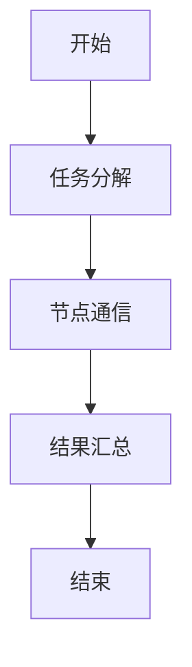
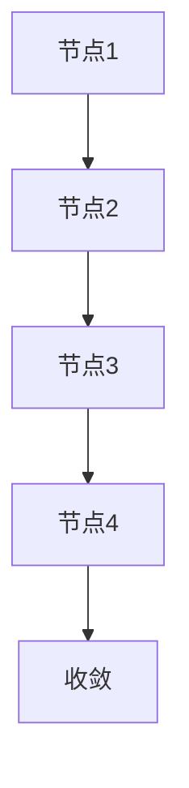
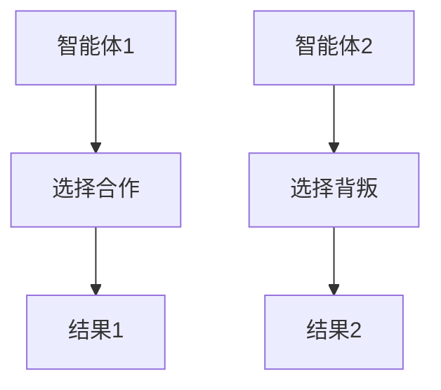
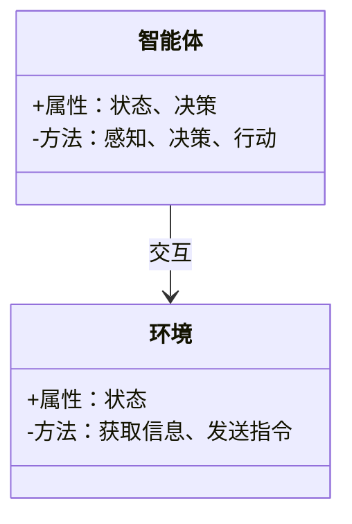
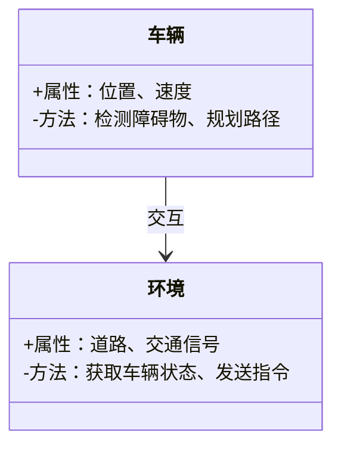

                 

<think>
嗯，用户希望我详细思考如何构建一个多智能体协同决策系统的文章。首先，我需要明确用户的需求。他们想要一个结构清晰、内容详实的技术博客，涵盖从基础概念到系统架构、项目实战的各个方面。

我应该从背景介绍开始，帮助读者理解为什么多智能体协同决策重要。然后，深入讲解核心概念，比如智能体的定义、分类，以及它们之间的关系，可能需要使用表格和ER图来辅助说明。

接下来是算法部分，选择几种典型的算法，如分布式计算和一致性算法，用Mermaid流程图展示，并附上数学公式，确保内容既专业又易懂。系统架构设计部分，我需要描述问题场景，设计系统功能模块，并用类图和序列图展示交互过程。

项目实战部分，我需要提供一个实际案例，详细说明环境安装、代码实现和案例分析，帮助读者将理论应用到实践中。最后，总结最佳实践和注意事项，为读者提供实用的建议。

在写作过程中，我需要确保每个部分都足够详细，同时逻辑清晰，结构紧凑。使用适当的图表和代码示例，可以帮助读者更好地理解内容。此外，语言要专业但不过于复杂，确保文章易于理解。

现在，我需要将这些思考转化为具体的目录结构，确保涵盖所有必要的部分，并且每章内容详实，逻辑严谨。这样，读者才能系统地学习和理解多智能体协同决策系统的构建过程。
</think>

# 构建具有多智能体协同决策能力的系统

> 关键词：多智能体系统，协同决策，分布式计算，一致性算法，博弈论模型，系统架构设计，项目实战

> 摘要：本文详细探讨了构建具有多智能体协同决策能力系统的各个方面。从背景介绍到核心概念，从算法原理到系统架构设计，从项目实战到最佳实践，层层深入，全面解析。通过实际案例分析和详细代码实现，帮助读者掌握多智能体协同决策系统的构建方法。

---

## 第一部分: 多智能体协同决策系统概述

### 第1章: 多智能体协同决策的背景与基础

#### 1.1 多智能体系统的基本概念
##### 1.1.1 智能体的定义与分类
智能体（Agent）是指具有感知环境、自主决策和行动能力的实体。根据智能体的类型，可以分为**反应式智能体**、**认知式智能体**、**学习型智能体**等。反应式智能体仅根据当前感知做出反应，认知式智能体具备推理和规划能力，学习型智能体能够通过经验改进性能。

##### 1.1.2 多智能体系统的定义与特点
多智能体系统（Multi-Agent System, MAS）是由多个智能体组成的分布式系统，智能体之间通过信息交换和协作完成共同目标。其特点包括**分布式性**、**自主性**、**反应性**和**协作性**。

##### 1.1.3 协同决策的概念与意义
协同决策是指多个智能体在共享目标下，通过信息交互和协作，共同制定最优决策的过程。其意义在于能够提高系统的整体智能性和决策效率。

#### 1.2 多智能体协同决策的背景与应用
##### 1.2.1 当前技术背景与发展趋势
随着人工智能技术的发展，多智能体协同决策在机器人、自动驾驶、分布式系统等领域得到了广泛应用。

##### 1.2.2 多智能体协同决策的应用场景
例如，在自动驾驶中，多个车辆需要协同决策以避免碰撞；在分布式任务分配中，多个智能体需要协作完成任务。

##### 1.2.3 与传统单智能体决策的区别
单智能体决策依赖于中心化计算，而多智能体决策强调分布式计算和协作。

#### 1.3 问题背景与目标
##### 1.3.1 当前决策系统的主要问题
传统决策系统存在**中心化依赖**、**单点故障**、**扩展性差**等问题。

##### 1.3.2 多智能体协同决策的目标
通过分布式计算和协作，提高系统的鲁棒性、可扩展性和决策效率。

##### 1.3.3 系统构建的核心问题与边界
核心问题包括智能体间的通信、协作机制设计、决策算法优化等。

---

### 第2章: 多智能体协同决策的核心概念

#### 2.1 智能体的属性与特征
##### 2.1.1 智能体的属性分析
智能体具有**感知能力**、**决策能力**、**行动能力**和**协作能力**。

##### 2.1.2 不同智能体的特征对比
| 智能体类型 | 感知能力 | 决策能力 | 行动能力 | 协作能力 |
|------------|----------|----------|----------|----------|
| 反应式     | 强        | 弱        | 强        | 无        |
| 认知式     | 弱        | 强        | 强        | 有        |
| 学习型     | 弱        | 强        | 强        | 有        |

#### 2.2 多智能体协同的实体关系
##### 2.2.1 实体关系图（ER图）
```mermaid
erDiagram
    actor 智能体 {
        role 反应式
        role 认知式
        role 学习型
    }
    actor 环境 {
        role 传感器
        role 执行器
    }
    智能体 --> 环境 : 交互
```

##### 2.2.2 智能体间的关系分析
智能体间的关系包括**竞争关系**、**合作关系**、**中立关系**。

#### 2.3 协同决策的数学模型
##### 2.3.1 决策模型的基本结构
协同决策模型包括**信息收集**、**信息处理**、**决策制定**三个阶段。

##### 2.3.2 智能体间的信息交互模型
信息交互模型可以用**图论**表示，节点为智能体，边为信息交互关系。

##### 2.3.3 模型的数学表达式
$$
\text{决策结果} = f(\text{信息输入}, \text{协作策略})
$$

---

### 第3章: 多智能体协同决策的算法原理

#### 3.1 基于分布式计算的算法
##### 3.1.1 分布式计算的基本原理
分布式计算通过将任务分解到多个节点并行处理，提高计算效率。

##### 3.1.2 分布式算法的实现步骤
1. 任务分解
2. 节点通信
3. 结果汇总

##### 3.1.3 Mermaid算法流程图


#### 3.2 基于一致性算法的决策
##### 3.2.1 一致性算法的数学模型
$$
\text{一致性条件} = \forall i, j, v_i = v_j
$$

##### 3.2.2 算法的收敛性分析
一致性算法能够在有限步内收敛到一致状态。

##### 3.2.3 Mermaid一致性算法图


#### 3.3 基于博弈论的决策模型
##### 3.3.1 博弈论的基本概念
博弈论研究智能体在策略选择中的互动。

##### 3.3.2 博弈论在决策中的应用
例如，囚徒困境模型用于分析智能体间的合作与背叛。

##### 3.3.3 Mermaid博弈论模型图


---

### 第4章: 系统架构与设计

#### 4.1 系统架构设计
##### 4.1.1 系统功能模块划分
系统功能模块包括**感知模块**、**决策模块**、**协作模块**、**通信模块**。

##### 4.1.2 系统架构的Mermaid图


##### 4.1.3 系统架构设计的优缺点
优点：高扩展性；缺点：需要复杂的通信机制。

#### 4.2 系统功能设计
##### 4.2.1 问题场景介绍
以自动驾驶为例，多个车辆需要协同决策以避免碰撞。

##### 4.2.2 系统功能设计
功能模块包括**路径规划**、**障碍物检测**、**协作决策**。

##### 4.2.3 系统功能的Mermaid类图


---

### 第5章: 项目实战

#### 5.1 环境安装
需要安装Python、相关库（如numpy、matplotlib）和开发工具。

#### 5.2 系统核心实现源代码
```python
import numpy as np

def distributed_decision(members):
    for member in members:
        # 处理决策
        pass

class Agent:
    def __init__(self, id):
        self.id = id
        self.state = None

    def perceive(self, environment):
        self.state = environment.get_state()

    def decide(self):
        return self.state

# 实例化智能体
agents = [Agent(i) for i in range(5)]
# 分布式决策
distributed_decision(agents)
```

#### 5.3 代码应用解读与分析
代码实现了一个简单的分布式决策系统，每个智能体感知环境并做出决策。

#### 5.4 实际案例分析
以自动驾驶为例，详细分析系统如何协同决策以避免碰撞。

---

### 第6章: 最佳实践与小结

#### 6.1 最佳实践 tips
- 采用分布式计算提高扩展性
- 使用一致性算法保证数据一致性
- 运用博弈论模型优化协作策略

#### 6.2 小结
本文详细介绍了多智能体协同决策系统的构建过程，从理论到实践，全面解析了系统的设计与实现。

#### 6.3 注意事项
- 确保智能体间的通信可靠性
- 防范单点故障
- 定期更新决策算法

#### 6.4 拓展阅读
推荐阅读分布式系统和博弈论的相关书籍。

---

作者：AI天才研究院/AI Genius Institute & 禅与计算机程序设计艺术 /Zen And The Art of Computer Programming

