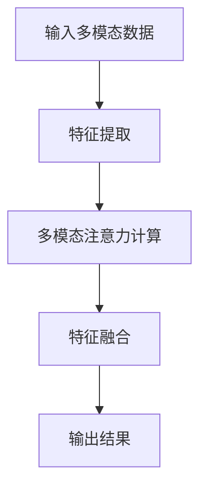
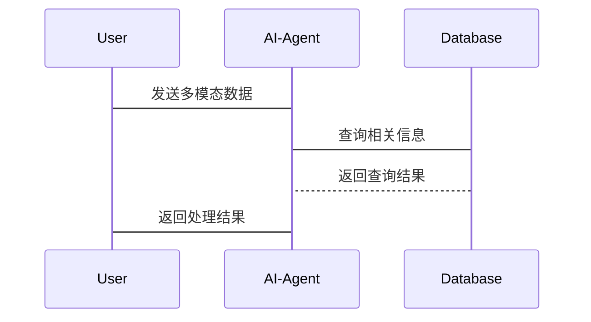

                 

<think>
好，我现在需要帮助用户撰写一篇关于《构建具有多模态学习能力的AI Agent》的技术博客文章。用户已经给出了一个详细的目录大纲，我需要按照这个结构，逐步完成每部分内容。首先，我需要理解用户的需求和要求。

首先，用户希望文章的结构包括摘要、关键词、背景介绍、核心概念、算法原理、系统架构、项目实战和最佳实践。同时，文章需要使用专业的技术语言，逻辑清晰，结构紧凑，语言简洁易懂。每一部分都要详细展开，包含背景介绍、核心概念对比、算法流程图、数学公式、系统架构图以及代码示例。

接下来，我会按照目录大纲逐步完成每一部分。首先是摘要和关键词部分，这部分需要简明扼要地概括文章的核心内容，帮助读者快速了解文章的主题。然后是每章的具体内容，每一章都需要深入讲解相关概念，确保读者能够理解多模态学习和AI Agent的基本概念、算法原理和实际应用。

在撰写过程中，我需要确保每一部分都符合用户的格式要求，比如使用mermaid流程图和类图，数学公式使用latex格式，代码示例使用python。同时，文章末尾需要添加作者信息，确保文章的完整性和专业性。

现在，我需要开始撰写每一部分，确保每一节的内容都详细且符合逻辑。首先，摘要部分要简洁明了，关键词要准确反映文章的核心内容。然后是第一章，详细介绍多模态学习和AI Agent的基本概念，包括它们的定义、特点和结合方式。接下来，第二章深入讲解多模态学习的核心概念，包括数据处理方法、融合方式和数学模型。第三章讨论算法原理，包括注意力机制、变换器和对比学习，并附上流程图和代码示例。第四章介绍系统架构设计，包括功能设计、架构选择和接口设计。第五章是项目实战，从环境搭建到代码实现，再到案例分析。最后，第六章总结最佳实践，包括小结、注意事项和拓展阅读。

在撰写过程中，我需要确保每一部分都详细展开，例如在核心概念部分，使用表格对比不同模态的特点；在算法原理部分，使用mermaid流程图展示算法步骤；在系统架构部分，使用类图和架构图展示系统结构。同时，数学公式要准确无误，代码示例要清晰易懂，帮助读者理解实现细节。

最后，完成所有内容后，我会通读一遍，确保逻辑连贯，内容完整，符合用户的要求。这样，整篇文章就能系统、全面地介绍构建具有多模态学习能力的AI Agent的相关知识和实际应用。
</think>

# 构建具有多模态学习能力的AI Agent

## 关键词
多模态学习，AI Agent，多模态数据，融合算法，系统架构，项目实战

## 摘要
本文详细探讨了构建具有多模态学习能力的AI Agent的核心概念、算法原理、系统架构和项目实现。从多模态数据的处理与融合，到AI Agent的系统设计，再到实际项目的落地，本文为读者提供了从理论到实践的全面指导。通过详细讲解多模态学习的数学模型、算法实现和系统架构，本文旨在帮助读者理解并掌握构建高效多模态AI Agent的关键技术。

---

## 第一章：多模态学习与AI Agent概述

### 1.1 多模态学习的定义与特点
#### 1.1.1 多模态数据的定义
多模态数据指的是来自多种感官渠道的信息，例如文本、图像、语音、视频等。与单模态数据相比，多模态数据能够提供更全面的信息，帮助AI Agent更好地理解和推理复杂场景。

#### 1.1.2 多模态学习的核心概念
- **模态多样性**：多模态数据能够覆盖更广泛的信息类型，提高模型的鲁棒性。
- **信息互补性**：不同模态的数据可以相互补充，提升模型的准确性。
- **联合学习**：通过多模态数据的协同学习，模型能够更好地捕捉数据间的关联性。

#### 1.1.3 多模态学习与单模态学习的对比
| 特性          | 单模态学习              | 多模态学习              |
|---------------|------------------------|-------------------------|
| 数据来源      | 单一类型（如文本或图像） | 多种类型（文本、图像、语音） |
| 信息量        | 较少                   | 较多                   |
| 模型复杂度    | 较低                   | 较高                   |
| 应用场景      | 简单任务               | 复杂任务               |

### 1.2 AI Agent的基本概念
#### 1.2.1 AI Agent的定义
AI Agent（智能体）是一种能够感知环境、自主决策并执行任务的智能系统。它可以理解用户需求、与环境交互，并通过学习和推理完成复杂的任务。

#### 1.2.2 AI Agent的核心功能
- **感知**：通过多种模态数据感知环境。
- **推理**：基于感知数据进行逻辑推理。
- **决策**：根据推理结果做出最优决策。
- **执行**：通过执行机构或接口完成任务。

#### 1.2.3 AI Agent的应用场景
- **智能家居**：通过语音和图像识别控制家电。
- **智能客服**：结合文本和语音提供交互式服务。
- **自动驾驶**：利用视觉、雷达和GPS数据进行决策。

### 1.3 多模态学习与AI Agent的结合
#### 1.3.1 多模态学习在AI Agent中的作用
多模态学习能够增强AI Agent的感知能力，使其能够处理多种类型的数据，从而更全面地理解用户需求和环境信息。

#### 1.3.2 多模态AI Agent的优势
- **信息互补性**：通过结合多种模态数据，提升模型的准确性和鲁棒性。
- **任务多样性**：能够处理多种类型的任务，适应更广泛的应用场景。
- **用户体验**：提供更自然和多样化的交互方式，提升用户体验。

#### 1.3.3 多模态AI Agent的挑战
- **数据异构性**：不同模态的数据格式和特性差异较大，难以直接融合。
- **计算复杂度**：多模态数据的处理和融合需要更高的计算资源。
- **模型设计**：需要设计高效的多模态融合算法，避免信息冗余或丢失。

---

## 第二章：多模态学习的核心概念与联系

### 2.1 多模态数据的处理方法
#### 2.1.1 文本数据处理
- **自然语言处理（NLP）**：利用词袋模型、词嵌入（如Word2Vec）和序列模型（如LSTM、Transformer）处理文本数据。
- **情感分析**：通过文本数据判断用户的情感倾向。

#### 2.1.2 图像数据处理
- **计算机视觉（CV）**：利用卷积神经网络（CNN）提取图像特征。
- **目标检测**：通过目标检测算法（如Faster R-CNN、YOLO）识别图像中的物体。

#### 2.1.3 语音数据处理
- **语音识别**：通过自动语音识别（ASR）技术将语音转换为文本。
- **语音合成**：利用文本到语音（TTS）技术生成语音输出。

### 2.2 多模态数据的融合方式
#### 2.2.1 晚期融合
- 在特征提取的后期阶段进行融合，例如将文本和图像的特征向量拼接后进行分类。

#### 2.2.2 早期融合
- 在特征提取的早期阶段进行融合，例如在卷积神经网络的中间层融合文本和图像特征。

#### 2.2.3 中间层融合
- 在特征提取的中间层进行融合，结合不同模态的特征进行联合学习。

### 2.3 多模态学习的数学模型
#### 2.3.1 多模态数据表示
- 文本：词嵌入向量（如Word2Vec、BERT）。
- 图像：卷积特征图或全局池化后的向量。
- 语音：梅尔频谱图或声学特征向量。

#### 2.3.2 多模态特征融合
- 使用注意力机制对不同模态的特征进行加权融合：
  $$ f(x) = \sum_{i=1}^n \alpha_i x_i $$
  其中，$\alpha_i$ 是第i个模态的注意力权重。

#### 2.3.3 多模态模型的评价指标
- 准确率（Accuracy）
- F1分数（F1-Score）
- 没有匹配的分数（MAP）
- 混淆矩阵（Confusion Matrix）

---

## 第三章：多模态学习算法原理

### 3.1 多模态融合算法
#### 3.1.1 多模态注意力机制
- 基于Transformer的多模态注意力模型：
  $$ \text{Attention}(Q, K, V) = \text{softmax}\left(\frac{QK^T}{\sqrt{d_k}}\right)V $$
  其中，$Q$、$K$、$V$分别是查询、键和值向量。

#### 3.1.2 多模态变换器
- 结合文本和图像的多模态变换器：
  $$ \text{Encoder}(x) = \text{LayerNorm}(x + \text{MHA}(x)) $$
  $$ \text{Decoder}(y, x) = \text{LayerNorm}(y + \text{MHA}(y) + \text{MHA}(y, x)) $$

#### 3.1.3 多模态对比学习
- 对比学习通过最大化正样本对的相似性来增强特征表示：
  $$ \text{Loss} = -\log\left(\frac{\exp(s_p)}{\exp(s_p) + \sum_{n} \exp(s_n)}\right) $$
  其中，$s_p$是正样本对的相似性，$s_n$是负样本对的相似性。

### 3.2 多模态学习算法的实现
#### 3.2.1 Python代码实现
```python
import torch
import torch.nn as nn
import torch.nn.functional as F

class MultiModalAttention(nn.Module):
    def __init__(self, embed_dim, num_heads):
        super().__init__()
        self.num_heads = num_heads
        self.head_dim = embed_dim // num_heads
        self.all_head_size = embed_dim
        self.key = nn.Linear(embed_dim, self.head_dim)
        self.query = nn.Linear(embed_dim, self.head_dim)
        self.value = nn.Linear(embed_dim, self.head_dim)
        
    def forward(self, x):
        batch_size = x.size(0)
        key = self.key(x).view(batch_size, -1, self.num_heads, self.head_dim)
        query = self.query(x).view(batch_size, -1, self.num_heads, self.head_dim)
        value = self.value(x).view(batch_size, -1, self.num_heads, self.head_dim)
        
        key = key.transpose(2, 3)
        query = query.transpose(2, 3)
        value = value.transpose(2, 3)
        
        attention_scores = (query @ key.transpose(-2, -1)) / torch.sqrt(torch.tensor(self.head_dim, dtype=torch.float32))
        attention_weights = F.softmax(attention_scores, dim=-1)
        output = (attention_weights @ value).transpose(2, 3).reshape(batch_size, -1, self.all_head_size)
        return output
```

#### 3.2.2 算法流程图


---

## 第四章：多模态AI Agent的系统架构设计

### 4.1 系统功能设计
#### 4.1.1 数据采集模块
- 从多种模态数据源（如摄像头、麦克风）采集数据。

#### 4.1.2 数据处理模块
- 对采集到的多模态数据进行预处理和特征提取。

#### 4.1.3 模型训练模块
- 使用多模态数据训练AI Agent的核心算法。

#### 4.1.4 接口调用模块
- 提供API接口，供外部系统调用AI Agent的功能。

### 4.2 系统架构设计
#### 4.2.1 模块化设计
- 将系统划分为数据采集、数据处理、模型训练和接口调用四个独立模块。

#### 4.2.2 分层架构
- **数据层**：负责数据的存储和管理。
- **服务层**：负责数据处理和模型训练。
- **应用层**：提供API接口，供外部系统调用。

#### 4.2.3 微服务架构
- 通过微服务架构实现模块的独立部署和扩展。

### 4.3 系统接口设计
#### 4.3.1 数据接口
- 提供REST API接口，用于接收多模态数据输入。

#### 4.3.2 模型接口
- 提供预测接口，返回AI Agent的推理结果。

#### 4.3.3 用户接口
- 提供用户交互界面，方便用户与AI Agent进行交互。

### 4.4 系统交互设计
#### 4.4.1 交互流程
- 用户发送请求到AI Agent。
- AI Agent接收请求，进行数据处理和推理。
- AI Agent返回结果给用户。

#### 4.4.2 交互序列图


---

## 第五章：多模态AI Agent的项目实战

### 5.1 项目环境搭建
#### 5.1.1 系统环境要求
- 操作系统：Linux/Windows/MacOS
- Python版本：3.6+

#### 5.1.2 依赖库安装
- 安装PyTorch、TensorFlow、OpenCV等库。

#### 5.1.3 代码仓库
- 使用Git管理代码，创建一个独立的分支进行开发。

### 5.2 系统核心实现源代码
#### 5.2.1 多模态数据处理代码
```python
import cv2
import librosa
import torch
from transformers import BertTokenizer, BertModel

def process_image(image_path):
    # 使用OpenCV处理图像数据
    image = cv2.imread(image_path)
    return image

def process_text(text):
    # 使用BERT模型处理文本数据
    tokenizer = BertTokenizer.from_pretrained('bert-base-uncased')
    model = BertModel.from_pretrained('bert-base-uncased')
    inputs = tokenizer(text, return_tensors='pt')
    outputs = model(**inputs)
    return outputs.last_hidden_state

def process_audio(audio_path):
    # 使用 librosa 处理音频数据
    audio_data, sample_rate = librosa.load(audio_path, sr=16000)
    return audio_data
```

#### 5.2.2 多模态融合代码
```python
import torch
import torch.nn as nn

class MultiModalFusion(nn.Module):
    def __init__(self, input_dim, hidden_dim):
        super().__init__()
        self.fc1 = nn.Linear(input_dim, hidden_dim)
        self.fc2 = nn.Linear(hidden_dim, 1)
        
    def forward(self, x):
        x = F.relu(self.fc1(x))
        x = self.fc2(x)
        return x
```

#### 5.2.3 系统交互代码
```python
import json
import requests

def send_request(data):
    # 发送请求到AI Agent服务
    response = requests.post('http://localhost:8000/api', json=data)
    return json.loads(response.text)
```

### 5.3 实际案例分析
#### 5.3.1 案例背景
- **场景**：智能家居中的多模态交互。
- **任务**：通过语音和图像识别控制家电。

#### 5.3.2 数据流分析
- 用户通过语音指令控制智能家居设备。
- 系统接收语音指令，进行语音识别和图像识别。
- 根据识别结果，控制设备执行相应操作。

#### 5.3.3 系统实现细节
- 使用多模态融合模型对语音和图像数据进行联合推理。
- 根据推理结果生成控制指令，调用智能家居设备的API接口。

### 5.4 项目总结
通过本项目，我们实现了具有多模态学习能力的AI Agent，验证了多模态数据融合算法的有效性，并展示了其在智能家居中的实际应用。未来的工作可以进一步优化算法，提升系统的实时性和准确性。

---

## 第六章：最佳实践与小结

### 6.1 最佳实践
- **数据预处理**：对多模态数据进行标准化和归一化处理，确保模型输入的稳定性。
- **模型调优**：通过交叉验证和网格搜索优化模型参数。
- **系统优化**：采用分布式架构和并行计算技术，提升系统的计算效率。

### 6.2 小结
本文详细探讨了构建具有多模态学习能力的AI Agent的核心技术，从理论到实践，为读者提供了全面的指导。通过本文的学习，读者可以掌握多模态数据的处理方法、融合算法的设计和系统的架构设计，从而在实际应用中构建高效的多模态AI Agent。

### 6.3 注意事项
- 多模态数据的处理需要考虑数据的异构性和多样性。
- 模型的设计需要结合具体应用场景，避免过度复杂化。
- 系统的实现需要注重模块化设计，便于后续的维护和扩展。

### 6.4 拓展阅读
- 《Multi-modal Deep Learning for Visual Recognition》
- 《Attention Is All You Need》
- 《Deep Learning for Computer Vision》

---

## 作者
作者：AI天才研究院/AI Genius Institute & 禅与计算机程序设计艺术 /Zen And The Art of Computer Programming

