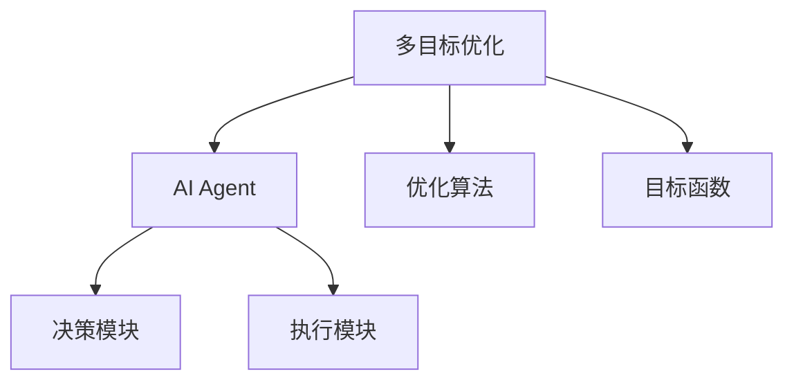
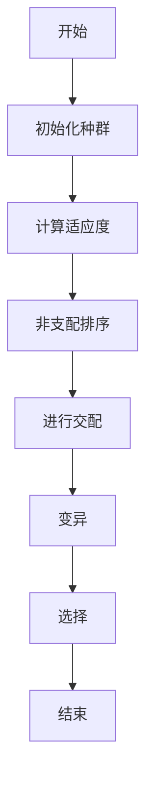
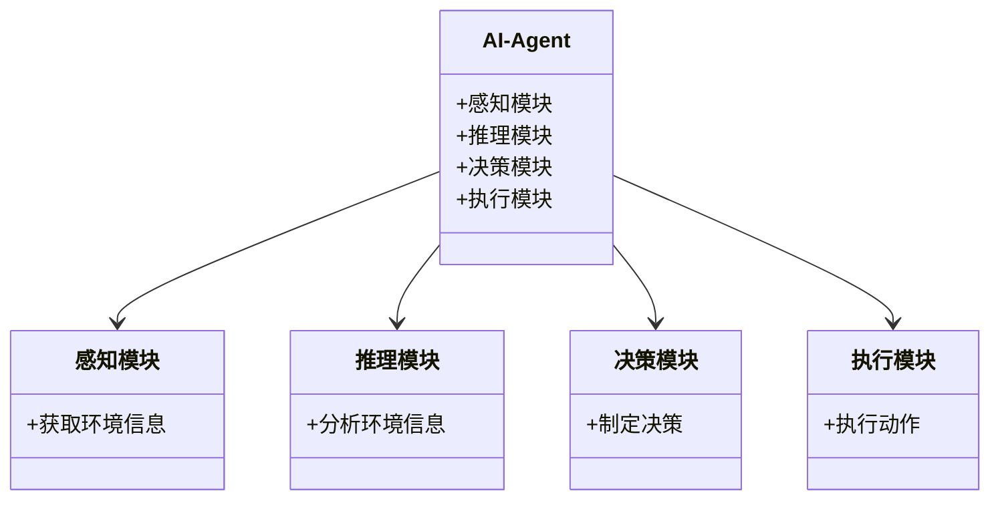
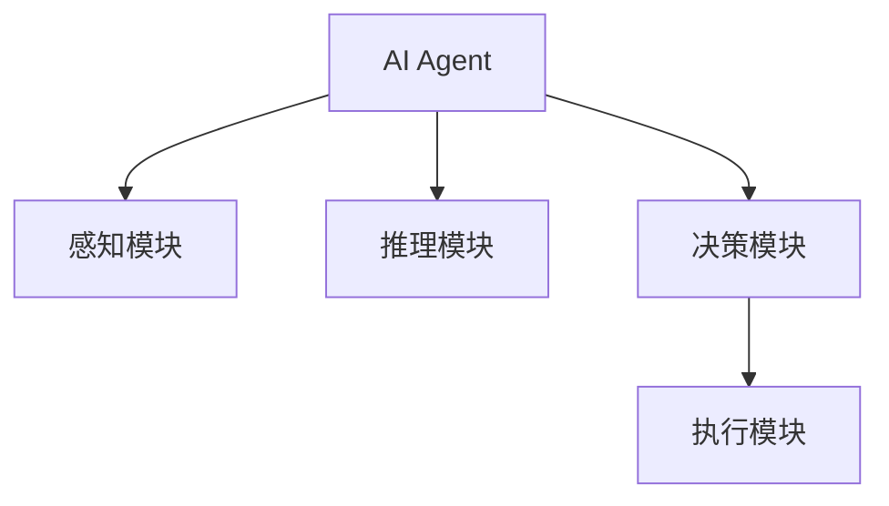
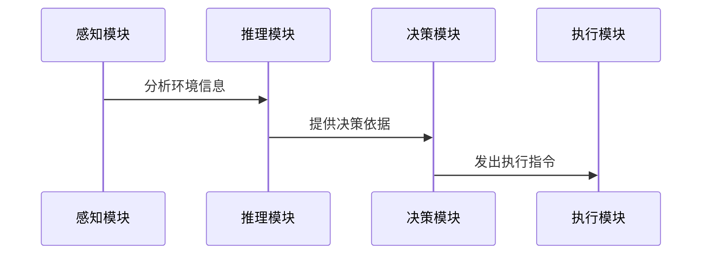

                 


# 构建具有多目标优化决策能力的AI Agent

## 关键词：多目标优化、AI Agent、决策机制、算法原理、系统架构、项目实战

## 摘要：  
本文详细探讨了如何构建具有多目标优化决策能力的AI Agent。从背景介绍、核心概念到算法实现、系统架构，再到项目实战和最佳实践，全面解析了多目标优化在AI Agent中的应用。通过NSGA-II算法的讲解和实际案例分析，帮助读者理解如何设计和实现高效的多目标优化AI Agent。

---

# 第1章: 多目标优化与AI Agent的背景介绍

## 1.1 问题背景  
### 1.1.1 当前AI Agent的发展现状  
AI Agent（人工智能代理）正在广泛应用于自动驾驶、智能推荐、机器人控制等领域。随着应用场景的复杂化，AI Agent需要在多个目标之间进行权衡，例如在自动驾驶中，既要保证安全，又要追求速度。  

### 1.1.2 多目标优化在AI Agent中的重要性  
传统的单目标优化无法满足复杂场景的需求，而多目标优化能够同时优化多个目标，帮助AI Agent在复杂环境中做出更优决策。  

### 1.1.3 问题背景与实际应用场景  
在智能推荐系统中，既要考虑用户的满意度，又要考虑推荐的效率。多目标优化能够平衡这两个目标，提供更优的推荐策略。  

## 1.2 问题描述  
### 1.2.1 多目标优化的定义  
多目标优化是指在多个相互冲突的目标下，寻找最优解的过程。例如，在资源分配问题中，目标可能是最大化利润和最小化成本。  

### 1.2.2 AI Agent的定义与功能  
AI Agent是一种能够感知环境、自主决策并采取行动的智能实体。它能够通过传感器获取信息，利用算法进行推理，并根据结果执行动作。  

### 1.2.3 多目标优化与AI Agent的结合  
AI Agent需要在多个目标之间进行权衡，例如在自动驾驶中，既要保证安全，又要追求速度。多目标优化能够帮助AI Agent找到最优的平衡点。  

## 1.3 问题解决  
### 1.3.1 多目标优化的解决思路  
通过引入 Pareto 优化的概念，找到一组非支配解，帮助AI Agent在多个目标之间找到最优解。  

### 1.3.2 AI Agent的决策机制  
AI Agent通过感知环境、分析目标、权衡利弊，最终做出最优决策。  

### 1.3.3 问题解决的具体步骤  
1. 确定目标和约束条件。  
2. 建立优化模型。  
3. 选择合适的优化算法。  
4. 实现算法并进行测试。  

## 1.4 边界与外延  
### 1.4.1 多目标优化的边界条件  
目标数量过多可能导致计算复杂度增加，因此需要设定合理的边界条件。  

### 1.4.2 AI Agent的应用范围  
AI Agent适用于需要自主决策的场景，如自动驾驶、智能机器人、智能推荐系统等。  

### 1.4.3 问题解决的局限性  
多目标优化算法的计算复杂度较高，可能不适合实时性要求极高的场景。  

## 1.5 概念结构与核心要素  
### 1.5.1 多目标优化的核心要素  
目标函数、约束条件、优化算法。  

### 1.5.2 AI Agent的核心组成  
感知模块、推理模块、决策模块、执行模块。  

### 1.5.3 两者的相互关系  
多目标优化为AI Agent的决策提供数学支持，AI Agent为多目标优化提供应用场景。  

---

# 第2章: 多目标优化与AI Agent的核心概念与联系

## 2.1 多目标优化的原理  
### 2.1.1 多目标优化的基本概念  
多目标优化是指在多个目标下寻找最优解的过程，通常涉及权衡和折中。  

### 2.1.2 常见的多目标优化算法  
1. NSGA-II：一种基于非支配排序的多目标优化算法。  
2. MOEA/D：一种分解式的多目标优化算法。  

### 2.1.3 多目标优化的评价指标  
1. Pareto 前沿：表示最优解的集合。  
2. 分散性：衡量解的分布情况。  

## 2.2 AI Agent的决策机制  
### 2.2.1 AI Agent的感知与推理  
AI Agent通过传感器获取环境信息，并利用推理算法进行分析。  

### 2.2.2 AI Agent的决策过程  
1. 状态感知。  
2. 目标分析。  
3. 解决策策冲突。  

### 2.2.3 AI Agent的学习与优化  
AI Agent通过强化学习或进化算法不断优化其决策策略。  

## 2.3 多目标优化与AI Agent的关系  
### 2.3.1 多目标优化在AI Agent中的作用  
多目标优化帮助AI Agent在多个目标之间找到平衡点，提升决策的全面性。  

### 2.3.2 AI Agent如何实现多目标优化  
通过引入多目标优化算法，AI Agent能够在复杂环境中做出更优决策。  

### 2.3.3 两者的相互影响  
多目标优化为AI Agent提供数学支持，AI Agent为多目标优化提供应用场景。  

## 2.4 核心概念对比表格  
| 概念       | 多目标优化                     | AI Agent                     |  
|------------|-------------------------------|------------------------------|  
| 核心目标   | 在多个目标下寻找最优解         | 在复杂环境中自主决策         |  
| 应用场景   | 工程设计、资源分配             | 自动驾驶、智能推荐             |  
| 关键技术   | Pareto 优化、分解式算法         | 强化学习、进化算法             |  

## 2.5 ER实体关系图  


---

# 第3章: 多目标优化算法的原理与实现

## 3.1 算法原理  
### 3.1.1 NSGA-II算法的基本原理  
NSGA-II是一种基于非支配排序的多目标优化算法，通过遗传算法的思想，逐步优化解的集合。  

### 3.1.2 多目标优化的数学模型  
目标函数：$f(x) = (x_1, x_2, ..., x_n)$  
约束条件：$g(x) \leq 0$  
优化目标：找到 Pareto 优化解集。  

### 3.1.3 算法的优缺点分析  
优点：能够找到 Pareto 优化解集；缺点：计算复杂度较高。  

## 3.2 算法实现  
### 3.2.1 NSGA-II算法的流程图  


### 3.2.2 Python代码实现  
```python
import random

def nsga_ii(population_size, crossover_rate, mutation_rate):
    # 初始化种群
    population = [random个体] * population_size
    # 计算适应度
    for individual in population:
        compute_fitness(individual)
    # 非支配排序
    pareto_front = non_dominated_sort(population)
    # 交配
    offspring = crossover(pareto_front, crossover_rate)
    # 变异
    mutate(offspring, mutation_rate)
    # 选择
    new_population = selection(population + offspring)
    return new_population
```

### 3.2.3 算法的数学模型与公式  
目标函数：$$f(x) = (x_1, x_2, ..., x_n)$$  
约束条件：$$g(x) \leq 0$$  
适应度函数：$$F(x) = \sum f(x_i)$$  

---

# 第4章: AI Agent的系统分析与架构设计

## 4.1 问题场景介绍  
AI Agent需要在复杂环境中做出决策，例如自动驾驶中的路径规划问题。  

## 4.2 系统功能设计  
### 4.2.1 领域模型（Mermaid类图）  


### 4.2.2 系统架构设计（Mermaid架构图）  


### 4.2.3 系统交互（Mermaid序列图）  


---

# 第5章: 项目实战

## 5.1 环境安装  
安装所需的Python库：numpy、pymoea、matplotlib。  

## 5.2 系统核心实现源代码  
```python
import numpy as np
from pymoea import NSGAII

# 定义目标函数
def objective(x):
    return (x[0], -x[1])

# 初始化种群
population_size = 100
crossover_rate = 0.8
mutation_rate = 0.2

# 运行NSGA-II算法
algorithm = NSGAII(objective, population_size, crossover_rate, mutation_rate)
optimal_solutions = algorithm.run()

# 可视化结果
import matplotlib.pyplot as plt
plt.scatter([x[0] for x in optimal_solutions], [x[1] for x in optimal_solutions])
plt.xlabel('目标1')
plt.ylabel('目标2')
plt.show()
```

## 5.3 代码应用解读与分析  
上述代码实现了NSGA-II算法，用于解决二维多目标优化问题。通过运行代码，可以得到Pareto前沿的最优解集。  

## 5.4 实际案例分析  
以自动驾驶为例，AI Agent需要在保证安全的前提下，尽可能快速地到达目的地。通过多目标优化算法，AI Agent能够在复杂环境中做出最优决策。  

## 5.5 项目小结  
通过本章的实战，读者可以掌握如何将多目标优化算法应用于AI Agent的决策过程中。  

---

# 第6章: 总结与展望

## 6.1 最佳实践 tips  
1. 在实际应用中，合理设置目标和约束条件。  
2. 根据具体场景选择合适的多目标优化算法。  
3. 定期优化AI Agent的决策模型，以适应环境的变化。  

## 6.2 小结  
本文详细探讨了多目标优化在AI Agent中的应用，从算法原理到系统架构，再到项目实战，全面解析了如何构建具有多目标优化决策能力的AI Agent。  

## 6.3 注意事项  
1. 多目标优化算法的计算复杂度较高，需要合理设置参数。  
2. 在实际应用中，注意处理不确定性和动态变化的环境。  

## 6.4 拓展阅读  
推荐阅读《多目标优化算法及其应用》和《AI Agent的设计与实现》等相关书籍。  

---

# 作者：AI天才研究院/AI Genius Institute & 禅与计算机程序设计艺术 /Zen And The Art of Computer Programming

