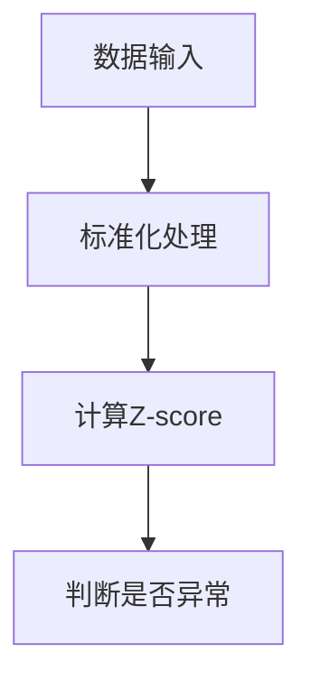
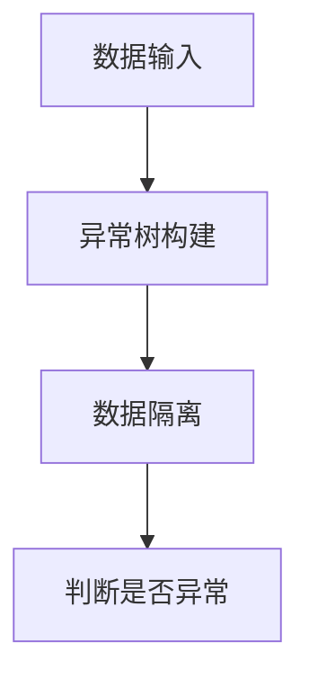
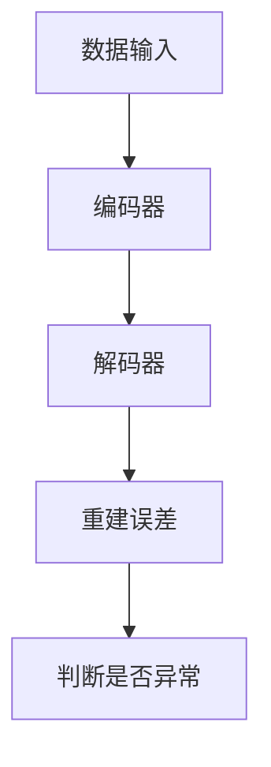
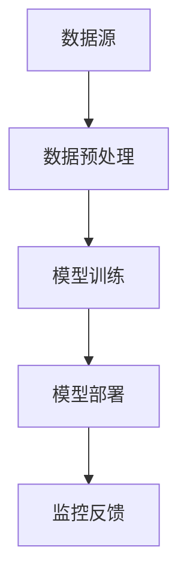

                 


# 构建具有异常检测能力的AI Agent

> 关键词：异常检测、AI Agent、机器学习、深度学习、实时检测

> 摘要：本文将探讨如何构建具有异常检测能力的AI Agent，涵盖其背景、核心概念、算法原理、系统架构和项目实战，帮助读者掌握构建此类系统的步骤和技巧。

---

## 第一部分: 异常检测与AI Agent基础

### 第1章: 异常检测与AI Agent概述

#### 1.1 异常检测的核心概念

##### 1.1.1 异常检测的定义与背景
异常检测是识别数据中与预期模式不一致的点或事件的过程。在AI Agent中，异常检测用于实时监控系统行为，发现潜在问题，提高系统的健壮性和安全性。

##### 1.1.2 AI Agent的基本概念
AI Agent是一种智能代理，能够感知环境、执行任务并做出决策。它广泛应用于推荐系统、自动化控制和智能监控等领域。

##### 1.1.3 异常检测在AI Agent中的作用
通过异常检测，AI Agent可以及时识别异常行为，预防潜在风险，提升系统的可靠性和用户体验。

#### 1.2 异常检测的关键技术

##### 1.2.1 统计方法
统计方法基于数据分布，如Z-score和标准差，适用于正态分布数据。其优点是计算简单，但对分布假设敏感。

##### 1.2.2 机器学习方法
机器学习方法如Isolation Forest，通过构建异常树隔离数据点，适合高维数据，但需要大量标记数据。

##### 1.2.3 深度学习方法
深度学习方法如Autoencoder，通过神经网络重建数据，识别异常点。其优点是无需标记数据，但计算复杂度较高。

#### 1.3 异常检测的应用场景

##### 1.3.1 金融领域的异常检测
用于检测欺诈交易和市场异常，保障金融系统的安全。

##### 1.3.2 网络安全中的异常检测
识别网络攻击和入侵，保护系统免受威胁。

##### 1.3.3 工业领域的异常检测
监测设备状态，预测故障，提高生产效率。

### 第2章: AI Agent的异常检测需求分析

#### 2.1 异常检测的业务需求

##### 2.1.1 数据特征分析
了解数据分布、维度和噪声，选择合适的检测方法。

##### 2.1.2 异常检测的实时性要求
根据业务需求，确定实时检测的频率和响应时间。

##### 2.1.3 模型的可解释性需求
确保模型结果可解释，便于调试和优化。

#### 2.2 异常检测的技术需求

##### 2.2.1 数据预处理需求
包括数据清洗、标准化和特征提取，确保数据质量。

##### 2.2.2 模型训练需求
选择适合的数据集和算法，调整超参数，优化模型性能。

##### 2.2.3 模型部署需求
设计高效的接口，确保模型在生产环境中稳定运行。

---

## 第二部分: 异常检测算法原理

### 第3章: 异常检测算法原理

#### 3.1 统计方法

##### 3.1.1 Z-score方法
$$ Z = \frac{X - \mu}{\sigma} $$
其中，$X$是数据点，$\mu$是均值，$\sigma$是标准差。Z-score超过一定阈值即视为异常。

##### 3.1.2 算法流程图


#### 3.2 机器学习方法

##### 3.2.1 Isolation Forest算法
通过构建随机树隔离异常点，适合高维数据。

##### 3.2.2 算法流程图


#### 3.3 深度学习方法

##### 3.3.1 Autoencoder算法
通过神经网络重建数据，识别异常点。

##### 3.3.2 算法流程图


---

## 第三部分: 系统架构与实现

### 第4章: 系统架构设计

#### 4.1 问题场景介绍
设计一个实时监控系统，检测网络流量中的异常行为，保护系统免受攻击。

#### 4.2 系统功能设计

##### 4.2.1 数据采集模块
负责收集实时数据，支持多种数据源。

##### 4.2.2 数据预处理模块
对数据进行清洗和标准化处理，提取特征。

##### 4.2.3 模型训练模块
选择合适算法，训练异常检测模型。

##### 4.2.4 模型部署模块
将模型部署到生产环境，提供API接口。

##### 4.2.5 监控反馈模块
实时监控模型表现，提供反馈和优化建议。

#### 4.3 系统架构图


---

## 第四部分: 项目实战

### 第5章: 项目实战

#### 5.1 环境安装
安装必要的库，如Python的scikit-learn和TensorFlow。

#### 5.2 核心实现

##### 5.2.1 数据预处理代码
```python
import pandas as pd
from sklearn.preprocessing import StandardScaler

data = pd.read_csv('data.csv')
scaler = StandardScaler()
data_scaled = scaler.fit_transform(data)
```

##### 5.2.2 模型训练代码
```python
from sklearn.ensemble import IsolationForest

model = IsolationForest(contamination=0.05)
model.fit(data_scaled)
```

##### 5.2.3 模型部署代码
```python
import flask

app = Flask(__name__)

@app.route('/detect', methods=['POST'])
def detect_anomaly():
    data = request.json['data']
    scaled_data = scaler.transform(data)
    prediction = model.predict(scaled_data)
    return jsonify({'is_anomaly': prediction[0] == -1})
```

#### 5.3 实际案例分析
通过具体案例分析模型的性能，调整参数优化结果。

---

## 第五部分: 最佳实践与总结

### 第6章: 最佳实践

#### 6.1 性能优化建议
使用分布式计算和流处理技术提升检测效率。

#### 6.2 模型调优技巧
定期重新训练模型，保持检测能力。

#### 6.3 系统扩展性设计
设计模块化架构，方便功能扩展和维护。

#### 6.4 小结
构建具有异常检测能力的AI Agent需要结合多种技术，合理选择算法，优化系统架构，确保模型高效稳定运行。

---

## 作者信息

作者：AI天才研究院 & 禅与计算机程序设计艺术

---

这篇文章详细讲解了构建具有异常检测能力的AI Agent的过程，从背景知识到算法实现，再到系统设计和项目实战，为读者提供了全面的指导。希望对您有所帮助！

