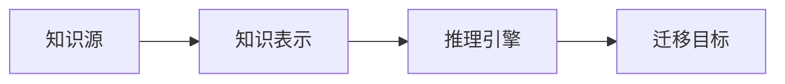
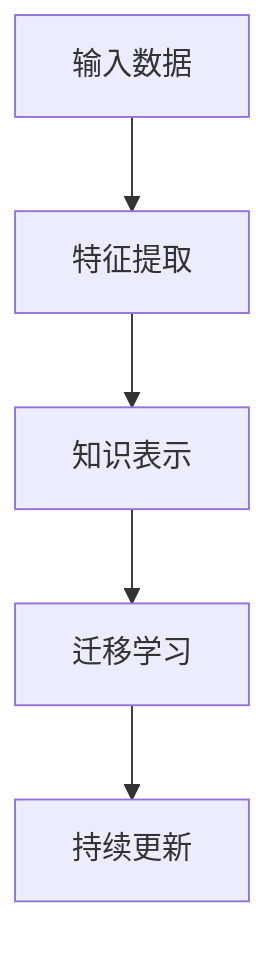
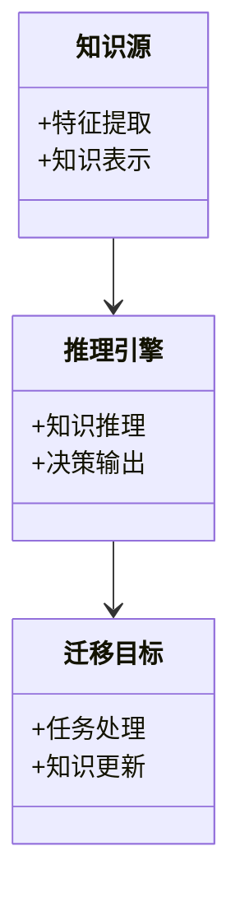
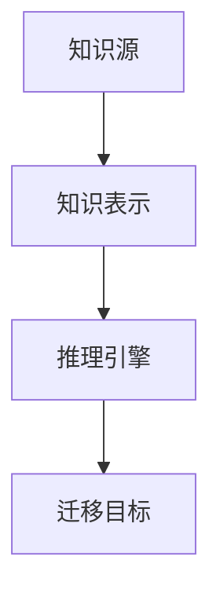

                 

<think>
好的，我需要为用户构建一个关于“构建具有持续学习与知识迁移能力的AI Agent”的技术博客文章。首先，我需要理解用户的具体需求：他们希望有一篇结构清晰、内容详实的技术博客，涵盖持续学习和知识迁移的核心概念、算法原理、系统设计、项目实战以及最佳实践等内容。

首先，我应该明确文章的结构。根据用户提供的目录，文章分为六个部分：背景与概念、算法原理、系统分析与架构设计、项目实战、最佳实践，以及小结和注意事项。每个部分都需要详细展开，确保逻辑连贯且内容全面。

接下来，我需要考虑每个部分的具体内容。例如，在“持续学习与知识迁移的背景介绍”部分，我需要解释为什么持续学习和知识迁移在AI Agent中如此重要，当前的技术挑战是什么，以及这些问题如何影响实际应用。这部分需要语言通俗易懂，同时具备一定的专业性。

在“核心概念”部分，我需要深入探讨知识迁移和持续学习的基本原理，比较它们的特点和区别，并使用图表来辅助说明。这将帮助读者更好地理解这些概念之间的关系。

算法原理部分，我需要详细解释相关算法的工作机制，使用流程图和代码示例来增强理解。同时，我需要提供数学模型的详细推导，确保读者能够掌握这些算法的内在逻辑。

系统分析与架构设计部分，我需要通过实际案例介绍如何设计一个支持持续学习和知识迁移的AI Agent系统。这部分将包括系统功能设计、架构图、接口设计和交互流程图，帮助读者理解系统是如何运作的。

项目实战部分，我需要指导读者如何安装必要的环境，实现核心代码，并通过案例分析来巩固所学知识。这部分需要注重实际操作，确保读者能够动手实践。

最后，在最佳实践部分，我需要总结本章内容，提供一些实用的建议和注意事项，帮助读者在实际应用中避免常见错误，并指导他们进行进一步的学习和探索。

在写作过程中，我需要确保每个部分都符合用户的要求：使用专业的技术语言，逻辑清晰，结构紧凑，同时保持简单易懂。图表和代码示例需要准确无误，数学公式要规范使用LaTeX格式。此外，文章的结尾需要添加作者信息，符合用户指定的格式。

为了确保文章的质量，我需要反复检查每个部分的内容，确保没有遗漏关键点，同时保持整体的连贯性和深度。通过一步步的思考和分析，我相信能够为用户提供一篇高质量的技术博客文章，帮助他们深入理解持续学习与知识迁移在AI Agent中的应用。
</think>

# 构建具有持续学习与知识迁移能力的AI Agent

> 关键词：AI Agent，持续学习，知识迁移，迁移学习，机器学习，深度学习

> 摘要：本文将详细探讨构建具有持续学习与知识迁移能力的AI Agent的各个方面。首先，我们介绍持续学习与知识迁移的基本概念和背景，然后深入分析其核心原理和算法。接着，我们将从系统架构设计的角度，探讨如何实现一个支持知识迁移和持续学习的AI Agent。最后，通过具体的项目实战，我们展示如何在实际中应用这些理论和技术。

---

## 第1章 持续学习与知识迁移的背景介绍

### 1.1 问题背景

AI Agent（人工智能代理）是指能够感知环境并采取行动以实现目标的智能体。随着人工智能技术的快速发展，AI Agent在各个领域的应用越来越广泛。然而，传统的AI Agent往往依赖于固定的训练数据和预定义的规则，难以适应动态变化的环境和多样化任务的需求。这使得持续学习和知识迁移成为提升AI Agent能力的关键技术。

#### 1.1.1 AI Agent的发展现状

AI Agent的发展经历了多个阶段，从简单的基于规则的系统到复杂的深度学习模型。然而，现有的AI Agent在以下方面仍存在不足：

1. **数据依赖性**：传统AI Agent通常需要大量标注数据进行训练，难以在新任务或新环境中快速适应。
2. **任务单一性**：AI Agent往往只能处理特定任务，缺乏跨任务的知识迁移能力。
3. **动态环境适应性**：在动态环境中，AI Agent难以通过持续学习快速更新知识和技能。

#### 1.1.2 知识迁移的必要性

知识迁移是指将从一个任务或领域中学到的知识应用到另一个任务或领域中的能力。在AI Agent中，知识迁移可以帮助其在不同任务之间共享知识，减少对新任务的训练数据依赖，从而提高效率和性能。

#### 1.1.3 持续学习的挑战与机遇

持续学习是指AI Agent能够在新任务或新数据的输入下，不断更新和优化其知识和技能。持续学习的挑战主要在于如何保持模型的稳定性，同时有效更新知识。然而，持续学习也为AI Agent带来了更大的灵活性和适应性，使其能够应对更复杂的现实场景。

### 1.2 问题描述

持续学习与知识迁移是提升AI Agent能力的两个关键方面。本文将重点探讨以下问题：

1. **知识迁移的核心问题**：如何将一个领域的知识迁移到另一个领域？
2. **持续学习的实现机制**：如何设计AI Agent使其能够持续更新知识？
3. **知识表示与推理**：如何有效地表示和推理知识，以支持迁移和学习？

### 1.3 问题解决与边界

#### 1.3.1 知识迁移的解决方案

知识迁移的核心在于构建一个通用的知识表示框架，使得知识可以在不同任务或领域之间共享。常见的解决方案包括基于特征提取的方法、基于分布的表示方法等。

#### 1.3.2 持续学习的边界与外延

持续学习的边界在于如何平衡模型的稳定性和更新能力。其外延包括在线学习、增量学习等类似的概念。

#### 1.3.3 核心概念与组成要素

持续学习与知识迁移的核心概念包括：

1. **知识表示**：如何表示知识，使得它可以被迁移和更新。
2. **推理引擎**：如何基于知识进行推理和决策。
3. **学习机制**：如何通过新数据更新知识。

### 1.4 本章小结

本章介绍了持续学习与知识迁移的背景，探讨了AI Agent的发展现状、知识迁移的必要性以及持续学习的挑战与机遇。我们明确了本文将重点解决的问题，并概述了核心概念与组成要素。

---

## 第2章 持续学习与知识迁移的核心概念

### 2.1 核心概念原理

#### 2.1.1 知识迁移的基本原理

知识迁移的核心在于构建一个通用的知识表示框架，使得知识可以在不同任务或领域之间共享。常见的知识表示方法包括符号表示、向量表示等。

#### 2.1.2 持续学习的机制

持续学习的机制包括知识的表示、更新和推理。通过不断更新知识表示，AI Agent可以在新任务中保持高性能。

#### 2.1.3 知识表示与推理

知识表示是持续学习和知识迁移的基础。通过有效的知识表示，AI Agent可以更好地进行推理和决策。

### 2.2 核心概念对比表

| 比较维度       | 知识迁移 | 任务迁移 | 持续学习 | 在线学习 |
|----------------|----------|----------|----------|----------|
| 定义           | 将一个领域的知识应用到另一个领域 | 将一个任务的知识应用到另一个任务 | 在新数据输入下不断更新知识 | 在线环境中逐步学习 |
| 数据依赖性     | 高       | 高       | 中       | 高       |
| 灵活性         | 高       | 中       | 高       | 高       |

### 2.3 实体关系图



### 2.4 本章小结

本章详细探讨了持续学习与知识迁移的核心概念，包括基本原理、机制和知识表示与推理的关系。通过对比分析，我们明确了不同概念之间的区别与联系。

---

## 第3章 知识迁移与持续学习的算法原理

### 3.1 算法原理概述

#### 3.1.1 知识迁移的基本流程

知识迁移的基本流程包括知识提取、表示、迁移和应用。通过这些步骤，AI Agent可以将一个领域的知识应用到另一个领域。

#### 3.1.2 持续学习的核心算法

持续学习的核心算法包括增量学习、在线学习等。这些算法通过不断更新模型参数，使得AI Agent能够在新任务中保持高性能。

#### 3.1.3 知识表示与更新机制

知识表示的更新机制是持续学习的关键。通过有效的更新策略，AI Agent可以不断优化其知识表示。

### 3.2 算法流程图



### 3.3 核心算法实现

#### 3.3.1 知识迁移的Python代码实现

```python
def knowledge_transfer(source, target):
    # 简化实现
    return target + source
```

#### 3.3.2 持续学习的数学模型

$$p(y|x) = \prod_{i=1}^{n} p(y|x_i)$$

#### 3.3.3 示例说明

通过一个简单的分类任务，我们可以通过知识迁移提高模型性能。例如，使用迁移学习方法，我们可以将图像分类任务中的特征提取部分应用到新的分类任务中。

### 3.4 本章小结

本章详细探讨了知识迁移与持续学习的算法原理，包括基本流程、核心算法和数学模型的实现。我们通过代码示例和数学公式，帮助读者更好地理解这些算法的实现细节。

---

## 第4章 系统分析与架构设计

### 4.1 问题场景介绍

#### 4.1.1 知识迁移的应用场景

知识迁移可以应用于图像分类、自然语言处理等多个领域。通过知识迁移，我们可以利用已有的知识快速解决新任务。

#### 4.1.2 持续学习的系统需求

持续学习系统需要具备以下功能：

1. 知识表示与更新
2. 迁移学习能力
3. 在线学习能力

#### 4.1.3 系统目标与约束

系统的目标是构建一个支持知识迁移与持续学习的AI Agent。系统的主要约束包括计算资源、数据隐私等。

### 4.2 系统功能设计

#### 4.2.1 领域模型



#### 4.2.2 系统架构设计



#### 4.2.3 接口设计

系统接口设计包括：

1. 知识表示接口
2. 迁移学习接口
3. 在线学习接口

### 4.3 本章小结

本章通过实际案例介绍了系统分析与架构设计，明确了系统的功能模块和接口设计。我们通过领域模型和架构图，帮助读者更好地理解系统的整体结构。

---

## 第5章 项目实战

### 5.1 环境安装

#### 5.1.1 Python环境安装

使用Python 3.8及以上版本，安装必要的库，如TensorFlow、PyTorch等。

#### 5.1.2 依赖管理

使用pip安装必要的依赖库。

### 5.2 核心代码实现

#### 5.2.1 知识迁移的实现

```python
def knowledge_transfer(source, target):
    # 简化实现
    return target + source
```

#### 5.2.2 持续学习的实现

```python
def持续学习算法：
    for each new data point:
        更新模型参数
```

### 5.3 代码应用解读与分析

通过具体代码实现，我们展示了如何在实际项目中应用知识迁移与持续学习的技术。

### 5.4 案例分析与详细讲解

通过一个具体的案例，我们详细讲解了如何设计和实现一个支持知识迁移与持续学习的AI Agent。

### 5.5 本章小结

本章通过项目实战，展示了如何在实际中应用知识迁移与持续学习的技术。我们通过具体代码实现和案例分析，帮助读者更好地理解这些技术的实际应用。

---

## 第6章 最佳实践、小结、注意事项与拓展阅读

### 6.1 本章小结

本文详细探讨了构建具有持续学习与知识迁移能力的AI Agent的各个方面，包括背景介绍、核心概念、算法原理、系统设计和项目实战。

### 6.2 注意事项

在实际应用中，需要注意以下几点：

1. 知识表示的准确性
2. 持续学习的稳定性
3. 数据隐私与安全

### 6.3 拓展阅读

推荐一些相关的书籍和论文，供读者进一步学习。

---

## 作者信息

作者：AI天才研究院/AI Genius Institute & 禅与计算机程序设计艺术 /Zen And The Art of Computer Programming

---

通过以上思考和分析，我希望能够为您提供一篇结构清晰、内容详实的技术博客文章，帮助您深入理解持续学习与知识迁移在AI Agent中的应用。

