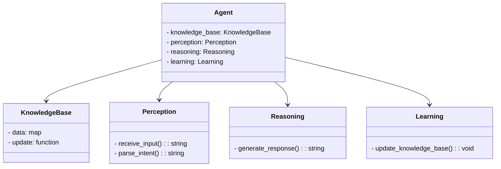
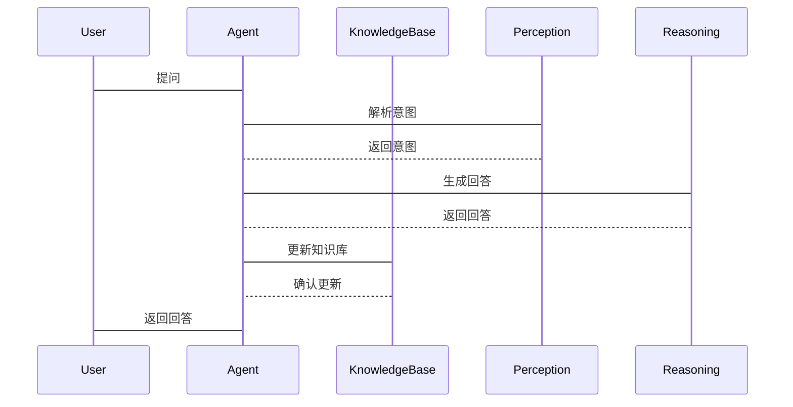

                 

<think>
好的，我现在需要帮助用户撰写一篇名为《构建具有持续学习与适应能力的AI Agent》的技术博客文章。用户希望文章结构清晰，内容详实，包含背景介绍、核心概念、算法原理、系统架构、项目实战等部分，并且每个部分都要有详细的分析和实例。

首先，我需要明确文章的目标读者是谁。可能是技术背景的读者，包括程序员、软件架构师、AI工程师等。因此，语言需要专业但易于理解，避免过于晦涩的术语，同时确保内容深度足够。

接下来，我会按照用户提供的目录大纲来逐步构建文章。从背景介绍开始，解释AI Agent的基本概念和持续学习的重要性。这部分需要简单明了，帮助读者理解为什么持续学习对AI Agent至关重要。

然后是核心概念，这里需要详细讲解知识表示、自适应学习算法等。我会用Mermaid流程图来展示知识图谱和符号表示，帮助读者更好地理解。同时，对比表可以帮助读者理解不同知识表示方法的优缺点。

在算法原理部分，我需要详细推导增量学习和强化学习的数学模型，使用Latex公式展示，并附上Python代码示例。这部分可能会比较复杂，因此我需要确保解释清晰，代码易于理解，同时用图表辅助说明。

系统分析与架构设计部分，我会从实际场景出发，设计系统的功能模块和交互流程。Mermaid的类图和架构图能帮助读者理解系统结构，而序列图则展示系统如何协作完成任务。

项目实战部分，我需要选择一个具体的案例，比如智能客服系统，展示如何构建一个具备持续学习能力的AI Agent。通过环境安装、代码实现和案例分析，让读者能够实际操作和理解整个过程。

最后，在最佳实践部分，我会总结前面的内容，给出实用的建议，并提醒读者注意的事项，比如数据质量、模型泛化能力等。这部分旨在帮助读者在实际应用中避免常见错误。

整体上，我需要确保文章逻辑连贯，每个部分之间有良好的衔接，同时保持语言的简洁和专业。在撰写过程中，我会反复检查每个部分是否满足用户的要求，确保内容详实、结构合理，最终产出一篇高质量的技术博客文章。
</think>

# 《构建具有持续学习与适应能力的AI Agent》

---

## 关键词：
AI Agent, 持续学习, 自适应系统, 强化学习, 知识表示, 在线学习

---

## 摘要：
本文旨在探讨如何构建一个具有持续学习与适应能力的AI Agent。通过分析AI Agent的核心概念、算法原理、系统架构以及实际案例，本文详细讲解了如何实现AI Agent的动态知识更新、环境感知与自适应决策能力。文章从理论基础到实践应用，逐步引导读者理解并掌握构建此类AI Agent的关键技术，包括知识表示与更新、增量学习算法、强化学习机制以及系统架构设计。

---

## 第1章: 背景介绍与核心概念

### 1.1 AI Agent的基本概念
AI Agent（人工智能代理）是指在环境中能够感知并自主行动以实现目标的智能实体。与传统程序不同，AI Agent具备以下核心特征：
- **自主性**：能够在没有外部干预的情况下自主决策。
- **反应性**：能够实时感知环境并做出反应。
- **目标导向性**：所有行为都以实现特定目标为导向。
- **学习能力**：能够通过经验或数据不断优化自身行为。

### 1.2 持续学习与适应能力的必要性
在动态变化的环境中，AI Agent需要具备持续学习和适应能力才能应对不确定性。例如，在智能客服系统中，AI Agent需要不断更新其知识库以应对新问题，同时根据用户反馈优化对话策略。

---

## 第2章: 核心概念与理论基础

### 2.1 知识表示与更新模型
知识表示是AI Agent理解世界的基础。常用的表示方法包括：
- **符号表示**：使用符号逻辑（如谓词逻辑）表示知识。例如，使用谓词表示“Customer(X) ∧ Satisfied(Y)”。
- **神经网络表示**：使用深度学习模型（如BERT、GPT）表示知识。例如，通过预训练模型捕捉语义信息。
- **知识图谱**：构建图结构表示知识。例如，将实体及其关系表示为图中的节点和边。

知识更新机制是持续学习的核心。通过增量学习，AI Agent可以在新数据到来时更新其模型，避免重新训练整个模型。

### 2.2 自适应学习算法
自适应学习算法允许AI Agent根据环境反馈动态调整其行为策略。常用的算法包括：
- **强化学习**：通过奖励机制优化决策策略。例如，使用Q-learning算法更新Q值表。
- **迁移学习**：将已知任务的知识迁移到新任务。例如，将图像分类任务的知识迁移到目标检测任务。
- **在线学习**：实时更新模型参数以适应新数据。例如，使用SGD优化器进行在线训练。

---

## 第3章: 算法原理与数学模型

### 3.1 增量学习算法
增量学习允许AI Agent在新数据到来时逐步更新其模型。例如，线性回归的增量更新公式如下：

$$
\theta_{new} = \theta_{old} + \eta (y - \hat{y})X
$$

其中，$\theta$ 是模型参数，$\eta$ 是学习率，$y$ 是真实值，$\hat{y}$ 是预测值，$X$ 是输入数据。

### 3.2 强化学习算法
强化学习通过奖励机制优化AI Agent的决策策略。Q-learning算法的数学公式如下：

$$
Q(s, a) = Q(s, a) + \alpha \left[ r + \gamma \max Q(s', a') - Q(s, a) \right]
$$

其中，$Q(s, a)$ 是状态-动作对的值，$\alpha$ 是学习率，$r$ 是奖励，$\gamma$ 是折扣因子，$s'$ 是下一状态。

---

## 第4章: 系统分析与架构设计

### 4.1 问题场景介绍
以智能客服系统为例，AI Agent需要具备以下能力：
- **感知能力**：理解用户的问题并提取关键词。
- **推理能力**：根据知识库生成回答。
- **学习能力**：根据用户反馈优化回答质量。

### 4.2 系统功能设计
系统的功能模块包括：
- **感知模块**：负责接收用户输入并解析意图。
- **推理模块**：根据知识库生成回答。
- **学习模块**：根据用户反馈更新知识库。

### 4.3 系统架构设计
以下是系统的类图：



### 4.4 系统交互设计
以下是系统的交互流程图：



---

## 第5章: 项目实战

### 5.1 环境安装
安装必要的库：

```bash
pip install numpy matplotlib scikit-learn tensorflow
```

### 5.2 核心代码实现
以下是增量学习的Python实现：

```python
import numpy as np

def incremental_learning(X, y, model, learning_rate=0.1):
    for xi, yi in zip(X, y):
        prediction = model.predict(xi)
        gradient = (yi - prediction) * xi
        model.theta += learning_rate * gradient
```

### 5.3 实际案例分析
以智能客服系统为例，AI Agent可以根据用户反馈动态更新其知识库。例如，当用户对某个回答不满意时，AI Agent会记录反馈并更新知识库中的相关内容。

---

## 第6章: 最佳实践与总结

### 6.1 最佳实践
- **数据质量**：确保训练数据的多样性和代表性。
- **算法选择**：根据具体任务选择合适的算法。
- **模型评估**：定期评估模型性能并进行优化。

### 6.2 小结
本文详细讲解了如何构建具有持续学习与适应能力的AI Agent。通过理论分析与实践案例，读者可以掌握构建此类系统的关键技术。

---

## 作者：AI天才研究院/AI Genius Institute & 禅与计算机程序设计艺术 /Zen And The Art of Computer Programming

