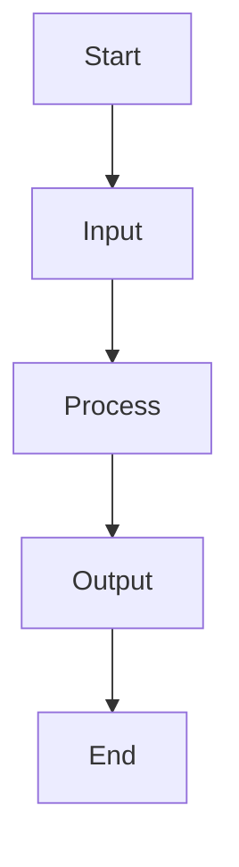
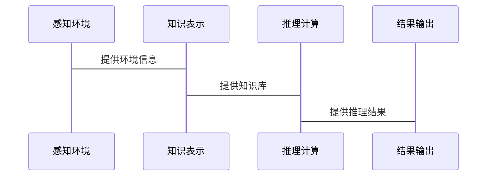

                 


# 构建具有推理能力的AI Agent

> 关键词：AI Agent, 推理能力, 人工智能, 逻辑推理, 知识表示, 机器学习

> 摘要：本文将详细介绍如何构建一个具有推理能力的AI Agent。首先，我们将介绍AI Agent的基本概念和其推理能力的重要性。接着，我们将深入探讨推理能力的核心概念，包括知识表示、逻辑推理和机器学习算法。然后，我们将通过实际案例分析，展示如何设计和实现一个具有推理能力的AI Agent系统。最后，我们将总结最佳实践和未来的发展方向。

---

# 第一部分: AI Agent与推理能力背景

# 第1章: AI Agent的基本概念

## 1.1 什么是AI Agent

AI Agent（智能代理）是一种能够感知环境、自主决策并执行任务的智能实体。它可以是一个软件程序，也可以是一个物理设备，其目标是通过与环境交互来实现特定目标。AI Agent的核心特征包括自主性、反应性、目标导向性和社交能力。

## 1.2 AI Agent的核心特征

- **自主性**：AI Agent能够在没有外部干预的情况下自主决策。
- **反应性**：AI Agent能够实时感知环境并做出反应。
- **目标导向性**：AI Agent的行为以实现特定目标为导向。
- **社交能力**：AI Agent能够与其他Agent或人类进行有效通信和协作。

## 1.3 推理能力的重要性

推理能力是AI Agent实现智能决策的关键。通过推理，AI Agent可以基于已有的知识和观察到的事实，推断出新的结论，从而做出更准确的决策。推理能力使AI Agent能够处理复杂问题，并在不确定性和模糊性环境中表现良好。

---

# 第2章: 推理能力的核心概念

## 2.1 知识表示与推理的关系

知识表示是AI Agent进行推理的基础。知识可以表示为符号、规则、概率分布或其他形式。推理算法通过对知识的处理，生成新的结论。例如，基于规则的推理系统通过将事实与规则匹配，推导出新的事实。

## 2.2 推理算法的分类与特点

### 2.2.1 基于规则的推理

基于规则的推理是一种简单的推理方法，适用于规则明确的场景。规则通常表示为“如果A，那么B”。通过匹配事实与规则，系统可以推导出新的结论。

### 2.2.2 基于逻辑的推理

基于逻辑的推理是通过逻辑运算（如命题逻辑、谓词逻辑）进行推理。这种方法能够处理复杂的逻辑关系，但计算量较大，适用于需要高精度推理的场景。

### 2.2.3 基于机器学习的推理

基于机器学习的推理通过训练模型来学习推理模式。这种方法能够处理复杂和不确定的场景，但需要大量数据支持。

## 2.3 推理系统的架构与功能

推理系统的架构通常包括知识库、推理引擎和结果解释模块。知识库存储推理所需的知识，推理引擎负责根据知识和输入事实生成结论，结果解释模块将结论转换为人类可理解的形式。

---

# 第3章: 推理算法原理与实现

## 3.1 算法原理讲解

### 3.1.1 基于规则的推理

基于规则的推理通过匹配事实与规则库中的规则，生成新的结论。例如，给定规则“如果A和B，则C”，当系统检测到A和B同时存在时，推导出C。

### 3.1.2 基于逻辑的推理

基于逻辑的推理通过逻辑运算符（如AND、OR、NOT）进行推理。例如，命题逻辑推理可以通过真值表和逻辑运算符进行推理。

### 3.1.3 基于机器学习的推理

基于机器学习的推理通过训练模型（如神经网络）进行推理。例如，深度学习模型可以通过训练数据学习推理模式。

## 3.2 算法流程图



## 3.3 Python实现示例

```python
def rule_based_inference(rules, facts):
    for rule in rules:
        if all(fact in facts for fact in rule['premises']):
            return rule['conclusion']
    return None
```

## 3.4 数学模型与公式

### 3.4.1 基于逻辑的推理公式

$$ p \rightarrow q $$

$$ p \land q $$

### 3.4.2 基于概率的推理公式

$$ P(A|B) = \frac{P(B|A)P(A)}{P(B)} $$

---

# 第4章: 系统架构设计

## 4.1 系统功能设计

AI Agent的系统功能包括感知环境、知识表示、推理计算和结果输出。感知环境模块负责收集环境中的信息，知识表示模块负责存储和管理知识，推理计算模块负责根据知识和输入信息进行推理，结果输出模块负责将推理结果输出给用户或系统。

## 4.2 系统架构图


## 4.3 系统接口设计

系统接口设计包括输入接口、输出接口和内部接口。输入接口负责接收外部输入信息，输出接口负责将推理结果输出给用户，内部接口负责系统内部模块之间的通信。

## 4.4 系统交互序列图



---

# 第5章: 项目实战

## 5.1 实际案例分析

以一个简单的客服系统为例，构建一个具有推理能力的AI Agent。系统需要根据用户的问题，推理出合适的回答。

## 5.2 环境安装

安装所需的开发工具和库，例如Python、TensorFlow、Scikit-learn等。

## 5.3 系统核心实现源代码

```python
def main():
    rules = [
        {'premises': ['用户问问题', '问题类型是常见问题'], 'conclusion': '提供标准答案'},
        {'premises': ['用户问问题', '问题类型是复杂问题'], 'conclusion': '转接人工客服'}
    ]
    facts = ['用户问问题', '问题类型是常见问题']
    result = rule_based_inference(rules, facts)
    print(result)

if __name__ == '__main__':
    main()
```

## 5.4 代码应用解读与分析

代码实现了一个简单的基于规则的推理系统。根据给定的事实和规则，系统推导出结论。这个案例展示了如何将理论应用于实际项目中。

## 5.5 项目小结

通过实际案例分析，我们展示了如何构建一个简单的具有推理能力的AI Agent系统。在实际应用中，系统需要处理更复杂的问题，并结合多种推理方法。

---

# 第6章: 最佳实践与总结

## 6.1 最佳实践

- 确保知识表示的准确性和完整性。
- 根据具体场景选择合适的推理算法。
- 定期更新和优化推理模型。

## 6.2 小结

本文详细介绍了如何构建具有推理能力的AI Agent。通过理论分析和实际案例，我们展示了推理能力的核心概念、算法原理和系统设计。未来，随着技术的发展，AI Agent的推理能力将更加智能化和多样化。

---

# 作者：AI天才研究院 & 禅与计算机程序设计艺术

