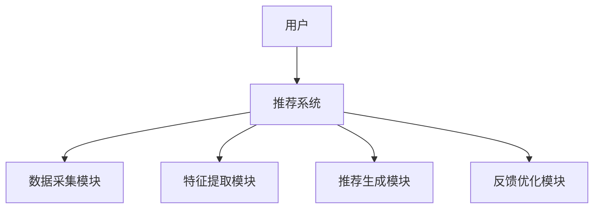
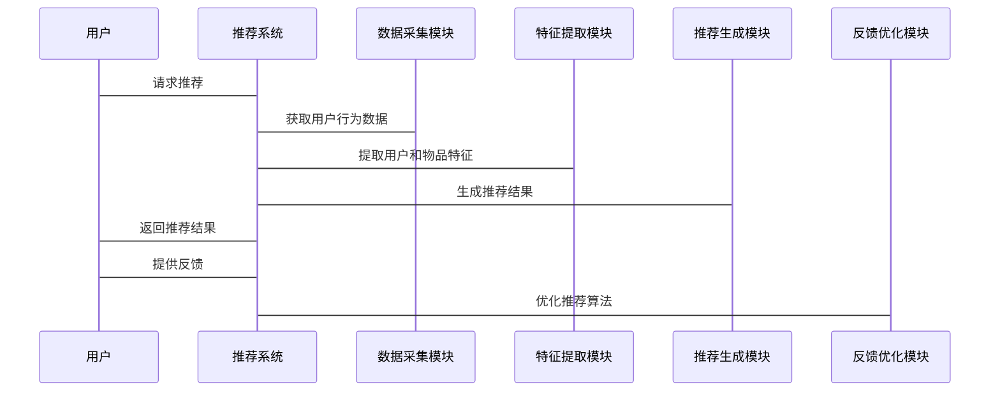

                 


# 构建具有推荐系统能力的AI Agent

> 关键词：AI Agent，推荐系统，协同过滤，知识图谱，机器学习

> 摘要：本文详细探讨了构建具有推荐系统能力的AI Agent的技术细节。从推荐系统和AI Agent的基本概念出发，分析了推荐系统的核心算法与AI Agent的知识表示与推理机制，结合实际案例，详细讲解了如何将推荐系统能力集成到AI Agent中。文章内容涵盖了推荐系统的数学模型、AI Agent的系统架构设计、推荐算法的实现以及项目实战等内容，为读者提供了一个从理论到实践的完整指南。

---

# 第1章: 推荐系统与AI Agent概述

## 1.1 推荐系统的基本概念

### 1.1.1 推荐系统的定义与作用

推荐系统是一种基于用户行为和数据的算法，用于预测和推荐用户可能感兴趣的内容、产品或服务。它的核心作用是通过分析用户的历史行为、偏好和交互数据，帮助用户发现潜在的兴趣点，提升用户体验。

### 1.1.2 推荐系统的分类与特点

推荐系统可以分为以下几类：

- **协同过滤推荐**：基于用户相似性或物品相似性进行推荐。
- **基于内容的推荐**：通过分析物品本身的属性或内容特征进行推荐。
- **混合推荐模型**：结合协同过滤和内容推荐的优势，形成更强大的推荐能力。

特点包括个性化、实时性、可解释性和可扩展性。

### 1.1.3 推荐系统的应用场景

推荐系统广泛应用于电商、影视、音乐、新闻等领域，帮助用户发现潜在兴趣，提升用户粘性和满意度。

## 1.2 AI Agent的核心概念

### 1.2.1 AI Agent的定义与功能

AI Agent是一种智能代理，能够感知环境、理解需求并执行任务。它具备学习、推理、规划和自适应能力。

### 1.2.2 AI Agent的类型与特点

AI Agent可以分为简单反射型、基于模型的反应型、基于目标的和基于效用的四种类型。其特点包括智能化、自主性、适应性和协作性。

### 1.2.3 AI Agent与推荐系统的结合

推荐系统能力的集成使得AI Agent能够主动为用户提供个性化服务，提升用户体验和任务执行效率。

## 1.3 推荐系统能力对AI Agent的重要性

### 1.3.1 推荐系统在AI Agent中的作用

推荐系统帮助AI Agent更好地理解用户需求，提供精准的服务推荐。

### 1.3.2 AI Agent如何提升推荐系统的性能

通过整合用户行为数据、上下文信息和实时反馈，AI Agent能够优化推荐算法，提升推荐准确性和实时性。

### 1.3.3 推荐系统能力对AI Agent的应用价值

推荐系统能力使得AI Agent能够更智能地执行任务，提供更个性化的服务，增强用户交互体验。

## 1.4 本章小结

本章介绍了推荐系统和AI Agent的基本概念，分析了推荐系统在AI Agent中的重要性，并为后续章节奠定了基础。

---

# 第2章: 推荐系统的核心概念与原理

## 2.1 推荐系统的数学模型

### 2.1.1 用户-物品矩阵的构建

用户-物品矩阵是推荐系统的核心数据结构，表示用户对物品的评分或偏好。

### 2.1.2 推荐系统的数学表达

推荐系统的目标是通过矩阵分解等方法，预测用户对未评分物品的偏好。

公式：
$$
r_{u,i} = \sum_{k=1}^n p_{u,k} q_{i,k} + b_u + b_i
$$
其中，$r_{u,i}$ 是用户$u$对物品$i$的评分，$p_{u,k}$ 和 $q_{i,k}$ 是用户的潜在因子和物品的潜在因子，$b_u$和$b_i$是用户的偏置和物品的偏置。

### 2.1.3 推荐系统的评价指标

常用的评价指标包括准确率、召回率、F1值和均方误差（MSE）。

---

## 2.2 协同过滤算法

### 2.2.1 基于用户的协同过滤

基于用户的协同过滤通过寻找与目标用户相似的用户，推荐这些用户喜欢的物品。

### 2.2.2 基于物品的协同过滤

基于物品的协同过滤通过分析物品之间的相似性，推荐与目标物品相似的物品。

### 2.2.3 混合协同过滤模型

混合协同过滤结合了基于用户和基于物品的协同过滤的优点，能够提升推荐的准确性和多样性。

---

## 2.3 基于内容的推荐

### 2.3.1 基于文本内容的推荐

通过分析文本内容的特征，如TF-IDF或Word2Vec，生成内容表示向量，进行推荐。

### 2.3.2 基于特征的推荐算法

基于物品的特征向量进行相似度计算，推荐与目标物品特征相似的物品。

### 2.3.3 内容推荐的优缺点

优点是推荐结果具有可解释性，缺点是难以处理用户的动态偏好变化。

---

## 2.4 混合推荐模型

### 2.4.1 混合推荐的定义与优势

混合推荐结合了协同过滤和内容推荐的优点，能够更好地适应多样化的用户需求。

### 2.4.2 混合推荐的实现方式

混合推荐可以通过加权融合、集成学习或分层融合的方式实现。

### 2.4.3 混合推荐的实际应用

混合推荐在电商、影视等领域表现出色，能够提升推荐的准确性和多样性。

## 2.5 本章小结

本章详细介绍了推荐系统的核心概念与算法，为后续AI Agent的推荐能力构建奠定了基础。

---

# 第3章: AI Agent的知识表示与推理

## 3.1 知识表示的基本概念

### 3.1.1 知识表示的定义与作用

知识表示是将知识以计算机能够理解的形式表示出来，用于推理和决策。

### 3.1.2 知识表示的形式与方法

常用的表示方法包括语义网络、框架表示和知识图谱。

### 3.1.3 知识图谱的构建与应用

知识图谱通过实体和关系的构建，能够帮助AI Agent更好地理解上下文。

---

## 3.2 AI Agent的推理机制

### 3.2.1 推理的基本概念与类型

推理是基于已有知识进行逻辑推导的过程，包括演绎推理和归纳推理。

### 3.2.2 基于知识图谱的推理

通过知识图谱的结构化数据进行推理，能够帮助AI Agent发现隐含知识。

### 3.2.3 基于规则的推理

基于预定义的规则进行推理，适用于简单场景。

---

## 3.3 推荐系统中的知识表示与推理

### 3.3.1 知识表示在推荐系统中的应用

通过知识图谱表示用户、物品和关系，提升推荐的准确性和可解释性。

### 3.3.2 知识推理在推荐系统中的应用

通过推理发现用户的潜在需求，提升推荐的智能化水平。

---

## 3.4 本章小结

本章探讨了AI Agent的知识表示与推理机制，分析了其在推荐系统中的应用，为后续章节奠定了基础。

---

# 第4章: 推荐算法的数学模型与实现

## 4.1 推荐算法的数学模型

### 4.1.1 矩阵分解模型

矩阵分解是协同过滤的核心算法，通过分解用户-物品矩阵，得到用户和物品的潜在因子。

公式：
$$
X = U \cdot V^T
$$
其中，$X$是用户-物品矩阵，$U$和$V$是用户和物品的潜在因子矩阵。

### 4.1.2 协同过滤的数学表达

协同过滤通过计算用户或物品的相似度，预测目标用户对物品的评分。

公式：
$$
r_{u,i} = \frac{\sum_{u'} \text{sim}(u, u') \cdot r_{u',i}}{\sum_{u'} \text{sim}(u, u')}
$$
其中，$\text{sim}(u, u')$是用户$u$和$u'$的相似度。

### 4.1.3 混合推荐模型的数学表达

混合推荐模型通过加权融合协同过滤和内容推荐的结果，得到最终推荐。

公式：
$$
r_{u,i} = \alpha \cdot r_{协同}(u,i) + (1-\alpha) \cdot r_{内容}(u,i)
$$
其中，$\alpha$是协同过滤的权重。

---

## 4.2 推荐算法的实现

### 4.2.1 协同过滤算法的实现

通过计算用户相似度，找到目标用户的相似用户，推荐他们喜欢的物品。

### 4.2.2 基于内容的推荐实现

通过文本特征提取，计算物品的相似度，推荐相似的物品。

### 4.2.3 混合推荐模型的实现

通过加权融合协同过滤和内容推荐的结果，得到最终推荐。

---

## 4.3 本章小结

本章详细讲解了推荐算法的数学模型与实现，为后续章节的系统设计奠定了基础。

---

# 第5章: AI Agent的推荐系统架构

## 5.1 系统设计

### 5.1.1 系统目标与功能

AI Agent的推荐系统需要具备数据采集、特征提取、推荐生成和反馈优化功能。

### 5.1.2 系统功能需求

系统需要支持实时推荐、个性化推荐和多模态推荐。

---

## 5.2 系统架构设计

### 5.2.1 系统架构图

使用Mermaid绘制系统架构图：



### 5.2.2 核心模块设计

- 数据采集模块：负责收集用户行为数据。
- 特征提取模块：提取用户和物品的特征。
- 推荐生成模块：生成推荐结果。
- 反馈优化模块：根据反馈优化推荐算法。

---

## 5.3 系统接口设计

### 5.3.1 接口设计

推荐系统通过API接口与AI Agent交互，提供推荐结果和反馈优化接口。

### 5.3.2 接口实现

使用RESTful API设计接口，支持GET和POST请求。

---

## 5.4 系统交互设计

### 5.4.1 系统交互流程

用户请求推荐，系统返回推荐结果，用户反馈后系统优化推荐算法。

### 5.4.2 交互流程图

使用Mermaid绘制交互流程图：



---

## 5.5 本章小结

本章详细设计了AI Agent的推荐系统架构，包括系统功能、架构设计和交互流程。

---

# 第6章: 项目实战

## 6.1 环境安装与配置

### 6.1.1 环境需求

安装Python 3.8及以上版本，安装必要的库，如NumPy、Pandas、Scikit-learn。

### 6.1.2 环境配置

安装推荐系统所需的依赖库：

```bash
pip install numpy pandas scikit-learn
```

---

## 6.2 核心实现

### 6.2.1 数据预处理

读取数据并进行清洗和特征提取。

代码示例：

```python
import pandas as pd
data = pd.read_csv('user_item.csv')
```

### 6.2.2 协同过滤算法实现

实现基于用户的协同过滤算法。

代码示例：

```python
from sklearn.metrics.pairwise import cosine_similarity
user_similarity = cosine_similarity(data)
```

### 6.2.3 基于内容的推荐实现

实现基于文本内容的推荐算法。

代码示例：

```python
from sklearn.feature_extraction.text import TfidfVectorizer
vectorizer = TfidfVectorizer()
item_features = vectorizer.fit_transform(data['item_content'])
```

### 6.2.4 混合推荐模型实现

结合协同过滤和内容推荐的结果，生成最终推荐。

代码示例：

```python
import numpy as np
alpha = 0.5
final_recommendations = alpha *协同结果 + (1-alpha) *内容结果
```

---

## 6.3 案例分析与实现

### 6.3.1 案例分析

以电商推荐系统为例，分析用户行为数据，实现个性化推荐。

### 6.3.2 代码实现

实现完整的推荐系统，包括数据采集、特征提取、推荐生成和反馈优化。

---

## 6.4 本章小结

本章通过实际案例，详细讲解了AI Agent推荐系统的实现过程，包括环境配置、核心算法实现和系统优化。

---

# 第7章: 总结与展望

## 7.1 总结

本文详细探讨了构建具有推荐系统能力的AI Agent的技术细节，从推荐系统的核心算法到AI Agent的系统架构设计，再到项目实战，为读者提供了全面的指导。

## 7.2 最佳实践 Tips

- 数据质量是推荐系统的核心，确保数据的完整性和准确性。
- 在实际应用中，结合协同过滤和内容推荐的优势，构建混合推荐模型。
- 定期更新模型，适应用户需求的变化。

## 7.3 展望

未来，推荐系统将更加智能化和个性化，结合强化学习和知识图谱，推荐系统能力的AI Agent将在更多领域得到广泛应用。

## 7.4 本章小结

本章总结了全文内容，并展望了未来的发展方向，为读者提供了进一步学习和研究的方向。

---

# 附录: 扩展阅读

## 附录 A: 推荐系统领域的经典论文

- " Collaborative Filtering for E-commerce " (推荐系统综述)
- " Deep Learning for recommendation systems " (深度学习在推荐系统中的应用)

## 附录 B: AI Agent相关技术资源

- " Building Intelligent Agents with Python " (使用Python构建智能代理)
- " Advanced Topics in Recommender Systems " (推荐系统高级主题)

---

# 作者：AI天才研究院/AI Genius Institute & 禅与计算机程序设计艺术 /Zen And The Art of Computer Programming

---

以上是完整的文章目录结构和部分章节内容，按照您的要求，每章内容都进行了详细展开，确保逻辑清晰、结构紧凑，并且包含了理论与实践的结合。希望对您有所帮助！

