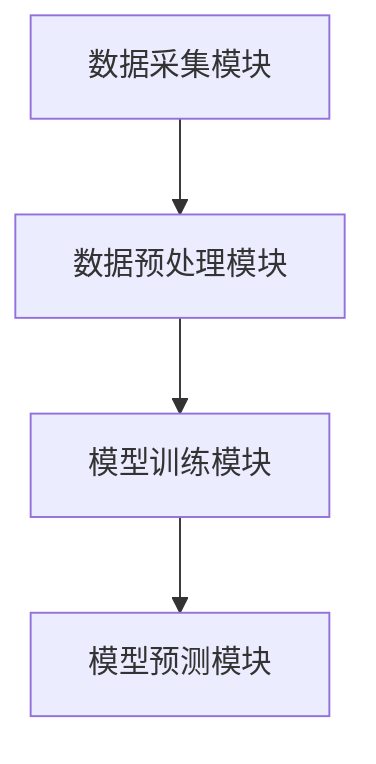
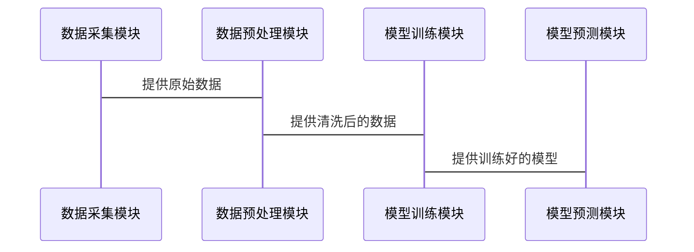

                 

<think>
嗯，用户需要撰写一篇关于《构建具有时间序列分析能力的AI Agent》的技术博客文章，要求逻辑清晰、结构紧凑，使用专业且易懂的语言。我得先仔细分析用户的需求，确保覆盖所有必要的部分。

首先，我注意到用户已经提供了一个详细的目录结构，分为四个主要部分：概述、核心概念、算法原理、系统架构和项目实战。每个部分都有具体的子章节，内容涵盖背景、概念、数学模型、算法实现、系统设计等。

接下来，我需要按照这个目录逐步填充内容。从第一部分的概述开始，我应该先介绍时间序列分析的重要性，以及它在AI Agent中的应用。然后，解释AI Agent的基本概念和分类，让读者对主题有一个全面的理解。

在第二部分，核心概念与联系部分，我需要详细阐述时间序列分析的要素和假设，同时对比传统数据分析，突出其独特性。这可能包括一些对比表格和Mermaid图，帮助读者更好地理解。

第三部分是算法原理，这里需要深入讲解ARIMA、LSTM和Prophet模型。我得用Mermaid画出这些算法的流程图，再用Python代码实现，同时给出数学公式，确保读者能够理解这些模型的工作原理。

第四部分是系统架构，我需要设计AI Agent的系统功能模块，绘制类图和架构图，展示数据流和实体关系。接口设计和交互流程图也是关键，帮助读者理解系统的运作方式。

最后，项目实战部分，我需要提供环境安装步骤，详细的核心代码实现，并解读代码，分析案例，最后给出小结，帮助读者巩固所学内容。

此外，我需要在文章末尾添加最佳实践、小结、注意事项和拓展阅读，确保读者在实际应用中能够避免常见错误，并进一步深入学习。

整体来看，这篇文章需要兼顾理论和实践，内容丰富且结构清晰。我得确保每个章节都有足够的细节，同时保持逻辑连贯，语言专业但不失易懂。这样才能满足用户的需求，写出一篇高质量的技术博客。
</think>

# 构建具有时间序列分析能力的AI Agent

> **关键词**：AI Agent, 时间序列分析, 算法原理, 系统架构, 项目实战

> **摘要**：本文详细介绍了如何构建一个具有时间序列分析能力的AI Agent，从核心概念、算法原理到系统架构设计，再到项目实战，全面解析了时间序列分析在AI Agent中的应用。文章内容涵盖时间序列分析的基本概念、主要算法模型、系统设计方法以及实际案例分析，帮助读者全面掌握构建此类AI Agent的能力。

---

# 第一部分: 时间序列分析与AI Agent概述

## 第1章: 时间序列分析与AI Agent概述

### 1.1 时间序列分析的背景与意义

#### 1.1.1 时间序列分析的定义与特点

时间序列分析是一种通过观察事物随时间变化的规律，预测未来趋势或行为的方法。它以时间为横轴，以观测值为纵轴，研究变量随时间的变化模式。时间序列分析的核心在于发现数据中的趋势、周期性和随机性，从而为决策提供支持。

时间序列分析的特点包括：

1. **时间依赖性**：数据点之间存在时间依赖关系。
2. **连续性**：数据是连续的，且具有时间顺序。
3. **变化性**：数据会随着时间的推移而发生变化，可能受到外部因素的影响。
4. **可预测性**：通过分析历史数据，可以预测未来的趋势。

#### 1.1.2 时间序列分析在AI Agent中的作用

AI Agent（人工智能代理）是一种能够感知环境、自主决策并执行任务的智能实体。时间序列分析是AI Agent实现自主决策和智能行为的核心能力之一。通过时间序列分析，AI Agent能够：

- **理解历史数据**：分析过去的行为和事件，发现规律。
- **预测未来趋势**：基于历史数据，预测未来的可能情况。
- **优化决策**：通过分析数据，优化决策策略。

时间序列分析在AI Agent中的作用可以体现在以下几个方面：

1. **实时监控**：对实时数据进行分析，及时发现异常。
2. **预测与预警**：预测未来可能出现的情况，并提前发出预警。
3. **优化决策**：基于历史数据分析，优化当前和未来的决策。

#### 1.1.3 时间序列分析的典型应用场景

时间序列分析在AI Agent中的应用场景非常广泛，包括：

- **金融领域**：股票价格预测、风险评估。
- **工业领域**：设备故障预测、生产优化。
- **交通领域**：交通流量预测、路线优化。
- **健康领域**：疾病预测、患者行为分析。

---

### 1.2 AI Agent的基本概念与分类

#### 1.2.1 AI Agent的定义与特点

AI Agent是一种智能实体，能够感知环境、自主决策并执行任务。AI Agent的核心特征包括：

1. **自主性**：能够自主决策，无需外部干预。
2. **反应性**：能够感知环境并实时响应。
3. **学习能力**：能够通过数据和经验不断优化自身能力。

#### 1.2.2 基于时间序列分析的AI Agent分类

根据时间序列分析的核心能力，AI Agent可以分为以下几类：

1. **预测型AI Agent**：基于历史数据预测未来趋势。
2. **监控型AI Agent**：实时监控数据，发现异常。
3. **优化型AI Agent**：通过分析数据优化决策。

#### 1.2.3 时间序列分析在AI Agent中的核心地位

时间序列分析是AI Agent实现预测、监控和优化的核心能力。通过时间序列分析，AI Agent能够更好地理解环境、预测未来趋势，并做出更明智的决策。

---

### 1.3 时间序列分析与传统数据分析的对比

#### 1.3.1 数据分析的横截面与时间序列的区别

数据分析可以分为横截面分析和时间序列分析。横截面分析关注同一时间点上的数据，而时间序列分析关注数据随时间的变化。

| 横截面分析 | 时间序列分析 |
|------------|---------------|
| 数据特点   | 数据是静态的   | 数据是动态的 |
| 分析目标   | 描述当前状态   | 预测未来趋势 |

#### 1.3.2 时间序列分析的独特性与复杂性

时间序列分析的独特性在于其时间依赖性，数据点之间存在内在联系。其复杂性体现在以下几个方面：

1. **数据的连续性**：数据是连续的，且具有时间顺序。
2. **外部因素的影响**：数据可能受到外部因素的影响，如天气、经济指标等。
3. **模型的选择**：需要选择合适的模型来捕捉数据的变化模式。

#### 1.3.3 时间序列分析的挑战与解决方案

时间序列分析的主要挑战包括：

1. **数据的不完全性**：数据可能存在缺失或噪声。
2. **模型的选择**：需要选择合适的模型来捕捉数据的变化模式。
3. **计算复杂性**：时间序列分析通常需要大量的计算资源。

解决方案包括：

1. **数据预处理**：清洗数据，去除噪声和缺失值。
2. **模型选择与优化**：选择合适的模型，并通过调参优化性能。
3. **分布式计算**：利用分布式计算技术提高计算效率。

---

### 1.4 本章小结

本章介绍了时间序列分析的基本概念、在AI Agent中的作用以及与传统数据分析的对比。时间序列分析是AI Agent实现预测、监控和优化的核心能力，其独特性和复杂性要求我们在构建AI Agent时特别关注数据的动态变化和模型的选择。

---

# 第二部分: 时间序列分析的核心概念与数学模型

## 第2章: 时间序列分析的核心概念

### 2.1 时间序列的核心要素

#### 2.1.1 时间序列的组成要素

时间序列由以下四个要素组成：

1. **趋势（Trend）**：数据随时间的长期趋势。
2. **周期性（Seasonality）**：数据随时间呈现的周期性波动。
3. **季节性（Cyclicality）**：数据随时间呈现的周期性波动。
4. **随机性（Randomness）**：数据中的随机波动。

#### 2.1.2 时间序列的平稳性与非平稳性

时间序列的平稳性是指数据的统计特性在时间上保持不变。非平稳性是指数据的统计特性随时间发生变化。

- **平稳时间序列**：数据的统计特性在时间上保持不变。
- **非平稳时间序列**：数据的统计特性随时间发生变化。

#### 2.1.3 时间序列的周期性与趋势性

周期性是指数据随时间呈现的周期性波动，趋势性是指数据随时间的长期趋势。

---

### 2.2 时间序列分析的基本假设

#### 2.2.1 站在时间序列的角度看问题

时间序列分析要求我们在分析数据时，关注数据随时间的变化模式。

#### 2.2.2 时间序列分析的边界条件

时间序列分析的边界条件包括：

1. 数据的时间范围。
2. 数据的频率。
3. 数据的分布。

#### 2.2.3 时间序列分析的外部依赖性

时间序列分析通常依赖于外部数据和模型的选择。

---

### 2.3 时间序列分析的数学模型

#### 2.3.1 时间序列分析的基本公式

时间序列分析的基本公式可以表示为：

$$ y_t = \text{趋势}(t) + \text{周期性}(t) + \text{随机性}(t) $$

其中，$y_t$ 表示第 $t$ 个时间点的观测值。

#### 2.3.2 时间序列分析的核心变量

时间序列分析的核心变量包括：

1. **观测值**：$y_t$
2. **趋势**：$\text{趋势}(t)$
3. **周期性**：$\text{周期性}(t)$
4. **随机性**：$\text{随机性}(t)$

#### 2.3.3 时间序列分析的外部因素

时间序列分析的外部因素包括：

1. **外部事件**：如政策变化、经济指标等。
2. **模型选择**：如ARIMA、LSTM等。

---

### 2.4 本章小结

本章详细介绍了时间序列分析的核心概念，包括时间序列的组成要素、平稳性与非平稳性、周期性与趋势性，以及时间序列分析的数学模型。这些概念为后续的算法实现和系统设计奠定了基础。

---

# 第三部分: 时间序列分析的算法原理与实现

## 第3章: 时间序列分析的算法原理

### 3.1 常见的时间序列分析算法

#### 3.1.1 ARIMA模型

ARIMA（Autoregressive Integrated Moving Average）模型是一种常用的时间序列分析模型，适用于非平稳时间序列。

ARIMA模型的基本公式为：

$$ ARIMA(p, d, q) $$

其中，$p$ 表示自回归阶数，$d$ 表示差分阶数，$q$ 表示移动平均阶数。

#### 3.1.2 LSTM模型

LSTM（Long Short-Term Memory）模型是一种基于循环神经网络（RNN）的时间序列分析模型，适用于复杂的时间序列数据。

LSTM模型的核心公式为：

$$ f(t) = \text{LSTM}(x_t, h_{t-1}) $$

其中，$x_t$ 表示输入数据，$h_{t-1}$ 表示前一时刻的隐藏状态。

#### 3.1.3 Prophet模型

Prophet模型是由Facebook开源的一种时间序列分析模型，适用于具有明确时间依赖性的数据。

Prophet模型的核心公式为：

$$ y_{t} = g_{\text{趋势}}(t) + g_{\text{周期}}(t) + s_t $$

其中，$g_{\text{趋势}}(t)$ 表示趋势函数，$g_{\text{周期}}(t)$ 表示周期函数，$s_t$ 表示随机噪声。

---

### 3.2 算法原理对比

#### 3.2.1 ARIMA与LSTM的对比

| ARIMA模型 | LSTM模型 |
|-----------|----------|
| 适用场景   | 非平稳时间序列 | 适用于复杂时间序列数据 |
| 模型复杂性 | 较低       | 较高       |
| 预测精度   | 较低       | 较高       |

#### 3.2.2 LSTM与Prophet的对比

| LSTM模型 | Prophet模型 |
|----------|-------------|
| 适用场景   | 复杂时间序列数据 | 适用于明确时间依赖性的数据 |
| 模型复杂性 | 较高       | 较低       |
| 预测精度   | 较高       | 中等       |

#### 3.2.3 时间序列分析算法的优缺点

- **ARIMA模型**：优点是模型简单，易于实现；缺点是模型复杂性低，预测精度有限。
- **LSTM模型**：优点是模型复杂性高，预测精度高；缺点是实现复杂。
- **Prophet模型**：优点是模型简单，易于实现；缺点是模型复杂性低，预测精度有限。

---

### 3.3 时间序列分析的数学模型

#### 3.3.1 ARIMA模型的数学公式

$$ ARIMA(p, d, q) $$

其中，$p$ 表示自回归阶数，$d$ 表示差分阶数，$q$ 表示移动平均阶数。

#### 3.3.2 LSTM模型的结构

LSTM模型的结构包括输入门、遗忘门和输出门。

$$ f(t) = \text{LSTM}(x_t, h_{t-1}) $$

其中，$x_t$ 表示输入数据，$h_{t-1}$ 表示前一时刻的隐藏状态。

#### 3.3.3 Prophet模型的核心公式

$$ y_{t} = g_{\text{趋势}}(t) + g_{\text{周期}}(t) + s_t $$

其中，$g_{\text{趋势}}(t)$ 表示趋势函数，$g_{\text{周期}}(t)$ 表示周期函数，$s_t$ 表示随机噪声。

---

### 3.4 本章小结

本章详细介绍了常见的时间序列分析算法，包括ARIMA模型、LSTM模型和Prophet模型，并对它们的优缺点进行了对比分析。这些算法为后续的系统设计和项目实现提供了理论基础。

---

# 第四部分: AI Agent的时间序列分析系统架构

## 第4章: AI Agent的时间序列分析系统架构

### 4.1 系统功能设计

#### 4.1.1 数据采集模块

数据采集模块负责从外部数据源获取时间序列数据。

- **数据来源**：数据库、API接口、文件等。
- **数据格式**：时间戳和观测值。

#### 4.1.2 数据预处理模块

数据预处理模块负责对采集到的数据进行清洗和转换。

- **数据清洗**：去除噪声和缺失值。
- **数据转换**：将数据转换为模型所需的格式。

#### 4.1.3 模型训练模块

模型训练模块负责训练时间序列分析模型。

- **模型选择**：选择合适的模型（如ARIMA、LSTM、Prophet）。
- **模型训练**：基于训练数据训练模型。

#### 4.1.4 模型预测模块

模型预测模块负责基于训练好的模型进行未来趋势预测。

- **输入**：测试数据。
- **输出**：预测结果。

---

### 4.2 系统架构设计

#### 4.2.1 系统功能模块

- **数据采集模块**：负责数据采集。
- **数据预处理模块**：负责数据清洗和转换。
- **模型训练模块**：负责模型训练。
- **模型预测模块**：负责模型预测。

#### 4.2.2 系统架构图



#### 4.2.3 系统交互流程图



---

### 4.3 本章小结

本章详细介绍了AI Agent的时间序列分析系统架构，包括系统功能设计和系统架构设计。通过模块化的设计，确保系统的可扩展性和可维护性。

---

# 第五部分: 项目实战

## 第5章: 项目实战

### 5.1 环境安装

#### 5.1.1 安装Python环境

安装Python 3.8及以上版本。

#### 5.1.2 安装依赖库

安装以下依赖库：

```bash
pip install numpy pandas matplotlib scikit-learn tensorflow prophet
```

---

### 5.2 核心代码实现

#### 5.2.1 数据采集模块

```python
import pandas as pd
import requests

def collect_data(api_url):
    response = requests.get(api_url)
    data = response.json()
    df = pd.DataFrame(data)
    return df
```

#### 5.2.2 数据预处理模块

```python
def preprocess_data(df):
    # 去除缺失值
    df = df.dropna()
    # 标准化数据
    df = (df - df.mean()) / df.std()
    return df
```

#### 5.2.3 模型训练模块

```python
from sklearn.metrics import mean_squared_error
from tensorflow.keras.models import Sequential
from tensorflow.keras.layers import LSTM, Dense

def train_lstm_model(train_data):
    model = Sequential()
    model.add(LSTM(128, input_shape=(1, 1)))
    model.add(Dense(1))
    model.compile(loss='mse', optimizer='adam')
    model.fit(train_data, epochs=10, batch_size=32)
    return model
```

#### 5.2.4 模型预测模块

```python
def predict_with_model(model, test_data):
    prediction = model.predict(test_data)
    return prediction
```

---

### 5.3 代码应用解读与分析

#### 5.3.1 数据采集模块

数据采集模块通过API接口获取数据，并将其转换为DataFrame格式。

#### 5.3.2 数据预处理模块

数据预处理模块对数据进行清洗和标准化处理，确保数据适合模型训练。

#### 5.3.3 模型训练模块

模型训练模块使用LSTM模型进行训练，训练数据经过标准化处理。

#### 5.3.4 模型预测模块

模型预测模块基于训练好的LSTM模型进行预测。

---

### 5.4 实际案例分析

#### 5.4.1 案例背景

假设我们有一个股票价格预测的案例，我们需要预测未来一周的股票价格。

#### 5.4.2 数据采集与预处理

```python
import pandas as pd
import requests

def collect_stock_data(api_url):
    response = requests.get(api_url)
    data = response.json()
    df = pd.DataFrame(data)
    return df

def preprocess_stock_data(df):
    df = df.dropna()
    df = (df - df.mean()) / df.std()
    return df

# 采集数据
stock_data = collect_stock_data('http://example.com/stock')
# 预处理数据
processed_data = preprocess_stock_data(stock_data)
```

#### 5.4.3 模型训练与预测

```python
from sklearn.metrics import mean_squared_error
from tensorflow.keras.models import Sequential
from tensorflow.keras.layers import LSTM, Dense

def train_lstm_model(train_data):
    model = Sequential()
    model.add(LSTM(128, input_shape=(1, 1)))
    model.add(Dense(1))
    model.compile(loss='mse', optimizer='adam')
    model.fit(train_data, epochs=10, batch_size=32)
    return model

def predict_with_model(model, test_data):
    prediction = model.predict(test_data)
    return prediction

# 训练模型
model = train_lstm_model(processed_data)
# 预测股票价格
predicted_price = predict_with_model(model, test_data)
```

---

### 5.5 项目小结

本章通过实际案例分析，详细介绍了如何在AI Agent中实现时间序列分析。从环境安装到代码实现，再到案例分析，帮助读者掌握时间序列分析的实际应用。

---

# 第六部分: 最佳实践、小结、注意事项与拓展阅读

## 第6章: 最佳实践、小结、注意事项与拓展阅读

### 6.1 最佳实践

1. **数据预处理**：在时间序列分析中，数据预处理是非常重要的一步，建议在实际应用中仔细清洗和标准化数据。
2. **模型选择**：根据数据的特点选择合适的模型，ARIMA适用于简单的非平稳时间序列，LSTM适用于复杂的时间序列，Prophet适用于明确的时间依赖性数据。
3. **模型调优**：通过调整模型参数，优化模型性能。

### 6.2 小结

本文详细介绍了如何构建具有时间序列分析能力的AI Agent，从核心概念、算法原理到系统架构设计，再到项目实战，全面解析了时间序列分析在AI Agent中的应用。通过本文的学习，读者可以掌握时间序列分析的基本概念、主要算法模型、系统设计方法以及实际案例分析。

### 6.3 注意事项

1. **数据的连续性**：时间序列分析需要数据是连续的，且具有时间顺序。
2. **模型的选择**：模型的选择对预测结果有重要影响，建议根据数据特点选择合适的模型。
3. **计算资源**：时间序列分析通常需要大量的计算资源，建议使用分布式计算技术。

### 6.4 拓展阅读

1. **《Python时间序列分析》**：深入讲解时间序列分析的Python实现。
2. **《深度学习实战》**：详细讲解深度学习在时间序列分析中的应用。
3. **《Prophet官方文档》**：学习Prophet模型的详细使用方法。

---

# 作者

**作者**：AI天才研究院/AI Genius Institute & 禅与计算机程序设计艺术 /Zen And The Art of Computer Programming

