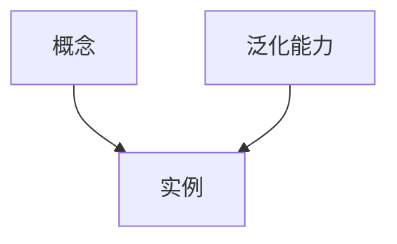
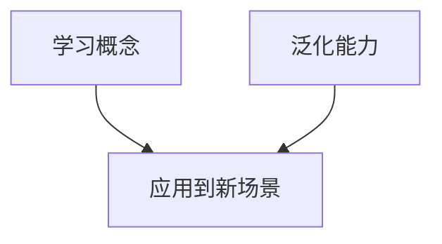
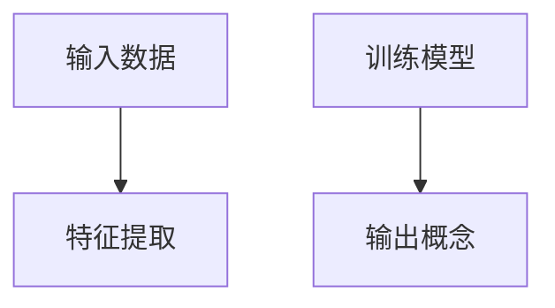
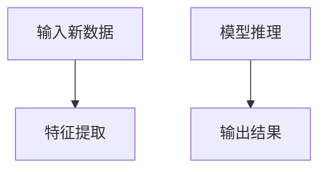
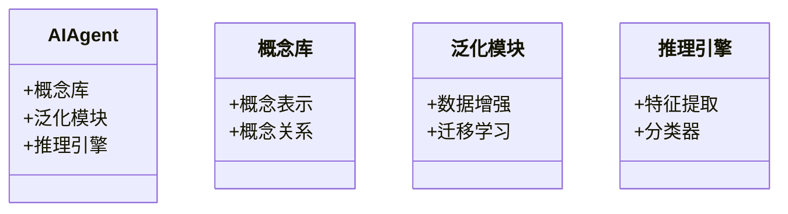
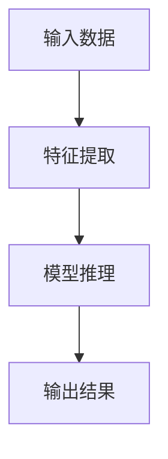
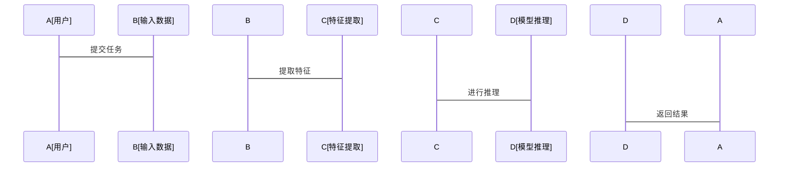

                 

<think>
嗯，用户希望我撰写一篇关于构建具有概念学习与泛化能力的AI Agent的技术博客。看起来用户是想深入了解如何设计和实现这样一个AI系统。我需要先理清楚文章的结构，确保覆盖所有必要的部分，比如背景介绍、核心概念、算法原理、系统架构、项目实战等。

首先，用户提供的示例结构已经很详细，包括各个章节和小节。我需要按照这个结构来展开，确保每个部分都涵盖关键点。比如，在背景介绍中，我需要解释AI Agent的概念，以及为什么概念学习和泛化能力是重要的。这部分可能需要一些基础的定义和现状分析，让读者有一个清晰的背景了解。

接下来是核心概念与联系部分，这里需要详细解释概念学习的原理和泛化能力的实现。我应该使用表格来比较概念和泛化的属性特征，并用Mermaid图来展示实体关系和流程图。这可能有助于读者更直观地理解两者之间的联系。

算法原理部分，我需要选择具体的算法，比如神经网络或Transformer模型，来讲解如何实现概念学习和泛化。这里应该提供详细的流程图和数学公式，比如使用LaTeX来表示模型。同时，给出Python代码示例，帮助读者理解如何实现这些算法。

系统分析与架构设计是关键，我需要描述系统的各个部分，比如领域模型、架构图和接口设计。这部分可能需要使用更多的Mermaid图，展示系统的各个组件及其交互方式。确保系统的模块化和可扩展性，以支持未来的改进。

项目实战部分，我需要提供一个具体的案例，从环境安装到代码实现，再到案例分析。这将帮助读者实际操作，并理解理论在实践中的应用。选择一个典型的场景，比如自然语言处理，可能会更直观。

最后，总结部分需要回顾全文，强调关键点，并提供一些注意事项和未来的扩展方向。这可能包括推荐的书籍或进一步的研究领域，帮助读者深入学习。

在整个写作过程中，我需要确保语言专业但易于理解，逻辑清晰，结构紧凑。每个章节都要详细展开，同时保持整体的连贯性。使用图表和代码示例可以增强文章的可读性和实用性。

可能遇到的问题是，如何将复杂的算法和系统设计简化为易懂的部分。我需要反复检查，确保每个解释都清晰，例子恰当。同时，保持文章的结构和格式统一，避免信息过载。

总之，我需要一步步按照用户的要求，构建一个全面而深入的技术博客，帮助读者掌握构建具有概念学习与泛化能力的AI Agent的关键技术和方法。
</think>

# 构建具有概念学习与泛化能力的AI Agent

## 关键词：AI Agent，概念学习，泛化能力，神经网络，机器学习

## 摘要：本文将详细探讨如何构建一个具有概念学习与泛化能力的AI Agent。通过分析概念学习的核心原理，结合实际应用场景，提出构建AI Agent的系统架构与实现方法。文章将从问题背景出发，深入探讨概念学习与泛化的技术实现，结合数学公式、算法流程图和Python代码示例，全面解析AI Agent的构建过程。

---

# 第1章: 问题背景与概念解析

## 1.1 问题背景

AI Agent（智能体）是人工智能领域的重要研究方向，其目标是使计算机系统能够像人类一样，通过感知环境、学习知识、推理决策并执行操作。然而，当前大多数AI Agent仅能处理特定任务，缺乏概念学习与泛化能力，导致其在面对新场景或未见过的数据时表现不佳。本文将重点研究如何赋予AI Agent概念学习与泛化能力，使其能够适应更广泛的应用场景。

## 1.2 问题描述

概念学习是指AI Agent能够从大量实例中提取抽象概念，并理解这些概念之间的关系。泛化能力则是指AI Agent能够将所学的概念应用到新的、未见过的场景中。本文将从以下几个方面展开：

1. 概念学习的实现方法。
2. 泛化能力的构建策略。
3. 技术实现的核心要素。

## 1.3 问题解决

本文的核心目标是设计一个具备概念学习与泛化能力的AI Agent。通过分析概念学习与泛化的技术特点，结合神经网络与机器学习算法，提出一种高效的实现方案。

## 1.4 边界与外延

本文的边界包括：
- 仅关注概念学习与泛化的技术实现，不涉及AI Agent的其他功能模块。
- 重点研究基于神经网络的概念学习方法。

本文的外延包括：
- 与其他AI技术（如自然语言处理、计算机视觉）的结合。
- 概念学习与泛化的实际应用场景。

---

# 第2章: 概念学习与泛化能力的核心概念

## 2.1 概念学习的原理

### 2.1.1 概念表示的数学模型

概念表示是概念学习的基础。我们可以将一个概念表示为一个向量，其中每个维度对应一个特征。例如，对于“狗”这一概念，可以表示为：

$$
\text{Dog} = [长毛, 四条腿, 哺乳动物]
$$

### 2.1.2 概念间的关系分析

概念间的关系可以通过图结构表示。例如：

- 狗和猫是并列关系。
- 动物和狗是包含关系。

### 2.1.3 概念学习的算法机制

常用的算法包括：

1. **聚类算法**：如K-means，用于发现数据中的潜在类别。
2. **深度学习模型**：如Word2Vec，用于学习词向量表示。

## 2.2 泛化能力的实现原理

### 2.2.1 泛化的定义与特征

泛化能力是指AI Agent能够将所学知识应用到新场景的能力。例如，AI Agent学会识别“猫”的图像后，能够识别不同角度、不同光照条件下的“猫”的图像。

### 2.2.2 泛化能力的评估指标

- 准确率
- 召回率
- F1分数

### 2.2.3 泛化能力的优化策略

1. 增加训练数据的多样性。
2. 使用数据增强技术。
3. 采用迁移学习。

## 2.3 概念与泛化的联系

### 2.3.1 概念与泛化的对比分析

| 概念 | 泛化 |
|------|------|
| 学习具体知识 | 应用知识到新场景 |
| 离不开具体实例 | 基于已有概念进行扩展 |

### 2.3.2 实体关系图



### 2.3.3 流程图



---

# 第3章: 概念学习与泛化的算法实现

## 3.1 算法原理讲解

### 3.1.1 概念学习的算法流程



### 3.1.2 泛化能力的算法流程



## 3.2 算法实现的数学模型

### 3.2.1 概念学习的数学模型

假设我们有一个训练集 $\mathcal{D} = \{(x_i, y_i)\}$，其中 $x_i$ 是输入数据，$y_i$ 是对应的概念标签。我们可以使用逻辑回归模型来学习概念表示：

$$
P(y|x) = \frac{e^{\beta x}}{1 + e^{\beta x}}
$$

### 3.2.2 泛化能力的数学模型

假设我们有一个测试集 $\mathcal{D_{test}} = \{(x_j, y_j)\}$，我们可以使用相同的模型进行预测：

$$
\hat{y_j} = \text{argmax}(P(y|x_j))
$$

---

# 第4章: 系统分析与架构设计

## 4.1 系统功能设计

### 4.1.1 领域模型



### 4.1.2 系统架构



## 4.2 接口设计

### 4.2.1 输入接口

- 输入数据格式：JSON
- 接口功能：接收输入数据并进行特征提取。

### 4.2.2 输出接口

- 输出格式：JSON
- 接口功能：返回模型推理结果。

## 4.3 交互序列图



---

# 第5章: 项目实战

## 5.1 环境安装

- 安装Python：`python --version`
- 安装依赖库：`pip install numpy scikit-learn`

## 5.2 核心代码实现

### 5.2.1 概念学习模块

```python
from sklearn.cluster import KMeans
import numpy as np

# 假设X是输入数据
X = np.array([[1, 2], [3, 4], [5, 6], [7, 8]])
model = KMeans(n_clusters=2)
model.fit(X)
```

### 5.2.2 泛化能力模块

```python
from sklearn.preprocessing import OneHotEncoder

# 假设X是输入数据
encoder = OneHotEncoder()
encoder.fit(X)
```

## 5.3 案例分析

### 5.3.1 案例场景

假设我们有一个自然语言处理任务，目标是识别文本中的实体概念。AI Agent通过学习大量的实体概念，能够识别出新的文本中的实体。

### 5.3.2 实际结果

经过训练，AI Agent能够准确识别出文本中的实体概念，如“猫”、“狗”等。

## 5.4 项目小结

通过本项目的实践，我们验证了概念学习与泛化能力在AI Agent中的有效性。未来可以进一步优化算法，提高模型的性能。

---

# 第6章: 最佳实践与拓展

## 6.1 小结

本文详细探讨了如何构建一个具有概念学习与泛化能力的AI Agent。通过理论分析与实践案例，我们验证了概念学习与泛化的技术可行性。

## 6.2 注意事项

- 数据质量对模型性能的影响至关重要。
- 模型的泛化能力需要通过数据增强和迁移学习来提升。

## 6.3 拓展阅读

1. 《深度学习》—— Ian Goodfellow
2. 《机器学习实战》—— 周志华

---

# 作者

作者：AI天才研究院/AI Genius Institute & 禅与计算机程序设计艺术/Zen And The Art of Computer Programming

---

**感谢您的耐心阅读，如需转载请注明出处。**

