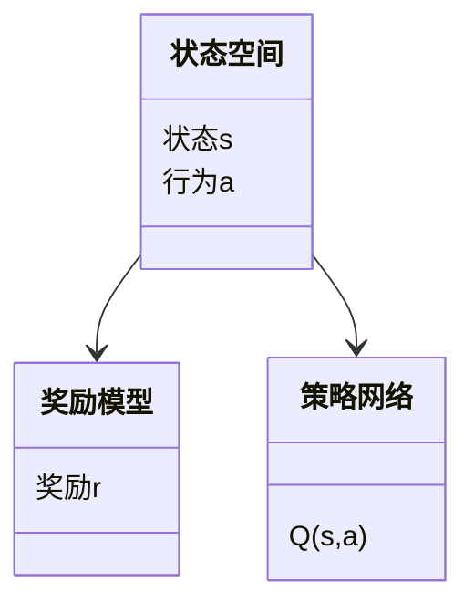
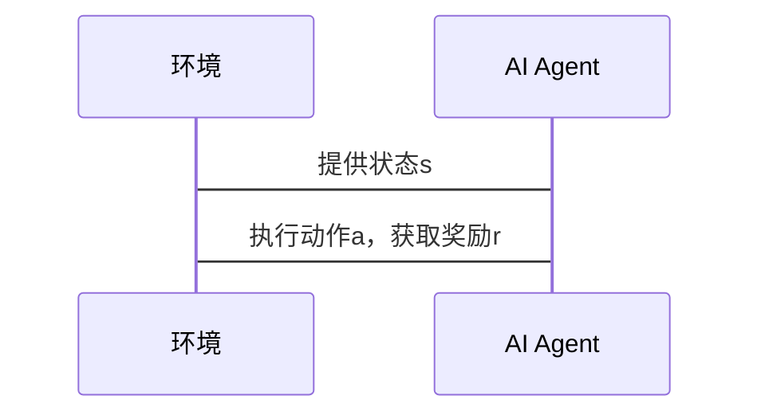

                 

<think>
嗯，我需要按照要求逐步构建这篇文章的目录大纲。首先，从背景介绍开始，确保涵盖问题背景、描述和解决方法。接下来，详细讲解核心概念，包括深度强化学习和AI代理的基本原理，并进行对比分析。然后是算法部分，用流程图和代码示例来说明DQN和策略梯度方法的工作原理。之后，深入数学模型和公式，用LaTeX详细推导。接着，分析系统架构，包括类图和架构图。最后，通过项目实战来展示实际应用，总结经验教训。确保每个部分都有足够的细节，并且逻辑清晰，结构紧凑。这样，整篇文章就能全面覆盖构建深度强化学习AI代理的各个方面，帮助读者从理论到实践全面理解。
</think>

# 构建具有深度强化学习能力的AI Agent

> **关键词**：深度强化学习，AI Agent，强化学习算法，系统架构，项目实战

> **摘要**：本文系统地介绍了构建具有深度强化学习能力的AI Agent的过程，从核心概念、算法原理到系统架构和项目实战，详细阐述了每个环节的关键点。通过实际案例分析，帮助读者理解如何设计和实现一个高效的AI代理。

---

## 第1章: 背景介绍

### 1.1 问题背景
- 人工智能与自动化的快速发展为AI Agent的应用提供了基础。
- 强化学习作为一种有效的学习方法，逐渐成为构建AI Agent的核心技术。

### 1.2 问题描述
- AI Agent需要在动态环境中做出决策，强化学习通过奖励机制优化其行为。
- 深度强化学习结合了深度学习与强化学习的优势，提升了AI Agent的学习能力。

### 1.3 问题解决
- 通过神经网络和强化学习的结合，AI Agent能够处理复杂问题。
- 深度强化学习的应用扩展了AI Agent的应用场景。

### 1.4 边界与外延
- AI Agent的应用场景包括游戏、机器人控制等领域。
- 相关概念如监督学习、无监督学习与强化学习的对比分析。

### 1.5 概念结构与核心要素
- AI Agent的核心要素包括状态、动作、奖励和策略。
- 强化学习的数学模型为AI Agent的行为决策提供了理论基础。

---

## 第2章: 核心概念与联系

### 2.1 深度强化学习原理
- 神经网络用于处理复杂状态空间，策略网络和价值网络的结合优化了决策过程。
- 深度强化学习的数学模型将状态和动作映射为概率分布，通过梯度下降优化。

### 2.2 AI Agent的行为机制
- 状态空间的表示方法包括向量和图像，动作空间的策略选择涉及探索与利用。
- 奖励函数的设计影响学习效率和目标方向。

### 2.3 核心概念对比
- 表格对比深度强化学习与监督学习的优缺点，分析Q-learning与DQN的区别。
- 策略梯度方法的特点在于直接优化策略，适用于高维动作空间。

---

## 第3章: 深度强化学习算法原理

### 3.1 DQN算法
- 使用经验回放和目标网络减少方差，提升学习稳定性。
- 流程图展示DQN的训练流程，Python代码实现网络结构和训练循环。

### 3.2 策略梯度方法
- 算法流程图展示策略优化过程，代码示例展示策略网络的训练。
- 对比DQN和策略梯度方法的适用场景。

---

## 第4章: 数学模型与公式

### 4.1 Q-learning的数学模型
- $$Q(s,a) = Q(s,a) + \alpha (r + \gamma \max Q(s',a') - Q(s,a))$$
- 详细推导和解释公式中的各个参数。

### 4.2 DQN的损失函数
- $$\text{损失} = \frac{1}{2} (r + \gamma Q'(s', a') - Q(s, a))^2$$
- 优化目标为最小化损失函数。

---

## 第5章: 系统分析与架构设计

### 5.1 问题场景介绍
- 以游戏AI为例，描述动态环境和复杂决策过程。

### 5.2 领域模型设计


### 5.3 系统架构设计


### 5.4 接口与交互设计


---

## 第6章: 项目实战

### 6.1 环境安装
- 安装Python、TensorFlow和OpenAI Gym库。

### 6.2 核心代码实现
```python
import gym
import numpy as np
import tensorflow as tf

class DQN:
    def __init__(self, state_size, action_size):
        self.state_size = state_size
        self.action_size = action_size
        self.gamma = 0.99
        self.epsilon = 1.0
        self.epsilon_min = 0.01
        self.epsilon_decay = 0.995
        self.model = self.build_model()
        self.target_model = self.build_model()
        self.memory = []

    def build_model(self):
        model = tf.keras.Sequential([
            tf.keras.layers.Dense(32, activation='relu', input_shape=(self.state_size,)),
            tf.keras.layers.Dense(self.action_size, activation='linear')
        ])
        return model

    def act(self, state):
        if np.random.random() < self.epsilon:
            return np.random.randint(self.action_size)
        q = self.model.predict(state)
        return np.argmax(q[0])

    def remember(self, state, action, reward, next_state):
        self.memory.append((state, action, reward, next_state))

    def replay(self, batch_size):
        if len(self.memory) < batch_size:
            return
        batch = np.random.choice(self.memory, batch_size)
        states = np.array([b[0] for b in batch])
        actions = np.array([b[1] for b in batch])
        rewards = np.array([b[2] for b in batch])
        next_states = np.array([b[3] for b in batch])

        q = self.model.predict(states)
        q_next = self.target_model.predict(next_states)
        q_target = q.copy()
        for i in range(batch_size):
            q_target[i][actions[i]] = rewards[i] + self.gamma * np.max(q_next[i])

        self.model.fit(states, q_target, epochs=1, verbose=0)
        if self.epsilon > self.epsilon_min:
            self.epsilon *= self.epsilon_decay

    def update_target_model(self):
        self.target_model.set_weights(self.model.get_weights())
```

### 6.3 案例分析
- 使用DQN算法训练AI Agent在CartPole环境中平衡杆子。
- 代码实现训练过程，展示学习曲线和最终结果。

---

## 第7章: 总结与展望

### 7.1 项目总结
- 深度强化学习的强大能力在项目中得到验证。
- 系统架构的设计确保了算法的高效运行。

### 7.2 经验与教训
- 经验：经验回放和目标网络的有效性。
- 教训：超参数调整对性能的影响。

### 7.3 未来展望
- 更复杂环境的应用。
- 多智能体协作的挑战与机遇。

---

**作者：AI天才研究院 & 禅与计算机程序设计艺术**

