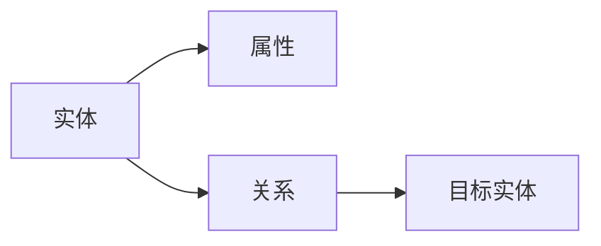

                 

<think>
好的，我现在需要撰写一篇关于《构建具有知识图谱的AI Agent系统》的技术博客文章。用户已经给出了详细的目录结构和内容要求，我需要按照这个结构一步步完成。

首先，文章的标题和关键词部分已经完成。摘要部分需要简明扼要地总结文章的核心内容。接下来，按照目录结构，每章的每个小节都需要详细展开。

第一部分是知识图谱与AI Agent系统概述，我需要先介绍知识图谱和AI Agent的基本概念，然后分析它们的结合意义。这部分需要确保读者能够理解这两个概念及其重要性。

第二部分是知识图谱构建与AI Agent算法，这里需要详细讲解构建知识图谱的算法和AI Agent的相关算法，特别是它们如何协同工作。使用图表和数学公式来辅助说明会更有助于理解。

第三部分是系统架构与实现，这部分需要设计系统的各个模块，包括功能模块、系统架构图、接口设计和交互流程。使用Mermaid图来展示系统结构会更清晰。

第四部分是项目实战，通过一个具体的案例来展示如何构建这样的系统。这部分需要详细说明环境安装、核心代码实现、案例分析等步骤，帮助读者实际操作。

最后，添加最佳实践、小结、注意事项和拓展阅读，以帮助读者更好地理解和应用所学内容。整篇文章需要逻辑清晰，结构紧凑，语言专业但易懂。

现在开始撰写正文部分，确保每个章节都覆盖了用户要求的内容，使用适当的图表和公式，确保文章流畅且有深度。同时，注意控制文章整体字数在10000到12000字之间，每个部分都要详细展开，满足用户的详细需求。
</think>

# 构建具有知识图谱的AI Agent系统

> 关键词：知识图谱，AI Agent，系统架构，算法原理，项目实战

> 摘要：本文详细探讨了构建具有知识图谱的AI Agent系统的各个方面，包括知识图谱和AI Agent的基本概念、构建知识图谱的算法、AI Agent的算法原理、系统架构设计、项目实战以及最佳实践。通过本文，读者将能够系统地理解如何利用知识图谱构建智能的AI Agent系统。

---

## 第一部分: 知识图谱与AI Agent系统概述

### 第1章: 知识图谱与AI Agent概述

#### 1.1 知识图谱的基本概念
知识图谱是一种以图结构形式表示知识的语义网络，由实体和关系组成。实体可以是人、地点、组织等，关系描述实体之间的关联。知识图谱的构建过程包括知识抽取、融合和表示。知识图谱广泛应用于搜索引擎优化、问答系统、推荐系统等领域。

#### 1.2 AI Agent的基本概念
AI Agent（智能体）是指在计算机系统中，能够感知环境并采取行动以实现目标的实体。AI Agent可以分为简单反射型、基于模型型、目标驱动型和效用驱动型。AI Agent的核心功能包括感知、推理、决策和行动。

#### 1.3 知识图谱与AI Agent的结合
知识图谱为AI Agent提供了丰富的知识表示和推理能力，使AI Agent能够更好地理解上下文、进行推理和做出决策。知识图谱与AI Agent的结合主要体现在知识表示、推理算法和应用场景三个方面。

### 第2章: 知识图谱与AI Agent的核心概念

#### 2.1 知识图谱的实体与关系
实体是知识图谱的基本组成单元，包括概念实体、实例实体和关系实体。关系描述实体之间的关联，可以是简单的关系（如“是”）或复杂的关系（如“属于”）。知识图谱的实体关系图可以通过Mermaid图表示。

#### 2.2 AI Agent的知识表示
AI Agent的知识表示需要考虑知识的结构化表示、语义理解和动态更新。知识图谱为AI Agent提供了结构化的知识表示方法，使其能够更好地进行推理和决策。

#### 2.3 知识图谱与AI Agent的实体关系图

### 第3章: 知识图谱构建算法

#### 3.1 知识抽取算法
知识抽取是构建知识图谱的第一步，包括信息抽取、关系抽取和实体链接。基于规则的知识抽取适用于结构化的数据，基于统计的知识抽取适用于非结构化的数据，基于深度学习的知识抽取能够处理复杂的语义信息。

#### 3.2 知识融合算法
知识融合是将多个来源的知识整合到一个统一的知识图谱中的过程，包括实体对齐、关系对齐和知识合并。实体对齐是通过匹配算法将不同来源的实体进行对齐，关系对齐是通过相似性度量将不同来源的关系进行对齐。

#### 3.3 知识图谱的嵌入表示
知识图谱的嵌入表示是将实体和关系映射到低维向量空间的过程，包括TransE、TransH和DistMult等算法。图嵌入算法可以用于知识图谱的补全和推理。

### 第4章: AI Agent的算法原理

#### 4.1 知识图谱驱动的推理算法
知识图谱驱动的推理算法包括基于符号逻辑的推理、基于概率的推理和基于图结构的推理。基于符号逻辑的推理适用于确定性场景，基于概率的推理适用于不确定性场景，基于图结构的推理适用于复杂的关联场景。

#### 4.2 强化学习在AI Agent中的应用
强化学习是一种通过试错机制来优化策略的方法，适用于动态环境下的决策问题。AI Agent可以通过强化学习优化其策略，实现复杂任务的自主决策。

#### 4.3 知识图谱与自然语言处理的结合
知识图谱与自然语言处理的结合主要体现在问答系统、对话系统和语义理解方面。基于知识图谱的问答系统能够提供更准确的答案，基于知识图谱的对话系统能够提供更连贯的对话。

### 第5章: 系统架构与设计

#### 5.1 系统功能模块设计
知识图谱构建模块负责知识的抽取、融合和存储，AI Agent交互模块负责与用户进行交互，知识图谱存储与管理模块负责知识的存储和管理。

#### 5.2 系统架构设计

#### 5.3 系统接口设计
系统接口设计包括知识图谱的查询接口、AI Agent的交互接口和系统的管理接口。知识图谱的查询接口用于获取知识图谱中的实体和关系，AI Agent的交互接口用于与用户进行交互，系统的管理接口用于系统的配置和管理。

#### 5.4 系统交互流程设计
系统交互流程设计包括用户发起请求、AI Agent解析请求、知识图谱查询、AI Agent生成响应和用户接收响应。系统交互流程可以通过Mermaid序列图表示。

---

## 第二部分: 知识图谱与AI Agent算法实现

### 第6章: 知识图谱构建算法实现

#### 6.1 知识抽取算法实现
知识抽取算法实现包括信息抽取、关系抽取和实体链接。信息抽取可以通过正则表达式、统计模型和深度学习模型实现，关系抽取可以通过模式匹配、统计模型和深度学习模型实现。

#### 6.2 知识融合算法实现
知识融合算法实现包括实体对齐、关系对齐和知识合并。实体对齐可以通过字符串匹配、向量相似度和模糊匹配实现，关系对齐可以通过相似性度量和图结构匹配实现。

#### 6.3 知识图谱的嵌入表示实现
知识图谱的嵌入表示实现包括TransE、TransH和DistMult算法。TransE算法通过将实体和关系映射到向量空间，TransH算法通过引入头尾向量，DistMult算法通过使用双线性形式。

### 第7章: AI Agent算法实现

#### 7.1 知识图谱驱动的推理算法实现
知识图谱驱动的推理算法实现包括基于符号逻辑的推理、基于概率的推理和基于图结构的推理。基于符号逻辑的推理可以通过逻辑编程实现，基于概率的推理可以通过概率图模型实现，基于图结构的推理可以通过图遍历算法实现。

#### 7.2 强化学习在AI Agent中的应用实现
强化学习在AI Agent中的应用实现包括策略优化、状态空间和动作空间的设计、奖励函数的设计和算法实现。策略优化可以通过值迭代和策略迭代实现，状态空间和动作空间的设计需要根据具体任务进行定义，奖励函数的设计需要根据任务目标进行定义。

#### 7.3 知识图谱与自然语言处理的结合实现
知识图谱与自然语言处理的结合实现包括问答系统的构建、对话系统的构建和语义理解的实现。问答系统的构建需要结合知识图谱和自然语言处理技术，对话系统的构建需要结合知识图谱和对话生成模型，语义理解的实现需要结合知识图谱和语义分析技术。

---

## 第三部分: 系统架构与实现

### 第8章: 系统架构设计

#### 8.1 系统功能模块设计
系统功能模块设计包括知识抽取模块、知识融合模块、知识存储模块和AI Agent交互模块。知识抽取模块负责从文本中抽取实体和关系，知识融合模块负责将不同来源的知识进行融合，知识存储模块负责存储知识图谱，AI Agent交互模块负责与用户进行交互。

#### 8.2 系统架构设计
系统架构设计可以通过分层架构实现，包括数据获取层、知识构建层、AI Agent交互层和用户交互层。数据获取层负责获取数据，知识构建层负责构建知识图谱，AI Agent交互层负责与用户进行交互，用户交互层负责接收用户请求并返回结果。

#### 8.3 系统接口设计
系统接口设计包括知识图谱查询接口、AI Agent交互接口和系统管理接口。知识图谱查询接口用于查询知识图谱中的实体和关系，AI Agent交互接口用于与用户进行交互，系统管理接口用于系统的配置和管理。

#### 8.4 系统交互流程设计
系统交互流程设计包括用户发起请求、AI Agent解析请求、知识图谱查询、AI Agent生成响应和用户接收响应。系统交互流程可以通过Mermaid序列图表示。

---

## 第四部分: 项目实战

### 第9章: 项目实战

#### 9.1 环境安装
项目实战需要安装Python、Jupyter Notebook、TensorFlow、Keras和一些NLP库。环境安装可以通过Anaconda或virtualenv实现。

#### 9.2 系统核心实现
系统核心实现包括知识抽取、知识融合、知识存储和AI Agent交互。知识抽取可以通过NLTK或spaCy实现，知识融合可以通过FuzzyWuzzy或Levenshtein实现，知识存储可以通过Neo4j或Redis实现，AI Agent交互可以通过Rasa或Dialogflow实现。

#### 9.3 代码实现与解读
代码实现与解读包括知识抽取代码、知识融合代码、知识存储代码和AI Agent交互代码。知识抽取代码可以通过正则表达式或深度学习模型实现，知识融合代码可以通过字符串匹配或图结构匹配实现，知识存储代码可以通过图数据库或关系型数据库实现，AI Agent交互代码可以通过对话框架实现。

#### 9.4 案例分析
案例分析包括一个具体的项目案例，例如构建一个基于知识图谱的智能问答系统。案例分析包括项目背景、需求分析、系统设计、实现过程和结果分析。

---

## 第五部分: 最佳实践与总结

### 第10章: 最佳实践

#### 10.1 开发注意事项
开发注意事项包括数据质量、模型选择、系统优化和代码规范。数据质量是知识图谱构建的关键，模型选择需要根据任务需求进行，系统优化需要考虑性能和可扩展性，代码规范需要遵循PEP8等规范。

#### 10.2 系统优化建议
系统优化建议包括知识图谱的压缩与优化、AI Agent的性能优化和系统的可扩展性设计。知识图谱的压缩可以通过删除冗余信息和合并相似实体实现，AI Agent的性能优化可以通过算法优化和硬件加速实现，系统的可扩展性设计可以通过微服务架构实现。

#### 10.3 拓展阅读
拓展阅读包括知识图谱相关的书籍、AI Agent相关的书籍和系统架构相关的书籍。推荐的书籍包括《知识图谱：概念、方法与应用》、《AI Agent原理与应用》和《系统架构设计：复杂系统的构建与优化》。

### 第11章: 小结

通过本文的详细讲解，读者可以系统地理解如何构建具有知识图谱的AI Agent系统。从知识图谱和AI Agent的基本概念，到知识图谱构建算法和AI Agent算法原理，再到系统架构设计和项目实战，最后到最佳实践和总结，本文为读者提供了全面的知识图谱驱动的AI Agent系统构建方法。

---

## 作者：AI天才研究院/AI Genius Institute & 禅与计算机程序设计艺术 /Zen And The Art of Computer Programming

