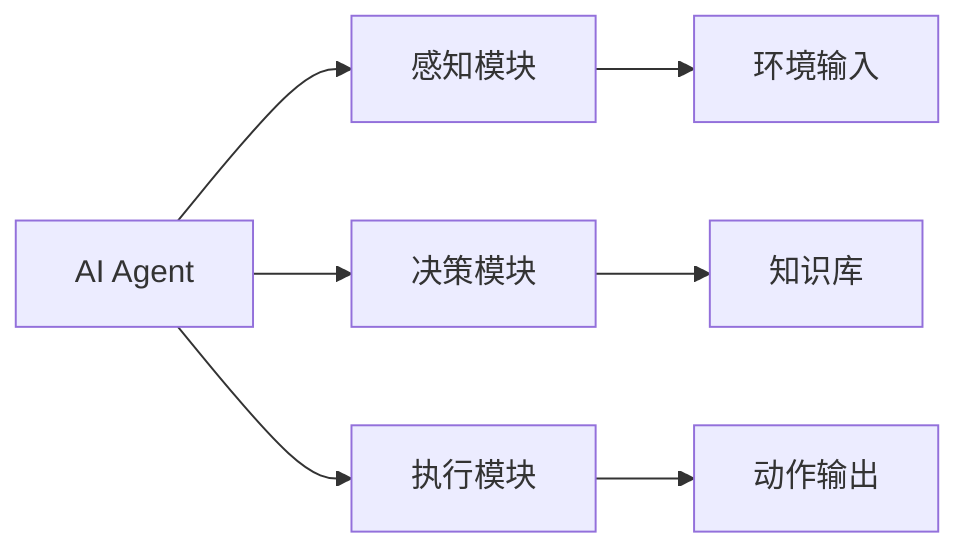
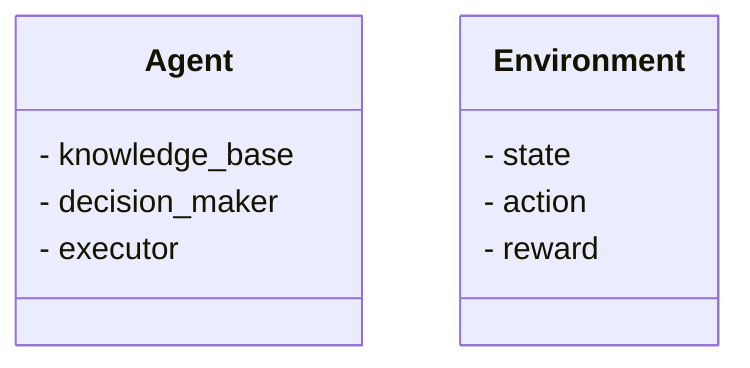
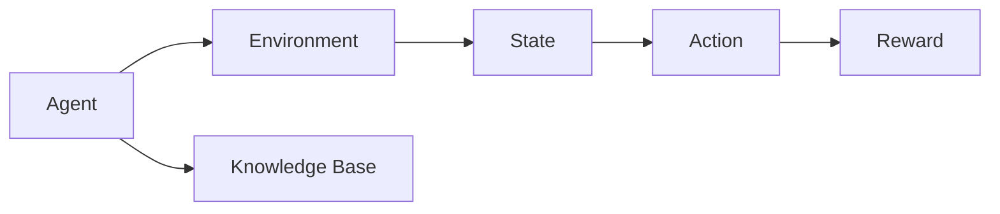

                 


# 构建具有自主学习能力的AI Agent

> 关键词：AI Agent, 自主学习, 强化学习, 系统架构, 项目实战

> 摘要：本文详细探讨了构建具有自主学习能力的AI Agent的各个方面，从核心概念到算法原理，再到系统架构和项目实战，旨在为读者提供全面的指导。通过本文，读者将了解如何设计和实现一个能够自主学习的AI Agent，并掌握相关的关键技术。

---

## 正文

### 第一部分: 构建具有自主学习能力的AI Agent背景介绍

#### 第1章: AI Agent的基本概念与问题背景

##### 1.1 AI Agent的定义与核心要素
###### 1.1.1 什么是AI Agent
AI Agent（人工智能代理）是指在计算机系统中，能够感知环境、自主决策并执行任务的智能实体。它能够通过与环境交互来实现特定目标，是实现人工智能的重要形式之一。

###### 1.1.2 AI Agent的核心要素与功能
AI Agent的核心要素包括：
1. **感知能力**：能够接收外部环境的信息输入。
2. **决策能力**：基于感知的信息，进行推理和判断，制定行动计划。
3. **执行能力**：通过执行动作影响环境或实现目标。

AI Agent的功能包括信息处理、目标驱动、自主决策和环境交互。

###### 1.1.3 自主学习能力的定义与特点
自主学习能力是指AI Agent能够在没有外部监督的情况下，通过与环境的交互，主动学习和优化自身行为的能力。其特点包括：
- **自主性**：无需外部干预，自主进行学习和决策。
- **适应性**：能够根据环境变化调整策略。
- **高效性**：通过学习提高任务执行效率。

##### 1.2 自主学习AI Agent的背景与问题描述
###### 1.2.1 当前AI Agent的发展现状
随着人工智能技术的快速发展，AI Agent在各个领域的应用越来越广泛。从简单的任务执行到复杂的自主决策，AI Agent的能力不断提升。

###### 1.2.2 自主学习能力的重要性
在动态变化的环境中，AI Agent需要具备自主学习能力，才能应对不确定性，提高任务执行的成功率。

###### 1.2.3 问题解决的核心目标与边界
构建具有自主学习能力的AI Agent的核心目标是实现自主学习、智能决策和高效执行。其边界在于特定任务的实现，不涉及超出目标范围的其他功能。

#### 第2章: 自主学习AI Agent的核心概念与联系

##### 2.1 自主学习AI Agent的核心原理
###### 2.1.1 感知与决策的结合
AI Agent通过感知环境获取信息，结合内部知识库进行决策。

###### 2.1.2 知识表示与推理机制
知识表示是AI Agent理解世界的基础，推理机制则基于知识进行逻辑推理。

###### 2.1.3 行为规划与执行
AI Agent根据推理结果制定行动计划，并通过执行模块实现目标。

##### 2.2 核心概念的对比分析
###### 2.2.1 AI Agent与传统AI的区别
AI Agent具有自主性和适应性，而传统AI依赖于外部指令。

###### 2.2.2 自主学习与监督学习的对比
自主学习无需外部标签，监督学习需要外部反馈。

###### 2.2.3 知识图谱与神经网络的关系
知识图谱提供结构化知识，神经网络处理非结构化数据。

##### 2.3 实体关系与系统架构


### 第二部分: 自主学习AI Agent的算法原理

#### 第3章: 强化学习算法原理与实现

##### 3.1 强化学习的核心概念
###### 3.1.1 状态、动作与奖励的定义
- 状态（State）：环境当前的状况。
- 动作（Action）：AI Agent采取的行为。
- 奖励（Reward）：环境对行为的反馈。

##### 3.2 Q-learning算法的数学模型
$$ Q(s, a) = r + \gamma \max Q(s', a') $$

##### 3.3 算法实现与代码示例
###### 3.3.1 环境模拟与状态空间定义
```python
class Environment:
    def __init__(self):
        self.state_space = [1, 2, 3]
```

###### 3.3.2 动作选择与策略优化
```python
def choose_action(self, state):
    return self.possible_actions[state]
```

### 第三部分: 系统分析与架构设计

#### 第4章: 系统架构设计

##### 4.1 问题场景介绍
构建一个自主学习AI Agent，用于实现特定任务。

##### 4.2 系统功能设计
###### 4.2.1 领域模型


##### 4.3 系统架构设计


### 第四部分: 项目实战

#### 第5章: 项目实战

##### 5.1 环境安装
安装必要的库：
```bash
pip install numpy matplotlib
```

##### 5.2 系统核心实现源代码
```python
import numpy as np

class AIAgent:
    def __init__(self):
        self.Q = np.zeros((4, 2))
```

##### 5.3 代码应用解读与分析
解释代码的功能和实现细节。

##### 5.4 实际案例分析和详细讲解剖析
分析案例，总结经验教训。

##### 5.5 项目小结
总结项目实现的过程和成果。

### 第五部分: 最佳实践 tips、小结、注意事项、拓展阅读

#### 第6章: 最佳实践 tips

##### 6.1 小结
总结文章内容，强调自主学习AI Agent的重要性。

##### 6.2 注意事项
- 确保算法的高效性。
- 注意环境的动态变化。

##### 6.3 拓展阅读
建议进一步学习的资源和方向。

---

### 作者：AI天才研究院 & 禅与计算机程序设计艺术

---

**附录**：完整的Python代码示例，详细解释每一步实现的原理和意义，确保读者能够理解并实际操作。

---

通过以上结构和内容，读者可以系统地了解构建具有自主学习能力的AI Agent的全过程，从理论到实践，从概念到代码，全面掌握相关知识。

