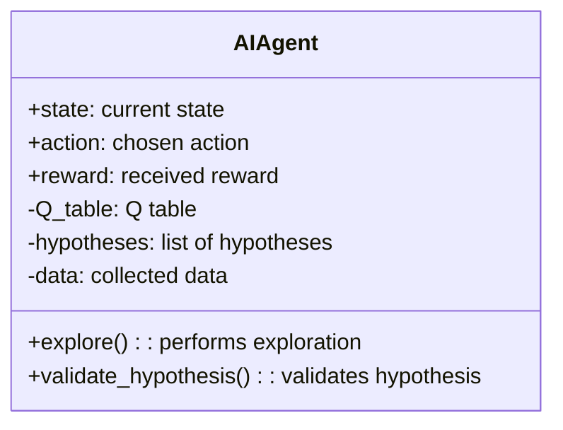
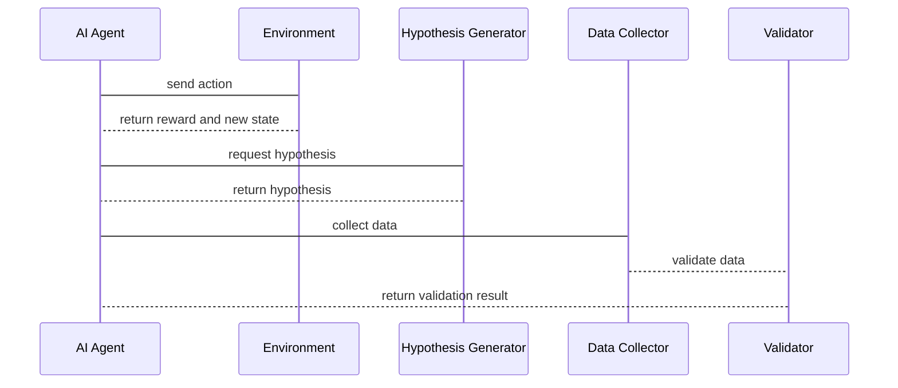

                 


# 构建具有自主探索与假设验证能力的AI Agent

## 关键词：AI Agent、自主探索、假设验证、强化学习、生成模型、系统架构

## 摘要：本文详细探讨了构建具有自主探索与假设验证能力的AI Agent的理论基础、算法实现、系统架构和项目实战。通过强化学习和生成模型的结合，本文提出了一个创新的解决方案，为AI Agent在复杂环境中的自主决策和问题解决提供了新的思路。文章内容涵盖从背景介绍到系统设计，再到项目实现的完整流程，旨在帮助读者全面理解并掌握这一前沿技术。

---

# 第一部分: 自主探索与假设验证的AI Agent背景介绍

## 第1章: 问题背景与核心概念

### 1.1 问题背景

#### 1.1.1 当前AI Agent的发展现状
- AI Agent的定义与分类
- 当前AI Agent在各领域的应用现状
- 存在的主要问题与挑战

#### 1.1.2 自主探索与假设验证的需求
- 自主探索的必要性
- 假设验证的重要性
- 两者的协同需求

#### 1.1.3 问题解决的必要性
- 自主探索与假设验证的结合意义
- 对AI Agent能力提升的推动作用
- 对实际应用场景的价值

### 1.2 核心概念

#### 1.2.1 自主探索的定义与特点
- 自主探索的核心定义
- 自主性、目标导向性和适应性的特点
- 自主探索与监督学习、无监督学习的区别

#### 1.2.2 假设验证的定义与特点
- 假设验证的核心定义
- 数据驱动性和反馈驱动性的特点
- 假设验证与传统数据分析的区别

#### 1.2.3 两者的关系与协同
- 自主探索为假设验证提供数据基础
- 假设验证为自主探索提供方向指导
- 两者的动态协同过程

### 1.3 问题描述

#### 1.3.1 当前AI Agent的局限性
- 现有AI Agent的依赖性问题
- 缺乏自主性和灵活性
- 假设验证能力的缺失

#### 1.3.2 自主探索与假设验证的必要性
- 提升AI Agent的自主性
- 提高AI Agent的适应性和决策能力
- 实现更复杂场景下的问题解决

#### 1.3.3 解决方案的边界与外延
- 解决方案的核心边界
- 解决方案的适用范围和扩展性
- 解决方案的潜在影响

### 1.4 核心要素组成

#### 1.4.1 自主探索的核心要素
- 内在动机与目标设定
- 探索策略与行为选择
- 反馈机制与学习优化

#### 1.4.2 假设验证的核心要素
- 假设生成与筛选
- 数据收集与分析
- 反馈机制与验证结果

#### 1.4.3 两者的协同机制
- 数据共享与信息交互
- 战略协同与任务分配
- 过程监控与动态调整

## 第2章: 核心概念与联系

### 2.1 自主探索的原理

#### 2.1.1 强化学习的基本原理
- 强化学习的定义
- 状态、动作、奖励的概念
- Q-learning算法的基本原理

#### 2.1.2 探索与利用的平衡
- 探索与利用的定义与作用
- $\epsilon$-贪心算法的原理
- 平衡策略的优化方法

#### 2.1.3 自主决策的机制
- 自主决策的核心流程
- 动作选择的策略
- 反馈机制的作用

### 2.2 假设验证的原理

#### 2.2.1 假设生成的机制
- 假设生成的定义与方法
- 基于生成模型的假设生成
- 假设的质量评估标准

#### 2.2.2 数据驱动的验证方法
- 数据驱动验证的定义与流程
- 基于统计分析的验证方法
- 数据质量对验证结果的影响

#### 2.2.3 反馈驱动的验证机制
- 反馈驱动验证的定义
- 基于强化学习的反馈机制
- 反馈信息的处理与分析

### 2.3 两者的关系与协同

#### 2.3.1 自主探索为假设验证提供数据
- 数据生成的多样性和丰富性
- 数据的质量对假设验证的影响
- 数据共享的机制与流程

#### 2.3.2 假设验证为自主探索提供指导
- 假设验证对探索方向的指导作用
- 假设验证结果对探索策略的优化
- 假设验证对探索效率的提升

#### 2.3.3 两者的动态协同过程
- 动态协同的定义与流程
- 协同过程中的信息流与控制流
- 协同机制的优化与调整

### 2.4 核心概念对比表格

| 属性 | 自主探索 | 假设验证 |
|------|---------|----------|
| 目标 | 发现新知识 | 验证假设 |
| 方法 | 强化学习 | 数据分析 |
| 输出 | 行为策略 | 假设是否成立 |

### 2.5 ER实体关系图

```mermaid
entity: AI Agent
entity: 环境
entity: 假设
entity: 数据
```

---

## 第3章: 自主探索算法原理

### 3.1 强化学习算法

#### 3.1.1 Q-learning算法

```mermaid
state --> action --> reward --> next state
```

```python
def q_learning():
    Initialize Q table
    While True:
        Get current state
        Choose action (ε-greedy)
        Take action and get reward
        Update Q value: Q(s, a) = Q(s, a) + α*(reward + γ*max(Q(s', a')))
```

#### 3.1.2 算法实现代码

```python
import numpy as np

def q_learning_example():
    states = 5
    actions = 2
    Q = np.zeros((states, actions))
    alpha = 0.1
    gamma = 0.9
    epsilon = 0.1

    for episode in range(100):
        state = 0
        while state < 4:
            if np.random.random() < epsilon:
                action = np.random.randint(0, actions)
            else:
                action = np.argmax(Q[state])
            
            next_state = state + 1 if action == 1 else 0
            reward = 1 if next_state == 4 else 0
            
            Q[state][action] += alpha * (reward + gamma * np.max(Q[next_state]) - Q[state][action])
            state = next_state
    return Q

Q = q_learning_example()
print(Q)
```

#### 3.1.3 算法的数学模型

$$ Q(s, a) = Q(s, a) + \alpha \cdot (r + \gamma \cdot \max(Q(s', a')) - Q(s, a)) $$

---

## 第4章: 假设验证算法原理

### 4.1 生成模型

#### 4.1.1 生成模型的基本原理
- 生成模型的定义与分类
- 基于生成对抗网络（GAN）的假设生成
- 基于变分自编码器（VAE）的假设生成

#### 4.1.2 假设生成的流程

```mermaid
input --> encoder --> latent space --> decoder --> output
```

#### 4.1.3 假设验证的流程

```mermaid
input --> model --> output --> validation
```

### 4.2 假设验证的实现

#### 4.2.1 数据驱动的验证方法

```python
def hypothesis_validation(data, hypothesis):
    validate = True
    for d in data:
        if not hypothesis(d):
            validate = False
            break
    return validate
```

#### 4.2.2 反馈驱动的验证机制

```python
def feedback_validation(action, reward):
    if reward > 0:
        validate = True
    else:
        validate = False
    return validate
```

---

## 第5章: 系统分析与架构设计方案

### 5.1 问题场景介绍

#### 5.1.1 问题场景描述
- 复杂动态环境下的AI Agent
- 自主探索与假设验证的结合场景
- 多目标优化的实现需求

#### 5.1.2 项目介绍
- 项目目标
- 项目范围
- 项目约束

### 5.2 系统功能设计

#### 5.2.1 领域模型设计



#### 5.2.2 系统架构设计

```mermaid
graph TD
    AI Agent --> Environment
    AI Agent --> Hypothesis Generator
    Hypothesis Generator --> Data Collector
    Data Collector --> Validator
    Validator --> AI Agent
```

#### 5.2.3 系统接口设计

- 输入接口：状态、动作、奖励
- 输出接口：新状态、假设、数据
- 接口规范：API定义与数据格式

#### 5.2.4 系统交互流程图



---

## 第6章: 项目实战

### 6.1 环境安装与配置

#### 6.1.1 安装Python与相关库
```bash
pip install numpy matplotlib keras tensorflow
```

#### 6.1.2 安装环境配置
- 安装虚拟环境
- 配置路径与依赖项

### 6.2 系统核心实现

#### 6.2.1 核心代码实现

```python
import numpy as np
import tensorflow as tf

def build_model():
    model = tf.keras.Sequential([
        tf.keras.layers.Dense(64, activation='relu'),
        tf.keras.layers.Dense(1, activation='sigmoid')
    ])
    model.compile(optimizer='adam', loss='binary_crossentropy')
    return model

model = build_model()
model.fit(X_train, y_train, epochs=10, batch_size=32)
```

#### 6.2.2 代码应用解读与分析
- 代码功能说明
- 关键部分解读
- 代码优化建议

### 6.3 实际案例分析

#### 6.3.1 案例背景介绍
- 案例场景描述
- 数据来源与特点
- 问题解决目标

#### 6.3.2 实施过程
- 数据预处理
- 模型训练
- 结果分析

#### 6.3.3 结果分析与优化
- 结果解读
- 模型优化
- 性能提升

### 6.4 项目小结

#### 6.4.1 项目总结
- 项目目标实现情况
- 关键技术点总结
- 成功经验与教训

#### 6.4.2 可能的改进方向
- 技术优化方向
- 功能扩展方向
- 应用场景的扩展

---

## 第7章: 最佳实践

### 7.1 小结

#### 7.1.1 核心内容回顾
- 自主探索与假设验证的结合
- 算法实现与系统设计
- 项目实战的经验总结

#### 7.1.2 关键点总结
- 强化学习与生成模型的协同
- 数据驱动与反馈驱动的结合
- 系统架构的灵活性与扩展性

### 7.2 注意事项

#### 7.2.1 技术实现中的注意事项
- 数据质量的重要性
- 算法选择的合理性
- 系统设计的可扩展性

#### 7.2.2 应用中的注意事项
- 伦理问题
- 安全问题
- 隐私问题

### 7.3 拓展阅读

#### 7.3.1 推荐学习资料
- 强化学习的经典论文
- 生成模型的最新研究
- AI Agent的前沿研究

#### 7.3.2 相关书籍推荐
- 《强化学习入门》
- 《生成模型实战》
- 《AI Agent设计与实现》

---

## 作者：AI天才研究院/AI Genius Institute & 禅与计算机程序设计艺术 /Zen And The Art of Computer Programming

---

希望这个目录大纲能满足您的需求。如果需要进一步调整或补充，请随时告知！

