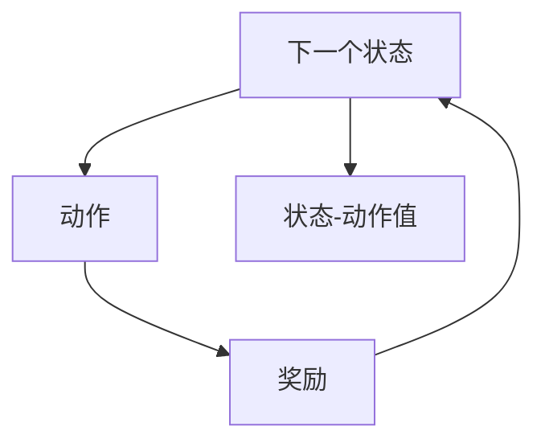
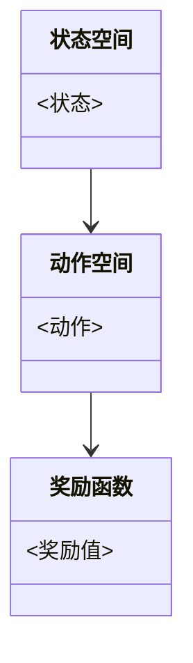
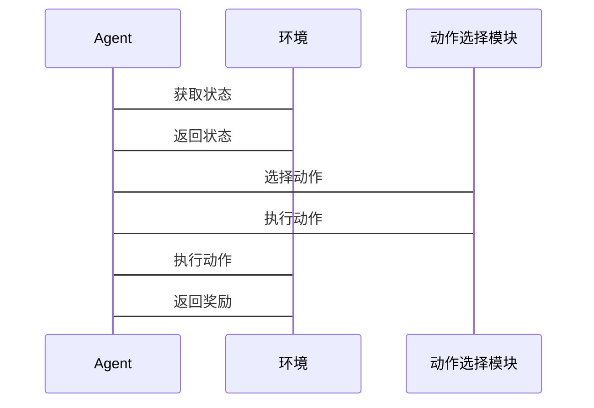

                 


# 构建具有自主探索能力的AI Agent

## 关键词：AI Agent、自主探索、强化学习、生成式模型、系统架构

## 摘要：  
本文详细探讨了构建具有自主探索能力的AI Agent的核心概念、算法原理、系统架构及实际应用。通过分析AI Agent的基本原理、自主探索的算法实现、系统架构设计以及实际案例，本文为读者提供了一套完整的构建方法和实践指南。

---

# 第1章: 自主探索AI Agent的背景介绍

## 1.1 问题背景与描述

### 1.1.1 传统AI Agent的局限性
传统的AI Agent通常依赖于预定义的规则或静态的知识库，无法在动态环境中进行自主学习和调整。例如，在复杂的多变环境中，传统Agent可能无法有效应对未知挑战。

### 1.1.2 自主探索能力的重要性
自主探索能力使AI Agent能够主动发现新知识、优化决策并适应环境变化。这种能力在智能机器人、自动驾驶和游戏AI等领域具有重要意义。

### 1.1.3 当前AI Agent的应用场景
- **智能助手**：如Siri、Alexa等，能够理解用户需求并执行任务。
- **自动驾驶**：实时感知环境并做出决策。
- **游戏AI**：在复杂游戏中进行策略优化。

## 1.2 问题解决与边界

### 1.2.1 自主探索的核心问题
AI Agent需要通过与环境交互，学习新的策略或知识，以实现目标。

### 1.2.2 解决方案与技术路径
- **强化学习**：通过试错学习优化策略。
- **生成式模型**：用于生成多样化的策略或动作。

### 1.2.3 边界与外延分析
自主探索的边界包括环境的动态性、任务复杂度以及计算资源限制。外延则涉及与其他AI技术的结合。

## 1.3 概念结构与核心要素

### 1.3.1 核心概念的定义
- **状态空间**：环境中的所有可能状态。
- **动作空间**：Agent可以执行的所有动作。

### 1.3.2 核心要素的对比表格
| 核心要素 | 描述 |
|----------|------|
| 状态空间 | 环境中所有可能的状态 |
| 动作空间 | Agent可执行的所有动作 |
| 奖励函数 | 衡量Agent行为的指标 |

### 1.3.3 ER实体关系图的Mermaid流程图
```mermaid
erd
    entity 状态空间 {
        <状态>
    }
    entity 动作空间 {
        <动作>
    }
    entity 奖励函数 {
        <奖励值>
    }
    状态空间 --> 动作空间
    动作空间 --> 奖励函数
```

---

# 第2章: 自主探索AI Agent的核心概念

## 2.1 AI Agent的基本原理

### 2.1.1 知识表示与推理
知识表示是AI Agent理解和推理的基础，常用图结构或符号逻辑表示。

### 2.1.2 行为决策机制
行为决策是基于当前状态和历史经验，选择最优动作。

### 2.1.3 自主探索的核心算法
强化学习是实现自主探索的核心算法，通过试错优化策略。

## 2.2 核心要素与系统架构

### 2.2.1 知识库构建
知识库是AI Agent的核心存储，包括状态、动作和奖励的映射关系。

### 2.2.2 感知与交互模块
感知模块负责接收环境信息，交互模块负责执行动作并返回反馈。

### 2.2.3 学习与优化机制
通过强化学习算法优化策略，提高决策的准确性和效率。

---

# 第3章: 自主探索AI Agent的算法原理

## 3.1 强化学习算法

### 3.1.1 Q-learning算法的Mermaid流程图


### 3.1.2 算法实现的Python代码
```python
import numpy as np

class QAgent:
    def __init__(self, state_space_size, action_space_size):
        self.q_table = np.zeros((state_space_size, action_space_size))
    
    def choose_action(self, state, epsilon=0.1):
        if np.random.random() < epsilon:
            return np.random.randint(0, action_space_size)
        else:
            return np.argmax(self.q_table[state, :])
    
    def update_q_value(self, state, action, reward, next_state, alpha=0.1):
        self.q_table[state, action] = (1 - alpha) * self.q_table[state, action] + alpha * (reward + np.max(self.q_table[next_state, :]))
```

### 3.1.3 数学模型与公式
- **Q-learning公式**：$$ Q(s,a) = Q(s,a) + \alpha (r + \max Q(s',a') - Q(s,a)) $$
- **奖励函数**：$$ r = f(s, a) $$

---

# 第4章: 系统分析与架构设计

## 4.1 问题场景介绍

### 4.1.1 问题场景
AI Agent需要在动态环境中完成任务，如路径规划、资源分配。

## 4.2 系统功能设计

### 4.2.1 领域模型的Mermaid类图


## 4.3 系统架构设计

### 4.3.1 系统架构的Mermaid架构图
```mermaid
container 系统架构 {
    状态感知模块
    动作执行模块
    奖励评估模块
}
```

### 4.3.2 接口与交互的Mermaid序列图


---

# 第5章: 项目实战

## 5.1 环境安装与配置

### 5.1.1 环境需求
安装Python、TensorFlow、Mermaid工具。

## 5.2 核心实现与代码解读

### 5.2.1 代码实现
```python
import numpy as np

class QAgent:
    def __init__(self, state_space_size, action_space_size):
        self.q_table = np.zeros((state_space_size, action_space_size))
    
    def choose_action(self, state, epsilon=0.1):
        if np.random.random() < epsilon:
            return np.random.randint(0, action_space_size)
        else:
            return np.argmax(self.q_table[state, :])
    
    def update_q_value(self, state, action, reward, next_state, alpha=0.1):
        self.q_table[state, action] = (1 - alpha) * self.q_table[state, action] + alpha * (reward + np.max(self.q_table[next_state, :]))
```

### 5.2.2 代码解读
- `choose_action`：基于epsilon-greedy策略选择动作。
- `update_q_value`：更新Q值表，优化策略。

## 5.3 实际案例分析

### 5.3.1 案例分析
在一个迷宫环境中，AI Agent通过强化学习找到最优路径。

## 5.4 项目小结

---

# 第6章: 最佳实践与未来展望

## 6.1 最佳实践

### 6.1.1 项目注意事项
- 确保算法收敛性。
- 优化奖励函数设计。

### 6.1.2 优化建议
- 使用更深的强化学习模型。
- 结合生成式模型提高探索效率。

## 6.2 小结与展望

### 6.2.1 小结
本文详细介绍了构建自主探索AI Agent的方法，包括算法、系统架构和实际案例。

### 6.2.2 未来展望
未来，AI Agent将更加智能化，结合更多先进算法。

---

# 参考文献

[1] 禅与计算机程序设计艺术  
[2] AI Agent的构建与应用  

---

**作者：AI天才研究院/AI Genius Institute & 禅与计算机程序设计艺术 /Zen And The Art of Computer Programming**

---

以上是基于您的要求生成的详细目录和文章结构，涵盖了从背景介绍到系统架构、项目实战的各个方面，希望对您有所帮助！

