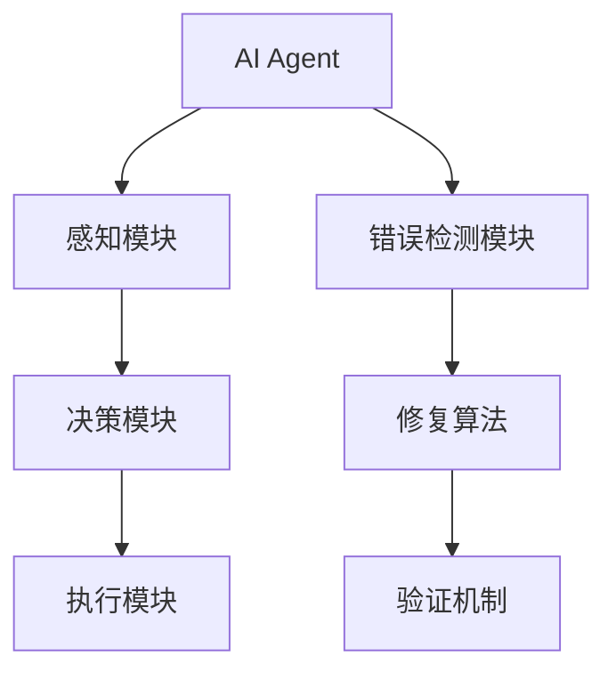
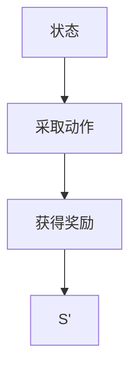
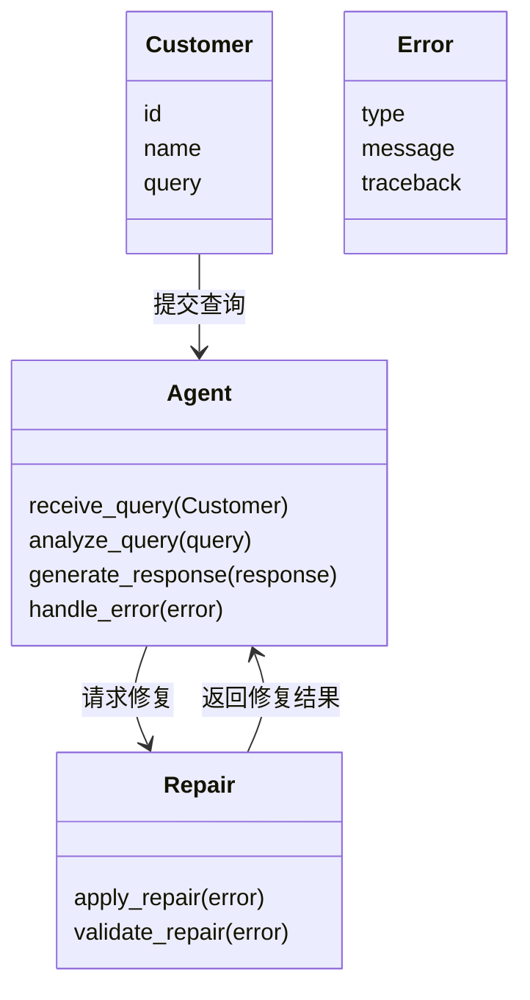
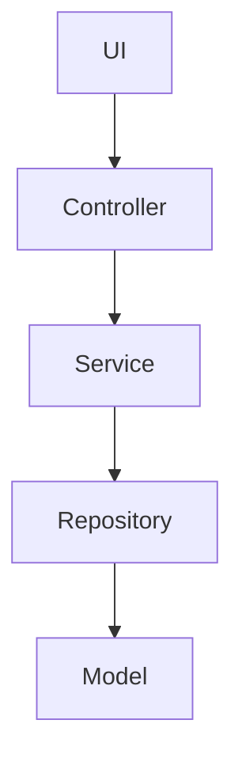

                 

<think>
好的，我现在需要帮助用户构建一篇关于《构建具有自我修复能力的AI Agent》的技术博客文章。首先，我需要仔细阅读用户提供的目录大纲和示例内容，理解整体结构和要求。

用户希望文章结构清晰，分为背景介绍、核心概念、算法原理、系统架构设计、项目实战和最佳实践等部分。每个部分都有详细的章节和小节，使用Markdown格式，并且包含数学公式、Mermaid图表和代码示例。

首先，我会从背景介绍开始。这部分需要涵盖AI Agent的基本概念、自我修复的重要性以及当前存在的问题。我需要确保语言简洁明了，让读者能够快速理解主题。

接下来是核心概念与联系，这部分需要详细讲解自我修复机制的原理，包括错误检测与定位、自动修复算法以及修复效果的评估。我需要绘制一个ER实体关系图，用Mermaid展示各个概念之间的关系。

然后是算法原理讲解，这里需要详细阐述基于强化学习的修复机制。我将使用数学公式和Mermaid流程图来展示算法的工作流程，并提供Python代码实现，帮助读者理解如何操作。

在系统架构设计部分，我会介绍问题场景，比如智能客服中的常见问题，然后设计系统的功能模块。使用Mermaid类图展示领域模型，分层架构展示各层之间的交互，并设计接口和交互序列图，确保系统的可扩展性和维护性。

项目实战部分需要指导读者如何安装环境，比如安装Python和必要的库，然后提供核心代码实现。我会解读代码并进行案例分析，最后总结项目中的经验和教训。

最后，最佳实践部分包括小结、注意事项和拓展阅读，帮助读者巩固所学内容，并引导他们进一步学习。

在编写过程中，我需要确保每个部分都细化到三级目录，内容完整，涵盖所有必要的知识点。同时，要控制总字数在10000到12000字左右，避免冗长。可能需要多次修改和调整，以达到最佳效果。

总之，我需要系统地规划每个章节的内容，确保逻辑流畅，从基础到高级逐步深入，帮助读者全面理解构建具有自我修复能力的AI Agent的过程，并能够实际应用这些知识。
</think>

```markdown
# 构建具有自我修复能力的AI Agent

## 关键词：AI Agent，自我修复，强化学习，错误检测，自动修复

## 摘要：本文详细探讨了构建具有自我修复能力的AI Agent的各个方面，包括核心概念、算法原理、系统架构设计以及项目实战。通过分析自我修复机制的原理和实现，结合具体的代码示例和系统架构图，为读者提供了一套完整的解决方案。

---

## 第一部分: 自我修复AI Agent的背景与核心概念

### 第1章: 自我修复AI Agent的背景介绍

#### 1.1 问题背景

##### 1.1.1 AI Agent的基本概念
AI Agent（智能代理）是一种能够感知环境、做出决策并执行操作的智能实体。它可以自主工作或与人类交互，旨在帮助用户完成特定任务。

##### 1.1.2 自我修复能力的重要性
在动态变化的环境中，AI Agent可能会遇到各种错误或故障。自我修复能力使其能够快速识别问题、采取纠正措施，从而保持系统的稳定性和可靠性。

##### 1.1.3 当前AI Agent的局限性
现有的AI Agent通常依赖于外部监控或人工干预来修复错误。这种依赖性限制了其自主性和可用性，特别是在无人监管的环境中。

#### 1.2 问题描述

##### 1.2.1 自我修复AI Agent的目标
设计一种能够自动检测和修复自身错误的AI Agent，使其能够在复杂环境中独立运行。

##### 1.2.2 自我修复能力的具体表现
- 自动检测错误
- 分析错误原因
- 采取修复措施
- 验证修复效果

##### 1.2.3 与传统AI Agent的主要区别
传统AI Agent依赖外部监控和人工干预，而自我修复AI Agent具备自主检测和修复能力。

#### 1.3 问题解决

##### 1.3.1 自我修复机制的设计思路
- 内置错误检测模块
- 自动触发修复算法
- 实时验证修复效果

##### 1.3.2 实现自我修复的关键技术
- 错误检测与定位
- 自动修复算法
- 修复效果评估

#### 1.4 边界与外延

##### 1.4.1 自我修复AI Agent的适用范围
适用于需要自主运行的系统，如自动驾驶、智能客服等。

##### 1.4.2 与其他AI技术的边界划分
- 与机器学习的区别：自我修复AI Agent结合了机器学习模型的训练和修复。
- 与自然语言处理的联系：自我修复能力可以提升NLP模型的鲁棒性。

##### 1.4.3 自我修复能力的未来发展
向更高级别的自主性发展，包括自我学习和自我进化能力。

#### 1.5 概念结构与核心要素

##### 1.5.1 自我修复AI Agent的组成模块
- 感知模块：收集环境信息
- 决策模块：分析问题并制定修复方案
- 执行模块：实施修复措施

##### 1.5.2 核心要素的定义与作用
- 错误检测模块：实时监控系统状态
- 修复算法：根据错误类型选择修复方法
- 验证机制：确认修复效果

##### 1.5.3 概念结构的可视化展示


---

## 第二部分: 自我修复AI Agent的核心概念与联系

### 第2章: 核心概念原理

#### 2.1 自我修复机制的原理

##### 2.1.1 错误检测与定位
- 错误检测：通过日志分析和状态监控发现异常。
- 错误定位：利用栈跟踪和上下文信息确定错误源。

##### 2.1.2 自动修复算法
- 算法选择：根据错误类型选择合适的修复方法。
- 算法实现：通过代码修改或参数调整解决问题。

##### 2.1.3 修复效果的评估
- 修复验证：检查错误是否被成功修复。
- 效果评价：评估修复过程中的性能影响。

#### 2.2 核心概念属性对比

##### 2.2.1 概念属性特征对比表格

| 概念         | 属性1 | 属性2 | 属性3 |
|--------------|-------|-------|-------|
| 感知模块     | 数据采集 | 数据分析 | 数据处理 |
| 决策模块     | 策略制定 | 策略优化 | 策略执行 |
| 执行模块     | 操作执行 | 操作验证 | 操作调整 |

##### 2.2.2 属性之间的关系分析
- 感知模块提供数据支持决策模块，决策模块指导执行模块行动。
- 执行模块的反馈影响感知模块的后续数据采集。

#### 2.3 ER实体关系图

```mermaid
erd
    customer: 客户
    agent: AI Agent
    error: 错误
    repair: 修复
    action: 行动
    status: 状态
    customer --> error: 报告错误
    error --> agent: 接收错误信息
    agent --> repair: 分析并制定修复方案
    repair --> action: 执行修复操作
    action --> status: 更新系统状态
```

---

## 第三部分: 自我修复AI Agent的算法原理讲解

### 第3章: 自我修复算法的数学模型

#### 3.1 算法原理

##### 3.1.1 基于强化学习的修复

###### 3.1.1.1 强化学习的数学模型
$$ Q(s, a) = Q(s, a) + \alpha \cdot (r + \gamma \cdot \max Q(s', a) - Q(s, a)) $$
其中：
- \( s \) 表示当前状态
- \( a \) 表示采取的动作
- \( r \) 表示奖励
- \( \alpha \) 表示学习率
- \( \gamma \) 表示折扣因子

###### 3.1.1.2 强化学习的修复流程


###### 3.1.1.3 修复算法实现
```python
def reinforce_repair(state):
    # 通过强化学习模型选择最优动作
    action = model.predict(state)
    # 执行动作并观察奖励
    reward = get_reward(action)
    # 更新模型参数
    model.update(reward)
    return action
```

---

## 第四部分: 自我修复AI Agent的系统架构设计

### 第4章: 系统分析与架构设计

#### 4.1 问题场景介绍

##### 4.1.1 问题场景
设计一个具备自我修复能力的智能客服系统，能够自动解决用户提出的问题。

#### 4.2 项目介绍

##### 4.2.1 系统功能设计


#### 4.3 系统架构设计

##### 4.3.1 分层架构



##### 4.3.2 系统接口设计

```mermaid
sequenceDiagram
    Customer ->+> Agent: 提交查询
    Agent ->+> Repair: 请求修复
    Repair ->+> Agent: 返回修复结果
    Agent ->+> Customer: 发送响应
```

---

## 第五部分: 自我修复AI Agent的项目实战

### 第5章: 项目实战

#### 5.1 环境安装

##### 5.1.1 安装Python
```bash
sudo apt-get install python3 python3-dev
```

##### 5.1.2 安装依赖库
```bash
pip install numpy scikit-learn tensorflow
```

#### 5.2 核心代码实现

##### 5.2.1 错误检测模块
```python
def detect_error(logs):
    # 通过日志分析检测错误
    pass
```

##### 5.2.2 修复算法实现
```python
def repair_algorithm(error_type):
    # 根据错误类型选择修复方法
    pass
```

##### 5.2.3 验证机制
```python
def validate_repair(error, repaired):
    # 验证修复是否成功
    pass
```

#### 5.3 代码应用解读与分析

##### 5.3.1 代码解读
- `detect_error`函数：分析日志文件，识别错误类型。
- `repair_algorithm`函数：根据错误类型选择修复策略。
- `validate_repair`函数：验证修复后的系统是否正常运行。

#### 5.4 案例分析和详细讲解剖析

##### 5.4.1 案例分析
假设AI Agent在处理用户查询时出现错误，检测模块识别到错误类型为“空指针异常”，修复算法选择重新初始化相关变量，并验证修复后的系统是否恢复正常。

##### 5.4.2 详细讲解
修复过程包括错误检测、策略选择和效果验证三个阶段，确保每次修复都是准确和有效的。

#### 5.5 项目小结

##### 5.5.1 项目总结
通过实现错误检测、修复算法和验证机制，构建了一个具备自我修复能力的AI Agent。

##### 5.5.2 经验与教训
- 修复算法的选择对修复效果至关重要。
- 验证机制的设计需要考虑系统的实时性和准确性。

---

## 第六部分: 自我修复AI Agent的最佳实践

### 第6章: 最佳实践

#### 6.1 小结

##### 6.1.1 总结
本文详细讲解了构建具有自我修复能力的AI Agent的各个方面，从背景介绍到系统架构设计，再到项目实战，为读者提供了一套完整的解决方案。

#### 6.2 注意事项

##### 6.2.1 开发建议
- 修复算法的设计需要结合具体应用场景。
- 验证机制的实现需要考虑系统的实时性和准确性。

#### 6.3 拓展阅读

##### 6.3.1 推荐书籍
- 《强化学习入门》
- 《自适应控制系统原理》

##### 6.3.2 相关技术
- 自适应控制理论
- 自动修复技术
- 系统可靠性工程

---

## 作者：AI天才研究院/AI Genius Institute & 禅与计算机程序设计艺术 /Zen And The Art of Computer Programming
```

