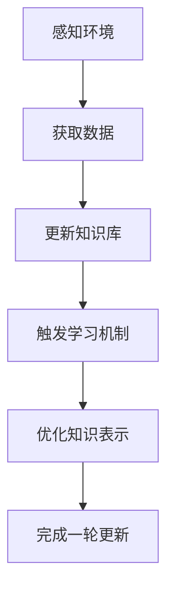
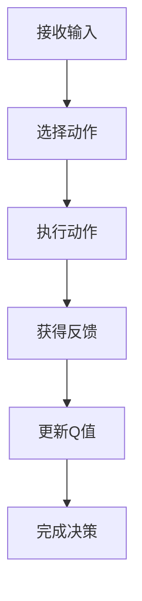
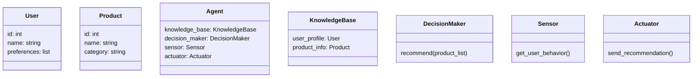
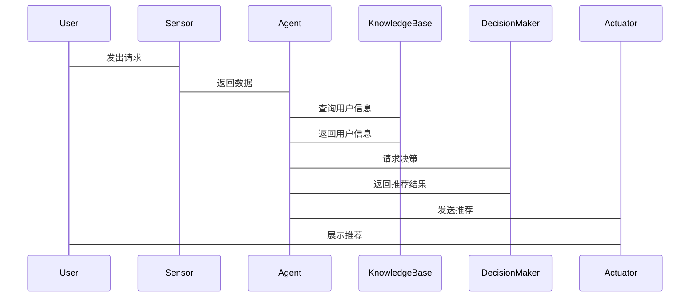

                 


# 构建具有自我演化能力的AI Agent系统

> 关键词：AI Agent, 自我演化, 知识表示, 行为决策, 强化学习

> 摘要：本文详细探讨了构建具有自我演化能力的AI Agent系统的各个方面，包括其核心概念、算法原理、数学模型、系统架构设计以及项目实战。文章从背景介绍开始，逐步深入，涵盖从理论到实践的全过程，旨在为读者提供一个全面而系统的指导。

---

## 第1章 AI Agent与自我演化能力概述

### 1.1 AI Agent的基本概念

#### 1.1.1 AI Agent的定义与特点
AI Agent（人工智能代理）是一种能够感知环境、自主决策并执行任务的智能实体。其核心特点包括自主性、反应性、目标导向性和社交能力。AI Agent能够通过传感器获取信息，利用知识库进行推理，并通过执行器与环境交互。

#### 1.1.2 自我演化能力的定义
自我演化能力是指AI Agent能够在运行过程中不断优化自身的知识库、行为策略和决策模型，以适应动态变化的环境。这种能力使得AI Agent能够从经验中学习，并在面对新问题时自适应调整。

#### 1.1.3 自我演化AI Agent的背景与意义
随着人工智能技术的发展，AI Agent的应用场景不断扩大。从智能助手到企业级决策支持系统，AI Agent的需求日益增长。然而，传统的静态AI Agent在面对复杂多变的环境时显得力不从心。因此，具有自我演化能力的AI Agent成为研究热点，其意义在于提高系统的适应性和智能性。

### 1.2 自我演化AI Agent的核心要素

#### 1.2.1 知识表示与学习机制
知识表示是AI Agent的核心，通常采用知识图谱或规则库。学习机制包括监督学习、无监督学习和强化学习，用于更新知识库。

#### 1.2.2 行为决策与执行机制
行为决策依赖于算法，如强化学习和遗传算法，用于在复杂环境中做出最优决策。执行机制则负责将决策转化为具体行动。

#### 1.2.3 自适应与优化机制
通过自适应算法，AI Agent能够实时调整参数和策略，确保在动态环境中保持高效运行。优化机制则通过反馈机制不断改进性能。

### 1.3 自我演化AI Agent的应用场景

#### 1.3.1 智能助手与个人代理
AI Agent可以作为个人助手，帮助用户处理日常事务，如日程管理、信息检索等。

#### 1.3.2 自动化系统与机器人
在工业自动化领域，自我演化AI Agent能够优化生产流程，提高效率。

#### 1.3.3 企业级智能决策支持
企业可以利用自我演化AI Agent进行市场分析、风险评估，提供决策支持。

### 1.4 本章小结
本章介绍了AI Agent的基本概念、自我演化能力的定义及其应用场景，为后续章节奠定了基础。

---

## 第2章 自我演化AI Agent的核心概念与联系

### 2.1 自我演化AI Agent的原理

#### 2.1.1 知识表示与更新机制
知识表示采用图结构或规则库，通过增量式学习和对比学习不断更新。

#### 2.1.2 行为决策与优化算法
强化学习和遗传算法用于行为决策，通过反馈不断优化策略。

#### 2.1.3 自我评估与改进策略
AI Agent通过自适应评估算法进行自我评估，并根据结果进行改进。

### 2.2 核心概念对比分析

#### 2.2.1 不同类型AI Agent的对比
| 类型            | 知识表示 | 学习机制 | 行为决策 |
|-----------------|----------|----------|----------|
| 静态AI Agent    | 固定规则 | 无       | 简单策略 |
| 动态AI Agent    | 知识库   | 监督学习 | 策略树    |
| 自我演化AI Agent| 知识图谱 | 增量式学习| 强化学习 |

#### 2.2.2 自我演化能力的层次分析
自我演化能力分为感知层、决策层和优化层，每一层都有其特定的功能和算法。

#### 2.2.3 知识表示与行为决策的关联
知识表示为行为决策提供基础，而行为决策的结果又反过来影响知识表示的更新。

### 2.3 实体关系图与流程图

#### 2.3.1 实体关系图（ER图）
```mermaid
erDiagram
    agent : AI Agent
    knowledge_base : 知识库
    environment : 环境
    sensor : 传感器
    actuator : 执行器
    decision_maker : 决策器

    agent --> sensor : 接收数据
    agent --> actuator : 发出指令
    agent --> decision_maker : 传递信息
    agent --> knowledge_base : 更新知识
```

#### 2.3.2 知识更新流程图（Mermaid）


---

## 第3章 自我演化AI Agent的算法原理

### 3.1 知识表示与学习算法

#### 3.1.1 知识图谱构建算法
知识图谱构建算法包括数据抽取、实体识别和关系抽取，利用图嵌入技术表示知识。

#### 3.1.2 增量式学习算法
增量式学习算法通过在线更新模型，适应新数据的变化。

#### 3.1.3 对比学习算法
对比学习通过对比不同样本的差异，提升模型的区分能力。

### 3.2 行为决策与优化算法

#### 3.2.1 强化学习算法（Q-learning）
Q-learning是一种经典的强化学习算法，通过Q值表更新策略，实现最优决策。

#### 3.2.2 遗传算法
遗传算法通过模拟自然选择，优化行为决策的参数。

#### 3.2.3 迁移学习算法
迁移学习算法将已有的知识迁移到新任务中，提高学习效率。

### 3.3 自我评估与改进算法

#### 3.3.1 自适应评估算法
自适应评估算法通过动态调整评估指标，确保评估结果的准确性。

#### 3.3.2 在线优化算法
在线优化算法实时调整模型参数，适应环境变化。

#### 3.3.3 分布式协作算法
分布式协作算法通过多代理协作，提高系统的整体性能。

### 3.4 算法流程图（Mermaid）

#### 3.4.1 知识更新流程图


#### 3.4.2 行为决策流程图


---

## 第4章 自我演化AI Agent的数学模型与公式

### 4.1 知识表示的数学模型

#### 4.1.1 知识图谱表示公式
知识图谱可以用图结构表示，节点表示实体，边表示关系。例如，$e1 - relatesTo - e2$ 表示实体 $e1$ 与 $e2$ 的关系。

#### 4.1.2 增量式学习公式
增量式学习的更新公式为：
$$ w_{new} = w_{old} + \alpha (y - \hat{y}) $$

#### 4.1.3 对比学习公式
对比学习的损失函数为：
$$ L = \frac{1}{N} \sum_{i=1}^{N} \log(1 + \exp(-y_i)) $$

### 4.2 行为决策的数学模型

#### 4.2.1 Q-l

---

## 第5章 系统分析与架构设计方案

### 5.1 问题场景介绍
在电商推荐系统中，AI Agent需要根据用户行为动态调整推荐策略。

### 5.2 系统功能设计

#### 5.2.1 领域模型类图


### 5.3 系统架构设计

#### 5.3.1 系统架构图


### 5.4 系统接口设计

#### 5.4.1 接口1：知识库接口
```python
class KnowledgeBase:
    def update_user_profile(self, user_data):
        pass
```

#### 5.4.2 接口2：决策器接口
```python
class DecisionMaker:
    def make_recommendation(self, user_id):
        pass
```

### 5.5 系统交互流程图（Mermaid）


---

## 第6章 项目实战

### 6.1 环境搭建

#### 6.1.1 安装Python和依赖库
```bash
pip install numpy
pip install matplotlib
pip install scikit-learn
```

### 6.2 系统核心实现源代码

#### 6.2.1 知识库实现
```python
class KnowledgeBase:
    def __init__(self):
        self.users = {}

    def update_user_profile(self, user_id, user_data):
        self.users[user_id] = user_data
```

#### 6.2.2 决策器实现
```python
class DecisionMaker:
    def __init__(self):
        self.products = []

    def make_recommendation(self, user_id, knowledge_base):
        user = knowledge_base.users[user_id]
        # 假设products是一个列表，根据用户偏好进行推荐
        return self.products[:5]
```

### 6.3 实际案例分析

#### 6.3.1 案例背景
在电商系统中，用户点击行为数据用于更新推荐策略。

#### 6.3.2 数据分析
通过分析用户点击数据，更新知识库中的用户偏好。

#### 6.3.3 系统优化
根据用户反馈优化推荐算法，提高推荐准确率。

### 6.4 项目小结
本章通过实际案例展示了如何在电商系统中应用自我演化AI Agent，详细讲解了环境搭建、代码实现和系统优化过程。

---

## 第7章 最佳实践、小结与注意事项

### 7.1 最佳实践

#### 7.1.1 数据质量
确保数据的准确性和完整性，避免噪声干扰。

#### 7.1.2 算法选择
根据具体场景选择合适的算法，避免盲目使用复杂模型。

#### 7.1.3 系统监控
实时监控系统性能，及时发现和解决问题。

### 7.2 小结
本文从理论到实践，详细探讨了构建具有自我演化能力的AI Agent系统的各个方面，提供了丰富的代码示例和实际案例。

### 7.3 注意事项

#### 7.3.1 数据隐私
注意保护用户数据隐私，遵守相关法律法规。

#### 7.3.2 系统安全
确保系统安全，防止恶意攻击。

#### 7.3.3 性能优化
在优化系统性能的同时，注意平衡资源消耗。

### 7.4 拓展阅读
推荐阅读《强化学习实战》和《分布式系统设计》等书籍，深入了解相关知识。

---

## 作者

作者：AI天才研究院/AI Genius Institute & 禅与计算机程序设计艺术 /Zen And The Art of Computer Programming

---

本文通过详细讲解构建具有自我演化能力的AI Agent系统的各个方面，为读者提供了从理论到实践的全面指导。希望本文能够帮助读者更好地理解和应用这一技术。

