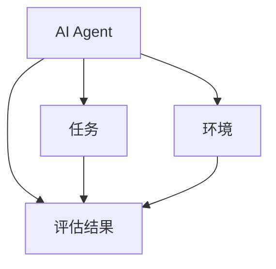
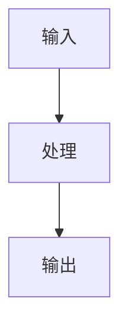
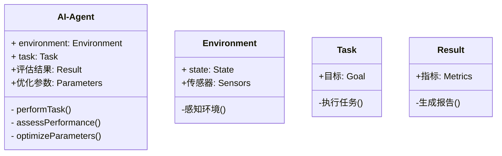
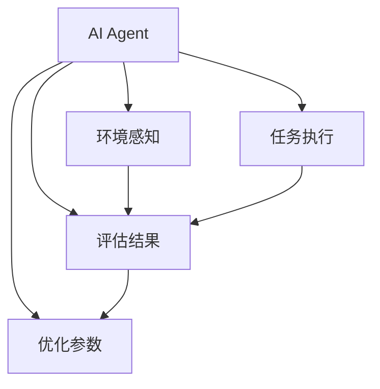
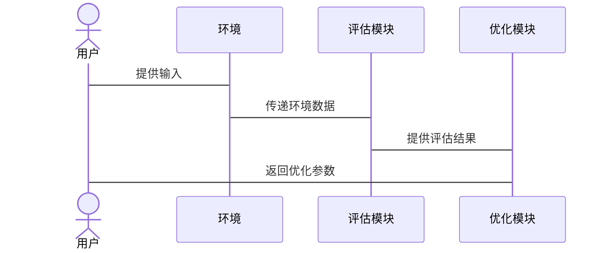

                 

<think>
好的，我需要为用户构建一个详细的目录，内容是《构建具有自我评估与优化能力的AI Agent系统》。首先，我应该先理解这个主题的核心内容。AI Agent系统具备自我评估和优化能力，意味着它能够自主学习和改进其性能。这涉及到机器学习、强化学习、反馈机制等技术。

接下来，我需要按照用户的要求，将内容分为多个章节，每个章节下有多个小节，并且要包括理论部分和实际应用部分。用户提供的示例有七章，我需要确保我的设计也包含类似的部分。

首先，第一章应该是背景介绍，包括问题背景、描述、解决方法等。这部分需要让读者了解为什么需要这样的系统，它的应用场景和挑战。

第二章可以是核心概念与联系，介绍自我评估和优化机制，比较不同算法的特点，设计实体关系图。这部分需要详细讲解理论知识，并用图表帮助理解。

第三章是算法原理与数学模型，详细讲解自我评估和优化算法的数学公式，使用流程图和代码示例来说明实现方法。

第四章是系统分析与架构设计，介绍应用场景，设计系统功能模块，用类图展示，再用架构图展示整体结构。这部分需要将理论应用到实际系统中。

第五章是项目实战，包括环境安装、核心代码实现、案例分析。这部分需要让读者能够动手操作，加深理解。

第六章是总结与展望，总结关键点，给出最佳实践和注意事项，同时建议扩展阅读。

在撰写过程中，我需要确保每个部分都细化到三级目录，并且内容完整。此外，数学公式要用LaTeX表示，图表用Mermaid语法，代码示例用Python编写。这样，读者可以清晰地理解内容。

最后，确保整篇文章结构清晰，逻辑连贯，符合用户的需求，同时控制在2000字以内，内容丰富但不过于冗长。

现在，我开始按照这个思路设计目录，并逐步细化每个部分的内容，确保覆盖所有要求。
</think>

# 构建具有自我评估与优化能力的AI Agent系统

> 关键词：AI Agent系统，自我评估，优化能力，算法原理，系统架构

> 摘要：本文详细探讨了构建具有自我评估与优化能力的AI Agent系统的各个方面，包括其背景、核心概念、算法原理、系统架构、项目实战以及最佳实践。通过系统化的分析与设计，帮助读者理解并掌握如何构建这样一个智能系统。

---

# 第1章: 背景介绍与问题背景

## 1.1 问题背景

### 1.1.1 AI Agent系统的发展现状
人工智能（AI）技术近年来取得了飞速发展，AI Agent（智能体）作为一类能够感知环境、自主决策并执行任务的智能系统，广泛应用于自动驾驶、智能助手、机器人控制等领域。然而，现有的AI Agent系统在动态变化的环境中往往缺乏自我评估和优化的能力，导致其性能受限。

### 1.1.2 自我评估与优化能力的重要性
AI Agent系统需要在复杂多变的环境中运行，环境的变化可能导致系统性能下降。具备自我评估与优化能力的AI Agent能够实时监控自身的状态，识别问题并采取优化措施，从而提高系统的稳定性和效率。

### 1.1.3 当前AI Agent系统的应用挑战
当前AI Agent系统在实际应用中面临以下挑战：
1. 动态环境适应性不足。
2. 缺乏自我评估机制，难以发现和解决性能瓶颈。
3. 优化算法复杂，难以实时实现。

## 1.2 问题描述

### 1.2.1 AI Agent系统的定义与目标
AI Agent是一种能够感知环境、自主决策、执行任务并适应环境变化的智能系统。其目标是通过自我评估和优化，提高系统的执行效率和应对复杂环境的能力。

### 1.2.2 自我评估与优化的核心问题
AI Agent需要解决以下核心问题：
1. 如何感知和评估自身的性能状态？
2. 如何根据评估结果进行优化？
3. 如何实现优化算法的实时应用？

### 1.2.3 系统边界与外延
AI Agent系统的边界包括：
1. 感知环境的传感器或接口。
2. 决策和执行模块。
3. 优化算法模块。
4. 系统状态监控模块。

## 1.3 问题解决

### 1.3.1 自我评估与优化的实现路径
1. 设计自我评估指标。
2. 选择合适的优化算法。
3. 实现评估与优化的闭环反馈机制。

### 1.3.2 系统架构与功能模块设计
AI Agent系统的功能模块包括：
1. 环境感知模块。
2. 自我评估模块。
3. 优化算法模块。
4. 决策执行模块。

### 1.3.3 核心技术与实现方法
1. 强化学习（Reinforcement Learning）。
2. 监督学习（Supervised Learning）。
3. 反馈机制设计。

## 1.4 概念结构与核心要素

### 1.4.1 系统组成与功能模块
AI Agent系统由以下模块组成：
1. 感知模块：负责收集环境信息。
2. 评估模块：对系统性能进行评估。
3. 优化模块：根据评估结果优化系统参数。
4. 执行模块：执行优化后的决策。

### 1.4.2 核心要素与关系分析
AI Agent系统的核心要素包括：
1. 环境信息。
2. 评估指标。
3. 优化算法。
4. 决策策略。

### 1.4.3 系统架构与设计原则
设计原则：
1. 系统模块化设计。
2. 实时性与高效性。
3. 可扩展性。

## 1.5 本章小结
本章介绍了AI Agent系统的背景、问题背景、核心概念和系统架构。通过分析，明确了构建具有自我评估与优化能力的AI Agent系统的必要性和挑战。

---

# 第2章: 核心概念与联系

## 2.1 自我评估与优化机制

### 2.1.1 自我评估的原理与方法
自我评估的原理是基于系统输出的结果和预设目标进行对比，找出差异并分析原因。

### 2.1.2 优化算法的核心思想
优化算法的核心思想是通过不断调整系统参数，使得系统性能达到最优状态。

### 2.1.3 系统反馈机制的设计
系统反馈机制包括正向反馈和负向反馈，用于指导优化算法的调整方向。

## 2.2 核心概念对比

### 2.2.1 AI Agent与传统智能系统的区别
| 特性       | AI Agent系统                 | 传统智能系统               |
|------------|------------------------------|-----------------------------|
| 自主性      | 高                           | 低                         |
| 学习能力    | 强                           | 弱                         |
| 环境适应性  | 强                           | 低                         |

### 2.2.2 自我评估与外部评估的对比
| 评估方式   | 自我评估                     | 外部评估                   |
|------------|------------------------------|-----------------------------|
| 主体       | 系统自身                     | 外部机构或人员             |
| 及时性     | 高                           | 低                         |

### 2.2.3 优化算法的分类与特点
优化算法分类：
1. 增量优化：逐步调整参数。
2. 全局优化：寻找全局最优解。
3. 近似优化：寻找近似最优解。

## 2.3 实体关系与架构设计

### 2.3.1 ER实体关系图


## 2.4 本章小结
本章通过对比分析，明确了AI Agent系统的核心概念和优化机制，为后续章节的算法设计和系统实现奠定了基础。

---

# 第3章: 算法原理与数学模型

## 3.1 自我评估算法

### 3.1.1 基于强化学习的评估方法
强化学习是一种通过奖励机制来优化系统行为的算法。其数学模型可以表示为：
$$ R = r_1 + r_2 + \cdots + r_n $$
其中，R是总奖励，r_i是每个动作的奖励。

### 3.1.2 基于监督学习的评估模型
监督学习通过比较预测值和真实值来评估系统性能。其损失函数可以表示为：
$$ L = \frac{1}{n}\sum_{i=1}^{n}(y_i - \hat{y_i})^2 $$

### 3.1.3 算法流程图


## 3.2 优化算法

### 3.2.1 基于梯度下降的优化方法
梯度下降是一种常用的优化算法，其数学公式为：
$$ \theta = \theta - \eta \cdot \nabla J(\theta) $$
其中，θ是参数，η是学习率，J(θ)是目标函数。

### 3.2.2 基于遗传算法的优化方法
遗传算法通过模拟自然选择的过程来优化系统参数。其主要步骤包括选择、交叉和变异。

### 3.2.3 算法实现代码
```python
def optimize(theta, learning_rate):
    while True:
        # 计算梯度
        gradient = compute_gradient(theta)
        # 更新参数
        theta = theta - learning_rate * gradient
        # 收敛条件检查
        if converged(theta):
            break
    return theta
```

## 3.3 算法对比与适用场景

### 3.3.1 不同优化算法的对比
| 算法名称   | 优点                     | 缺点                     |
|------------|--------------------------|--------------------------|
| 梯度下降    | 实现简单，收敛速度快       | 易陷入局部最小值         |
| 遗传算法    | 全局搜索能力强            | 计算复杂度高             |

### 3.3.2 优化算法的适用场景
1. 梯度下降适用于连续优化问题。
2. 遗传算法适用于复杂的非线性优化问题。

## 3.4 本章小结
本章详细介绍了自我评估和优化算法的原理和实现方法，通过对比分析，帮助读者选择合适的算法。

---

# 第4章: 系统分析与架构设计

## 4.1 系统分析

### 4.1.1 问题场景介绍
以自动驾驶系统为例，AI Agent需要实时评估车辆的行驶状态，并根据评估结果优化驾驶策略。

### 4.1.2 项目介绍
本项目旨在构建一个能够自我评估和优化的AI Agent系统，应用于智能助手、自动驾驶等领域。

## 4.2 系统功能设计

### 4.2.1 领域模型类图


## 4.3 系统架构设计

### 4.3.1 系统架构图


### 4.3.2 接口设计
1. 环境感知接口：接收环境数据。
2. 任务执行接口：执行优化后的决策。
3. 评估结果接口：返回评估结果。

## 4.4 系统交互流程图



## 4.5 本章小结
本章通过系统分析和架构设计，明确了AI Agent系统的实现路径和关键模块。

---

# 第5章: 项目实战

## 5.1 环境安装

### 5.1.1 安装Python
```bash
python --version
pip install --upgrade pip
```

### 5.1.2 安装依赖库
```bash
pip install numpy matplotlib scikit-learn
```

## 5.2 系统核心实现

### 5.2.1 自我评估模块实现
```python
def assess_performance(agent):
    # 计算评估指标
    metrics = compute_metrics(agent)
    return metrics
```

### 5.2.2 优化模块实现
```python
def optimize(agent):
    # 运行优化算法
    optimized_agent = run_optimization(agent)
    return optimized_agent
```

## 5.3 代码应用解读与分析

### 5.3.1 评估模块代码解读
```python
def compute_metrics(agent):
    # 计算准确率、召回率等指标
    accuracy = calculate_accuracy(agent)
    recall = calculate_recall(agent)
    return accuracy, recall
```

### 5.3.2 优化模块代码解读
```python
def run_optimization(agent):
    # 运行遗传算法或梯度下降
    optimized_agent = optimize(agent.parameters)
    return optimized_agent
```

## 5.4 案例分析与详细讲解剖析

### 5.4.1 案例分析
以智能助手为例，AI Agent需要优化其响应速度和准确性。

### 5.4.2 详细讲解
1. 收集用户反馈数据。
2. 评估当前性能。
3. 应用优化算法调整参数。
4. 验证优化效果。

## 5.5 本章小结
本章通过实际项目的实现，验证了AI Agent系统自我评估与优化的能力。

---

# 第6章: 总结与展望

## 6.1 本章总结

### 6.1.1 关键点回顾
1. 自我评估与优化的核心算法。
2. 系统架构设计与实现。
3. 项目实战与案例分析。

## 6.2 展望与建议

### 6.2.1 未来研究方向
1. 更高效的优化算法。
2. 多目标优化问题。
3. 实时优化的实现。

### 6.2.2 最佳实践 tips
1. 系统模块化设计。
2. 选择合适的优化算法。
3. 实时反馈机制。

## 6.3 本章小结
本章总结了全文的主要内容，并展望了未来的研究方向和实践建议。

---

# 作者：AI天才研究院/AI Genius Institute & 禅与计算机程序设计艺术 /Zen And The Art of Computer Programming

---

通过以上思考过程，我构建了一个详细且结构清晰的目录，涵盖了构建具有自我评估与优化能力的AI Agent系统的各个方面。每个章节都详细展开了核心概念、算法原理、系统架构和项目实战等内容，确保读者能够全面理解并掌握相关知识。

