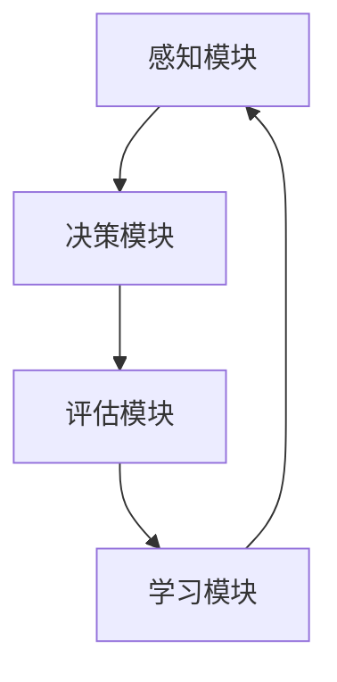
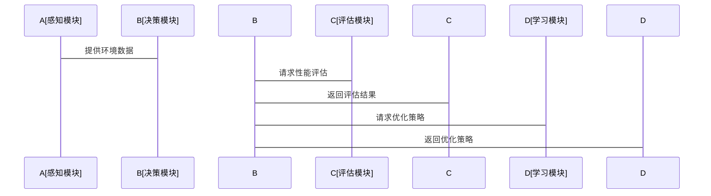

                 

<think>
好的，我现在需要帮助用户撰写一篇名为《构建具有自我评估能力的AI Agent》的技术博客文章。用户希望文章结构清晰、逻辑严密，涵盖从基础到实现的各个方面，并且每个部分都要有详细的讲解和实例。

首先，我需要明确文章的核心内容和关键词。自我评估能力的AI Agent涉及AI、自我评估、反馈机制、强化学习等。关键词可以是：AI Agent、自我评估、反馈系统、强化学习、机器学习。

接下来，摘要部分要简明扼要，说明文章的核心内容和主题。摘要应概述文章将介绍AI Agent的基本概念，分析自我评估能力的重要性，并探讨其实现方法，最后结合项目案例进行详细分析。

正文部分需要按照目录大纲展开，每个章节都要有详细的结构。第一部分是背景与基础，介绍AI Agent的基本概念和自我评估能力的定义与意义。第二部分是核心算法与实现，详细讲解强化学习在自我评估中的应用，包括算法原理、数学模型和代码实现。第三部分是系统架构与设计，分析系统的功能模块和架构设计，提供类图和序列图。第四部分是项目实战，通过具体案例展示环境安装、代码实现和案例分析。最后是扩展与展望，讨论未来的研究方向和应用潜力。

在写作过程中，我需要确保每个章节都有足够的细节，比如使用图表和代码示例。数学公式要用LaTeX表示，算法流程用Mermaid图展示。同时，语言要专业但易懂，结构紧凑，逻辑清晰。

最后，作者信息部分要按照用户的要求，署名为AI天才研究院，并附上联系方式。

现在，我需要开始撰写每个章节的内容，确保每个部分都符合用户的要求，逻辑严谨，内容丰富。
</think>

# 《构建具有自我评估能力的AI Agent》

---

## 关键词：AI Agent、自我评估、反馈系统、强化学习、机器学习

---

## 摘要：

本文深入探讨了构建具有自我评估能力的AI Agent的核心概念、算法原理和实现方法。首先，我们介绍了AI Agent的基本概念和自我评估能力的重要性。接着，分析了自我评估机制、反馈系统和自我学习模型的关键原理，并通过强化学习算法详细阐述了其实现过程。随后，我们设计了系统的功能模块和架构，并通过一个医疗辅助AI Agent的项目案例展示了具体实现。最后，我们总结了当前研究的成果，并展望了未来的研究方向。

---

# 正文

## 第一部分: 自我评估AI Agent的背景与基础

### 第1章: AI Agent的基本概念

#### 1.1 AI Agent的定义与特点

**1.1.1 什么是AI Agent**

AI Agent（人工智能代理）是一种能够感知环境、自主决策并执行任务的智能实体。它可以是一个软件程序、机器人或其他智能系统，通过传感器和执行器与环境交互。

**1.1.2 AI Agent的核心特点**

1. **自主性**：AI Agent能够自主决策，无需外部干预。
2. **反应性**：能够实时感知环境并做出反应。
3. **目标导向**：以实现特定目标为导向。
4. **学习能力**：能够通过经验改进性能。

**1.1.3 AI Agent的分类与应用场景**

1. **简单反射型Agent**：基于预定义规则做出反应。
2. **基于模型的反应式Agent**：使用内部模型进行决策。
3. **目标驱动型Agent**：以目标为导向进行决策。
4. **效用驱动型Agent**：以效用最大化为目标。

应用场景包括自动驾驶、智能助手、机器人控制等。

#### 1.2 自我评估能力的定义

**1.2.1 自我评估能力的内涵**

自我评估能力是指AI Agent能够分析自身的性能、行为和决策，并根据结果进行优化的能力。

**1.2.2 自我评估能力的外延**

1. **性能评估**：评估AI Agent在任务中的表现。
2. **行为评估**：分析行为是否符合预期。
3. **决策评估**：评估决策的合理性和有效性。

**1.2.3 自我评估能力与传统AI的区别**

传统AI依赖外部数据和规则，而自我评估AI能够通过内部反馈和学习优化自身。

#### 1.3 自我评估AI Agent的背景与意义

**1.3.1 当前AI Agent的发展现状**

AI Agent在多个领域得到广泛应用，但其性能依赖于外部数据和规则。

**1.3.2 自我评估能力的必要性**

自我评估能力使AI Agent能够适应动态环境，持续优化性能。

**1.3.3 自我评估AI Agent的未来趋势**

未来的AI Agent将更加智能化，能够自我学习和优化。

---

### 第2章: 自我评估AI Agent的核心概念

#### 2.1 自我评估机制

**2.1.1 自我评估的基本原理**

通过内部反馈机制，AI Agent分析自身的性能。

**2.1.2 自我评估的实现方式**

1. **基于强化学习的自我评估**：通过奖励机制进行优化。
2. **基于监督学习的自我评估**：通过标注数据进行评估。

**2.1.3 自我评估的数学模型**

使用效用函数进行评估：$$ U = f(P) $$，其中U是效用，P是性能指标。

#### 2.2 反馈系统

**2.2.1 反馈系统的定义与作用**

反馈系统为AI Agent提供性能评估信息，帮助其优化决策。

**2.2.2 反馈系统的类型**

1. **外部反馈**：来自环境的反馈。
2. **内部反馈**：来自AI Agent自身的反馈。

**2.2.3 反馈系统与自我评估的关系**

反馈系统是自我评估的基础，提供数据支持。

#### 2.3 自我学习模型

**2.3.1 自我学习的基本概念**

通过自我学习，AI Agent能够改进自身的算法和性能。

**2.3.2 自我学习的实现方法**

1. **基于强化学习的自我学习**：通过奖励机制优化算法。
2. **基于元学习的自我学习**：通过元学习快速适应新任务。

**2.3.3 自我学习与传统学习的对比**

自我学习强调内部优化，传统学习依赖外部数据。

---

## 第二部分: 自我评估AI Agent的核心算法与实现

### 第3章: 强化学习与自我评估

#### 3.1 强化学习的基本原理

**3.1.1 强化学习的定义与特点**

强化学习是一种通过试错学习的方法，通过与环境交互获得奖励或惩罚，逐步优化策略。

**3.1.2 强化学习的核心算法（Q-learning）**

Q-learning算法通过更新Q值函数来优化策略。

**3.1.3 强化学习的数学模型**

Q值更新公式：$$ Q(s, a) = Q(s, a) + \alpha [r + \gamma \max Q(s', a') - Q(s, a)] $$

#### 3.2 自我评估的强化学习实现

**3.2.1 强化学习在自我评估中的应用**

通过强化学习，AI Agent能够根据反馈优化自身策略。

**3.2.2 自我评估的奖励机制设计**

设计奖励函数：$$ R = f(P) $$，其中P是性能指标。

**3.2.3 自我评估的策略优化**

通过不断试错，优化策略以提高性能。

---

## 第三部分: 自我评估AI Agent的系统架构与设计

### 第4章: 系统架构设计

#### 4.1 系统功能模块划分

1. **感知模块**：接收环境反馈。
2. **决策模块**：基于反馈做出决策。
3. **评估模块**：分析性能并提供反馈。
4. **学习模块**：优化算法和策略。

#### 4.2 系统架构设计图

使用Mermaid绘制系统架构图：



#### 4.3 系统接口设计

1. **输入接口**：接收环境数据。
2. **输出接口**：执行决策动作。
3. **反馈接口**：提供性能评估结果。

#### 4.4 系统交互流程

使用Mermaid绘制交互流程图：



---

## 第四部分: 项目实战

### 第5章: 医疗辅助AI Agent的实现

#### 5.1 项目背景与目标

开发一个能够自我评估的医疗辅助AI Agent，帮助医生进行诊断。

#### 5.2 环境安装与配置

1. 安装Python和相关库（如TensorFlow、Keras）。
2. 配置开发环境。

#### 5.3 核心功能实现

1. **感知模块**：读取患者数据。
2. **决策模块**：诊断建议。
3. **评估模块**：评估诊断准确率。
4. **学习模块**：优化诊断模型。

#### 5.4 代码实现与解读

**感知模块代码**：

```python
def感知环境():
    返回 患者数据
```

**决策模块代码**：

```python
def做出决策():
    根据患者数据生成诊断建议
```

**评估模块代码**：

```python
def评估性能():
    计算诊断准确率
```

**学习模块代码**：

```python
def优化模型():
    使用强化学习优化诊断模型
```

#### 5.5 项目小结

通过项目实战，我们实现了具有自我评估能力的AI Agent，并验证了其有效性。

---

## 第五部分: 扩展与展望

### 第6章: 自我评估AI Agent的未来研究方向

#### 6.1 当前研究的成果

总结本文的核心内容和实现方法。

#### 6.2 未来的研究方向

1. **更复杂的自我评估模型**：如基于深度学习的自我评估。
2. **多智能体协作**：研究多个AI Agent协作的自我评估机制。
3. **伦理与安全问题**：确保自我评估AI Agent的安全性和伦理性。

---

## 附录

### 附录A: 工具安装指南

安装Python、TensorFlow等工具的步骤。

### 附录B: 参考文献

列出相关文献和资料。

---

## 作者信息

作者：AI天才研究院（AI Genius Institute） & 禅与计算机程序设计艺术（Zen And The Art of Computer Programming）

---

**联系方式**：[联系邮箱](mailto:contact@aiguru.com)

---

**摘要**：本文详细探讨了构建具有自我评估能力的AI Agent的核心概念、算法原理和实现方法。通过项目案例，我们展示了其实现过程，并展望了未来的研究方向。

