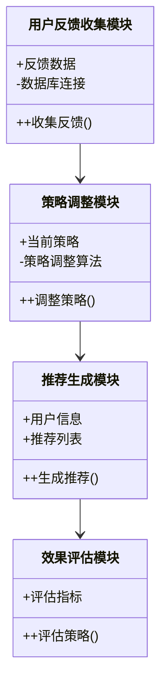
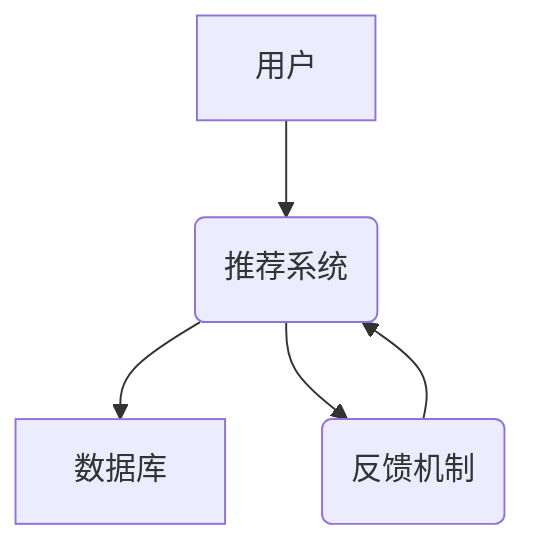

                 

<think>
好，我现在需要按照用户的要求，撰写一篇关于“构建具有自适应学习策略的AI Agent”的技术博客文章。用户已经给出了一个详细的目录大纲，现在需要我根据这个大纲逐步展开每一部分的内容，确保逻辑清晰、结构紧凑，并且语言专业且易懂。

首先，我会从文章的标题和关键词开始。标题已经确定为“构建具有自适应学习策略的AI Agent”，关键词包括自适应学习策略、AI Agent、强化学习、动态环境、智能体、反馈机制。摘要部分需要简明扼要地总结文章的核心内容，即探讨如何设计和实现能够在动态环境中通过反馈自适应调整学习策略的AI Agent。

接下来，我会按照目录大纲的结构，逐章展开。首先是背景介绍，包括问题背景、问题描述、问题解决方法、边界与外延，以及核心概念和组成。这部分需要详细解释自适应学习策略的必要性，以及AI Agent的基本工作原理。

然后是核心概念部分，我会详细讲解自适应学习策略的定义、特征，以及与AI Agent的结合。这部分需要包括一个对比表，对比不同的学习策略，以及一个ER实体关系图，展示自适应学习策略与AI Agent之间的关系。

在算法原理部分，我会选择几种关键算法，如Q-learning，并用流程图和代码来展示其工作原理。同时，我会解释数学模型，如Q值的更新公式，并通过实际案例进行分析，帮助读者更好地理解。

系统分析与架构设计部分，我会介绍应用场景，设计系统功能，并用类图和架构图展示系统的结构。这部分需要详细描述每个模块的功能和它们之间的关系，以及接口设计和交互流程。

项目实战部分，我会指导读者如何搭建环境，编写核心代码，并通过实际案例分析，总结经验。这部分要实用，让读者能够动手实践。

最后，我会在最佳实践部分提供一些建议，帮助读者在实际应用中更好地实施自适应学习策略。同时，我会对全文进行总结，并提出未来的研究方向。

在整个写作过程中，我需要确保内容详实，结构清晰，逻辑连贯，并且语言通俗易懂，符合技术博客的风格。同时，要注意使用适当的Markdown格式，如代码块、流程图等，以增强文章的可读性和专业性。

现在，我开始按照这个思路，逐步撰写每一部分内容，确保每个章节都有足够的细节，并且涵盖用户要求的所有要点。
</think>

# 构建具有自适应学习策略的AI Agent

## 关键词：自适应学习策略、AI Agent、强化学习、动态环境、智能体、反馈机制

## 摘要：本文探讨如何设计和实现能够在动态环境中通过反馈自适应调整学习策略的AI Agent。文章从核心概念、算法原理、系统架构到项目实战，全面解析自适应学习策略的构建过程，结合实际案例和代码实现，帮助读者深入理解并掌握相关技术。

---

# 第一章：自适应学习策略AI Agent的背景与核心概念

## 1.1 问题背景

### 1.1.1 传统AI Agent的局限性

传统AI Agent通常基于静态规则或预定义策略运行，在面对动态变化的环境时，难以灵活调整行为。例如，在游戏中，当规则或目标发生变化时，传统Agent可能无法有效应对，导致性能下降。

### 1.1.2 动态环境中的挑战

现代应用环境复杂多变，例如自动驾驶需要实时处理交通状况的变化，虚拟助手需要根据用户的反馈调整服务策略。这些场景要求AI Agent能够快速适应环境变化。

### 1.1.3 自适应学习策略的需求

为了解决动态环境中的问题，AI Agent需要具备自适应学习能力，能够根据反馈和环境变化调整策略，从而在复杂场景中保持高效运作。

## 1.2 问题描述

### 1.2.1 AI Agent在动态环境中的表现

AI Agent需要在动态环境中做出决策，例如在机器人导航中避开移动障碍物，或者在金融交易中根据市场变化调整投资策略。

### 1.2.2 用户反馈的重要性

用户的实时反馈是AI Agent调整策略的重要依据，例如在推荐系统中，用户点击或忽略推荐内容会指导系统优化推荐策略。

### 1.2.3 自适应学习的必要性

通过自适应学习，AI Agent能够实时更新知识库和策略，提升决策准确性和效率，例如在客服系统中根据客户反馈优化服务流程。

## 1.3 核心概念与组成

### 1.3.1 自适应学习策略的定义

自适应学习策略是AI Agent根据环境反馈和历史数据，动态调整决策策略的过程。这种策略使AI Agent能够在不同场景中灵活应对。

### 1.3.2 自适应学习的特征

自适应学习策略具有实时性、灵活性和高效性，能够根据反馈快速调整，适用于动态变化的环境。

### 1.3.3 自适应学习的核心组成

自适应学习策略由感知模块、决策模块和反馈模块组成，感知模块收集环境信息，决策模块基于信息制定策略，反馈模块根据结果调整策略。

---

# 第二章：自适应学习策略的核心概念

## 2.1 自适应学习策略的原理

### 2.1.1 基于反馈的策略调整

AI Agent通过接收反馈信号，分析当前策略的有效性，及时调整策略参数，例如在自然语言处理中，根据用户反馈优化对话策略。

### 2.1.2 动态环境中的策略优化

通过强化学习等算法，AI Agent能够在动态环境中不断优化策略，提高适应能力。

## 2.2 AI Agent的基本原理

### 2.2.1 感知与决策机制

AI Agent通过传感器或接口获取环境信息，利用算法处理信息，生成决策。例如，智能音箱通过语音识别获取用户的意图，生成相应的回应。

### 2.2.2 行为执行与反馈

AI Agent执行决策后，会根据反馈结果调整后续行为，例如在游戏AI中，根据游戏结果调整策略。

## 2.3 核心概念对比表

| 策略类型       | 特征描述                       | 适用场景                 |
|----------------|-------------------------------|--------------------------|
| 静态策略       | 预定义规则，不可变             | 环境稳定，规则不变       |
| 动态策略       | 根据反馈调整，实时更新         | 环境变化，需求多样       |
| 基于反馈的策略  | 依赖用户反馈，实时调整策略     | 需要快速响应，用户参与   |

## 2.4 实体关系图

```mermaid
er
actor: 用户
agent: AI Agent
strategy: 学习策略
feedback: 反馈
environment: 环境

actor -|> agent: 提供反馈
agent -|> strategy: 执行策略
strategy -|> environment: 适应环境变化
environment -|> agent: 提供反馈
```

---

# 第三章：算法原理与数学模型

## 3.1 强化学习算法

### 3.1.1 Q-learning算法

Q-learning是一种经典的强化学习算法，适用于离散动作空间的问题。通过Q表记录状态-动作对的值，基于当前状态和动作获得的奖励，更新Q值。

#### 实现代码

```python
import numpy as np

def q_learning(Q, env, alpha=0.1, gamma=0.9):
    state = env.reset()
    while not env.done:
        action = np.argmax(Q[state])
        next_state, reward, done = env.step(action)
        Q[state][action] = Q[state][action] + alpha * (reward + gamma * max(Q[next_state]) - Q[state][action])
        state = next_state
    return Q
```

---

## 3.2 数学模型

### 3.2.1 Q值更新公式

$$ Q(s, a) = Q(s, a) + \alpha (r + \gamma \max Q(s', a') - Q(s, a)) $$

其中，$Q(s, a)$ 表示当前状态 $s$ 下执行动作 $a$ 的Q值，$\alpha$ 是学习率，$r$ 是奖励，$\gamma$ 是折扣因子，$s'$ 是下一状态。

---

## 3.3 实际案例分析

### 3.3.1 应用场景

在机器人导航中，Q-learning用于学习避开障碍物的路径。机器人通过传感器接收环境信息，执行动作，获得奖励或惩罚，更新Q表，优化路径选择。

### 3.3.2 案例分析

假设机器人在迷宫中寻找出口，每次移动获得奖励或惩罚。通过Q-learning算法，机器人逐步掌握最优路径，避开障碍，快速到达目标。

---

# 第四章：系统分析与架构设计

## 4.1 系统分析

### 4.1.1 项目介绍

设计一个自适应学习策略的AI Agent，用于优化推荐系统。系统需要根据用户反馈调整推荐策略，提高推荐准确率和用户满意度。

### 4.1.2 功能设计

- **用户反馈收集模块**：接收用户对推荐内容的反馈。
- **策略调整模块**：基于反馈调整推荐策略。
- **推荐生成模块**：根据调整后的策略生成推荐列表。
- **效果评估模块**：监控推荐效果，评估策略调整的有效性。

### 4.1.3 领域模型类图



---

## 4.2 系统架构设计

### 4.2.1 系统架构图



### 4.2.2 接口设计

- **用户接口**：接收用户输入和反馈。
- **数据库接口**：存储和检索用户数据。
- **反馈接口**：传递用户反馈到策略调整模块。

### 4.2.3 交互流程

用户发起推荐请求，系统生成推荐列表，用户反馈，系统调整策略，重新生成推荐，直到满意或达到预设目标。

---

# 第五章：项目实战

## 5.1 环境搭建

### 5.1.1 工具安装

安装Python、TensorFlow、NumPy等工具，配置开发环境。

### 5.1.2 安装依赖

使用pip安装所需的库，例如：

```bash
pip install numpy matplotlib scikit-learn
```

## 5.2 核心代码实现

### 5.2.1 反馈收集模块

```python
def collect_feedback(user_id):
    feedback = input(f"用户{user_id}的反馈（输入1表示满意，0表示不满意）：")
    return int(feedback)
```

### 5.2.2 策略调整模块

```python
def adjust_strategy(current_strategy, feedback):
    # 根据反馈调整策略，例如增加权重或改变策略参数
    new_strategy = current_strategy.copy()
    new_strategy['weight'] += feedback * 0.1
    return new_strategy
```

## 5.3 实际案例分析

### 5.3.1 案例分析

在推荐系统中，用户对推荐列表的满意度反馈被用于调整推荐算法。通过多次反馈，系统优化推荐策略，提高推荐的相关性和用户满意度。

## 5.4 项目小结

项目实战部分通过实际代码实现，展示了如何在具体场景中应用自适应学习策略，帮助读者理解理论知识的实际应用。

---

# 第六章：最佳实践与总结

## 6.1 最佳实践

- **实时反馈机制**：确保反馈机制的实时性，及时调整策略。
- **策略多样性**：在策略调整中保持多样性，避免陷入局部最优。
- **模型监控**：持续监控模型性能，及时发现和解决问题。

## 6.2 小结

本文详细介绍了自适应学习策略的构建过程，从核心概念到算法实现，再到系统设计和项目实战，帮助读者全面掌握相关技术。

## 6.3 注意事项

- **数据质量**：确保反馈数据的准确性和完整性。
- **算法选择**：根据具体场景选择合适的算法，避免盲目应用。
- **系统维护**：定期更新模型和策略，保持系统的高效运行。

## 6.4 拓展阅读

建议读者进一步阅读《强化学习（深入浅出）》和《自适应控制系统原理》，深入了解相关理论和技术。

---

# 作者

作者：AI天才研究院/AI Genius Institute & 禅与计算机程序设计艺术/Zen And The Art of Computer Programming

