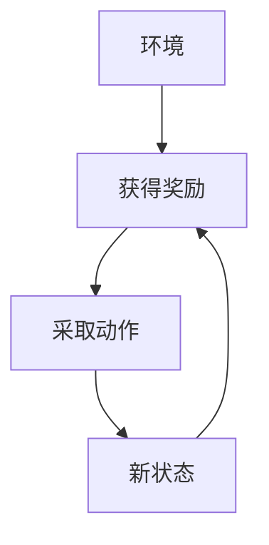

                 

<think>
好的，我需要根据用户的要求，撰写一篇关于《构建具有自适应学习能力的AI Agent》的技术博客文章。首先，我需要明确用户的需求和要求。

用户希望文章结构清晰，逻辑紧凑，使用专业但易懂的技术语言。文章需要涵盖自适应学习AI Agent的背景、算法原理、系统架构设计、项目实战以及高级主题。用户还特别强调要使用详细的章节划分，每个部分都要有丰富的讲解和具体的内容。

首先，我会从文章的标题和关键词开始。标题已经给出，关键词需要包含核心概念，比如自适应学习、AI Agent、强化学习、在线学习、系统架构等。摘要部分需要简明扼要地概括文章的核心内容，包括背景、重要性以及文章的主要结构。

接下来，按照目录大纲，依次撰写每个章节的内容。第一章是自适应学习AI Agent的背景与概念，我需要先定义AI Agent和自适应学习，然后介绍其重要性，并列举应用场景。这部分需要确保读者能够理解什么是AI Agent，以及为什么自适应学习能力如此关键。

第二章是自适应学习的核心算法。这里我需要详细介绍强化学习和在线学习的算法，包括Q-learning和策略梯度算法。同时，还需要解释这些算法的数学模型和公式，例如Q-learning的更新公式，以及策略梯度的基本原理。为了更好地理解，我需要通过例子和图示来说明这些算法的工作机制。

第三章是系统架构设计。我需要讨论如何设计一个支持自适应学习的AI Agent系统，包括系统的模块划分、架构图和接口设计。这部分可能需要使用Mermaid图来展示类图和序列图，以便读者更直观地理解系统结构。

第四章是项目实战，我会选择一个具体的案例，比如在智能推荐系统中的应用，详细讲解环境搭建、算法实现和案例分析。这部分需要包括代码示例和详细的实现步骤，帮助读者理解如何将理论应用到实际中。

第五章是高级主题，探讨模型可解释性、多智能体协作以及安全与伦理问题。这些都是当前AI领域的重要议题，能够增加文章的深度。

最后，附录部分包括工具安装指南、数学公式汇总和参考文献，方便读者查阅。

在写作过程中，我需要确保每个部分都详细且具体，使用清晰的逻辑和专业术语，同时保持语言的易懂性。数学公式需要使用LaTeX格式，并在适当的地方插入图示，如Mermaid流程图和类图，以增强文章的可读性和可视化效果。

此外，我需要遵守用户的格式要求，确保文章结构完整，内容详实。每个章节的小结部分要简明扼要，总结本章节的核心内容，并为下一章节做好铺垫。

总的来说，我需要系统地从背景到算法，再到系统设计和项目实战，逐步展开，确保读者能够全面理解如何构建具有自适应学习能力的AI Agent。同时，通过实际案例和详细的技术分析，帮助读者将理论应用于实践，提升他们的技术水平和解决问题的能力。
</think>

# 构建具有自适应学习能力的AI Agent

> 关键词：自适应学习，AI Agent，强化学习，在线学习，系统架构设计

> 摘要：本文详细探讨了构建具有自适应学习能力的AI Agent的理论基础、算法实现和系统架构设计。首先介绍了AI Agent的基本概念和自适应学习的重要性，然后深入分析了强化学习和在线学习的核心算法，接着讨论了系统的架构设计和项目实现。最后，探讨了高级主题如模型可解释性、多智能体协作和安全伦理问题，为读者提供了全面的技术指导。

---

## 第一部分: 自适应学习AI Agent的背景与概念

### 第1章: 自适应学习AI Agent概述

#### 1.1 AI Agent的基本概念

##### 1.1.1 什么是AI Agent
AI Agent（人工智能代理）是一种能够感知环境、做出决策并采取行动以实现特定目标的智能实体。它可以是一个软件程序、机器人或其他形式的智能系统，旨在通过与环境的交互来完成任务。

##### 1.1.2 AI Agent的核心特征
- **自主性**：能够自主决策，无需外部干预。
- **反应性**：能够实时感知环境并做出反应。
- **目标导向**：所有行为都围绕实现特定目标展开。
- **学习能力**：能够通过经验改进性能。

##### 1.1.3 自适应学习能力的定义
自适应学习能力是指AI Agent能够在动态变化的环境中，根据新的信息和反馈调整自身行为和决策策略的能力。这种能力使得AI Agent能够不断优化性能，适应不同的任务需求。

#### 1.2 自适应学习的背景与重要性

##### 1.2.1 当前AI Agent的发展现状
随着人工智能技术的快速发展，AI Agent的应用范围不断扩大。从智能助手到自动驾驶，AI Agent在各个领域展现出强大的潜力。然而，传统的AI Agent往往依赖于固定的规则和预定义的逻辑，难以应对复杂多变的环境。

##### 1.2.2 自适应学习在AI Agent中的作用
自适应学习使得AI Agent能够动态调整策略，适应环境的变化。这不仅提高了系统的灵活性和 robustness，还增强了其在复杂任务中的表现。

##### 1.2.3 自适应学习的必要性与优势
- **动态环境适应**：能够实时调整策略以应对环境变化。
- **复杂任务处理**：在复杂任务中，自适应学习能够显著提升性能。
- **数据驱动优化**：通过学习和优化，系统能够更好地利用数据资源。

#### 1.3 自适应学习AI Agent的应用场景

##### 1.3.1 智能推荐系统
自适应学习AI Agent可以根据用户的反馈实时调整推荐策略，提供更精准的推荐结果。

##### 1.3.2 自动驾驶
在自动驾驶中，AI Agent需要实时感知环境并做出决策，自适应学习能力使其能够应对各种复杂路况。

##### 1.3.3 智能客服与聊天机器人
通过自适应学习，智能客服可以更好地理解用户需求，提供更高效的解决方案。

#### 1.4 本章小结
本章介绍了AI Agent的基本概念和自适应学习能力的重要性，分析了其在智能推荐、自动驾驶和智能客服等领域的应用，为后续内容奠定了基础。

---

## 第二部分: 自适应学习的算法原理

### 第2章: 自适应学习的核心算法

#### 2.1 强化学习算法

##### 2.1.1 强化学习的基本原理
强化学习是一种通过试错方式来优化决策策略的算法。智能体通过与环境的交互，获得奖励或惩罚，从而调整行为以最大化累计奖励。

##### 2.1.2 Q-learning算法
Q-learning是一种经典的强化学习算法，适用于离线学习和无模型的环境。其核心思想是通过Q值表记录状态-动作对的期望奖励，最终找到最优策略。



##### 2.1.3 策略梯度算法
策略梯度算法通过优化策略直接调整动作的选择概率，以最大化期望奖励。它适用于高维状态空间和复杂任务。

#### 2.2 在线学习算法

##### 2.2.1 在线学习的定义与特点
在线学习是指在数据流不断变化的环境中，模型能够实时更新和调整，以适应新数据的算法。

##### 2.2.2 梯度下降法在在线学习中的应用
梯度下降法是一种常用的优化算法，通过不断更新模型参数，使得损失函数最小化。在在线学习中，模型可以实时更新以适应新数据。

##### 2.2.3 带有遗忘机制的在线学习算法
为了应对数据流中的概念漂移，需要引入遗忘机制，调整模型的更新策略，以减少旧数据的影响。

#### 2.3 自适应优化算法

##### 2.3.1 动态规划与自适应优化
动态规划通过分解问题为子问题，逐步求解最优解。自适应优化算法则通过实时调整参数，使得系统在动态环境中保持最优性能。

##### 2.3.2 自适应步长调整
自适应步长调整是一种优化策略，通过动态调整学习率，加快收敛速度，同时保持稳定性。

##### 2.3.3 贝叶斯优化方法
贝叶斯优化是一种基于概率模型的优化方法，通过构建概率分布模型，寻找最优解。

#### 2.4 本章小结
本章详细介绍了强化学习、在线学习和自适应优化算法的基本原理和应用场景，为后续的系统设计和实现提供了理论基础。

---

## 第三部分: 自适应学习AI Agent的系统架构设计

### 第3章: 系统架构与模块划分

#### 3.1 系统功能模块

##### 3.1.1 感知模块
感知模块负责从环境中获取信息，如传感器数据或用户输入。

##### 3.1.2 决策模块
决策模块根据感知信息和历史数据，生成决策策略。

##### 3.1.3 学习模块
学习模块负责更新模型参数，优化决策策略。

##### 3.1.4 执行模块
执行模块根据决策模块的指令，采取具体行动。

#### 3.2 系统架构设计

##### 3.2.1 分层架构
分层架构将系统划分为感知层、决策层和执行层，每层负责不同的功能。

##### 3.2.2 微服务架构
微服务架构将系统功能模块化，每个模块独立运行，便于扩展和维护。

##### 3.2.3 混合架构
混合架构结合了分层和微服务架构的优点，适用于复杂系统。

#### 3.3 系统接口设计

##### 3.3.1 模块间接口
模块间接口定义了各模块之间的通信协议和数据格式。

##### 3.3.2 外部系统接口
外部系统接口定义了与外部系统的交互方式，如与其他服务或数据库的接口。

##### 3.3.3 用户接口
用户接口定义了与用户的交互方式，如图形界面或命令行接口。

#### 3.4 系统交互流程

##### 3.4.1 感知与输入
感知模块接收环境输入，传递给决策模块。

##### 3.4.2 决策与优化
决策模块根据感知信息生成决策，并通过学习模块优化策略。

##### 3.4.3 执行与反馈
执行模块根据决策采取行动，并将结果反馈给感知模块。

#### 3.5 本章小结
本章详细讨论了自适应学习AI Agent的系统架构设计，包括功能模块划分、架构选择和接口设计，为后续的实现提供了指导。

---

## 第四部分: 项目实战与实现

### 第4章: 项目实战: 自适应学习AI Agent的实现

#### 4.1 项目环境搭建

##### 4.1.1 Python开发环境安装
安装Python和必要的开发工具，如Jupyter Notebook或PyCharm。

##### 4.1.2 深度学习框架安装
安装TensorFlow或PyTorch等深度学习框架，用于模型训练。

##### 4.1.3 数据集准备
收集和整理训练数据集，确保数据质量。

#### 4.2 核心算法实现

##### 4.2.1 强化学习算法实现
实现Q-learning算法，定义状态、动作和奖励函数。

##### 4.2.2 在线学习算法实现
实现在线梯度下降算法，实时更新模型参数。

##### 4.2.3 代码示例

```python
import numpy as np

# Q-learning算法实现
class QLearning:
    def __init__(self, state_space, action_space, learning_rate=0.1, gamma=0.9):
        self.state_space = state_space
        self.action_space = action_space
        self.lr = learning_rate
        self.gamma = gamma
        self.Q = np.zeros((state_space, action_space))

    def choose_action(self, state):
        return np.argmax(self.Q[state])

    def update_Q(self, state, action, reward, next_state):
        self.Q[state, action] += self.lr * (reward + self.gamma * np.max(self.Q[next_state]) - self.Q[state, action])

# 在线梯度下降算法实现
class OnlineGD:
    def __init__(self, model, learning_rate=0.1):
        self.model = model
        self.lr = learning_rate

    def update_model(self, inputs, targets):
        loss = self.model.compute_loss(inputs, targets)
        gradients = self.model.compute_gradients(loss)
        self.model.apply_gradients(gradients, self.lr)
```

#### 4.3 系统功能实现

##### 4.3.1 环境配置与数据处理
配置训练环境，处理数据集，确保数据格式符合模型输入要求。

##### 4.3.2 学习模块实现
实现自适应优化算法，动态调整模型参数。

##### 4.3.3 系统集成与测试
将各模块集成到系统中，进行功能测试和性能调优。

#### 4.4 案例分析与优化

##### 4.4.1 案例分析
通过具体案例分析系统性能，评估自适应学习能力的有效性。

##### 4.4.2 系统优化
根据测试结果，优化系统架构和算法参数，提升系统性能。

#### 4.5 本章小结
本章通过具体项目实战，详细讲解了自适应学习AI Agent的实现过程，包括环境搭建、算法实现和系统集成。

---

## 第五部分: 高级主题

### 第5章: 高级主题与扩展

#### 5.1 模型可解释性

##### 5.1.1 可解释性的重要性
可解释性是确保AI Agent决策透明性和可信性的关键因素。

##### 5.1.2 提升模型可解释性的方法
通过简化模型结构、引入可解释性算法等方法，提升模型的可解释性。

#### 5.2 多智能体协作

##### 5.2.1 多智能体协作的挑战
多智能体协作需要解决通信、协调和冲突问题。

##### 5.2.2 协作算法设计
设计高效的协作算法，如分布式强化学习，以实现多智能体的有效协作。

#### 5.3 安全与伦理问题

##### 5.3.1 自适应学习的安全风险
自适应学习可能导致模型被攻击或滥用，需要采取安全防护措施。

##### 5.3.2 伦理与社会影响
自适应学习AI Agent的应用可能引发伦理和社会问题，需要制定相应的规范和政策。

#### 5.4 本章小结
本章探讨了自适应学习AI Agent的高级主题，包括模型可解释性、多智能体协作和安全伦理问题，为读者提供了更全面的视角。

---

## 附录

### 附录A: 工具与库安装指南

#### A.1 Python工具安装
- 安装Python：[https://www.python.org/downloads/](https://www.python.org/downloads/)
- 安装深度学习框架：TensorFlow或PyTorch。

#### A.2 环境搭建脚本
```bash
pip install numpy tensorflow matplotlib
```

### 附录B: 数学公式汇总

#### B.1 强化学习公式
- Q-learning更新公式：
  $$ Q(s, a) = Q(s, a) + \alpha [r + \gamma \max Q(s', a) - Q(s, a)] $$
- 策略梯度公式：
  $$ \nabla \theta J(\theta) = \mathbb{E}[ \nabla \log \pi(a|s) Q(s,a) ] $$

#### B.2 在线学习公式
- 梯度下降更新公式：
  $$ \theta = \theta - \eta \nabla L $$

### 附录C: 参考文献

#### C.1 基础书籍
1. Russell, S., & Norvig, P. (2010). Artificial Intelligence: A Modern Approach.
2. Sutton, R. S., & Barto, A. G. (2018). Reinforcement Learning: An Introduction.

#### C.2 学术论文
1. Mnih, V., et al. (2016). Deep Mind: Playing Atar with Deep Reinforcement Learning.

---

## 作者信息

作者：AI天才研究院/AI Genius Institute & 禅与计算机程序设计艺术 /Zen And The Art of Computer Programming

---

以上是《构建具有自适应学习能力的AI Agent》的技术博客文章的完整目录和内容框架。希望这篇文章能够为读者提供清晰的理论指导和实践指南，帮助他们理解和实现自适应学习AI Agent。

