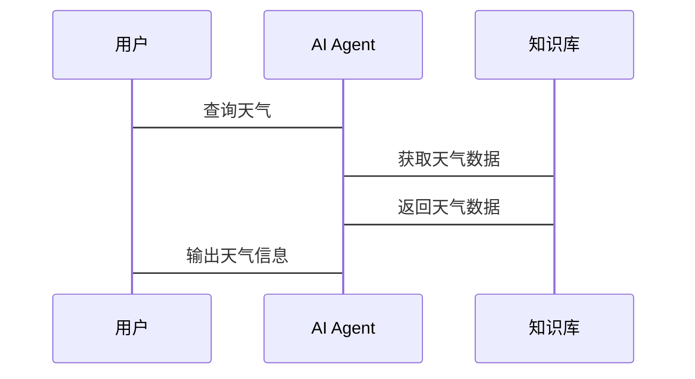

                 

<think>
好的，我现在需要帮助用户构建一篇关于《构建具有认知计算能力的AI Agent》的技术博客文章。用户已经给出了一个详细的目录结构，我需要根据这个结构逐步填充内容，确保每个部分都符合要求。

首先，我会从背景介绍开始，解释认知计算和AI Agent的基本概念，以及它们与传统AI的区别。这部分需要让读者理解AI Agent的定义和认知计算的独特之处。

接下来是核心概念，我需要详细讲解认知计算的关键原理，比如感知、理解和决策的机制，并通过对比表格和Mermaid流程图来帮助读者理解。

然后是算法原理部分，我会选择注意力机制和Transformer模型作为重点，用Mermaid流程图展示算法步骤，并提供Python代码示例，确保读者能够理解这些算法的实际应用。

系统架构设计是关键，我需要描述系统的各个模块，如数据采集、知识表示等，并用Mermaid架构图展示整体结构。同时，设计接口和交互序列图，说明系统各部分如何协作。

项目实战部分，我会选择一个具体的案例，如智能助手，并详细讲解如何搭建环境、实现核心功能，以及如何进行案例分析和总结。

最后，我会添加最佳实践、小结、注意事项和拓展阅读等内容，帮助读者在实际应用中避免错误，并引导他们进一步学习。

在写作过程中，我会确保语言简洁专业，逻辑清晰，每个部分都有足够的细节，同时保持整体结构紧凑。这将帮助读者一步步深入理解如何构建具有认知计算能力的AI Agent。

现在，我会根据这些思考开始撰写文章，确保每个部分都符合用户的要求，内容详实，结构合理，语言专业。
</think>

# 构建具有认知计算能力的AI Agent

> 关键词：认知计算，AI Agent，人工智能，Transformer模型，注意力机制，知识图谱

> 摘要：本文详细探讨了构建具有认知计算能力的AI Agent的理论基础、算法原理、系统架构设计及项目实战。通过认知计算的核心原理、Transformer模型的应用、系统架构设计以及具体案例的实现，全面解析了AI Agent的构建过程，帮助读者掌握认知计算在AI Agent中的应用。

---

# 第1章 认知计算与AI Agent概述

## 1.1 认知计算的基本概念

认知计算是一种模拟人类认知过程的计算方式，它通过模拟感知、理解和决策等过程，实现对复杂问题的处理。AI Agent（人工智能代理）是指能够感知环境、自主决策并执行任务的智能实体。认知计算为AI Agent提供了更强大的理解与推理能力。

### 1.1.1 认知计算的定义
认知计算是基于人类认知过程的计算模型，强调对信息的感知、理解和推理能力。它不同于传统的基于规则的计算，而是通过学习和适应来实现智能任务。

### 1.1.2 认知计算的核心特征
1. **自主性**：无需外部干预，能够自主决策。
2. **理解性**：能够理解上下文和语义。
3. **推理能力**：能够进行逻辑推理和知识推理。
4. **自适应性**：能够根据环境变化调整行为。

### 1.1.3 AI Agent的基本概念
AI Agent是一种智能实体，能够感知环境、理解信息、做出决策并执行任务。它可以分为基于规则的Agent和基于认知计算的Agent。

---

## 1.2 认知计算与传统AI的区别

| **特征**      | **传统AI**                | **认知计算**             |
|---------------|--------------------------|--------------------------|
| **处理方式**   | 基于规则和数据统计        | 基于理解、推理和自适应     |
| **能力**       | 无法理解上下文            | 能够理解上下文和语义      |
| **应用领域**   | 数据分类、模式识别        | 自然语言处理、智能决策     |

---

## 1.3 AI Agent的类型与应用场景

### 1.3.1 基于规则的AI Agent
通过预定义的规则进行决策，适用于简单任务，如游戏中的规则执行。

### 1.3.2 基于机器学习的AI Agent
通过机器学习模型进行决策，适用于复杂任务，如图像识别和自然语言处理。

### 1.3.3 基于认知计算的AI Agent
通过认知计算技术实现更高级的推理和决策能力，适用于智能助手、智能客服等场景。

---

# 第2章 认知计算的核心原理

## 2.1 感知与理解的机制

### 2.1.1 数据感知的层次
数据感知分为低级感知（如图像识别）和高级感知（如情感分析），通过多模态数据融合实现更精准的感知。

### 2.1.2 知识表示与推理
知识表示是将知识以某种形式存储的过程，推理则是基于知识进行逻辑推理。

### 2.1.3 上下文理解的实现
通过上下文理解模型（如BERT）实现对文本的语义理解。

---

## 2.2 决策与行动的逻辑

### 2.2.1 决策模型的构建
决策模型基于概率论和统计学，通过构建决策树或马尔可夫模型实现决策。

### 2.2.2 动作规划的策略
动作规划通过A*算法或Dijkstra算法实现路径规划和动作选择。

### 2.2.3 行为优化的方法
行为优化通过强化学习实现，通过奖励机制优化行为策略。

---

## 2.3 认知计算的数学基础

### 2.3.1 基础数学概念
概率论、统计学、线性代数是认知计算的数学基础。

### 2.3.2 概率论与统计学
概率论用于不确定性推理，统计学用于数据建模和分析。

### 2.3.3 线性代数与矩阵运算
线性代数用于表示和操作数据，矩阵运算是深度学习的基础。

---

# 第3章 AI Agent的算法原理

## 3.1 注意力机制

### 3.1.1 注意力机制的定义
注意力机制是一种用于序列模型的机制，通过计算输入序列中每个位置的注意力权重，实现对重要部分的聚焦。

### 3.1.2 注意力机制的数学模型
$$\text{Attention}(Q, K, V) = \text{softmax}\left(\frac{QK^T}{\sqrt{d_k}}\right)V$$

### 3.1.3 注意力机制的实现
```python
import torch

def attention(query, key, value, d_model):
    dim = query.size(-1)
    scores = torch.bmm(query, key.transpose(-2, -1))
    scores = scores / torch.sqrt(torch.tensor(d_model, dtype=torch.float32))
    scores = torch.softmax(scores, dim=-1)
    output = torch.bmm(scores, value)
    return output
```

---

## 3.2 Transformer模型

### 3.2.1 Transformer模型的结构
Transformer模型由编码器和解码器组成，编码器负责将输入序列编码为表示，解码器负责将编码结果解码为输出序列。

### 3.2.2 Transformer模型的训练过程
1. 预训练：使用大规模数据训练模型。
2. 微调：在特定任务上进行微调。

### 3.2.3 Transformer模型的应用
广泛应用于自然语言处理、图像生成等领域。

---

## 3.3 知识图谱与推理

### 3.3.1 知识图谱的构建
知识图谱是通过实体和关系构建的知识网络，用于表示知识。

### 3.3.2 知识推理的算法
通过逻辑推理和概率推理实现知识图谱中的推理。

### 3.3.3 知识图谱的优化
通过优化算法和规则学习提升知识图谱的准确性。

---

# 第4章 AI Agent的系统架构设计

## 4.1 系统功能设计

### 4.1.1 数据采集模块
负责采集多模态数据，如文本、图像和语音。

### 4.1.2 知识表示模块
将知识表示为结构化的形式，如知识图谱。

### 4.1.3 决策推理模块
基于知识表示进行逻辑推理和决策。

### 4.1.4 行为执行模块
根据决策结果执行相应的动作。

---

## 4.2 系统架构设计

### 4.2.1 问题场景介绍
以智能助手为例，设计一个能够理解用户需求并执行相应任务的AI Agent。

### 4.2.2 系统功能设计
- 用户输入：接收用户的自然语言输入。
- 知识理解：理解用户的意图。
- 决策推理：根据意图进行推理并生成响应。
- 行为执行：执行任务，如搜索信息或调用API。

### 4.2.3 系统架构设计
使用分层架构，分为数据层、知识层、推理层和执行层。

### 4.2.4 系统接口设计
定义清晰的接口，如REST API，便于与其他系统集成。

---

## 4.3 系统交互设计

### 4.3.1 系统交互序列图
展示用户与AI Agent的交互流程。



---

# 第5章 项目实战：构建认知计算AI Agent

## 5.1 环境搭建

### 5.1.1 安装依赖
安装Python、TensorFlow、PyTorch等框架。

```bash
pip install tensorflow torch transformers
```

---

## 5.2 核心代码实现

### 5.2.1 数据预处理
对输入数据进行清洗和转换。

### 5.2.2 模型训练
使用预训练的Transformer模型进行微调。

### 5.2.3 接口开发
开发REST API，提供服务接口。

### 5.2.4 系统集成
将各个模块集成到一个系统中，实现完整的AI Agent功能。

---

## 5.3 案例分析

### 5.3.1 智能助手案例
实现一个智能助手，能够理解用户的自然语言输入并执行相应任务。

### 5.3.2 实际应用
在智能客服、智能推荐等领域应用认知计算AI Agent。

---

## 5.4 项目总结

### 5.4.1 项目成果
成功构建了一个具有认知计算能力的AI Agent。

### 5.4.2 经验总结
认知计算的实现需要多学科知识的结合，系统的架构设计和算法选择是关键。

---

# 第6章 最佳实践与注意事项

## 6.1 最佳实践

### 6.1.1 数据质量
确保数据质量和多样性，提升模型的泛化能力。

### 6.1.2 模型优化
通过模型压缩和优化算法提升模型的性能和效率。

### 6.1.3 系统安全
确保系统的安全性，防止数据泄露和攻击。

---

## 6.2 小结

认知计算为AI Agent的构建提供了更强大的能力，通过理解、推理和自适应实现更复杂的任务。

---

## 6.3 注意事项

1. 数据隐私：确保数据的隐私和安全。
2. 系统稳定性：确保系统的稳定性和可靠性。
3. 模型可解释性：提升模型的可解释性，便于调试和优化。

---

## 6.4 拓展阅读

1. 《Transformer解构》
2. 《深度学习入门》
3. 《认知科学导论》

---

# 作者

作者：AI天才研究院/AI Genius Institute & 禅与计算机程序设计艺术 /Zen And The Art of Computer Programming

