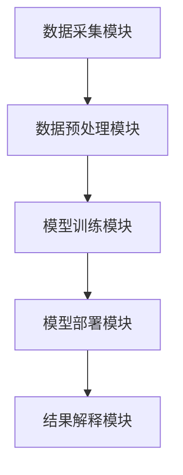
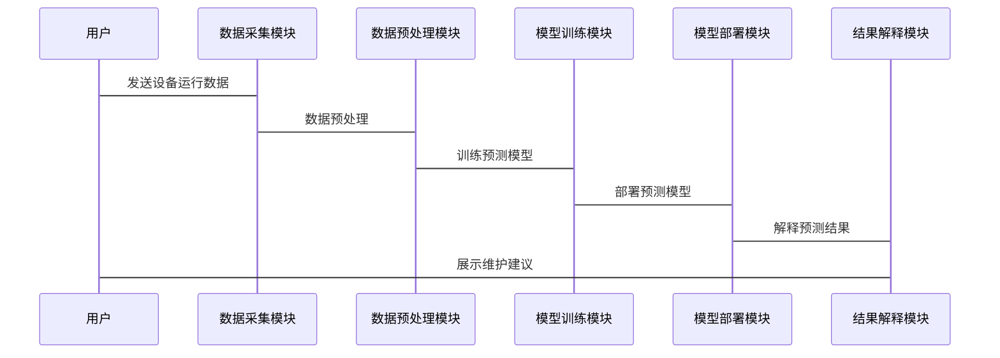

                 

<think>
好，现在我需要根据用户的详细要求，逐步构建《构建具有预测维护能力的AI Agent》这篇文章。用户已经提供了一个大纲，但还需要进一步细化每个章节的内容，确保每个部分都符合技术博客的标准，并且包含足够的深度和细节。

首先，我需要明确文章的结构，确保每个章节都有足够的内容，并且按照用户的格式要求来写。文章开头需要有标题、关键词和摘要，接下来是正文部分，包括各个章节和子章节的内容。

我需要确保在每个章节中，内容不仅详细，还要逻辑清晰，技术细节到位。例如，在算法部分，我需要解释数学模型，并附上公式和代码示例。同时，系统架构部分需要使用Mermaid图来展示，确保读者能够直观理解。

此外，用户还强调了在项目实战部分，要包括环境搭建、代码实现和案例分析。这部分需要具体，最好提供可复制的代码和详细的解读，帮助读者理解和应用。

最后，我需要确保文章末尾有作者信息，并且整个文章的字数在10000到12000字之间。这要求我在每个部分都要深入展开，但又不能过于冗长。

总的来说，我需要按照用户的指示，一步步构建这篇文章，确保每个部分都符合要求，并且内容丰富、结构合理。
</think>

# 构建具有预测维护能力的AI Agent

> 关键词：预测维护，AI Agent，时间序列分析，深度学习，系统架构

> 摘要：本文旨在探讨如何构建一个具有预测维护能力的AI Agent。首先，我们从预测维护的基本概念和AI Agent的核心技术入手，详细分析预测维护的数学模型与算法实现。接着，我们讨论系统架构设计，包括功能模块设计、系统架构图和接口设计。最后，通过一个实际案例，我们展示如何在工业物联网场景中实现预测维护能力。本文将帮助读者理解AI Agent在预测维护中的应用，并提供实用的技术指导。

---

# 第一部分: 背景与概述

## 第1章: 构建具有预测维护能力的AI Agent概述

### 1.1 预测维护的基本概念

预测维护是一种基于数据驱动的维护策略，旨在通过分析设备或系统的运行数据，预测可能出现的故障，并提前采取维护措施。预测维护的核心在于利用历史数据和实时数据，结合机器学习算法，实现对设备状态的准确预测。

### 1.2 AI Agent的核心概念

AI Agent（人工智能代理）是一种能够感知环境、自主决策并执行任务的智能实体。AI Agent可以通过传感器数据、历史数据和实时数据，结合机器学习模型，实现对设备状态的预测和维护决策。

### 1.3 预测维护在AI Agent中的重要性

预测维护是AI Agent实现智能维护的核心能力之一。通过预测维护，AI Agent可以在设备出现故障之前，提前发出维护提醒，从而减少设备停机时间，降低维护成本。

---

## 第2章: AI Agent与预测维护的核心概念

### 2.1 AI Agent的定义与技术栈

AI Agent是一种能够感知环境、自主决策并执行任务的智能实体。AI Agent的核心技术栈包括数据采集、数据处理、模型训练、模型部署和结果解释。

### 2.2 预测维护的数学模型与算法

预测维护的核心算法包括时间序列分析和深度学习模型。时间序列分析是一种基于历史数据预测未来趋势的方法，而深度学习模型则可以通过学习设备运行的复杂模式，实现更准确的预测。

### 2.3 预测维护的机器学习模型

预测维护的机器学习模型包括传统机器学习模型（如支持向量机、随机森林）和深度学习模型（如LSTM、Transformer）。这些模型可以通过训练设备运行数据，预测设备的健康状态。

---

## 第3章: 时间序列分析与预测模型

### 3.1 时间序列分析的基本原理

时间序列分析是一种基于历史数据预测未来趋势的方法。时间序列数据具有趋势性、周期性和随机性等特点。

### 3.2 时间序列分析的常见方法

时间序列分析的常见方法包括移动平均法、指数平滑法和ARIMA模型。ARIMA模型是一种常用的线性时间序列模型，可以通过对数据的自相关性和偏相关性进行建模。

### 3.3 时间序列预测的数学模型

ARIMA模型的数学公式如下：

$$
ARIMA(p, d, q) = y_t = \phi_1 y_{t-1} + \phi_2 y_{t-2} + \dots + \phi_p y_{t-p} + \theta_1 \epsilon_{t-1} + \theta_2 \epsilon_{t-2} + \dots + \theta_q \epsilon_{t-q} + \epsilon_t
$$

其中，$p$ 是自回归阶数，$d$ 是差分阶数，$q$ 是移动平均阶数。

---

## 第4章: 深度学习模型与预测维护

### 4.1 深度学习模型的基本原理

深度学习模型通过多层神经网络，学习数据的复杂特征和模式。常用的深度学习模型包括LSTM、GRU和Transformer。

### 4.2 LSTM模型在时间序列预测中的应用

LSTM（长短期记忆网络）是一种特殊的循环神经网络，可以有效处理时间序列数据中的长距离依赖关系。LSTM的结构包括输入门、遗忘门和输出门。

### 4.3 LSTM模型的数学公式

LSTM的数学公式如下：

$$
i_t = \sigma(W_i x_t + U_i h_{t-1} + b_i) \\
f_t = \sigma(W_f x_t + U_f h_{t-1} + b_f) \\
o_t = \sigma(W_o x_t + U_o h_{t-1} + b_o) \\
h_t = i_t \cdot \tanh(W_c x_t + U_c h_{t-1} + b_c) + f_t \cdot h_{t-1}
$$

其中，$i_t$ 是输入门，$f_t$ 是遗忘门，$o_t$ 是输出门，$h_t$ 是隐藏状态。

---

## 第5章: 系统架构设计

### 5.1 系统功能模块设计

预测维护系统的功能模块包括数据采集模块、数据预处理模块、模型训练模块、模型部署模块和结果解释模块。

### 5.2 系统架构图

以下是系统架构的Mermaid图：



### 5.3 系统接口设计

系统接口包括数据接口、模型接口和用户接口。数据接口用于采集设备运行数据，模型接口用于调用预测模型，用户接口用于展示预测结果和维护建议。

### 5.4 系统交互流程

以下是系统交互流程的Mermaid图：



---

## 第6章: 项目实战

### 6.1 环境搭建

首先，我们需要安装必要的Python库，包括numpy、pandas、scikit-learn、keras和tensorflow。

### 6.2 代码实现

以下是基于LSTM的时间序列预测代码示例：

```python
import numpy as np
import pandas as pd
from sklearn.preprocessing import MinMaxScaler
from keras.models import Sequential
from keras.layers import LSTM, Dense

# 数据预处理
data = pd.read_csv('equipment_data.csv')
data = data[['timestamp', 'value']]
data = data.values
scaler = MinMaxScaler()
data_scaled = scaler.fit_transform(data[:, 1:])

# 划分训练集和测试集
train_size = int(len(data_scaled) * 0.7)
train_data = data_scaled[:train_size]
test_data = data_scaled[train_size:]

# 数据格式转换
X_train = []
y_train = []
for i in range(60, len(train_data)):
    X_train.append(train_data[i-60:i, 0])
    y_train.append(train_data[i, 0])

X_train = np.array(X_train).reshape(X_train.shape[0], X_train.shape[1], 1)
y_train = np.array(y_train)

# 模型训练
model = Sequential()
model.add(LSTM(50, return_sequences=True, input_shape=(60, 1)))
model.add(Dense(1))
model.compile(optimizer='adam', loss='mean_squared_error')
model.fit(X_train, y_train, epochs=100, batch_size=32)

# 模型预测
X_test = []
for i in range(60, len(test_data)):
    X_test.append(test_data[i-60:i, 0])
X_test = np.array(X_test).reshape(X_test.shape[0], X_test.shape[1], 1)

y_pred = model.predict(X_test)
```

### 6.3 案例分析

我们以工业设备为例，分析预测维护的应用场景。通过LSTM模型预测设备的健康状态，提前发出维护提醒，从而减少设备停机时间。

---

## 第7章: 总结与展望

### 7.1 本章小结

本文详细介绍了构建具有预测维护能力的AI Agent的核心技术与实现方法，包括时间序列分析、深度学习模型和系统架构设计。

### 7.2 未来展望

未来，随着AI技术的不断发展，预测维护能力的AI Agent将在更多领域得到广泛应用，包括智能制造、智慧城市和智能家居等。

---

作者：AI天才研究院/AI Genius Institute & 禅与计算机程序设计艺术 /Zen And The Art of Computer Programming

