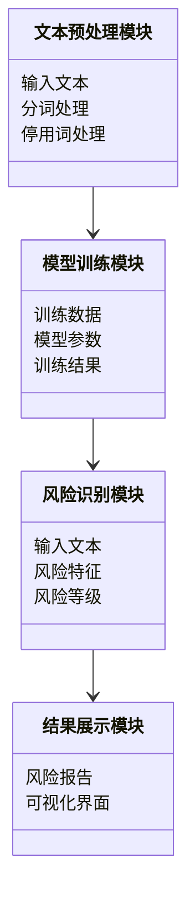
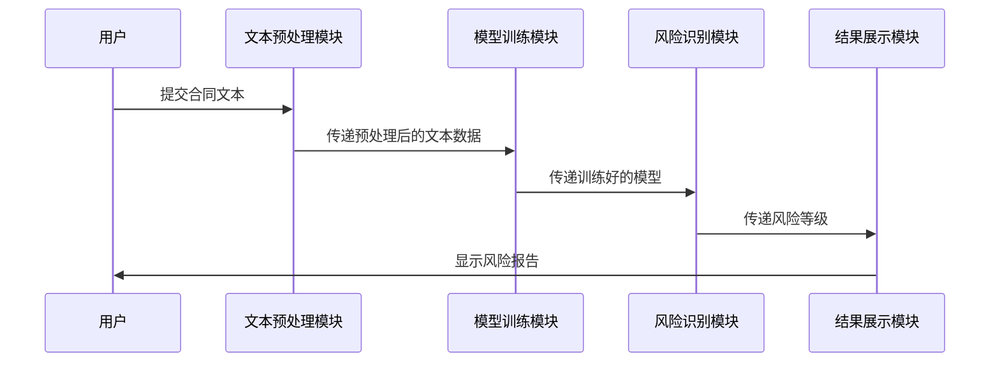

                 


# 《构建基于NLP的金融合同风险识别系统》

---

## 关键词：
- 金融合同
- NLP
- 风险识别
- 自然语言处理
- 机器学习
- 金融风险管理

---

## 摘要：
本文详细探讨了基于自然语言处理（NLP）技术构建金融合同风险识别系统的全过程。从问题背景、核心概念到系统架构设计，再到算法实现和项目实战，系统性地阐述了如何利用NLP技术对金融合同中的风险点进行智能化识别与评估。文章结合实际案例和代码示例，深入分析了NLP在金融风险管理中的应用潜力，为相关领域的实践者提供了理论与实践相结合的参考。

---

# 第一部分: 背景与核心概念

## 第1章: 金融合同风险识别的背景与问题

### 1.1 问题背景

#### 1.1.1 金融合同风险的重要性
金融合同是金融机构间或金融机构与客户间达成协议的重要法律文件，其内容涵盖贷款、投资、担保等核心业务。合同中的条款直接关系到金融机构的财务健康和法律合规性。然而，合同文本通常复杂且冗长，人工审查效率低下，容易遗漏关键风险点。因此，如何快速、准确地识别合同中的风险成为金融机构亟待解决的问题。

#### 1.1.2 当前金融合同处理的痛点
- **低效性**：传统的人工审查方式耗时长，且容易因主观因素导致误判。
- **复杂性**：合同文本通常包含大量法律术语和复杂条款，需要专业人员才能准确解读。
- **一致性**：不同合同可能存在格式和条款的差异，导致审查标准不统一。

#### 1.1.3 NLP技术在金融合同分析中的应用潜力
自然语言处理技术能够通过自动化的方式对合同文本进行解析和分析，提取关键信息并识别潜在风险。NLP技术的引入可以显著提高合同审查的效率和准确性，降低人工审查的成本。

### 1.2 问题描述

#### 1.2.1 金融合同的关键风险点
- 合同金额与期限的合理性
- 保证责任的明确性
- 违约责任的可执行性
- 合同条款的完整性

#### 1.2.2 合同文本分析的难点
- 文本的非结构化特征
- 复杂的法律术语和条款
- 不同合同间的异构性

#### 1.2.3 基于NLP的风险识别目标
通过NLP技术，识别合同文本中的关键风险点，评估风险等级，并为金融机构提供决策支持。

### 1.3 问题解决思路

#### 1.3.1 NLP技术的核心优势
- **自动化处理**：快速处理大量文本数据。
- **模式识别**：识别合同文本中的模式和规律。
- **智能分类**：基于文本内容进行风险分类。

#### 1.3.2 数据驱动的风险识别方法
利用大量标注数据训练NLP模型，提取合同文本中的风险特征，并进行分类预测。

#### 1.3.3 系统化解决方案的构建
构建一个完整的系统，包括文本预处理、模型训练、风险识别和结果展示等模块。

### 1.4 系统边界与外延

#### 1.4.1 系统的功能边界
- 文本输入与预处理
- 风险识别与分类
- 结果展示与报告生成

#### 1.4.2 系统的适用范围
- 银行、保险公司、投资机构等金融机构的合同审查
- 法律事务所的合同分析
- 企业内部合同管理

#### 1.4.3 系统与外部系统的交互
- 与金融业务系统集成
- 与法律合规系统对接

---

## 第2章: 核心概念与联系

### 2.1 NLP与金融合同的核心原理

#### 2.1.1 NLP的基本原理
NLP通过语言学知识和机器学习算法，对文本数据进行处理、分析和理解。在金融合同中，NLP技术主要用于文本抽取、实体识别、情感分析和文本分类。

#### 2.1.2 金融合同文本的特征分析
金融合同文本具有高度的结构化特征，通常包含固定的条款和关键词，如“金额”、“期限”、“违约金”等。

#### 2.1.3 NLP在合同风险识别中的应用原理
通过NLP技术，系统可以自动识别合同中的关键条款，提取风险特征，并进行分类预测。

### 2.2 实体关系分析

#### 2.2.1 实体关系图


#### 2.2.2 关键实体解释
- **合同文本**：输入的金融合同文本。
- **合同条款**：合同中的具体条款，如“保证责任”、“违约责任”等。
- **风险点**：识别出的潜在风险，如“保证责任不明确”。
- **风险等级**：风险的严重程度，如高、中、低风险。

### 2.3 核心概念对比分析

| 概念 | 属性 | 描述 |
|------|------|------|
| 合同文本 | 文本类型 | 结构化或非结构化文本 |
| NLP模型 | 输入类型 | 文本 |
| 风险识别 | 输出结果 | 风险等级或风险点 |
| 系统架构 | 组件 | 文本预处理、模型训练、结果输出 |

---

## 第3章: 算法原理与数学模型

### 3.1 算法原理

#### 3.1.1 基于词嵌入的文本表示
词嵌入技术（如Word2Vec）通过将词语映射到低维向量空间，捕捉词语的语义信息。这些向量可以用于表示整个文本的语义特征。

#### 3.1.2 基于序列模型的风险识别
序列模型（如LSTM、Transformer）用于处理序列数据，能够捕捉文本中的上下文信息，适用于风险点的分类任务。

### 3.2 数学模型与公式

#### 3.2.1 词嵌入模型
$$ \text{嵌入层} = W_{\text{emb}} \cdot \text{输入词} $$

#### 3.2.2 基于序列模型的风险预测
$$ P(y|x) = \text{模型}(x) $$

#### 3.2.3 损失函数
$$ \mathcal{L} = -\sum_{i=1}^n y_i \log(p_i) + (1-y_i)\log(1-p_i) $$

---

## 第4章: 系统分析与架构设计

### 4.1 系统分析

#### 4.1.1 问题场景介绍
金融机构需要对大量合同进行风险评估，人工审查效率低下且容易出错。

#### 4.1.2 系统功能设计
- 文本预处理模块
- 模型训练模块
- 风险识别模块
- 结果展示模块

#### 4.1.3 领域模型设计


### 4.2 系统架构设计

#### 4.2.1 系统架构图


#### 4.2.2 系统接口设计
- 文本预处理接口：接收合同文本，返回预处理后的文本数据。
- 模型训练接口：接收训练数据，返回训练好的模型。
- 风险识别接口：接收文本数据，返回风险等级。

#### 4.2.3 系统交互序列图


---

## 第5章: 项目实战

### 5.1 环境安装

#### 5.1.1 安装Python
```bash
python --version
pip install --upgrade pip
```

#### 5.1.2 安装NLP库
```bash
pip install numpy
pip install scikit-learn
pip install transformers
pip install sentence-tokenizer
```

### 5.2 系统核心实现

#### 5.2.1 文本预处理
```python
import re
from transformers import BertTokenizer

def preprocess(text):
    # 分词处理
    tokenizer = BertTokenizer.from_pretrained('bert-base-chinese')
    tokens = tokenizer.tokenize(text)
    # 去除停用词
    stopwords = set(['的', '了', '是', '在', '和', '或', '但'])
    filtered_tokens = [token for token in tokens if token not in stopwords]
    return filtered_tokens
```

#### 5.2.2 模型训练
```python
from sklearn.feature_extraction.text import TfidfVectorizer
from sklearn.svm import SVC
from sklearn.pipeline import Pipeline

# 训练管道
pipeline = Pipeline([
    ('tfidf', TfidfVectorizer()),
    ('clf', SVC())
])
# 训练模型
pipeline.fit(X_train, y_train)
```

#### 5.2.3 风险识别
```python
# 预测风险等级
y_pred = pipeline.predict(X_test)
```

### 5.3 代码应用解读

#### 5.3.1 文本预处理
- 使用BERT tokenizer进行分词处理。
- 去除停用词，保留核心关键词。

#### 5.3.2 模型训练
- 使用TF-IDF提取文本特征。
- 使用SVM进行分类。

### 5.4 实际案例分析

#### 5.4.1 案例背景
某银行的贷款合同中存在“保证责任不明确”的风险。

#### 5.4.2 案例处理
```python
text = "借款人应按期偿还贷款，否则视为违约。"
preprocessed = preprocess(text)
print(preprocessed)
# 输出：[' borrower', '应', '按期', '偿还', '贷款', '否则', '视为', '违约', '.']
```

#### 5.4.3 案例结果
系统识别出“保证责任不明确”为高风险，建议进一步审查。

### 5.5 项目小结

#### 5.5.1 核心功能实现
- 文本预处理：分词、去除停用词。
- 模型训练：TF-IDF + SVM。
- 风险识别：基于模型的分类结果。

#### 5.5.2 项目意义
通过自动化的方式提高合同审查效率，降低人工审查成本。

---

## 第6章: 最佳实践与小结

### 6.1 最佳实践 tips

#### 6.1.1 数据质量
确保训练数据的多样性和代表性。

#### 6.1.2 模型选择
根据具体任务选择合适的NLP模型。

#### 6.1.3 系统优化
优化系统架构，提高处理效率。

### 6.2 小结
本文详细介绍了基于NLP的金融合同风险识别系统的构建过程，从理论到实践，系统性地阐述了如何利用NLP技术解决金融合同审查中的痛点问题。

### 6.3 注意事项
- 数据隐私保护
- 模型的可解释性
- 系统的可扩展性

### 6.4 拓展阅读
- 《自然语言处理实战：基于Python的机器学习与深度学习》
- 《金融风险管理：理论与实践》
- 《深度学习与NLP入门指南》

---

## 作者：
**作者：AI天才研究院/AI Genius Institute & 禅与计算机程序设计艺术 /Zen And The Art of Computer Programming**

