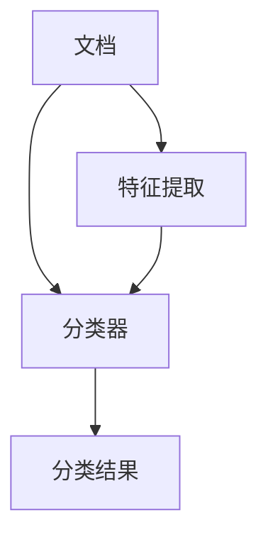
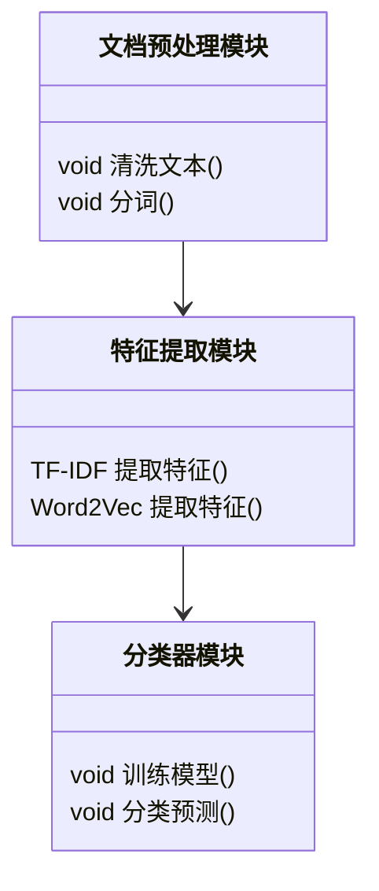
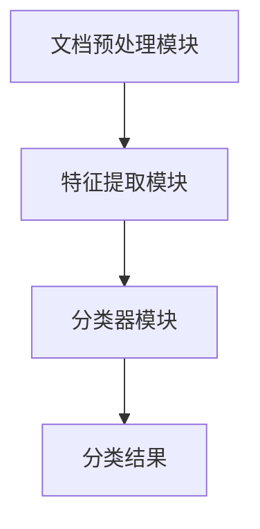
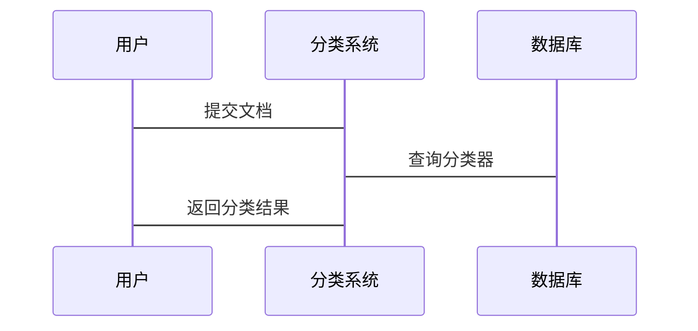

                 


# 构建基于NLP的金融文档自动分类系统

> 关键词：金融文档分类，自然语言处理，机器学习，文本分类，SVM，Word2Vec

> 摘要：本文将详细探讨如何构建一个基于自然语言处理（NLP）的金融文档自动分类系统。文章首先从背景介绍入手，分析问题背景、问题描述及解决方法；接着深入讲解核心概念，包括NLP与机器学习的基本原理及其在金融文档分类中的应用；随后分析算法原理，重点介绍TF-IDF、Word2Vec和SVM等算法；然后进行系统分析与架构设计，包括项目场景、系统功能、系统架构及接口设计；最后通过项目实战部分，展示环境安装、代码实现、案例分析及项目总结。文章最后总结了最佳实践，包括小结、注意事项、后续学习方向及拓展阅读。

---

## 第一部分: 背景介绍

### 第1章: 问题背景与描述

#### 1.1 问题背景
金融行业每天都会产生大量文档，包括财务报告、市场分析、新闻公告等。这些文档通常需要手动分类，以便进行后续的分析和处理。然而，手动分类不仅效率低下，而且容易出错。随着自然语言处理（NLP）和机器学习技术的发展，自动分类成为可能。

#### 1.2 问题描述
金融文档分类的挑战在于文档的多样性和专业性。文档可能包含复杂的术语和上下文，传统基于规则的分类方法难以应对这些复杂性。此外，金融文档的分类标准可能需要动态调整，以适应市场变化。

#### 1.3 解决方法
基于NLP的分类系统可以通过以下步骤实现：
1. **文本预处理**：去除停用词、分词、去除标点符号等。
2. **特征提取**：使用TF-IDF、Word2Vec等方法提取文本特征。
3. **模型训练**：使用机器学习算法（如SVM、随机森林等）训练分类器。
4. **分类与评估**：对新文档进行分类，并评估模型的性能。

#### 1.4 系统边界与外延
本系统仅专注于文档的自动分类，不涉及文档内容的生成或修改。分类结果将作为后续分析的输入。

### 第2章: 核心概念与联系

#### 2.1 NLP与机器学习的核心概念
- **NLP**：研究如何让计算机理解和生成人类语言的技术。
- **机器学习**：通过数据训练模型，使其能够进行分类、回归等任务。
- **金融文档分类**：结合NLP和机器学习，对金融文档进行自动分类。

#### 2.2 核心概念的属性对比
| 概念          | 描述                                                                 |
|---------------|----------------------------------------------------------------------|
| 文档表示方法  | TF-IDF、Word2Vec、one-hot编码                                           |
| 分类算法      | SVM、随机森林、朴素贝叶斯                                               |
| 系统架构模式  | 单体架构、微服务架构                                                   |

#### 2.3 实体关系图


---

## 第二部分: 算法原理讲解

### 第3章: NLP基础算法

#### 3.1 词袋模型与TF-IDF
- **词袋模型**：将文档表示为词袋，忽略词序。
- **TF-IDF**：计算词在文档中的重要性。
  - TF（Term Frequency）：词在文档中的频率。
  - IDF（Inverse Document Frequency）：词的反向文档频率。
  - TF-IDF公式：
    $$TF\text{-}IDF_{td} = TF_{td} \times IDF_{td}$$

#### 3.2 余弦相似度
- 计算两个向量之间的夹角余弦值，衡量文本相似度。
  $$\text{相似度} = \frac{\vec{A} \cdot \vec{B}}{\|\vec{A}\| \|\vec{B}\|}$$

#### 3.3 Word2Vec
- 将词映射为向量，捕捉词义信息。
- 使用skip-gram或CBOW模型训练。

### 第4章: 机器学习算法

#### 4.1 支持向量机（SVM）
- 分类器通过找到最优超平面，将数据分为不同类别。
- **目标函数**：
  $$\min_{w,b,\xi} \frac{1}{2}\|w\|^2 + C\sum_{i=1}^n \xi_i$$
- **约束条件**：
  $$y_i(w \cdot x_i + b) \geq 1 - \xi_i$$
  $$\xi_i \geq 0$$

#### 4.2 随机森林
- 使用决策树的集成方法，适合高维数据。

---

## 第三部分: 系统分析与架构设计

### 第5章: 项目场景介绍

#### 5.1 项目背景
- 金融行业文档分类需求日益增长。
- 手动分类效率低，误判率高。
- 自动分类系统可提高效率和准确性。

### 第6章: 系统功能设计

#### 6.1 功能模块
- 文本预处理模块：清洗、分词、去除停用词。
- 特征提取模块：TF-IDF、Word2Vec。
- 分类器模块：SVM、随机森林。
- 结果展示模块：分类结果可视化。

#### 6.2 领域模型类图


### 第7章: 系统架构设计

#### 7.1 系统架构图


#### 7.2 接口设计
- 输入接口：接收待分类的金融文档。
- 输出接口：返回分类结果。

#### 7.3 交互流程图


---

## 第四部分: 项目实战

### 第8章: 环境安装与代码实现

#### 8.1 环境安装
- Python 3.8+
- Scikit-learn、NLTK、Gensim、jieba

#### 8.2 核心代码实现

##### 8.2.1 文本预处理
```python
import jieba

def preprocess(text):
    words = jieba.lcut(text)
    return ' '.join(words)
```

##### 8.2.2 特征提取
```python
from sklearn.feature_extraction.text import TfidfVectorizer

vectorizer = TfidfVectorizer()
X = vectorizer.fit_transform(documents)
```

##### 8.2.3 模型训练与分类
```python
from sklearn import svm

model = svm.SVC()
model.fit(X_train, y_train)
y_pred = model.predict(X_test)
```

### 第9章: 案例分析与代码解读

#### 9.1 案例分析
以某公司财务报告为例，展示如何通过代码实现分类。

#### 9.2 代码解读
- 预处理代码：去除停用词、分词。
- 特征提取：使用TF-IDF提取关键词向量。
- 模型训练：使用SVM训练分类器。

### 第10章: 项目总结

#### 10.1 学习总结
- 掌握了NLP和机器学习的基本原理。
- 学会了如何构建一个完整的分类系统。

#### 10.2 项目小结
- 项目实现了金融文档的自动分类。
- 在实际应用中，需要考虑数据质量和模型调优。

---

## 第五部分: 最佳实践

### 第11章: 小结与建议

#### 11.1 学习小结
- 理解NLP和机器学习的核心原理。
- 掌握文本分类的实现步骤。

#### 11.2 注意事项
- 数据预处理是关键，需仔细清洗数据。
- 模型调优可提高分类准确率。

#### 11.3 后续学习方向
- 深入学习深度学习模型（如BERT）。
- 探索无监督学习方法。

#### 11.4 拓展阅读
- 《自然语言处理实战：构建中文文本挖掘系统》
- 《机器学习实战》

---

## 作者：AI天才研究院/AI Genius Institute & 禅与计算机程序设计艺术/Zen And The Art of Computer Programming

