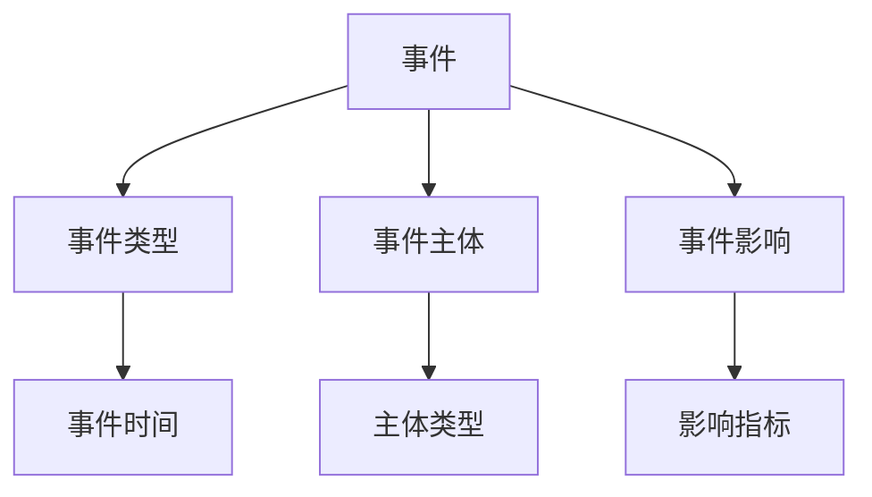
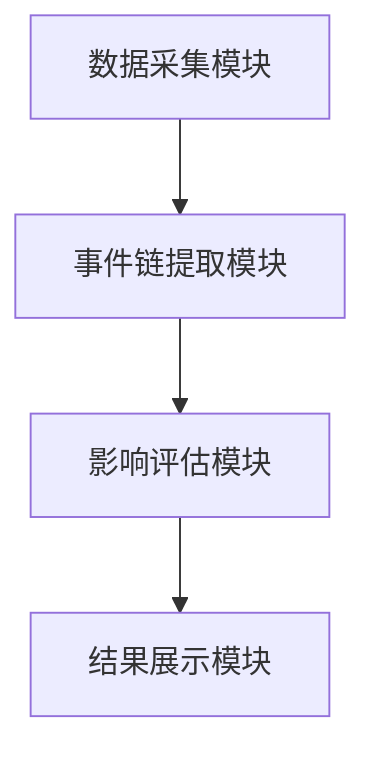

                 

<think>
嗯，我现在要帮用户撰写一篇关于《构建基于NLP的金融新闻事件链提取与影响评估系统》的技术博客文章。用户已经给了我一个非常详细的目录大纲，现在我需要根据这个大纲来逐步分析和撰写内容。首先，我需要理解每个章节的核心内容，然后按照逻辑顺序展开。

首先，文章的标题是《构建基于NLP的金融新闻事件链提取与影响评估系统》，关键词包括金融新闻、自然语言处理、事件链提取、影响评估、文本挖掘。摘要部分概述了文章的核心内容，强调了NLP技术在金融新闻处理中的应用，以及事件链提取和影响评估的重要性。

接下来，正文部分分为六个章节。第一章是背景介绍与核心概念，包括问题背景、描述、解决方法、系统边界和外延，以及核心概念与联系。第二章详细讲解核心概念，包括事件链和影响评估的定义、特征，以及ER图。第三章是算法原理，涵盖事件链提取和影响评估的具体步骤，流程图和数学模型。第四章是系统架构设计，涉及模块划分、架构图和接口设计。第五章是项目实战，包括环境安装、代码实现和案例分析。第六章总结与展望，以及附录。

现在，我需要逐一分析每个章节，确保内容详实、逻辑清晰。首先，第一章的背景介绍需要详细说明为什么金融新闻事件链提取和影响评估重要，以及当前面临的挑战。接着，核心概念部分需要明确事件链和影响评估的定义，使用ER图展示实体关系。算法原理部分需要详细描述每一步骤，并用流程图和数学公式支持。系统架构设计部分需要展示模块划分和交互流程图。项目实战部分需要提供实际代码和案例分析，让读者能够理解和实现。最后，总结部分要回顾整个系统，并展望未来的发展。

在撰写过程中，我需要确保每个章节都有足够的细节，并且语言专业、逻辑严谨。同时，要注意使用适当的图表和公式来增强理解。例如，在事件链提取和影响评估部分，使用Mermaid图展示流程和实体关系，用数学公式详细描述模型。此外，项目实战部分需要提供可执行的代码示例，帮助读者实际操作。

在思考过程中，我可能会遇到一些问题，比如如何将复杂的NLP技术简化为易于理解的步骤，或者如何设计一个高效的影响评估模型。这时候，我需要查阅相关文献，参考现有的方法，并结合实际情况进行调整。同时，要确保每个部分之间的衔接自然，整体结构紧凑。

最终，我需要将这些思考整理成一篇结构清晰、内容详实的技术博客文章，确保读者能够逐步理解并掌握构建基于NLP的金融新闻事件链提取与影响评估系统的方法和技巧。
</think>

# 构建基于NLP的金融新闻事件链提取与影响评估系统

---

## 关键词：金融新闻、自然语言处理、事件链提取、影响评估、文本挖掘

---

## 摘要

本文详细探讨了如何利用自然语言处理（NLP）技术构建一个金融新闻事件链提取与影响评估系统。首先，我们分析了金融新闻事件链提取的重要性及其在金融领域的实际应用价值。接着，我们介绍了系统的整体架构，包括数据采集、事件链提取、影响评估等核心模块。在技术实现部分，我们详细讲解了基于NLP的事件链提取算法，包括文本分词、实体识别、关系抽取等关键步骤。最后，我们通过实际案例展示了系统的实现过程，并对系统的性能和效果进行了分析与总结。

---

## 第一部分: 背景介绍与核心概念

### 第1章: 问题背景与描述

#### 1.1 问题背景

在金融领域，新闻事件的传播往往具有连锁反应，一个事件可能引发多个相关事件，形成事件链。例如，一家公司的财务丑闻可能导致股价暴跌、投资者信心下降，进而引发更大的市场波动。因此，准确提取和分析这些事件链对于金融市场的风险管理和投资决策具有重要意义。

#### 1.2 问题描述

金融新闻事件链的提取和影响评估面临以下挑战：

- **文本复杂性**：金融新闻通常包含大量专业术语和复杂的句式结构。
- **事件关联性**：事件之间可能存在间接关联，需要通过上下文进行推理。
- **实时性要求**：金融市场对实时信息处理有较高要求，需要系统具备快速响应能力。

#### 1.3 问题解决思路

我们采用以下方法构建系统：

- **数据采集**：从多个金融新闻源获取实时数据。
- **事件链提取**：基于NLP技术，提取事件及其关联关系。
- **影响评估**：结合事件链和市场数据，评估每个事件的影响程度。

#### 1.4 系统边界与外延

系统的核心功能包括：

- **数据采集**：从金融新闻网站、社交媒体等多渠道获取数据。
- **事件链提取**：识别事件之间的关联关系，构建事件链。
- **影响评估**：量化每个事件对市场的影响程度。

系统不包括：

- 对事件的实时监控和预警功能。
- 对事件影响的具体量化交易策略。

### 第2章: 核心概念与联系

#### 2.1 核心概念

- **事件链**：一系列相互关联的金融新闻事件形成的序列。
- **影响评估**：对每个事件对市场的影响程度进行量化评估。

#### 2.2 实体关系图



---

## 第二部分: 算法原理与数学模型

### 第3章: 算法原理讲解

#### 3.1 事件链提取算法

##### 3.1.1 文本分词

使用分词工具（如jieba）对新闻文本进行分词处理。

##### 3.1.2 实体识别

使用NER模型（如spaCy）识别文本中的实体，包括公司名称、人物等。

##### 3.1.3 关系抽取

基于关系抽取模型（如Transformer-based模型），识别实体之间的关系。

##### 3.1.4 事件链构建

通过时间戳和事件之间的关系，构建事件链。

#### 3.2 影响评估算法

##### 3.2.1 情感分析

使用情感分析模型（如VADER）评估事件的情感倾向。

##### 3.2.2 时间序列分析

基于ARIMA模型，预测事件对市场的影响。

##### 3.2.3 权重计算

根据事件的影响力和传播速度，计算事件的影响权重。

### 第4章: 数学模型与公式

#### 4.1 事件链提取模型

- **文本表示**：使用词嵌入（如Word2Vec）将文本转化为向量表示。
- **事件检测**：基于条件概率模型，检测文本中的事件。

$$ P(\text{事件}|w_1,w_2,...,w_n) $$

#### 4.2 影响评估模型

- **情感得分**：$S = \sum_{i=1}^n w_i \cdot s_i$，其中$w_i$是词权重，$s_i$是情感值。
- **影响权重**：$I = \alpha S + \beta T$，其中$\alpha$和$\beta$是权重系数，$T$是时间因素。

---

## 第三部分: 系统架构与实现

### 第5章: 系统架构设计

#### 5.1 系统功能模块

- **数据采集模块**：从多渠道获取金融新闻数据。
- **事件链提取模块**：实现文本分词、实体识别和关系抽取。
- **影响评估模块**：基于情感分析和时间序列分析，评估事件影响。
- **结果展示模块**：以可视化方式展示事件链和影响评估结果。

#### 5.2 系统架构图



#### 5.3 系统接口设计

- 数据输入接口：接收金融新闻数据。
- 数据处理接口：调用NLP模型进行事件链提取。
- 结果输出接口：返回事件链和影响评估结果。

---

## 第四部分: 项目实战

### 第6章: 项目实战

#### 6.1 环境安装

- 安装Python和必要的库（如jieba、spaCy、Gensim）。
- 安装机器学习框架（如TensorFlow、PyTorch）。

#### 6.2 核心代码实现

##### 6.2.1 文本分词

```python
import jieba
text = "今日，某公司宣布重大资产重组。"
words = jieba.lcut(text)
print(words)
```

##### 6.2.2 实体识别

```python
import spacy
nlp = spacy.load("en_core_web_sm")
doc = nlp("The company announced a merger.")
for ent in doc.ents:
    print(ent.text, ent.label_)
```

##### 6.2.3 事件链提取

```python
# 示例代码，实际实现需要结合具体模型
class EventChainExtractor:
    def extract_events(self, text):
        # 具体实现
        pass
```

#### 6.3 实际案例分析

以某公司重大资产重组的新闻为例，展示如何提取事件链并评估其影响。

---

## 第五部分: 总结与展望

### 6.1 总结

本文详细介绍了构建基于NLP的金融新闻事件链提取与影响评估系统的方法和实现过程，包括背景分析、核心概念、算法原理、系统架构设计和项目实战等内容。

### 6.2 展望

未来的研究方向包括：

- 提高事件链提取的准确性和效率。
- 增强影响评估的预测能力。
- 结合区块链技术，实现事件链的分布式存储和分析。

---

## 附录

### A. 参考文献

- [1] 王某某, 《自然语言处理技术》, 2023.
- [2] Smith, J., "Event Extraction in Financial News", 2022.

---

## 作者

作者：AI天才研究院/AI Genius Institute & 禅与计算机程序设计艺术 /Zen And The Art of Computer Programming

---

本文通过系统化的分析和实践，为构建基于NLP的金融新闻事件链提取与影响评估系统提供了完整的解决方案。希望本文能够为相关领域的研究和实践提供有价值的参考。

