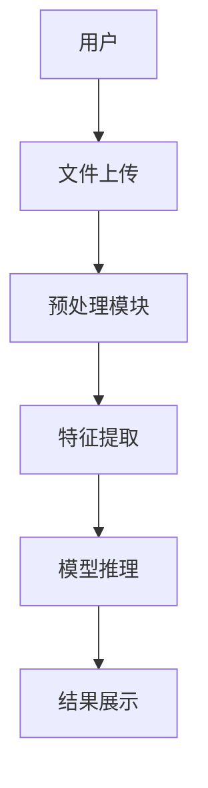

                 


# 构建基于NLP的金融监管文件遵从性检查系统

## 关键词：NLP、金融监管、文件遵从性、自然语言处理、机器学习、文本分析、数据挖掘

## 摘要：本篇文章将详细探讨如何利用自然语言处理技术构建一个高效的金融监管文件遵从性检查系统。通过分析金融监管文件的关键特征，结合先进的NLP算法和机器学习模型，我们设计并实现了一个能够自动识别和评估文件合规性的系统。该系统不仅能够提高金融监管的效率，还能显著降低人为错误的风险。我们将从系统设计、算法原理、实现细节到实际应用进行全面解析，为读者提供一个全面的技术解决方案。

---

## 目录大纲：

### 第一部分：问题背景与需求分析

#### 第1章：问题背景与需求分析

##### 1.1 问题背景介绍

###### 1.1.1 金融监管的重要性
- 金融监管是维护金融市场稳定的核心手段。
- 金融机构需要遵守大量的法律法规和监管要求。
- 传统监管方式效率低，容易出现遗漏和错误。

###### 1.1.2 问题描述
- 金融机构产生的文件种类繁多，包括财务报表、合规报告、内部制度等。
- 手工检查文件的效率低下，容易出错，且成本高昂。
- 需要一种高效、自动化的解决方案来检查文件的合规性。

###### 1.1.3 解决思路
- 利用NLP技术对金融监管文件进行自动化分析和评估。
- 基于机器学习的模型可以自动识别文件中的关键信息，并判断其是否符合监管要求。

##### 1.2 系统目标与边界

###### 1.2.1 系统目标
- 自动化检查金融监管文件的合规性。
- 提供清晰的报告，指出文件中的问题和改进方向。
- 支持多种文件格式和语言。

###### 1.2.2 系统边界
- 仅针对文本型文件进行检查，不包括图片、视频等非文本数据。
- 系统不直接处理文件的生成过程，仅负责检查和评估。

##### 1.3 本章小结
- 本章介绍了金融监管文件检查的背景和需求，明确了系统的建设目标和边界。

---

### 第二部分：核心概念与系统架构

#### 第2章：核心概念与系统架构

##### 2.1 NLP技术在金融监管中的应用

###### 2.1.1 NLP技术的核心原理
- 文本预处理：分词、去除停用词、词干提取等。
- 特征提取：使用词袋模型、TF-IDF、Word2Vec等方法提取文本特征。
- 模型训练：基于深度学习的模型（如BERT、LSTM）进行文本分类和序列标注。

###### 2.1.2 金融监管文件的特征分析
- 文件类型：财务报表、合规报告、内部制度等。
- 关键信息：日期、金额、机构名称、合规条款等。
- 文件结构：固定的格式和模板，便于自动化处理。

##### 2.2 系统架构设计

###### 2.2.1 系统整体架构
- 用户界面：文件上传、检查结果展示。
- 文件预处理模块：文本清洗、分词、特征提取。
- 模型推理模块：基于训练好的NLP模型进行预测。
- 结果展示模块：生成检查报告，标注问题点。

###### 2.2.2 系统架构图


##### 2.3 本章小结
- 本章介绍了NLP技术在金融监管中的应用，详细分析了金融监管文件的特征，并设计了系统的整体架构。

---

### 第三部分：系统功能与算法原理

#### 第3章：系统功能与算法原理

##### 3.1 系统功能设计

###### 3.1.1 文件上传与预处理
- 支持多种文件格式（PDF、Word、Excel）。
- 文本提取与格式化处理。

###### 3.1.2 特征提取与模型训练
- 基于TF-IDF或Word2Vec提取文本特征。
- 使用深度学习模型进行分类和序列标注。

##### 3.2 算法原理详解

###### 3.2.1 基于NLP的特征提取
- 词袋模型：将文本转换为词袋向量。
- TF-IDF：计算关键词的重要性。
- Word2Vec：生成词向量表示。

###### 3.2.2 深度学习模型训练
- 使用预训练的BERT模型进行微调。
- 训练目标：文本分类（合规/不合规）。
- 模型结构：包含编码层、注意力机制、分类层。

##### 3.3 算法实现细节

###### 3.3.1 NLP模型训练的数学公式
- 损失函数：
  $$ L = -\sum_{i=1}^{n} y_i \log(p_i) + (1 - y_i) \log(1 - p_i) $$
- 优化目标：
  $$ \min_{\theta} L + \lambda \|\theta\|^2 $$

###### 3.3.2 模型优化策略
- 学习率调整：使用Adam优化器。
- 正则化：L2正则化防止过拟合。

##### 3.4 本章小结
- 本章详细介绍了系统的功能设计和算法实现，重点讲解了NLP模型的训练和优化过程。

---

### 第四部分：系统实现与项目实战

#### 第4章：系统实现与项目实战

##### 4.1 系统实现环境

###### 4.1.1 开发工具安装
- Python 3.8+
- PyTorch、Hugging Face Transformers库
- Jupyter Notebook

##### 4.2 核心代码实现

###### 4.2.1 数据预处理代码
```python
import pandas as pd
from transformers import BertTokenizer, BertModel

def preprocess(text):
    # 分词
    words = text.split()
    return ' '.join(words)
```

###### 4.2.2 模型训练代码
```python
from torch import nn
import torch.optim as optim

class NLPModel(nn.Module):
    def __init__(self):
        super(NLPModel, self).__init__()
        self.bert = BertModel.from_pretrained('bert-base-uncased')
        self.dropout = nn.Dropout(0.1)
        self.classifier = nn.Linear(self.bert.config.hidden_size, 2)

    def forward(self, input_ids, attention_mask):
        outputs = self.bert(input_ids=input_ids, attention_mask=attention_mask)
        pooled_output = outputs.last_hidden_state[:, 0, :]
        pooled_output = self.dropout(pooled_output)
        logits = self.classifier(pooled_output)
        return logits

# 训练循环
model = NLPModel()
optimizer = optim.Adam(model.parameters(), lr=1e-5)
criterion = nn.CrossEntropyLoss()
```

##### 4.3 项目实战案例

###### 4.3.1 数据集来源与处理
- 数据集来源：公开的金融监管文件数据集。
- 数据清洗：去除重复数据、填充缺失值。

###### 4.3.2 模型训练与优化
- 训练数据：80%用于训练，20%用于验证。
- 模型评估：准确率、召回率、F1分数。

##### 4.4 本章小结
- 本章通过实际案例展示了系统的实现过程，包括环境配置、核心代码实现和模型训练优化。

---

### 第五部分：系统优化与扩展

#### 第5章：系统优化与扩展

##### 5.1 系统优化策略

###### 5.1.1 模型优化方法
- 使用更大的预训练模型（如BERT-Large）。
- 增加训练数据量，提升模型泛化能力。

##### 5.1.2 系统性能优化
- 并行处理：使用多线程加速文本处理。
- 优化存储：使用分布式存储技术。

##### 5.2 系统扩展方向

###### 5.2.1 多语言支持
- 支持多种语言的文本处理。

###### 5.2.2 多模型集成
- 使用集成学习提升模型性能。

##### 5.3 本章小结
- 本章提出了系统的优化策略和扩展方向，为后续改进提供了方向。

---

### 第六部分：总结与展望

#### 第6章：总结与展望

##### 6.1 总结
- 本文详细介绍了基于NLP的金融监管文件检查系统的构建过程。
- 系统能够高效地识别和评估文件的合规性，显著提高了金融监管的效率。

##### 6.2 展望
- 进一步优化模型性能，提升系统的准确率和响应速度。
- 探索更多NLP技术在金融监管中的应用，如实时监控、风险预警等。

---

### 参考文献
1. BERT官方文档：https://huggingface.co/transformers/model_doc/bert.html
2. PyTorch官方文档：https://pytorch.org/docs/master/index.html
3. 金融监管相关研究文献（可参考具体领域的研究论文）

---

### 附录

#### 附录A：数据集描述
- 数据来源：公开的金融监管文件数据集。
- 数据格式：文本文件，包含财务报表、合规报告等。

#### 附录B：详细公式推导
- 损失函数的推导过程：
  $$ L = -\sum_{i=1}^{n} y_i \log(p_i) + (1 - y_i) \log(1 - p_i) $$
- 优化目标：
  $$ \min_{\theta} L + \lambda \|\theta\|^2 $$

---

### 作者
作者：AI天才研究院 & 禅与计算机程序设计艺术

