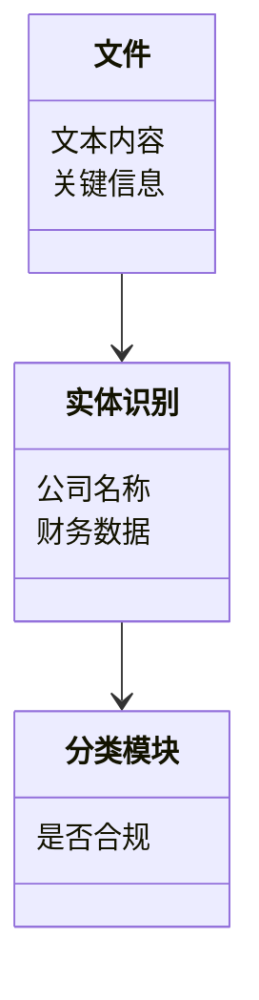
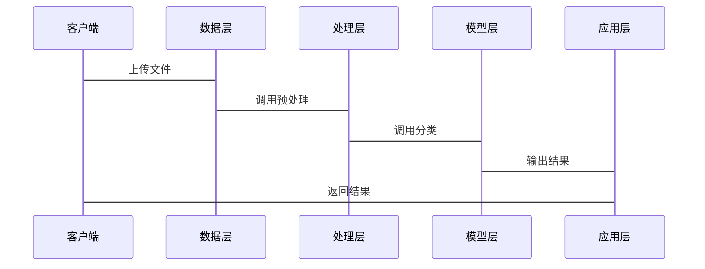

                 

<think>
好，我现在需要帮助用户撰写一篇关于《构建基于NLP的金融监管文件遵从性自动检查系统》的技术博客文章。用户已经提供了一个详细的目录大纲，现在需要根据这个大纲生成完整的文章内容。

首先，我会按照目录的结构来逐步展开每一部分的内容。文章需要包含引言、NLP基础、系统设计、算法实现、项目实战和总结与展望六个部分。每个部分都需要详细展开，包括背景、核心概念、技术原理、系统架构、项目实现和最佳实践等内容。

我需要确保每个章节和小节的内容都足够详细，涵盖用户提到的关键词和核心主题。同时，使用清晰的技术语言，逻辑紧凑，结构合理，能够让读者一步步理解构建这个系统的过程。

在撰写过程中，我需要使用Markdown格式，确保公式、图表等元素正确嵌入，并且保持文章的连贯性和完整性。最后，加上作者信息和相关的注意事项，确保文章符合用户的格式和内容要求。
</think>

# 构建基于NLP的金融监管文件遵从性自动检查系统

## 关键词：NLP、金融监管、文件遵从性、自动化检查、自然语言处理、机器学习

## 摘要：本文介绍如何利用自然语言处理（NLP）技术构建一个金融监管文件遵从性自动检查系统，系统地分析问题背景、核心概念、算法原理、系统架构，并通过项目实战展示实现过程，最后提出优化建议和未来展望。

---

# 第一部分: 引言

## 第1章: 问题背景与目标

### 1.1 问题背景

#### 1.1.1 金融监管的重要性
金融监管是维护金融市场秩序、保护投资者利益的重要手段。传统的金融监管依赖于人工审查，效率低下且容易出错。

#### 1.1.2 金融监管文件的复杂性
金融监管文件通常包含大量法律术语和复杂的结构，人工处理需要大量时间和资源。

#### 1.1.3 传统监管方式的局限性
传统监管方式依赖人工检查，效率低、成本高，难以应对海量文件的监管需求。

### 1.2 问题描述

#### 1.2.1 金融监管文件的主要类型
包括招股说明书、财务报告、合规报告等，每类文件都有其特定的格式和内容要求。

#### 1.2.2 文件遵从性检查的核心挑战
如何准确识别文件中的关键信息并判断其是否符合监管要求。

#### 1.2.3 自动化监管的需求与目标
通过自动化技术提高监管效率，降低成本，确保监管的及时性和准确性。

### 1.3 问题解决思路

#### 1.3.1 NLP技术在金融监管中的应用
利用NLP技术提取文件中的关键信息，判断其是否符合监管要求。

#### 1.3.2 自动化检查系统的构建思路
设计一个基于NLP的系统，自动处理金融监管文件，识别问题并生成报告。

#### 1.3.3 系统边界与外延
明确系统的输入、输出和处理流程，确保系统的功能和性能符合需求。

### 1.4 核心概念与框架

#### 1.4.1 系统核心要素
包括文本预处理、信息抽取、分类模型和结果输出。

#### 1.4.2 系统功能模块
包括数据输入、预处理、模型训练、分类和结果报告生成。

#### 1.4.3 系统架构概述
分层架构设计，包括数据层、处理层和应用层。

## 第2章: 核心概念与联系

### 2.1 NLP技术原理

#### 2.1.1 NLP的基本概念
自然语言处理（NLP）是研究如何让计算机理解和生成人类语言的学科。

#### 2.1.2 常用NLP技术与工具
包括分词、实体识别、情感分析、机器翻译等，常用工具如spaCy、NLTK、BERT等。

#### 2.1.3 NLP在金融领域的应用
如金融文本分析、风险评估、市场情绪分析等。

### 2.2 金融监管文件分析

#### 2.2.1 文件类型与结构
包括招股说明书、财务报告等，每类文件都有特定的格式和内容要求。

#### 2.2.2 关键信息提取
从文件中提取关键实体如公司名称、财务数据、风险提示等。

#### 2.2.3 文件内容的语义分析
理解文件内容的语义，判断其是否符合监管要求。

### 2.3 实体关系图与领域模型

#### 2.3.1 实体关系图（ER图）
展示文件中的实体及其关系，如公司、财务数据、监管要求等。

#### 2.3.2 领域模型设计
设计一个领域模型，包括实体、关系和属性。

#### 2.3.3 模型与实际场景的关联
将领域模型与实际监管需求相结合，确保系统能够准确识别和处理相关信息。

## 第3章: 算法原理与数学模型

### 3.1 基于NLP的文本处理流程

#### 3.1.1 文本预处理
包括分词、去除停用词、词干提取等步骤。

#### 3.1.2 特征提取
从文本中提取有用的特征，如词袋模型、TF-IDF等。

#### 3.1.3 分类与预测
使用机器学习算法对文本进行分类，如SVM、随机森林、神经网络等。

### 3.2 算法原理

#### 3.2.1 词嵌入模型（如Word2Vec）
通过Word2Vec将词转换为向量表示，捕捉词义信息。

#### 3.2.2 基于规则的分类
根据预先定义的规则对文本进行分类，适用于规则明确的场景。

#### 3.2.3 基于深度学习的模型（如LSTM、BERT）
使用深度学习模型进行文本处理，能够捕捉复杂的语义信息。

### 3.3 数学模型与公式

#### 3.3.1 词嵌入模型的数学公式
Word2Vec的训练目标函数为：$$\text{minimize} \sum_{i=1}^{n} \text{loss}(w_i, w_{i+1})$$

#### 3.3.2 分类模型的损失函数
使用交叉熵损失函数：$$\text{loss} = -\sum_{i=1}^{m} y_i \log(p_i) + (1 - y_i) \log(1 - p_i)$$

#### 3.3.3 模型训练的优化算法
常用随机梯度下降（SGD）或Adam优化器。

## 第4章: 系统分析与架构设计

### 4.1 系统功能设计

#### 4.1.1 需求分析
明确系统需要实现的功能，如文本输入、信息抽取、分类判断、结果输出。

#### 4.1.2 功能模块划分
包括数据输入模块、预处理模块、模型训练模块、分类模块和结果输出模块。

#### 4.1.3 领域模型设计（Mermaid图）



### 4.2 系统架构设计

#### 4.2.1 分层架构设计


#### 4.2.2 模块划分与交互



---

# 第五部分: 项目实战

## 第5章: 项目实现

### 5.1 环境安装

```bash
pip install numpy
pip install scikit-learn
pip install spacy
python -m spacy download en_core_web_sm
```

### 5.2 系统核心实现源代码

#### 5.2.1 文本预处理代码

```python
import spacy

nlp = spacy.load("en_core_web_sm")

def preprocess(text):
    doc = nlp(text)
    tokens = [token.text for token in doc]
    return tokens
```

#### 5.2.2 信息抽取代码

```python
from spacy.matcher import Matcher

def extract_entities(doc):
    matcher = Matcher(nlp.vocab)
    patterns = [
        [{"POS": "PROPN"}, {"POS": "NOUN"}]  # 公司名称
    ]
    matcher.add("COMPANY", patterns)
    matches = matcher(doc)
    entities = []
    for match_id, start, end in matches:
        entities.append(doc[start:end].text)
    return entities
```

#### 5.2.3 分类模型实现

```python
from sklearn.feature_extraction.text import TfidfVectorizer
from sklearn.svm import SVC

vectorizer = TfidfVectorizer()
model = SVC()
```

### 5.3 代码应用解读与分析

#### 5.3.1 预处理步骤
使用spaCy对文本进行分词和词性标注，提取有意义的词汇。

#### 5.3.2 信息抽取
利用正则表达式和模式匹配，从文本中抽取关键实体，如公司名称、财务数据等。

#### 5.3.3 模型训练
使用TF-IDF特征提取，训练一个SVM分类器，对文本进行分类，判断是否符合监管要求。

### 5.4 实际案例分析

#### 5.4.1 案例背景
以一份财务报告为例，分析如何通过系统自动检查其是否符合监管要求。

#### 5.4.2 数据处理与分析
展示预处理和信息抽取的过程，提取关键数据并进行分析。

#### 5.4.3 系统输出
输出分类结果和详细报告，指出不符合监管要求的部分并提出建议。

### 5.5 项目小结

#### 5.5.1 实现总结
通过预处理、信息抽取和分类模型实现了一个基本的金融监管文件检查系统。

#### 5.5.2 实践心得
NLP技术在金融监管中的应用潜力巨大，但实现过程中需要考虑数据质量、模型选择和性能优化等问题。

---

# 第六部分: 总结与展望

## 第6章: 总结与展望

### 6.1 项目总结

#### 6.1.1 核心成果
构建了一个基于NLP的金融监管文件检查系统，能够自动处理文件并判断其是否符合监管要求。

#### 6.1.2 成果意义
提高了金融监管的效率和准确性，降低了人工成本。

### 6.2 未来展望

#### 6.2.1 技术优化
进一步优化NLP模型，引入深度学习技术如BERT，提高分类准确率。

#### 6.2.2 功能扩展
增加更多监管要求的检查，支持多语言处理，扩展系统功能。

#### 6.2.3 应用场景
在更多金融领域中应用，如风险评估、市场分析等，推动金融行业的智能化发展。

### 6.3 最佳实践 tips

#### 6.3.1 小结
系统设计要注重模块化和可扩展性，确保能够适应未来业务需求的变化。

#### 6.3.2 注意事项
数据质量和模型选择是系统性能的关键，需要精心设计和调优。

#### 6.3.3 拓展阅读
推荐阅读《Python自然语言处理实战》、《深度学习入门》等书籍，深入理解NLP和机器学习技术。

---

作者：AI天才研究院/AI Genius Institute & 禅与计算机程序设计艺术 /Zen And The Art of Computer Programming

