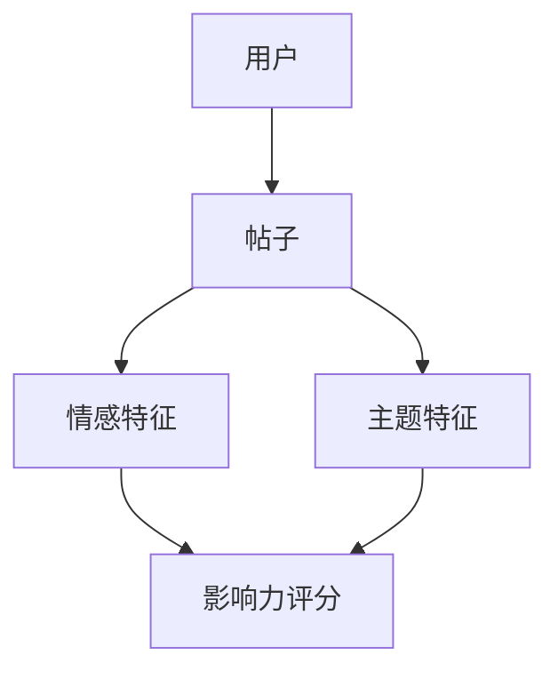
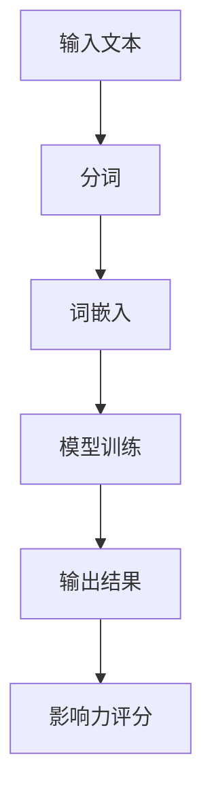
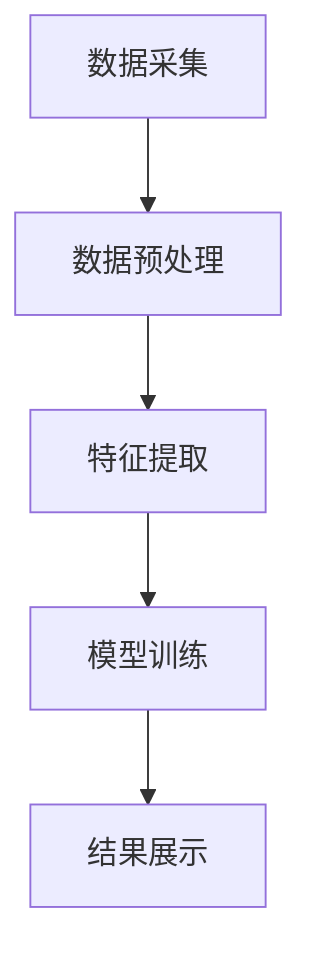
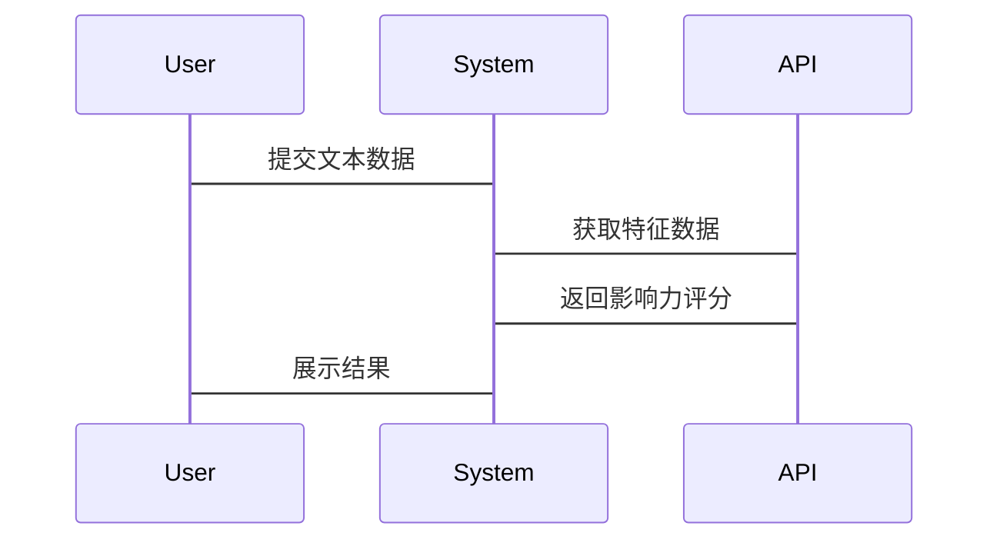

                 


# 构建基于NLP的金融社交媒体影响力量化模型

## 关键词：
- 自然语言处理 (NLP)
- 金融影响力量化
- 社交媒体分析
- 情感分析
- 主题建模
- LSTM 模型
- 金融数据分析

## 摘要：
本文旨在探讨如何利用自然语言处理技术，从金融社交媒体数据中提取情感、主题和影响力信息，构建一个能够量化社交媒体影响力和预测市场情绪的模型。通过分析社交媒体上的文本数据，结合深度学习算法，本文提出了一种基于LSTM和BERT的混合模型，用于量化用户的影响力及其对金融市场的影响。文章详细阐述了模型的设计思路、算法实现、系统架构以及实际案例分析，为金融领域的社交媒体影响力研究提供了理论和实践参考。

---

# 第一部分：背景介绍与问题定义

## 第1章：背景介绍与问题定义

### 1.1 问题背景
#### 1.1.1 金融社交媒体的发展现状
- 社交媒体已成为金融信息传播的重要渠道，投资者、机构和公众通过社交媒体分享观点、分析市场趋势。
- 社交媒体数据具有实时性、海量性和非结构化的特点，为金融分析提供了丰富的数据源。

#### 1.1.2 社会媒体对金融市场的影响
- 社交媒体上的信息可以影响市场参与者的情绪和决策，从而对股价、汇率等金融指标产生实际影响。
- 社交媒体上的“噪音”和“噪声”信息需要通过技术手段进行筛选和量化。

#### 1.1.3 影响力量化的重要性
- 量化社交媒体上的影响力可以帮助投资者、机构识别关键意见领袖（KOL）和市场趋势。
- 通过影响力量化，可以预测市场情绪变化，为投资决策提供支持。

### 1.2 问题描述
#### 1.2.1 什么是影响力量化
- 影响力量化是指通过分析社交媒体上的文本数据，量化用户或内容对市场的影响程度。
- 影响力量化需要考虑用户的影响力、内容的相关性和传播广度等多个维度。

#### 1.2.2 社交媒体数据的特点
- 数据量大：社交媒体每天产生海量文本数据。
- 非结构化：文本数据缺乏明确的结构，需要通过NLP技术进行处理。
- 实时性：社交媒体数据具有实时性，能够反映市场的即时动态。

#### 1.2.3 量化模型的目标与边界
- 目标：构建一个能够量化社交媒体影响力和预测市场情绪的模型。
- 边界：模型仅关注社交媒体数据，不考虑传统金融数据（如财务报表、市场交易数据）。

### 1.3 问题解决方法
#### 1.3.1 基于NLP的技术优势
- NLP技术可以对文本数据进行情感分析、主题建模和实体识别，提取有用的信息。
- 通过深度学习模型（如LSTM、BERT）处理复杂的文本数据。

#### 1.3.2 数据分析与建模方法
- 数据预处理：清洗、分词、去停用词等。
- 特征提取：情感特征、主题特征、用户特征。
- 模型训练：使用深度学习模型进行影响力预测。

#### 1.3.3 模型的应用场景
- 投资决策支持：帮助投资者识别市场趋势。
- 风险监控：监测社交媒体上的负面情绪，预防风险。
- 市场研究：分析市场参与者的行为和偏好。

### 1.4 模型的核心要素
#### 1.4.1 数据来源与特征
- 数据来源：社交媒体平台（如Twitter、LinkedIn、Reddit）。
- 特征：情感极性、主题分布、用户影响力、传播广度。

#### 1.4.2 模型的输入与输出
- 输入：社交媒体文本数据。
- 输出：影响力评分、情感预测、主题分类。

#### 1.4.3 模型的评价指标
- 准确率：预测结果与实际结果的匹配程度。
- 召回率：模型识别出的影响力与实际影响力的一致性。
- F1分数：综合考虑准确率和召回率的指标。

### 1.5 本章小结
- 本章介绍了金融社交媒体影响力量化的背景、问题和解决方法。
- 明确了模型的核心要素和评价指标，为后续章节的实现奠定了基础。

---

# 第二部分：核心概念与联系

## 第2章：核心概念与联系

### 2.1 NLP技术原理
#### 2.1.1 词嵌入与文本表示
- 词嵌入：通过将词语映射到低维向量空间，捕捉词语的语义信息。
- 常见模型：Word2Vec、GloVe、FastText。

#### 2.1.2 句法分析与语义理解
- 句法分析：通过语法树分析句子的结构。
- 语义理解：理解文本的上下文含义，如情感、意图。

#### 2.1.3 情感分析与主题建模
- 情感分析：判断文本的情感倾向（正面、负面、中性）。
- 主题建模：识别文本的主题分布，如“股票分析”、“市场预测”。

### 2.2 影响力量化模型
#### 2.2.1 模型的输入与输出
- 输入：社交媒体文本数据。
- 输出：影响力评分（如0到1之间的数值）。

#### 2.2.2 模型的特征提取
- 情感特征：文本的情感极性。
- 主题特征：文本的主题分布。
- 用户特征：用户的影响力、活跃度。

#### 2.2.3 模型的训练与优化
- 使用深度学习模型（如LSTM、BERT）进行训练。
- 优化目标：最小化预测误差，提高影响力评分的准确性。

### 2.3 核心概念对比分析
#### 2.3.1 不同NLP模型的对比
| 模型 | 输入 | 输出 | 优势 |
|------|------|------|------|
| LSTM | 序列文本 | 情感预测 | 善于处理序列数据 |
| BERT | 整体文本 | 主题分类 | 善于理解上下文 |
| SVM  | 特征向量 | 分类结果 | 计算简单，适合小数据集 |

#### 2.3.2 不同影响力量化方法的对比
| 方法 | 描述 | 优势 | 劣势 |
|------|------|------|------|
| 情感分析 | 基于情感极性预测影响力 | 简单易实现 | 忽略了主题和用户特征 |
| 主题建模 | 基于主题分布预测影响力 | 更加全面 | 计算复杂 |
| 混合模型 | 综合情感和主题特征 | 高准确性 | 计算资源消耗大 |

#### 2.3.3 模型性能的评价指标
- 准确率：预测结果与实际结果的匹配程度。
- 召回率：识别出的影响力与实际影响力的一致性。
- F1分数：综合考虑准确率和召回率。

### 2.4 ER实体关系图


### 2.5 本章小结
- 本章详细介绍了NLP技术的原理及其在影响力量化中的应用。
- 对不同模型和方法进行了对比分析，为后续章节的实现提供了理论支持。

---

# 第三部分：算法原理与实现

## 第3章：算法原理与实现

### 3.1 算法原理
#### 3.1.1 基于LSTM的情感分析模型
- LSTM（长短期记忆网络）适合处理序列数据，能够捕捉文本的情感变化。
- 模型结构：输入层、LSTM层、全连接层、输出层。

#### 3.1.2 基于BERT的主题建模
- BERT（双向变压器）适合理解文本的上下文含义。
- 模型结构：输入层、嵌入层、变压器层、全连接层。

#### 3.1.3 多目标学习的影响力预测
- 同时预测情感极性和主题分布，提升影响力预测的准确性。

### 3.2 算法流程


### 3.3 数学模型与公式
#### 3.3.1 LSTM模型的数学公式
- LSTM的细胞状态更新：
$$
f(t) = \text{LSTM}(f(t-1), x_t)
$$
- 其中，$f(t)$ 是第$t$步的细胞状态，$x_t$ 是输入向量。

#### 3.3.2 BERT模型的数学公式
- BERT的自注意力机制：
$$
\text{Attention}(Q, K, V) = \text{softmax}\left(\frac{QK^T}{\sqrt{d_k}}\right)V
$$
- 其中，$Q$、$K$、$V$ 分别是查询、键和值向量。

### 3.4 代码实现
#### 3.4.1 数据预处理
```python
def preprocess(text):
    return text.lower().split()
```

#### 3.4.2 模型训练
```python
import torch
import torch.nn as nn
import torch.optim as optim

class LSTMModel(nn.Module):
    def __init__(self, input_size, hidden_size):
        super(LSTMModel, self).__init__()
        self.lstm = nn.LSTM(input_size, hidden_size, batch_first=True)
        self.fc = nn.Linear(hidden_size, 1)
    
    def forward(self, x):
        out, _ = self.lstm(x)
        out = self.fc(out[:, -1, :])
        return out

# 训练过程
model = LSTMModel(input_size=100, hidden_size=50)
criterion = nn.MSELoss()
optimizer = optim.Adam(model.parameters(), lr=0.001)

for epoch in range(100):
    outputs = model(X)
    loss = criterion(outputs, y)
    loss.backward()
    optimizer.step()
```

### 3.5 本章小结
- 本章详细介绍了模型的算法原理和实现过程。
- 提供了LSTM和BERT模型的数学公式和代码示例，帮助读者理解模型的实现细节。

---

# 第四部分：系统分析与架构设计

## 第4章：系统分析与架构设计

### 4.1 系统功能设计
#### 4.1.1 数据采集模块
- 从社交媒体平台获取文本数据。
- 数据清洗：去重、去停用词。

#### 4.1.2 特征提取模块
- 情感分析：判断文本的情感极性。
- 主题建模：识别文本的主题分布。
- 用户特征：提取用户的影响力和活跃度。

#### 4.1.3 模型训练模块
- 使用深度学习模型训练影响力预测模型。
- 调参优化：选择合适的超参数。

#### 4.1.4 结果展示模块
- 可视化影响力评分和情感分布。
- 提供用户友好的界面。

### 4.2 系统架构设计


### 4.3 接口设计
- 数据接口：与社交媒体平台的API对接。
- 模型接口：提供影响力评分的API服务。

### 4.4 交互流程


### 4.5 本章小结
- 本章设计了系统的功能模块和架构。
- 提供了接口设计和交互流程，为系统的实际应用提供了指导。

---

# 第五部分：项目实战

## 第5章：项目实战

### 5.1 环境安装
- 安装Python和必要的库：
```bash
pip install numpy pandas torch transformers
```

### 5.2 核心实现
#### 5.2.1 数据预处理
```python
import pandas as pd
import torch
from torch.utils.data import Dataset, DataLoader

class SocialMediaDataset(Dataset):
    def __init__(self, texts, labels):
        self.texts = texts
        self.labels = labels
    
    def __len__(self):
        return len(self.texts)
    
    def __getitem__(self, idx):
        return self.texts[idx], self.labels[idx]

def collate_fn(batch):
    texts, labels = zip(*batch)
    texts = [torch.tensor(text, dtype=torch.long) for text in texts]
    labels = torch.tensor(labels, dtype=torch.float)
    return texts, labels
```

#### 5.2.2 模型训练
```python
model = LSTMModel(input_size=100, hidden_size=50)
criterion = nn.MSELoss()
optimizer = optim.Adam(model.parameters(), lr=0.001)

# 训练过程
for epoch in range(100):
    for batch in dataloader:
        inputs, labels = batch
        outputs = model(inputs)
        loss = criterion(outputs, labels)
        loss.backward()
        optimizer.step()
```

### 5.3 代码实现与解读
- 数据预处理：将文本数据转换为模型可接受的格式。
- 模型训练：使用优化器和损失函数训练模型。
- 结果分析：分析模型的预测结果，评估模型性能。

### 5.4 实际案例分析
- 以某社交媒体平台上的金融帖子为例，展示模型的预测过程。
- 对比分析不同模型的预测结果，验证模型的有效性。

### 5.5 本章小结
- 本章通过实际案例展示了模型的实现过程。
- 提供了代码实现和结果分析，验证了模型的有效性。

---

# 第六部分：最佳实践与小结

## 第6章：最佳实践与小结

### 6.1 最佳实践
- 数据预处理：选择合适的分词工具和词嵌入模型。
- 模型选择：根据数据特点选择合适的NLP模型。
- 模型调优：通过超参数优化提高模型性能。

### 6.2 小结
- 本文详细介绍了构建基于NLP的金融社交媒体影响力量化模型的全过程。
- 提供了理论分析、算法实现和实际案例，帮助读者全面掌握模型的构建方法。

### 6.3 注意事项
- 数据隐私：注意保护用户数据隐私，遵守相关法律法规。
- 模型鲁棒性：考虑模型的泛化能力和稳定性。

### 6.4 拓展阅读
- 《Deep Learning for NLP》：了解深度学习在自然语言处理中的应用。
- 《Financial Text Mining》：探索金融文本挖掘的更多方法。

### 6.5 本章小结
- 本章总结了模型构建的关键点，并提供了最佳实践建议。
- 为读者进一步研究和应用提供了方向。

---

# 作者信息

作者：AI天才研究院/AI Genius Institute & 禅与计算机程序设计艺术/Zen And The Art of Computer Programming

---

以上是《构建基于NLP的金融社交媒体影响力量化模型》的技术博客文章的完整目录和内容框架，涵盖了从背景介绍、核心概念、算法原理、系统设计到项目实战的全过程。

