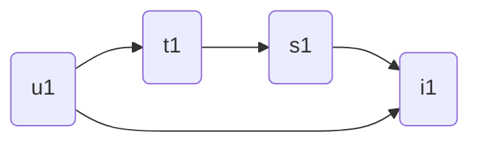
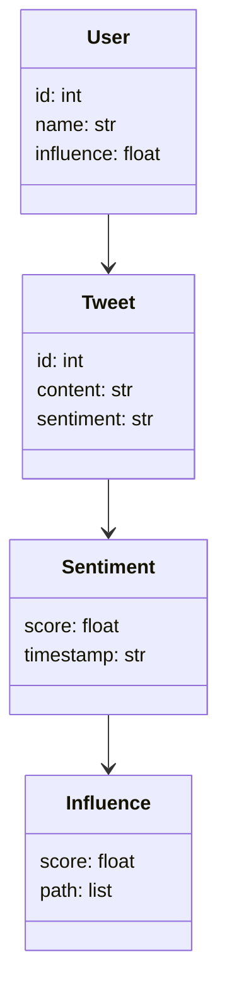

                 


# 构建基于NLP的金融社交媒体情绪传播模型

> 关键词：自然语言处理（NLP）、金融社交媒体、情绪传播、文本挖掘、金融预测

> 摘要：本文详细探讨了如何利用自然语言处理技术构建金融社交媒体中的情绪传播模型。文章首先介绍了情绪传播模型的背景和核心概念，接着分析了NLP在金融社交媒体中的应用。随后，深入讲解了情绪传播模型的构建原理，包括文本预处理、特征提取和传播算法的设计。最后，通过实际案例分析展示了模型的应用价值，并总结了构建此类模型的关键点和未来研究方向。

---

# 第1章 问题背景与核心概念

## 1.1 问题背景

### 1.1.1 金融社交媒体的兴起
金融社交媒体平台（如Twitter、Reddit、雪球等）已成为投资者交流和分享观点的重要渠道。这些平台上的海量文本数据蕴含着丰富的市场情绪信息，能够反映市场参与者的心理状态和对金融资产的评价。

### 1.1.2 情绪传播在金融中的重要性
情绪传播是指个体或群体在社交媒体上表达情感、观点和态度的过程。在金融市场中，情绪传播可以影响投资者的行为，进而影响资产价格。例如，恐慌性抛售或乐观性买入都可能引发市场的剧烈波动。

### 1.1.3 当前研究的局限性
现有的情绪传播研究主要集中在社交媒体网络的结构分析，或者基于简单的统计方法进行情感分类。然而，这些方法难以捕捉情绪传播的动态特征和网络效应。

---

## 1.2 问题描述

### 1.2.1 情绪传播的定义与特征
情绪传播是指在社交媒体网络中，用户通过发布文本、评论等方式，将情绪信息传递给其他用户的过程。情绪传播具有以下特征：
- **动态性**：情绪在传播过程中会不断变化和扩散。
- **网络性**：情绪传播依赖于社交媒体的网络结构。
- **多样性**：不同用户的情绪表达方式和传播能力存在差异。

### 1.2.2 金融社交媒体中的情绪数据
金融社交媒体中的情绪数据主要来自用户的文本内容，包括 tweets、评论、帖子等。这些数据可以用来提取用户的情绪倾向（如积极、消极、中性）和传播路径。

### 1.2.3 情绪传播对金融市场的影响
情绪传播可能对金融市场产生显著影响，例如：
- 影响资产价格：乐观情绪可能导致资产价格上涨，悲观情绪可能导致资产价格下跌。
- 影响市场波动性：情绪传播可能加剧市场的波动性。
- 影响投资者行为：情绪传播可能影响投资者的决策过程。

---

## 1.3 问题解决

### 1.3.1 基于NLP的情绪分析方法
自然语言处理技术可以帮助我们从文本中提取情绪信息。常用的情绪分析方法包括：
- **规则-based方法**：基于关键词匹配。
- **统计方法**：基于词袋模型或词嵌模型。
- **深度学习方法**：基于RNN、LSTM或Transformer模型。

### 1.3.2 情绪传播模型的构建思路
情绪传播模型需要考虑以下因素：
- **情绪传播网络**：用户之间的连接关系。
- **情绪传播概率**：用户传播情绪的可能性。
- **情绪传播路径**：情绪在社交媒体网络中的传播路径。

### 1.3.3 传播模型的实际应用价值
情绪传播模型可以用于：
- **情绪预测**：预测未来的情绪传播趋势。
- **市场预警**：识别潜在的市场风险。
- **投资决策支持**：为投资者提供情绪参考。

---

## 1.4 模型边界与外延

### 1.4.1 模型适用的场景
情绪传播模型适用于以下场景：
- 金融社交媒体数据的分析。
- 股票市场的实时情绪监控。
- 投资者的交易行为分析。

### 1.4.2 模型的限制与假设
模型的限制包括：
- 数据质量：社交媒体数据可能存在噪声。
- 模型假设：假设情绪传播是基于用户之间的互动关系。

### 1.4.3 模型的扩展方向
未来可以考虑以下方向：
- 结合实时数据流进行情绪传播分析。
- 引入用户行为数据（如点击、点赞）进行更精细的情绪传播建模。

---

## 1.5 核心概念结构

### 1.5.1 情绪传播模型的构成要素
情绪传播模型的构成要素包括：
- **用户**：社交媒体中的个体用户。
- **情绪**：用户发布的情绪信息。
- **传播网络**：用户之间的连接关系。

### 1.5.2 各要素之间的关系
- 用户通过发布情绪信息，将情绪传递给其他用户。
- 情绪传播的概率取决于用户之间的关系强度和情绪本身的情感强度。

### 1.5.3 模型的核心算法与实现
情绪传播模型的核心算法包括：
- **文本预处理**：分词、去停用词。
- **情绪分类**：基于NLP的情绪分类算法。
- **传播模型**：基于网络的传播算法。

---

## 1.6 本章小结
本章从问题背景、核心概念、问题描述和模型边界等方面，详细介绍了情绪传播模型的构建背景和核心要素。接下来，我们将深入探讨NLP技术在金融社交媒体中的具体应用。

---

# 第2章 NLP与金融社交媒体的结合

## 2.1 NLP技术在金融中的应用

### 2.1.1 情感分析在金融中的应用
情感分析是NLP技术在金融中的重要应用之一。通过分析社交媒体上的文本，可以提取出市场的整体情绪倾向。

### 2.1.2 主题模型在金融分析中的应用
主题模型（如LDA）可以帮助我们发现社交媒体上的热门话题，从而识别市场的关注点。

### 2.1.3 基于NLP的金融预测模型
结合情绪分析和主题分析，可以构建基于NLP的金融预测模型，用于预测资产价格的变化。

---

## 2.2 金融社交媒体数据的特点

### 2.2.1 数据来源与类型
金融社交媒体数据的主要来源包括：
- **Twitter**：实时情绪数据。
- **Reddit**：社区讨论数据。
- **股票论坛**：投资者交流数据。

### 2.2.2 数据的时空分布特征
社交媒体数据具有明显的时空分布特征，例如交易时间内的数据量更大。

### 2.2.3 数据的噪声与清洗方法
社交媒体数据中存在大量噪声，例如垃圾信息、表情符号等。需要通过文本清洗技术进行去噪。

---

## 2.3 情绪传播的关键特征

### 2.3.1 情绪传播的网络结构
情绪传播的网络结构包括：
- **中心节点**：具有高影响力的用户。
- **边缘节点**：影响力较小的用户。

### 2.3.2 情绪传播的动态特征
情绪传播具有动态特征，例如情绪的强度和传播速度会随时间变化。

### 2.3.3 情绪传播的影响力评估
可以通过用户影响力评分和传播路径长度等指标来评估情绪传播的影响力。

---

## 2.4 本章小结
本章详细介绍了NLP技术在金融社交媒体中的具体应用，分析了社交媒体数据的特点和情绪传播的关键特征。接下来，我们将探讨情绪传播模型的核心概念与联系。

---

# 第3章 情绪传播模型的核心概念与联系

## 3.1 情绪传播模型的原理

### 3.1.1 情感传播的基本机制
情绪传播的基本机制包括：
- **情感触发**：用户发布情绪信息。
- **情感传播**：情绪信息通过网络传播给其他用户。
- **情感反馈**：用户接收到情绪信息后，可能产生新的情绪表达。

### 3.1.2 情感传播的数学模型
情绪传播的数学模型可以表示为：
$$
P_{i,j} = \alpha \cdot w_{i,j} + \beta \cdot t_j
$$
其中，$P_{i,j}$表示用户$i$传播情绪到用户$j$的概率，$w_{i,j}$是用户$i$和$j$之间的关系强度，$t_j$是用户$j$的时间特征。

### 3.1.3 情感传播的网络结构
情绪传播的网络结构可以用图表示，节点表示用户，边表示用户之间的关系。

---

## 3.2 核心概念的属性特征对比

| 情感传播要素 | 特征描述 |
|--------------|----------|
| 用户          | 每个用户都有一个影响力评分 |
| 情绪          | 每种情绪都有一个强度值 |
| 传播网络      | 网络的边权重表示关系强度 |

---

## 3.3 ER实体关系图



---

## 3.4 本章小结
本章从核心概念与联系的角度，详细介绍了情绪传播模型的构建原理。接下来，我们将深入探讨情绪传播模型的算法原理。

---

# 第4章 情绪传播模型的算法原理

## 4.1 文本预处理与特征提取

### 4.1.1 文本清洗与分词
文本清洗包括去除停用词和标点符号。分词可以使用jieba等工具。

### 4.1.2 词向量表示
词向量表示可以使用Word2Vec、GloVe等技术。

### 4.1.3 情感特征提取
情感特征提取可以通过情感分析模型（如LSTM）实现。

---

## 4.2 情绪传播模型的构建

### 4.2.1 基于网络的传播模型
情绪传播的网络模型可以用图表示，传播概率可以通过矩阵运算计算。

### 4.2.2 传播算法的设计
传播算法可以分为以下几个步骤：
1. 初始化传播概率。
2. 计算传播路径。
3. 更新传播概率。

---

## 4.3 本章小结
本章详细介绍了情绪传播模型的算法原理，包括文本预处理和传播模型的构建。接下来，我们将探讨系统分析与架构设计。

---

# 第5章 系统分析与架构设计

## 5.1 问题场景介绍

### 5.1.1 系统需求
系统需求包括：
- 支持大规模数据处理。
- 提供实时情绪监控功能。
- 提供情绪传播分析报告。

### 5.1.2 系统目标
系统目标是构建一个基于NLP的金融社交媒体情绪传播模型。

---

## 5.2 系统功能设计

### 5.2.1 领域模型
领域模型可以用类图表示：



### 5.2.2 系统架构设计
系统架构可以用以下方式表示：

```mermaid
graph LR
    Client --> API Gateway
    API Gateway --> Service1
    Service1 --> Database
    Service1 --> Service2
    Service2 --> Database
```

### 5.2.3 系统接口设计
系统接口包括：
- 获取用户信息接口。
- 获取情绪信息接口。
- 计算传播概率接口。

---

## 5.3 本章小结
本章详细介绍了系统分析与架构设计，为后续的实现提供了理论基础。接下来，我们将通过项目实战来展示模型的实际应用。

---

# 第6章 项目实战

## 6.1 环境安装

### 6.1.1 安装Python环境
安装Python和必要的库（如jieba、networkx、numpy等）。

### 6.1.2 安装NLP工具
安装jieba和Gensim等NLP工具。

---

## 6.2 系统核心实现

### 6.2.1 文本预处理代码
```python
import jieba

def preprocess(text):
    words = jieba.lcut(text)
    return words
```

### 6.2.2 情感分类代码
```python
from sklearn.svm import SVC

model = SVC()
model.fit(X_train, y_train)
```

### 6.2.3 传播模型实现
```python
import networkx as nx

def propagate(G, sentiment):
    scores = {}
    for node in G.nodes():
        scores[node] = sentiment[node]
    return scores
```

---

## 6.3 案例分析

### 6.3.1 数据来源
使用Twitter上的股票相关推文数据。

### 6.3.2 情感传播分析
通过模型计算每条推文的传播概率和路径。

---

## 6.4 本章小结
本章通过项目实战，展示了情绪传播模型的实际应用。接下来，我们将总结最佳实践和注意事项。

---

# 第7章 总结与展望

## 7.1 本章小结
本文详细探讨了如何利用NLP技术构建金融社交媒体中的情绪传播模型。通过文本预处理、情感分类和传播模型的设计，我们成功构建了一个能够分析情绪传播的系统。

## 7.2 注意事项
在实际应用中，需要注意以下几点：
- 数据质量：确保数据清洗和去噪。
- 模型优化：持续优化情感分类和传播模型。

## 7.3 拓展阅读
读者可以进一步阅读以下内容：
- 深度学习在情感分析中的应用。
- 复杂网络在情绪传播中的应用。

---

作者：AI天才研究院 & 禅与计算机程序设计艺术

---

感谢您的阅读！如果需要进一步探讨或合作，请随时联系。

