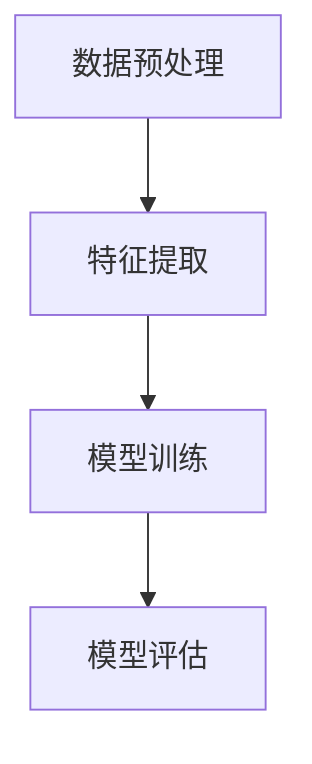
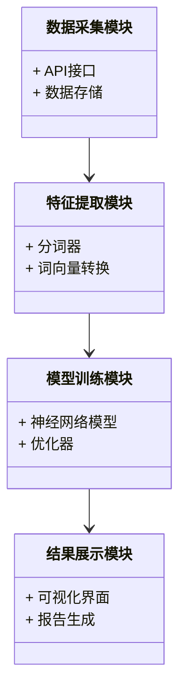
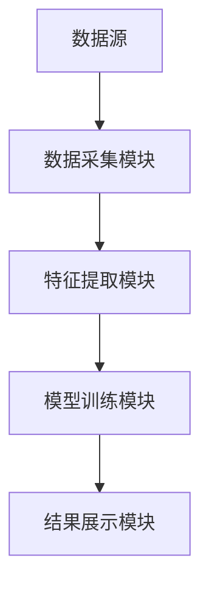
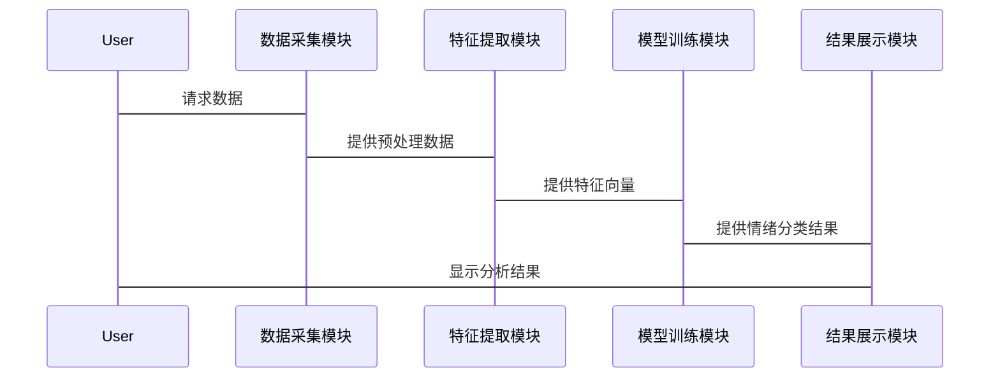

                 


```markdown
# 构建基于NLP的金融社交媒体情绪分析模型

## 关键词：自然语言处理、情绪分析、金融、社交媒体、深度学习

## 摘要：本文详细探讨了如何利用自然语言处理技术构建金融社交媒体情绪分析模型。首先介绍了情绪分析的基本概念及其在金融领域的应用，然后深入讲解了自然语言处理的基础知识，包括文本预处理、词嵌入和经典NLP模型。接着，分析了情绪分析的机器学习方法，包括监督学习和深度学习技术。随后，讨论了金融领域情绪分析的独特挑战，并提出了相应的解决方案。最后，通过实际项目展示了模型的构建过程，包括数据采集、特征提取、模型训练和结果分析。本文旨在为读者提供从理论到实践的全面指导，帮助他们掌握构建高效的情绪分析模型的技巧。

---

## 第一部分: 基于NLP的金融社交媒体情绪分析模型概述

### 第1章: 情绪分析与金融应用概述

#### 1.1 情绪分析的基本概念
##### 1.1.1 情绪分析的定义与核心概念
- 情绪分析的定义：通过自然语言处理技术，对文本中的情感倾向进行分类。
- 核心概念：情感极性（positive/negative）、情感强度、情感类别。

##### 1.1.2 情绪分析在金融领域的应用背景
- 金融市场的复杂性：投资者情绪对市场波动的影响。
- 社交媒体在金融决策中的作用：实时信息、用户生成内容的分析。

##### 1.1.3 金融社交媒体情绪分析的重要性
- 帮助投资者做出更明智的决策。
- 提供市场趋势的早期预警。

#### 1.2 金融社交媒体数据的特点
##### 1.2.1 社交媒体数据的多样性
- 文本数据：社交媒体帖子、评论、新闻标题。
- 非结构化数据：情感、观点、意图。

##### 1.2.2 金融数据的特殊性
- 数据的时间敏感性：实时分析的需求。
- 数据的稀疏性：某些情绪类别样本不足。

##### 1.2.3 情绪分析在金融决策中的作用
- 预测市场走势：通过分析投资者情绪预测股票价格。
- 提供投资建议：基于情绪数据优化投资策略。

#### 1.3 情绪分析模型的构建目标
##### 1.3.1 理解用户情绪
- 分析用户对金融产品的看法。
- 识别市场参与者的信心水平。

##### 1.3.2 预测市场走势
- 通过情绪数据预测股票价格波动。
- 识别市场拐点。

##### 1.3.3 提供投资决策支持
- 帮助投资者做出更明智的投资决策。
- 优化投资组合。

---

## 第二部分: 自然语言处理（NLP）基础

### 第2章: NLP的核心概念与技术

#### 2.1 语言学基础
##### 2.1.1 词语的构成与句法分析
- 词语的构成：词根、前缀、后缀。
- 句法分析：语法树、依存关系。

##### 2.1.2 文本的语义与语用分析
- 语义分析：词语在上下文中的含义。
- 语用分析：语境中的隐含意义。

#### 2.2 文本预处理技术
##### 2.2.1 分词与词干提取
- 分词：将文本分割成单词或短语。
- 词干提取：去除单词的后缀，保留词干。

##### 2.2.2 停用词处理
- 停用词：常见但无实际意义的词汇（如“and”、“the”）。

##### 2.2.3 词向量表示
- 词袋模型：将文本表示为词汇的频率向量。
- 词嵌入技术：通过深度学习生成词向量（如Word2Vec、GloVe）。

#### 2.3 词嵌入与表示学习
##### 2.3.1 词袋模型
- 优缺点：简单但信息量有限。

##### 2.3.2 词嵌入技术
- Word2Vec：通过神经网络训练词向量。
- BERT：基于Transformer的预训练模型。

##### 2.3.3 现代词嵌入技术
- 使用BERT等预训练模型捕捉上下文信息。

---

### 第3章: 情绪分析的机器学习方法

#### 3.1 监督学习与特征工程
##### 3.1.1 常见的情绪分类算法
- 朴素贝叶斯：简单但效果不错。
- 支持向量机：适用于小规模数据。

##### 3.1.2 特征提取与选择
- 词频统计：TF-IDF。
- 词嵌入：Word2Vec、BERT。

##### 3.1.3 模型训练与评估
- 交叉验证：防止过拟合。
- 分类指标：准确率、召回率、F1值。

#### 3.2 情绪分析的深度学习方法
##### 3.2.1 RNN与LSTM在情绪分析中的应用
- RNN：处理序列数据。
- LSTM：长短期记忆网络，捕捉长距离依赖。

##### 3.2.2 Transformer架构的优势
- 并行计算：高效处理大规模数据。
- 自注意力机制：捕捉全局信息。

##### 3.2.3 预训练语言模型（如BERT）的应用
- 使用BERT进行文本表示。
- 微调模型：针对特定任务优化。

#### 3.3 情绪分析的算法实现
##### 3.3.1 算法流程图


##### 3.3.2 代码实现示例
```python
def preprocess(text):
    # 文本预处理代码
    return processed_text

model = BertForSequenceClassification.from_pretrained("bert-base-uncased")
```

---

## 第三部分: 金融领域的情绪分析挑战与解决方案

### 第4章: 金融领域的情绪分析挑战

#### 4.1 数据稀疏性
##### 4.1.1 问题描述
- 某些情绪类别样本不足。

##### 4.1.2 解决方案
- 数据增强：生成更多样本。
- 迁移学习：利用其他领域的数据。

#### 4.2 领域适应性
##### 4.2.1 问题描述
- 预训练模型在金融领域的表现不佳。

##### 4.2.2 解决方案
- 领域微调：在金融数据上微调模型。
- 多任务学习：结合其他任务增强模型表现。

#### 4.3 实时性要求
##### 4.3.1 问题描述
- 高频交易需要实时情绪分析。

##### 4.3.2 解决方案
- 网络架构优化：减少计算时间。
- 使用轻量级模型：如MobileBERT。

---

## 第四部分: 系统架构与项目实战

### 第5章: 系统架构设计

#### 5.1 系统功能设计
##### 5.1.1 功能模块
- 数据采集模块：从社交媒体获取数据。
- 特征提取模块：处理文本数据。
- 模型训练模块：训练情绪分类模型。
- 结果展示模块：可视化分析结果。

##### 5.1.2 实体关系图


#### 5.2 系统架构图


#### 5.3 接口设计与交互
##### 5.3.1 接口设计
- 数据接口：RESTful API。
- 模型接口：提供情绪分类服务。

##### 5.3.2 交互流程


---

## 第五章: 项目实战

### 5.1 环境搭建与数据采集

#### 5.1.1 环境搭建
- 安装Python、TensorFlow、Keras、BERT库。
- 安装社交媒体API（如Twitter API）。

#### 5.1.2 数据采集
- 使用Twitter API获取 tweets。
- 数据清洗：去除无关信息。

### 5.2 特征提取与模型训练

#### 5.2.1 特征提取
- 使用BERT进行文本表示。
- 提取文本嵌入作为特征。

#### 5.2.2 模型训练
- 使用预训练BERT模型微调任务。
- 调参优化：学习率、批量大小、 epochs。

### 5.3 模型实现与结果分析

#### 5.3.1 代码实现
```python
from transformers import BertForSequenceClassification, BertTokenizer
import torch

tokenizer = BertTokenizer.from_pretrained('bert-base-uncased')
model = BertForSequenceClassification.from_pretrained('bert-base-uncased', num_labels=3)
```

#### 5.3.2 结果分析
- 模型准确率、召回率、F1值。
- 可视化分析：情感分布、关键词分析。

### 5.4 项目小结
- 成功构建了一个基于BERT的情绪分析模型。
- 验证了模型在金融领域的有效性。

---

## 第六章: 总结与展望

### 6.1 全文总结
- 本文详细介绍了如何构建基于NLP的金融社交媒体情绪分析模型。
- 结合了NLP基础、机器学习算法和系统架构设计。

### 6.2 未来展望
- 提高模型的实时性和可解释性。
- 探索更先进的预训练模型（如T5、GPT）。
- 拓展到更多金融场景的应用。

### 6.3 最佳实践 Tips
- 数据预处理是关键。
- 选择合适的模型架构。
- 持续优化模型参数。

---

## 作者：AI天才研究院/AI Genius Institute & 禅与计算机程序设计艺术 /Zen And The Art of Computer Programming

---

**注：以上目录大纲为《构建基于NLP的金融社交媒体情绪分析模型》的详细内容框架，每个部分都可以展开为具体的章节内容，结合理论分析、算法实现和项目实战，确保文章的深度和广度。**
```

