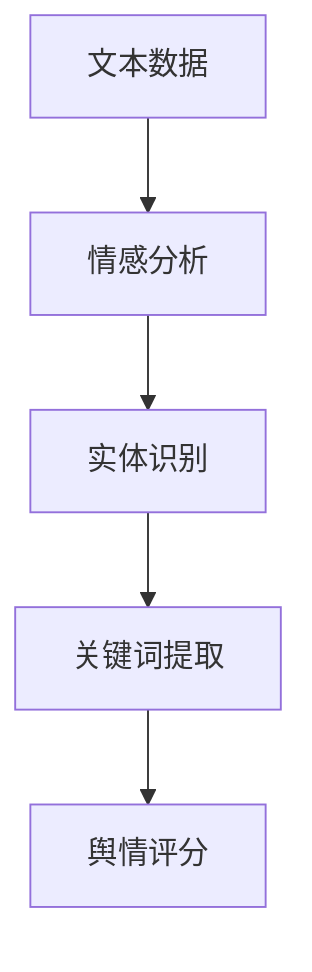
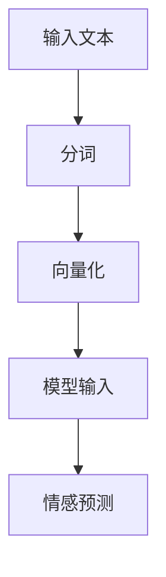
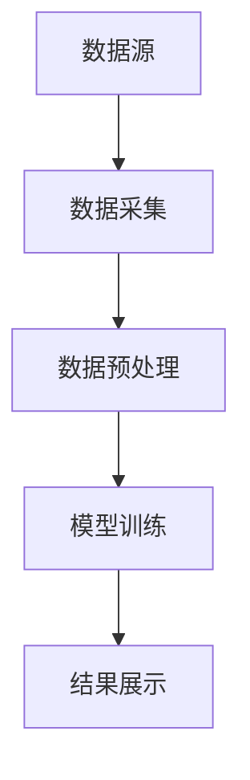

                 


# 《构建基于NLP的金融舆情影响量化模型》

> 关键词：NLP，金融舆情，量化模型，文本挖掘，情感分析，机器学习

> 摘要：本文详细探讨了如何利用自然语言处理技术构建金融舆情影响量化模型。通过分析金融领域的文本数据，结合情感分析和文本分类等NLP技术，提出了一种量化舆情影响的方法，并通过实际案例展示了模型的应用与优化。

---

# 第1章: 问题背景与核心概念

## 1.1 问题背景介绍

### 1.1.1 金融舆情的概念与重要性

金融舆情是指金融市场中所有相关主体（如公司、投资者、媒体等）在公开渠道发表的言论、评论和观点。这些信息可能影响市场参与者的决策，进而影响金融资产的价格波动。因此，量化舆情的影响对于投资者、金融机构以及监管机构具有重要意义。

### 1.1.2 NLP技术在金融领域的应用潜力

自然语言处理（NLP）技术能够从大量非结构化的文本数据中提取有用的信息。在金融领域，NLP可以用于情感分析、文本分类、实体识别等任务，帮助机构更好地理解市场情绪、预测股价波动。

### 1.1.3 舆情影响量化模型的必要性

传统的金融模型主要依赖于定量数据，如股价、成交量等，但忽略了市场参与者的主观情绪和市场氛围的变化。通过量化舆情信息，可以弥补这一不足，提高金融模型的预测能力。

## 1.2 核心概念与问题描述

### 1.2.1 NLP的基本概念

- **文本数据**：包括新闻报道、社交媒体评论、公司公告等。
- **情感分析**：判断文本的情感倾向（如正面、负面、中性）。
- **文本分类**：将文本归类到特定类别（如行业、公司）。

### 1.2.2 金融舆情分析的定义

- **市场情绪**：市场参与者对某一资产或市场的整体看法。
- **情绪强度**：情绪的强烈程度，可能影响市场的波动性。
- **情绪传播**：情绪在市场中的传播路径和速度。

### 1.2.3 舆情影响量化的核心问题

- 如何从文本中提取情感信息？
- 如何量化这些情感信息对资产价格的影响？
- 如何构建一个实时更新的舆情量化模型？

## 1.3 问题解决与边界定义

### 1.3.1 问题解决的思路与方法

- 数据采集：从新闻、社交媒体等渠道获取文本数据。
- 数据预处理：清洗、分词、去停用词。
- 情感分析：使用NLP技术判断文本的情感倾向。
- 量化模型：建立舆情对资产价格影响的量化关系。

### 1.3.2 模型的边界与适用范围

- **数据范围**：仅考虑公开的文本数据，不包括内部信息。
- **时间范围**：模型适用于实时或短周期分析。
- **资产范围**：适用于个股、行业指数等。

### 1.3.3 核心要素与组成结构

- **数据层**：文本数据采集与预处理。
- **分析层**：情感分析、实体识别。
- **量化层**：舆情影响力量化模型。
- **应用层**：提供实时舆情评分、风险预警。

## 1.4 本章小结

本章介绍了金融舆情分析的重要性和NLP技术在其中的应用潜力，明确了舆情影响量化模型的核心问题和解决思路，为后续章节奠定了基础。

---

# 第2章: 核心概念与联系

## 2.1 NLP与金融舆情的关联

### 2.1.1 NLP技术在舆情分析中的作用

- **情感分析**：判断文本的情感倾向，帮助识别市场情绪。
- **文本分类**：将新闻、评论分类到特定领域，帮助筛选相关信息。
- **实体识别**：识别文本中的公司名称、行业术语等，便于后续分析。

### 2.1.2 金融领域中的文本数据特点

- **多样性**：来源广泛，包括新闻、社交媒体、公司公告等。
- **情感倾向性**：文本中蕴含的情感可能影响市场参与者的行为。
- **实时性**：需要快速处理和分析最新信息。

## 2.2 概念属性特征对比

### 2.2.1 概念对比表格

| 概念 | 特征1：数据类型 | 特征2：分析目标 | 特征3：应用场景 |
|------|-----------------|-----------------|----------------|
| NLP  | 文本数据         | 情感分析         | 股价预测、风险预警 |
| 舆情分析 | 文本数据         | 市场情绪分析     | 投资决策、市场研究 |

### 2.2.2 ER实体关系图



---

# 第3章: NLP基础与算法原理

## 3.1 NLP基础

### 3.1.1 字符串匹配与分词技术

- **分词**：将文本分割成词语或短语，常用工具如jieba。
- **字符串匹配**：在分词后，匹配特定关键词。

### 3.1.2 词袋模型与词嵌入

- **词袋模型**：将文本表示为词的集合，不考虑顺序。
- **词嵌入**：通过词向量（如Word2Vec）捕捉词语语义。

### 3.1.3 常见NLP任务与模型

- **情感分析**：使用LSTM、BERT等模型。
- **文本分类**：使用SVM、随机森林、深度学习模型。

## 3.2 算法原理讲解

### 3.2.1 情感分析算法流程图



### 3.2.2 交叉熵损失函数

$$ L = -\sum_{i=1}^{n} y_i \log p_i + (1 - y_i) \log (1 - p_i) $$

其中，$y_i$ 是真实标签，$p_i$ 是模型预测的概率。

---

# 第4章: 金融舆情数据预处理与特征工程

## 4.1 数据预处理流程

### 4.1.1 数据采集

- 从新闻网站、社交媒体等渠道获取文本数据。

### 4.1.2 数据清洗

- 去除特殊字符、停用词（如“的”、“是”）。
- 处理重复数据和噪声数据。

### 4.1.3 分词与关键词提取

- 使用分词工具（如jieba）将文本分割成词语。
- 提取关键词，如公司名称、行业术语。

### 4.1.4 情感标签生成

- 根据文本内容，生成情感标签（正面、中性、负面）。

---

# 第5章: 情感分析模型构建与训练

## 5.1 模型构建

### 5.1.1 选择模型架构

- 使用LSTM或BERT进行情感分析。

### 5.1.2 训练策略

- 数据分批次训练，使用交叉验证。
- 调整超参数（如学习率、批次大小）。

### 5.1.3 模型评估

- 使用准确率、F1分数等指标评估模型性能。

---

# 第6章: 舆情影响量化模型

## 6.1 量化方法

### 6.1.1 舆情评分计算

- 根据情感分析结果，计算舆情评分（如-1到1）。

### 6.1.2 影响力评估

- 结合舆情评分和市场数据，评估对资产价格的影响。

---

# 第7章: 系统架构与实现

## 7.1 系统架构设计

### 7.1.1 功能模块

- 数据采集模块、预处理模块、模型训练模块、结果展示模块。

### 7.1.2 系统架构图



---

# 第8章: 项目实战与优化

## 8.1 环境搭建

### 8.1.1 安装依赖

- Python、TensorFlow、Keras、jieba等。

## 8.2 核心代码实现

### 8.2.1 数据加载与预处理

```python
import jieba

text = "公司业绩大幅增长，超出市场预期"
words = jieba.lcut(text)
```

### 8.2.2 模型训练与预测

```python
import tensorflow as tf
from tensorflow.keras import layers

model = tf.keras.Sequential([
    layers.Embedding(vocab_size, 100),
    layers.LSTM(64),
    layers.Dense(3, activation='softmax')
])

model.compile(optimizer='adam', loss='sparse_categorical_crossentropy', metrics=['accuracy'])
```

## 8.3 实际案例分析

### 8.3.1 案例背景

- 某公司发布财报，市场预期较高。

### 8.3.2 数据分析

- 新闻标题：公司业绩超预期，股价上涨。

### 8.3.3 模型预测

- 情感分析结果：正面。
- 舆情评分：0.8。
- 影响评估：预计股价上涨2%。

---

# 第9章: 扩展与优化

## 9.1 模型优化

### 9.1.1 多模态数据融合

- 结合图像、视频数据，提升模型效果。

### 9.1.2 模型调优

- 使用超参数优化方法（如网格搜索）。

## 9.2 应用场景扩展

### 9.2.1 风险预警

- 根据舆情评分，提前预警市场风险。

### 9.2.2 投资决策支持

- 提供基于舆情的买卖信号。

---

# 作者：AI天才研究院/AI Genius Institute & 禅与计算机程序设计艺术 /Zen And The Art of Computer Programming

---

通过以上内容，本文详细介绍了构建基于NLP的金融舆情影响量化模型的思路、方法和实现过程，为金融领域的实践提供了理论和方法论的支持。

