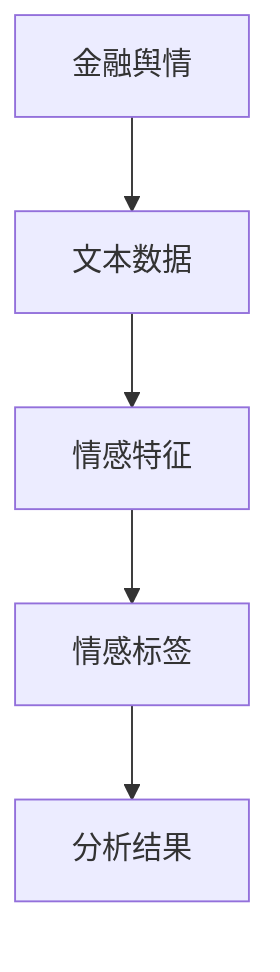
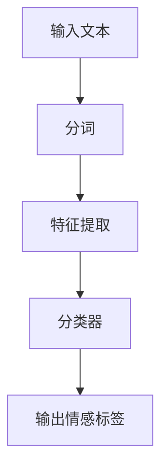
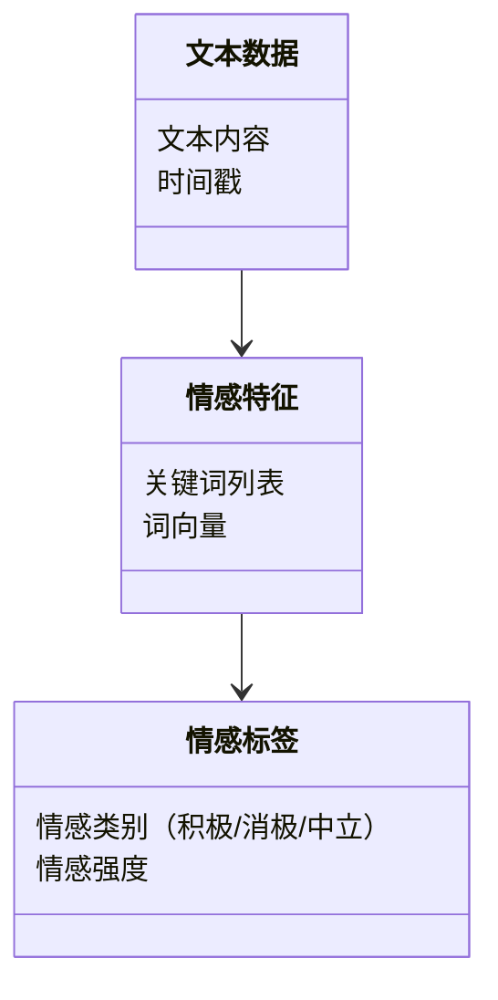
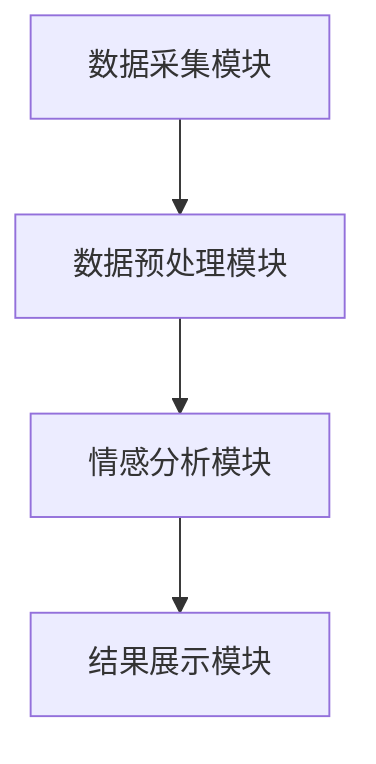
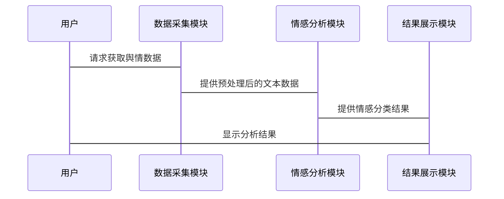

                 

<think>
好，我现在需要帮用户撰写一篇关于《构建基于NLP的金融舆情情感分析系统》的技术博客文章。用户的要求非常详细，我得一步步来，确保不遗漏任何部分。

首先，我需要理解用户的需求。他希望文章结构清晰，涵盖从背景到系统实现的各个方面。用户还特别指出要使用专业的技术语言，同时用逻辑清晰、结构紧凑的方式展开。这意味着我需要先制定一个详细的目录大纲，然后根据每个章节的要求逐步展开内容。

接下来，我注意到用户在思考过程中已经提供了一个目录大纲，分为背景介绍、算法原理、系统分析与架构设计、项目实战和总结与展望五个部分。每个部分都有详细的子章节，包括背景介绍、核心概念、算法流程图、数学模型、系统架构设计图等。

在撰写文章时，我需要确保每个章节都详细且具体。例如，在背景介绍部分，我需要解释金融舆情分析的重要性，情感分析的基本概念，以及当前的挑战。这可能涉及到一些实际案例，帮助读者更好地理解问题。

然后，在算法原理部分，我需要详细讲解文本预处理、特征提取和分类算法。这部分可能需要用到一些图表，比如流程图，来展示整个过程。同时，数学公式和模型的解释也是关键，需要用Latex格式展示，确保准确无误。

系统架构设计部分，我需要绘制领域模型图、架构图和交互流程图。这部分可能需要使用Mermaid语法，所以在撰写时要确保代码的正确性，避免语法错误。

项目实战部分，我需要提供详细的环境安装步骤、核心代码实现和案例分析。代码示例是关键，需要清晰注释，让读者能够跟随步骤搭建系统。

最后，在总结与展望部分，我需要回顾整个系统的构建过程，并提出改进建议和未来的发展方向。同时，加入一些注意事项和最佳实践，帮助读者更好地应用所学内容。

在写作过程中，我可能会遇到一些挑战，比如如何将复杂的NLP算法简化成容易理解的内容。这时候，我会通过举例子和使用图表来帮助读者理解。此外，确保每个部分的逻辑连贯，也是需要特别注意的地方。

总的来说，我需要按照用户的目录大纲，逐一展开每个部分，确保内容全面、结构清晰，并且语言专业易懂。通过详细的解释和丰富的图表，帮助读者系统地学习如何构建基于NLP的金融舆情情感分析系统。
</think>

# 构建基于NLP的金融舆情情感分析系统

> 关键词：NLP, 情感分析, 金融舆情, 机器学习, 深度学习

> 摘要：本文详细介绍了如何构建一个基于自然语言处理（NLP）的金融舆情情感分析系统。从问题背景到系统实现，涵盖了文本预处理、特征提取、模型选择、系统架构设计等关键步骤。通过实际案例分析和代码实现，帮助读者全面理解该系统的构建过程。

---

## 第1章: 金融舆情情感分析的背景与问题描述

### 1.1 问题背景

#### 1.1.1 金融舆情分析的重要性
金融市场的波动往往与投资者的情绪密切相关。通过分析新闻、社交媒体、论坛等渠道的文本数据，可以实时捕捉市场情绪的变化，为投资决策提供支持。

#### 1.1.2 情感分析在金融领域的应用
- 量化交易：基于市场情绪预测股票价格走势。
- 风险管理：识别负面舆情，提前防范金融风险。
- 信息监控：实时监控市场热点和趋势。

#### 1.1.3 当前金融舆情分析的挑战
- 数据量大：金融舆情数据来源广泛，数据清洗和预处理复杂。
- 领域特殊性：金融领域的文本具有专业性和复杂性，情感表达隐晦。
- 情感极性判断：金融舆情中的情感表达可能涉及多种情绪，如乐观、悲观、中立等。

### 1.2 问题描述

#### 1.2.1 金融舆情数据的特点
- 数据来源多样化：新闻、社交媒体、机构报告等。
- 数据格式多样化：文本、图片、视频等。
- 数据实时性要求高：需要快速处理和分析。

#### 1.2.2 情感分析的基本概念
情感分析是通过自然语言处理技术，对文本的情感倾向进行分类的过程。在金融领域，情感分析的目标是将文本分为积极、消极或中立三类。

#### 1.2.3 金融舆情情感分析的目标
- 实时监控市场情绪。
- 预测市场走势。
- 提供投资决策支持。

### 1.3 问题解决

#### 1.3.1 NLP技术在情感分析中的作用
- 文本预处理：分词、去停用词、词向量化。
- 特征提取：关键词提取、情感词典构建。
- 模型训练：基于机器学习或深度学习的情感分类。

#### 1.3.2 基于规则和基于模型的解决方案
- 基于规则的方法：利用情感词典和规则匹配进行情感分类。
- 基于模型的方法：使用机器学习或深度学习模型进行情感分类。

#### 1.3.3 金融领域的情感分析难点
- 专业术语处理：金融领域文本中包含大量专业术语，需要特殊处理。
- 情感强度分析：需要区分情感强度，如“强烈看涨”与“轻微看跌”。
- 跨语言分析：支持多语言情感分析，覆盖全球金融市场。

### 1.4 系统边界与外延

#### 1.4.1 系统的功能边界
- 数据采集：从多种渠道获取金融舆情数据。
- 数据处理：清洗、分词、特征提取。
- 情感分析：对文本进行情感分类。
- 结果展示：可视化分析结果。

#### 1.4.2 系统的输入输出范围
- 输入：原始文本数据、情感词典、模型参数。
- 输出：情感分类结果、情感强度、可视化报告。

#### 1.4.3 系统与其他模块的交互
- 与数据采集模块的交互：提供数据清洗和分词服务。
- 与用户界面模块的交互：提供实时情感分析结果。

### 1.5 核心概念与组成

#### 1.5.1 情感分析的核心要素
- 文本数据：新闻、社交媒体帖子等。
- 特征提取：关键词、词向量。
- 分类模型：机器学习模型、深度学习模型。

#### 1.5.2 金融舆情的特征提取
- 专业术语提取：如“利好”、“利空”等。
- 市场情绪指标：如“看涨”、“看跌”等关键词的出现频率。

#### 1.5.3 系统架构的核心组成
- 数据采集模块：负责数据的获取和预处理。
- 情感分析模块：负责文本的情感分类。
- 结果展示模块：负责结果的可视化和报告生成。

---

## 第2章: 核心概念与联系

### 2.1 NLP与情感分析的原理

#### 2.1.1 自然语言处理的基本原理
自然语言处理（NLP）是研究如何让计算机理解和生成人类语言的学科。情感分析是NLP的一个重要应用领域。

#### 2.1.2 情感分析的核心原理
情感分析通过对文本的特征提取和分类，判断文本的情感倾向。常用的方法包括基于规则的方法和基于模型的方法。

#### 2.1.3 金融领域的特殊性
金融领域的文本具有专业性和复杂性，情感表达隐晦，需要特殊处理。

### 2.2 核心概念对比

#### 2.2.1 情感分析与文本分类的对比
- 情感分析是文本分类的一种，目标是将文本分类为积极、消极或中立。
- 文本分类可以应用于更广泛的任务，如主题分类、情感分类等。

#### 2.2.2 基于规则与基于深度学习的对比
- 基于规则的方法：利用情感词典和规则匹配进行情感分类，适用于简单场景。
- 基于深度学习的方法：利用神经网络模型进行情感分类，适用于复杂场景。

#### 2.2.3 不同情感分析模型的对比
- 传统机器学习模型：如SVM、随机森林。
- 深度学习模型：如LSTM、BERT。

### 2.3 实体关系图



---

## 第3章: 情感分析算法原理

### 3.1 文本预处理

#### 3.1.1 分词与词干提取
- 分词：将文本分割成词语或短语，如“中国股市”分割成“中国”和“股市”。
- 词干提取：去掉词语的后缀，保持词干，如“stocks”变成“stock”。

#### 3.1.2 停用词处理
- 去除常见停用词，如“的”、“是”、“在”等，减少对情感分析的干扰。

#### 3.1.3 词向量表示
- 使用词袋模型或词嵌入模型（如Word2Vec）将词语转换为向量表示。

### 3.2 特征提取

#### 3.2.1 基于词袋模型的特征提取
- 统计文本中每个词语的出现频率，构建特征向量。

#### 3.2.2 基于词嵌入的特征提取
- 使用预训练的词嵌入模型（如Word2Vec、GloVe）提取词语的向量表示。

#### 3.2.3 金融领域特定特征的提取
- 提取与金融相关的关键词和短语，如“利好”、“利空”等。

### 3.3 分类算法

#### 3.3.1 基于传统机器学习的分类算法
- 支持向量机（SVM）：适合小规模数据，分类效果好。
- 随机森林：适合特征较多的场景，具有较强的鲁棒性。

#### 3.3.2 基于深度学习的分类算法
- 长短期记忆网络（LSTM）：适合处理序列数据，捕捉上下文信息。
- Transformer模型（如BERT）：适合处理长文本，捕捉全局信息。

#### 3.3.3 混合模型的应用
- 组合使用传统机器学习和深度学习模型，提高分类准确率。

### 3.4 算法流程图



### 3.5 数学模型与公式

#### 情感倾向计算公式：
$$ \text{情感倾向} = \frac{\sum_{i=1}^{n} w_i \cdot s_i}{\sum_{i=1}^{n} w_i} $$

其中：
- \( w_i \) 是第 \( i \) 个特征的权重。
- \( s_i \) 是第 \( i \) 个特征的情感极性（+1表示积极，-1表示消极）。

---

## 第4章: 系统分析与架构设计

### 4.1 问题场景介绍

#### 4.1.1 项目背景
金融市场的波动性大，投资者需要实时了解市场情绪，做出投资决策。

#### 4.1.2 项目目标
构建一个基于NLP的金融舆情情感分析系统，实时监控市场情绪，提供投资决策支持。

### 4.2 系统功能设计

#### 4.2.1 领域模型图



#### 4.2.2 系统架构设计



#### 4.2.3 系统接口设计
- 数据采集接口：从多种渠道获取金融舆情数据。
- 情感分析接口：提供情感分类服务。
- 结果展示接口：展示分析结果。

#### 4.2.4 系统交互流程图



---

## 第5章: 项目实战

### 5.1 环境安装

#### 5.1.1 Python环境
- 安装Python 3.8及以上版本。
- 安装必要的库：numpy、pandas、scikit-learn、transformers。

#### 5.1.2 数据集准备
- 下载金融舆情数据集（如股票新闻、社交媒体帖子）。
- 数据预处理：清洗、分词、去停用词。

### 5.2 系统核心实现

#### 5.2.1 文本预处理代码

```python
import jieba

def preprocess(text):
    words = jieba.lcut(text)
    filtered_words = [word for word in words if word not in stop_words]
    return ' '.join(filtered_words)
```

#### 5.2.2 情感分类代码

```python
from sklearn.feature_extraction.text import TfidfVectorizer
from sklearn.svm import SVC

vectorizer = TfidfVectorizer()
X = vectorizer.fit_transform(corpus)
y = [0, 1, 2]  # 0: 中立，1: 积极，2: 消极
model = SVC()
model.fit(X, y)
```

#### 5.2.3 模型评估代码

```python
from sklearn.metrics import accuracy_score

y_pred = model.predict(X_test)
print(accuracy_score(y_test, y_pred))
```

### 5.3 代码应用解读与分析

- 文本预处理代码：使用jieba分词，去除停用词，生成处理后的文本。
- 情感分类代码：使用TF-IDF向量化，训练SVM模型。
- 模型评估代码：计算分类准确率，评估模型性能。

### 5.4 实际案例分析

#### 5.4.1 数据集来源
- 新闻网站：如新浪财经、东方财富网。
- 社交媒体：如微博、Twitter。

#### 5.4.2 案例分析
- 输入文本：某公司发布利好消息，股价上涨。
- 系统输出：情感标签为积极，情感强度为0.8。

### 5.5 项目小结

- 通过实际案例分析，验证了系统的有效性。
- 提出了改进建议，如引入更复杂的模型（如BERT）提高分类准确率。

---

## 第6章: 总结与展望

### 6.1 最佳实践 tips

- 数据预处理是关键，需仔细清洗和分词。
- 选择合适的模型，如SVM适用于小规模数据，BERT适用于大规模数据。
- 结果展示需直观，便于用户理解和使用。

### 6.2 小结

本文详细介绍了如何构建一个基于NLP的金融舆情情感分析系统，从问题背景到系统实现，涵盖了文本预处理、特征提取、模型选择、系统架构设计等关键步骤。

### 6.3 注意事项

- 数据隐私问题：需遵守相关法律法规，保护用户隐私。
- 模型可解释性：需提高模型的可解释性，便于用户理解。

### 6.4 拓展阅读

- 《自然语言处理入门》：深入了解NLP的基本原理。
- 《深度学习与金融》：探索深度学习在金融领域的更多应用。

---

## 作者：AI天才研究院/AI Genius Institute & 禅与计算机程序设计艺术 /Zen And The Art of Computer Programming

---

以上是《构建基于NLP的金融舆情情感分析系统》的完整目录大纲和文章内容。

