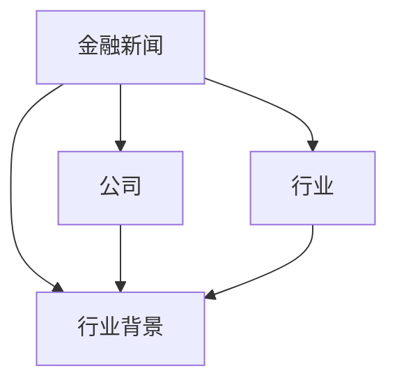
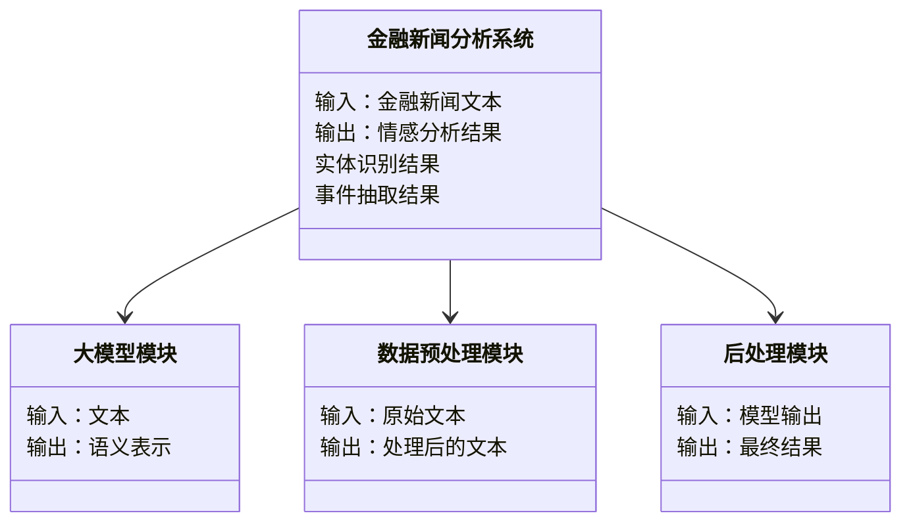
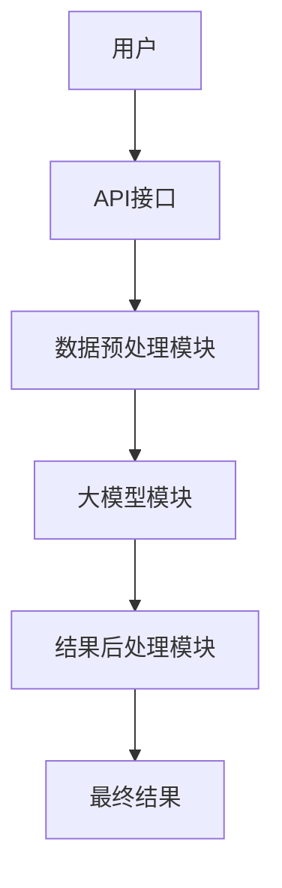

                 


# 构建基于大模型的金融新闻分析引擎

## 关键词：大模型，金融新闻分析，自然语言处理，文本挖掘，机器学习，金融风险管理

## 摘要：本文详细探讨了如何利用大模型技术构建金融新闻分析引擎，涵盖从背景介绍到系统架构设计的完整流程。通过结合自然语言处理和机器学习，本文展示了如何高效地从金融新闻中提取关键信息，为投资决策提供支持。

---

# 第一部分：金融新闻分析与大模型概述

## 第1章：金融新闻分析与大模型的背景

### 1.1 金融新闻分析的背景与意义

#### 1.1.1 金融新闻分析的定义与目标

金融新闻分析是指对金融领域的新闻文本进行信息提取、情感分析和事件预测等处理，以辅助投资决策、风险管理等活动。其目标是通过自动化手段，快速从海量新闻中提取有价值的信息。

#### 1.1.2 传统金融新闻分析的局限性

传统金融新闻分析主要依赖人工阅读和手动记录，存在效率低、误差大、覆盖范围有限等问题。此外，传统NLP技术在处理复杂语义和上下文关系时也显得力不从心。

#### 1.1.3 大模型在金融新闻分析中的优势

大模型（如BERT、GPT）具有强大的上下文理解和语义分析能力，能够处理复杂的金融文本，提供更精准的信息提取和预测结果。

### 1.2 大模型技术的概述

#### 1.2.1 大模型的定义与特点

大模型是指基于深度学习的大型神经网络模型，具有参数量大、训练数据多、语义理解能力强等特点。

#### 1.2.2 大模型在自然语言处理中的应用

大模型在文本生成、问答系统、情感分析等领域展现出强大的能力，为金融新闻分析提供了新的技术手段。

#### 1.2.3 大模型在金融领域的潜力

大模型可以用于金融新闻的情感分析、实体识别、事件抽取等任务，帮助投资者快速捕捉市场动态。

---

# 第二部分：基于大模型的金融新闻分析核心概念

## 第2章：大模型与金融新闻分析的核心概念

### 2.1 大模型的训练与推理机制

#### 2.1.1 预训练与微调的概念

预训练是指在大规模通用数据上训练模型，微调则是针对特定任务对模型进行优化。

#### 2.1.2 大模型的注意力机制与上下文理解

注意力机制使大模型能够关注文本中的重要部分，提升语义理解能力。

#### 2.1.3 大模型的可解释性问题

尽管大模型性能强大，但其决策过程往往缺乏可解释性，这在金融领域尤为重要。

### 2.2 金融新闻分析的关键任务

#### 2.2.1 文本分类与情感分析

通过分类模型判断新闻的乐观、中立或悲观情绪。

#### 2.2.2 实体识别与关系抽取

识别新闻中的公司、行业等实体，并分析它们之间的关系。

#### 2.2.3 事件抽取与时间线构建

从新闻中提取事件，并按照时间顺序构建事件 timeline。

### 2.3 大模型与金融领域知识的结合

#### 2.3.1 领域知识图谱的构建

通过构建金融领域的知识图谱，增强模型的领域适应性。

#### 2.3.2 大模型的领域适应性

通过微调和领域数据增强，提升模型在金融领域的表现。

#### 2.3.3 领域专家与大模型的协作模式

结合领域专家的深度知识，优化大模型的分析结果。

### 2.4 核心概念对比与ER实体关系图

#### 2.4.1 大模型与传统NLP技术的对比

| 特性         | 大模型               | 传统NLP技术          |
|--------------|----------------------|----------------------|
| 参数量       | 大                   | 小                   |
| 上下文理解   | 强                   | 弱                   |
| 可解释性     | 低                   | 高                   |

#### 2.4.2 金融新闻分析的ER实体关系图



---

# 第三部分：大模型在金融新闻分析中的算法原理

## 第3章：基于大模型的金融新闻分析算法

### 3.1 大模型的预训练与微调

#### 3.1.1 预训练目标函数

$$ \text{损失函数} = \sum_{i=1}^{n} \text{交叉熵}(y_i, \hat{y}_i) $$

#### 3.1.2 微调策略与代码实现

```python
def train_fine_tuning(model, optimizer, criterion, train_loader, val_loader, epochs):
    for epoch in range(epochs):
        model.train()
        for batch in train_loader:
            inputs, labels = batch['input'], batch['label']
            outputs = model(inputs)
            loss = criterion(outputs, labels)
            loss.backward()
            optimizer.step()
            optimizer.zero_grad()
```

### 3.2 金融新闻分析的算法实现

#### 3.2.1 文本分类算法

使用BERT进行情感分析：

```python
from transformers import BertTokenizer, BertModel
tokenizer = BertTokenizer.from_pretrained('bert-base-uncased')
model = BertModel.from_pretrained('bert-base-uncased')
inputs = tokenizer(batch_text, return_tensors='pt')
outputs = model(**inputs)
```

#### 3.2.2 实体识别算法

使用CRF层进行实体识别：

```python
class CRF(nn.Module):
    def __init__(self, hidden_dim, tag_set_size):
        super(CRF, self).__init__()
        self.transitions = nn.Parameter(torch.randn(tag_set_size, tag_set_size))
        self.start Transitional = nn.Parameter(torch.randn(tag_set_size))
        self.end Transitional = nn.Parameter(torch.randn(tag_set_size))
```

---

# 第四部分：系统架构与设计

## 第4章：系统架构设计与实现

### 4.1 系统功能设计

#### 4.1.1 领域模型设计



### 4.2 系统架构设计

#### 4.2.1 系统架构图



---

# 第五部分：项目实战与案例分析

## 第5章：基于大模型的金融新闻分析系统实现

### 5.1 环境安装与配置

```bash
pip install transformers torch datasets
```

### 5.2 系统核心代码实现

```python
from transformers import AutoTokenizer, AutoModelForTokenClassification
tokenizer = AutoTokenizer.from_pretrained('bert-base-uncased')
model = AutoModelForTokenClassification.from_pretrained('bert-base-uncased')
inputs = tokenizer("The company reported record profits.", return_tensors='pt')
outputs = model(**inputs)
```

### 5.3 案例分析与结果解读

#### 5.3.1 情感分析案例

输入新闻文本："The market is bullish today."

模型输出："positive"

#### 5.3.2 实体识别案例

输入新闻文本："Apple introduces new product."

模型输出：Apple(公司)

---

# 第六部分：总结与展望

## 第6章：总结与未来展望

### 6.1 系统总结

通过大模型技术，我们构建了一个高效的金融新闻分析引擎，能够快速从新闻中提取关键信息。

### 6.2 未来展望

未来可以进一步优化模型的可解释性，探索多模态数据的融合，提升系统的实时性和准确性。

---

# 附录

## 附录A：大模型列表

- BERT
- GPT
- RoBERTa

## 附录B：NLP工具包

- transformers
- nltk
- spacy

---

# 作者：AI天才研究院/AI Genius Institute & 禅与计算机程序设计艺术 /Zen And The Art of Computer Programming

