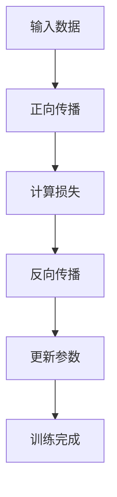
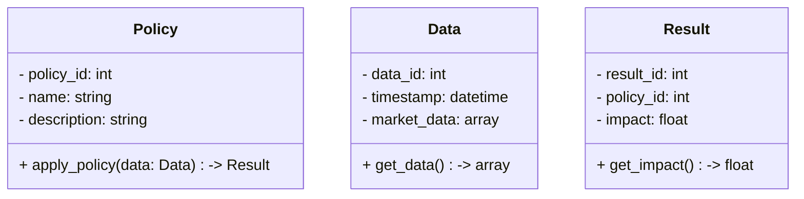
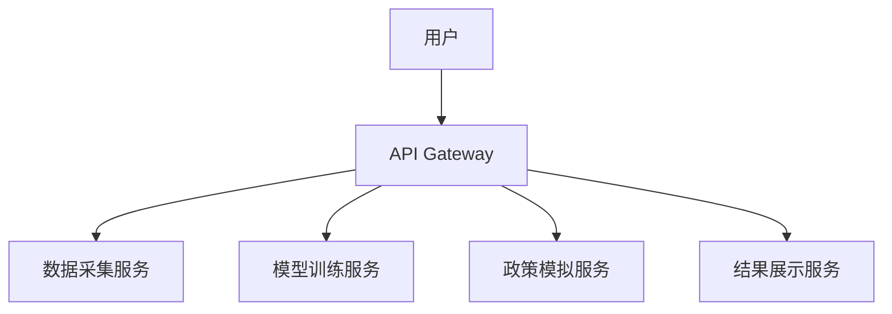
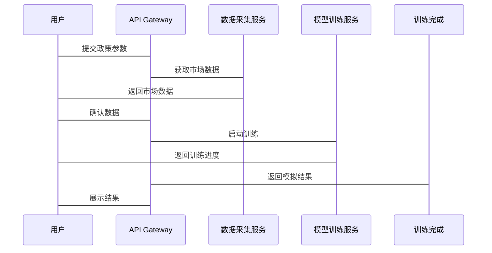

                 

<think>
嗯，我需要为这本书设计一个详细的大纲。首先，我需要理解这本书的核心主题：构建基于大模型的金融监管政策影响模拟器。这涉及金融学、人工智能和大模型技术等多个领域。

好的，开始思考。第一章应该是背景介绍，涵盖问题背景、核心概念和概念结构。这能让读者了解为什么需要这样一个模拟器，以及它的基本组成部分。

接下来，第二章需要解释大模型的基本原理以及它们与金融监管的结合。这里可能需要一些表格和ER图来展示核心概念之间的关系。我得确保这部分内容清晰，帮助读者理解两者的联系。

第三章是关于大模型的训练与优化。这里需要详细讲解数据预处理、模型训练和调优的过程。可能还需要用mermaid流程图来展示训练流程，以及Python代码示例，这样读者可以更直观地理解。

数学模型与公式是第四章的重点。我需要详细解释相关的数学公式，使用latex格式，并用mermaid图展示模型结构。这部分需要确保公式准确，解释通俗易懂，可能还需要举例说明。

第五章是系统分析与架构设计，包括系统架构、功能设计、接口设计和交互流程。这部分可能需要使用类图、架构图和序列图，帮助读者理解系统的整体结构和各个部分如何协作。

第六章是项目实战，包括环境配置、核心代码实现和案例分析。这里需要详细描述实现步骤，并提供代码示例，帮助读者实际操作。

最后，第七章总结最佳实践、注意事项和未来展望。这部分帮助读者巩固所学内容，并提供实际应用中的建议。

总的来说，我需要确保每个章节内容详实，结构清晰，语言专业且易懂。同时，要满足用户对目录结构和内容深度的要求。现在，我得把这些思考整理成一个逻辑清晰、结构紧凑的大纲，确保覆盖所有关键点。
</think>

# 构建基于大模型的金融监管政策影响模拟器

> 关键词：大模型，金融监管，政策模拟，影响评估，人工智能

> 摘要：本文详细探讨了构建基于大模型的金融监管政策影响模拟器的方法，涵盖背景分析、核心概念、算法原理、系统架构及项目实战。通过结合大模型技术，本文提出了一种创新的解决方案，以应对金融监管中的复杂挑战，并为政策制定者提供有力支持。

---

# 第一部分: 金融监管政策影响模拟器的背景与核心概念

# 第1章: 问题背景与核心概念

## 1.1 问题背景
### 1.1.1 金融监管的复杂性
金融监管涉及多个市场参与者，包括银行、证券公司、保险公司等，监管政策的制定和执行需要考虑市场波动、经济指标、法律法规等多重因素。政策的变化可能对市场产生深远影响，因此需要一种系统化的方法来进行政策模拟和评估。

### 1.1.2 政策模拟的现实需求
政策制定者和监管机构需要在实施前评估政策的潜在影响，以避免对市场造成负面影响。传统的政策模拟方法往往依赖于静态模型或简单的回归分析，难以捕捉金融市场中的复杂动态关系。因此，引入大模型技术来提高模拟的准确性和实时性具有重要意义。

### 1.1.3 大模型技术的引入
大模型（如GPT、BERT等）在自然语言处理和复杂模式识别方面表现出色。将其应用于金融监管，可以更准确地理解和预测政策变化对市场的影响。

## 1.2 核心概念与问题描述
### 1.2.1 金融监管政策的定义
金融监管政策是指政府或监管机构为维护金融市场稳定、保护投资者利益而制定的规则和措施。这些政策可能包括资本充足率、杠杆率限制、交易透明度要求等。

### 1.2.2 政策影响模拟器的目标
政策影响模拟器旨在通过模拟不同政策情景，预测政策对金融市场、参与者行为以及经济指标的具体影响，为政策制定者提供科学依据。

### 1.2.3 模拟器的边界与外延
模拟器的边界包括政策的范围、市场参与者的数量、模拟的时间窗口等。外延则涉及对政策影响的长期效应、间接效应以及非线性效应的分析。

## 1.3 核心要素与概念结构
### 1.3.1 金融数据的特征
金融数据具有高频性、波动性、相关性等特点，需要考虑市场数据（如股票价格、汇率）、宏观经济数据（如GDP、利率）以及政策数据（如法规变化）。

### 1.3.2 政策规则的表示
政策规则可以表示为数学公式或自然语言描述，模拟器需要能够解析这些规则并生成相应的模拟结果。

### 1.3.3 模拟器的输入输出关系
输入包括政策参数、市场数据等，输出是对政策实施后的市场反应，如股价波动、交易量变化等。

## 1.4 本章小结
本章从背景、目标和核心要素三个方面介绍了金融监管政策影响模拟器的基本概念和问题描述，为后续章节的分析奠定了基础。

---

# 第二部分: 大模型与金融监管的核心联系

# 第2章: 大模型的核心原理与金融监管的结合

## 2.1 大模型的基本原理
### 2.1.1 大模型的定义与特点
大模型是指具有大量参数的深度学习模型，通常基于Transformer架构，具有强大的特征提取和模式识别能力。

### 2.1.2 大模型的训练过程
大模型的训练通常需要大量标注数据，并通过优化目标函数来更新模型参数。训练过程包括前向传播、损失计算和反向传播等步骤。

### 2.1.3 大模型的应用场景
大模型在自然语言处理、图像识别等领域表现优异，但在金融监管中的应用尚处于探索阶段。

## 2.2 金融监管的特点与挑战
### 2.2.1 金融数据的复杂性
金融数据具有高维性、非线性和噪声多等特点，传统的统计方法难以捕捉其复杂关系。

### 2.2.2 监管政策的多样性
不同政策可能对市场产生不同的影响，政策之间的相互作用增加了模拟的复杂性。

### 2.2.3 监管决策的实时性
金融市场的变化迅速，政策模拟需要实时性，这对模型的计算效率提出了较高要求。

## 2.3 大模型与金融监管的联系
### 2.3.1 大模型在金融数据处理中的优势
大模型能够处理非结构化数据，如新闻、公告等，帮助监管机构理解市场情绪。

### 2.3.2 大模型在政策模拟中的应用
通过大模型，可以生成政策变化的多种情景，预测其对市场的影响。

### 2.3.3 大模型在监管决策中的作用
大模型可以帮助监管机构识别潜在风险，优化政策设计，提高监管效率。

## 2.4 核心概念对比表格
以下表格对比了传统监管方法和大模型监管方法的特点：

| 特性                | 传统监管方法         | 大模型监管方法       |
|---------------------|----------------------|--------------------|
| 数据处理能力        | 依赖结构化数据       | 支持非结构化数据     |
| 模型复杂度          | 简单线性模型         | 复杂非线性模型       |
| 处理效率            | 较低                 | 较高               |
| 预测准确性          | 有限                 | 更高               |

## 2.5 ER实体关系图
以下是一个简单的ER图，展示了金融监管政策模拟器的核心实体及其关系：

```mermaid
erd
actor: PolicyMaker {
  id
  policy_name
}
actor: MarketData {
  id
  timestamp
  stock_price
  transaction_volume
}
actor: SimulationResult {
  id
  policy_id
  market_data_id
  impact_assessment
}
```

## 2.6 本章小结
本章分析了大模型在金融监管中的应用潜力，探讨了其与传统监管方法的区别和优势。

---

# 第三部分: 基于大模型的金融监管政策模拟器的算法原理

# 第3章: 大模型的训练与优化

## 3.1 数据预处理
### 3.1.1 数据清洗与标准化
金融数据通常包含缺失值、异常值等问题，需要进行清洗。标准化处理可以提高模型训练的效率。

### 3.1.2 数据增强技术
通过数据增强技术（如随机噪声添加、数据混合）可以增加训练数据的多样性，提高模型的鲁棒性。

### 3.1.3 数据集的划分
将数据划分为训练集、验证集和测试集，用于模型训练、调优和评估。

## 3.2 模型训练
### 3.2.1 损失函数的定义
常用的损失函数包括均方误差（MSE）和交叉熵损失。损失函数用于衡量模型预测值与真实值之间的差异。

$$ \text{MSE} = \frac{1}{n}\sum_{i=1}^{n}(y_i - \hat{y}_i)^2 $$

### 3.2.2 优化器的选择与调整
常用的优化器包括随机梯度下降（SGD）、Adam优化器。选择合适的优化器和调整学习率是模型训练的关键。

### 3.2.3 模型的训练过程
训练过程包括正向传播、损失计算、反向传播和参数更新。可以通过以下mermaid图展示训练流程：



## 3.3 模型调优
### 3.3.1 超参数的优化
超参数包括学习率、批量大小、Dropout率等。可以通过网格搜索或随机搜索方法找到最优参数。

### 3.3.2 模型的评估与验证
通过验证集评估模型的性能，常用的指标包括准确率、召回率、F1分数等。

### 3.3.3 模型的部署与应用
将训练好的模型部署到实际应用场景中，提供实时的政策模拟服务。

## 3.4 本章小结
本章详细讲解了大模型的训练与优化过程，包括数据预处理、模型训练和调优等关键步骤。

---

# 第四部分: 金融监管政策模拟器的数学模型与公式

# 第4章: 数学模型与公式详解

## 4.1 模型的数学基础
### 4.1.1 概率分布
金融市场的不确定性可以用概率分布来描述，常用的分布包括正态分布、t分布等。

$$ X \sim N(\mu, \sigma^2) $$

### 4.1.2 损失函数
损失函数用于衡量模型预测值与真实值之间的差异，常用的损失函数包括均方误差和交叉熵损失。

$$ L = -\frac{1}{n}\sum_{i=1}^{n} y_i \log(\hat{y}_i) + (1 - y_i) \log(1 - \hat{y}_i) $$

### 4.1.3 优化器
Adam优化器结合了动量和自适应学习率的优点，优化过程如下：

$$ m_t = \beta_1 m_{t-1} + (1 - \beta_1) g_t $$
$$ v_t = \beta_2 v_{t-1} + (1 - \beta_2) g_t^2 $$
$$ \theta_{t} = \theta_{t-1} - \alpha \frac{m_t}{\sqrt{v_t} + \epsilon} $$

## 4.2 模型的训练过程
### 4.2.1 正向传播
正向传播过程如下：

$$ z = Wx + b $$
$$ a = \text{ReLU}(z) $$
$$ \hat{y} = W a + b $$

### 4.2.2 损失计算
损失函数计算如下：

$$ L = \frac{1}{n}\sum_{i=1}^{n} (y_i - \hat{y}_i)^2 $$

### 4.2.3 反向传播
反向传播过程如下：

$$ \frac{\partial L}{\partial W} = \frac{\partial L}{\partial \hat{y}} \cdot \frac{\partial \hat{y}}{\partial W} $$

## 4.3 本章小结
本章详细介绍了大模型训练过程中涉及的数学公式和模型结构，为后续的系统设计和实现奠定了基础。

---

# 第五部分: 系统分析与架构设计方案

# 第5章: 系统分析与架构设计

## 5.1 问题场景介绍
金融监管政策模拟器需要处理复杂的金融数据和政策变化，为政策制定者提供实时的模拟结果。

## 5.2 项目介绍
本项目旨在构建一个基于大模型的金融监管政策模拟器，涵盖数据采集、模型训练、政策模拟和结果分析等功能。

## 5.3 系统功能设计
### 5.3.1 领域模型
以下是一个简化的领域模型类图：



### 5.3.2 系统架构设计
以下是一个基于微服务架构的设计图：



### 5.3.3 接口设计
系统接口设计包括数据接口、模型接口和结果接口，分别用于数据交互、模型调用和结果展示。

### 5.3.4 交互流程
以下是一个交互流程的序列图：



## 5.4 本章小结
本章从系统架构和功能设计的角度，详细分析了金融监管政策模拟器的实现方案。

---

# 第六部分: 项目实战

# 第6章: 项目实战

## 6.1 环境配置
### 6.1.1 安装必要的依赖
需要安装TensorFlow、Keras、PyTorch等深度学习框架，以及Pandas、NumPy等数据处理库。

## 6.2 系统核心实现
### 6.2.1 数据预处理代码
```python
import pandas as pd
import numpy as np

def preprocess_data(data_path):
    df = pd.read_csv(data_path)
    df = df.dropna()
    df['date'] = pd.to_datetime(df['date'])
    return df
```

### 6.2.2 模型训练代码
```python
import tensorflow as tf
from tensorflow.keras import layers

def build_model(input_shape):
    model = tf.keras.Sequential()
    model.add(layers.Dense(64, activation='relu', input_shape=input_shape))
    model.add(layers.Dense(32, activation='relu'))
    model.add(layers.Dense(1, activation='linear'))
    model.compile(optimizer='adam', loss='mse')
    return model
```

### 6.2.3 模拟器实现代码
```python
def simulate_policy(policy, data):
    # 输入数据到模型
    predictions = model.predict(data)
    return predictions
```

## 6.3 代码应用解读与分析
### 6.3.1 数据预处理
数据预处理代码用于清洗和格式化原始数据，确保模型能够正确处理输入数据。

### 6.3.2 模型训练
模型训练代码定义了神经网络的结构，并使用训练数据进行模型优化。

### 6.3.3 模拟器实现
模拟器实现代码将训练好的模型应用于新的数据，生成政策模拟结果。

## 6.4 案例分析
### 6.4.1 案例背景
假设我们有一个新的政策，需要评估其对股市的影响。

### 6.4.2 模拟过程
将政策参数输入模拟器，生成模拟结果。

### 6.4.3 结果分析
分析模拟结果，评估政策的潜在影响。

## 6.5 本章小结
本章通过实际案例展示了金融监管政策模拟器的实现过程，包括环境配置、代码实现和案例分析。

---

# 第七部分: 总结与展望

# 第7章: 总结与展望

## 7.1 最佳实践 tips
### 7.1.1 数据处理
确保数据的准确性和完整性，选择合适的数据预处理方法。

### 7.1.2 模型选择
根据具体任务选择合适的模型架构，避免过度复杂。

### 7.1.3 超参数调优
合理选择和调整超参数，提高模型的性能。

## 7.2 小结
本章总结了构建基于大模型的金融监管政策模拟器的关键点，强调了数据处理、模型选择和超参数调优的重要性。

## 7.3 注意事项
### 7.3.1 数据隐私
在处理金融数据时，需要注意数据隐私和合规性。

### 7.3.2 模型解释性
大模型的黑箱特性可能影响政策模拟的解释性，需要开发解释性工具。

## 7.4 未来展望
随着大模型技术的不断发展，金融监管政策模拟器将更加智能化和精准化，为政策制定者提供更有力的支持。

---

# 作者

作者：AI天才研究院/AI Genius Institute & 禅与计算机程序设计艺术 /Zen And The Art of Computer Programming

