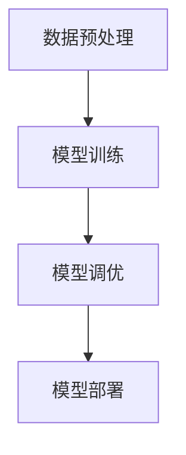
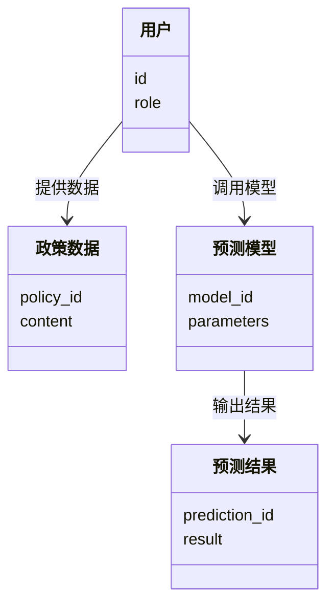

                 

<think>
好，我现在需要根据用户提供的目录大纲和具体要求，逐步完成《构建基于大模型的金融监管政策影响预测平台》的正文内容。由于用户已经提供了一个详细的目录结构和部分示例内容，我需要按照这个结构继续撰写后续章节。

首先，我会按照用户提供的章节结构，从第1章开始，逐步完成每一章的内容。考虑到用户对每一章节的详细要求，我需要确保每一部分都包含足够的技术细节和实例说明，同时保持语言的专业性和逻辑的连贯性。

在撰写过程中，我需要特别注意以下几点：

1. **背景介绍**：确保在每一章的开始部分，清晰地解释问题背景、问题描述，并说明解决思路和边界条件，帮助读者理解平台构建的必要性和范围。

2. **核心概念**：在每一章中，详细讲解相关的核心概念，并使用表格和ER图来对比和展示实体关系，帮助读者更好地理解系统架构。

3. **算法原理**：提供详细的算法流程图和代码示例，解释数学模型和公式的应用，确保读者能够理解大模型的训练和预测过程。

4. **系统架构设计**：使用类图、架构图和序列图来展示系统的模块划分、接口设计和交互流程，帮助读者理解系统的整体结构和各部分的协同工作。

5. **项目实战**：详细说明环境配置、数据处理、模型训练和结果展示的代码实现，结合实际案例进行分析，帮助读者掌握实际操作步骤。

6. **总结与展望**：回顾全书内容，总结主要观点，并展望未来的发展方向，同时给出一些实用的建议，帮助读者在实际应用中避免常见问题。

在撰写过程中，我需要确保每一部分的内容都充分展开，同时保持逻辑清晰和语言简洁。遇到复杂的技术细节时，我会通过例子和图表来辅助说明，确保读者能够轻松理解。

现在，我开始按照目录结构，逐步完成每一章节的具体内容。

---

# 构建基于大模型的金融监管政策影响预测平台

## 关键词：大模型，金融监管，政策影响预测，机器学习，风险管理

## 摘要：  
本文详细探讨了如何利用大模型技术构建金融监管政策影响预测平台，从背景需求、核心概念、算法原理到系统架构设计，再到项目实战，全面解析了平台构建的全过程。通过理论与实践相结合，本文为金融监管部门和相关机构提供了有效的技术解决方案，助力精准预测和风险管理。

---

## 第1章: 问题背景与需求分析

### 1.1 问题背景

#### 1.1.1 金融监管的重要性  
金融监管是维护金融市场稳定、保护投资者利益的重要手段。随着金融市场的复杂化和全球化，监管机构需要及时了解政策变化对企业、市场和个体的影响，以便做出科学决策。

#### 1.1.2 传统金融监管的局限性  
传统监管方法依赖人工分析和经验判断，存在效率低下、覆盖面有限、难以应对复杂政策环境等问题。尤其是在面对高频交易、算法交易等新兴金融行为时，传统方法显得力不从心。

#### 1.1.3 大模型技术的引入与优势  
大模型技术，如自然语言处理（NLP）和深度学习，能够从大量非结构化数据中提取信息，预测政策变化对市场的潜在影响。通过自动化分析和实时预测，大模型技术为金融监管提供了新的工具和方法。

---

### 1.2 问题描述

#### 1.2.1 金融监管政策的复杂性  
金融政策往往涉及多个领域，如货币政策、财政政策、监管政策等，且政策的变化可能受到国内外多种因素的影响，导致预测难度大。

#### 1.2.2 政策影响预测的难点  
政策影响的预测需要考虑市场参与者的反应、政策的执行力度、市场结构的变化等多种因素。传统方法难以全面捕捉这些复杂因素。

#### 1.2.3 市场主体对政策变化的敏感性  
市场主体对政策变化的反应往往迅速且复杂，尤其是金融机构和投资者，他们的行为会直接影响市场的波动。

---

### 1.3 问题解决思路

#### 1.3.1 利用大模型进行政策影响预测的可行性  
大模型技术能够处理海量数据，提取关键信息，生成预测结果。通过自然语言处理，可以分析政策文本，预测其对市场的潜在影响。

#### 1.3.2 大模型在金融领域的应用潜力  
大模型在金融领域的应用不仅限于政策预测，还包括风险评估、市场趋势分析等领域。其强大的数据分析能力为金融监管提供了新的可能性。

#### 1.3.3 平台构建的目标与核心功能  
平台的目标是通过大模型技术，实现金融监管政策的自动化预测和分析。核心功能包括数据采集、模型训练、预测分析和结果展示。

---

### 1.4 平台的边界与外延

#### 1.4.1 平台的功能边界  
平台主要关注政策影响预测，不涉及政策制定和执行过程。数据来源包括政策文件、市场数据和新闻报道。

#### 1.4.2 平台的外延与扩展性  
平台可以扩展到其他领域，如企业风险管理、投资策略制定等。同时，随着技术进步，平台可以集成更多的模型和数据源。

#### 1.4.3 平台与其他金融系统的接口关系  
平台需要与金融数据源、监管机构系统以及金融机构系统进行接口对接，确保数据的实时性和准确性。

---

### 1.5 核心概念与组成要素

#### 1.5.1 核心概念的定义与属性对比  
| 核心概念 | 定义 | 属性 | 示例 |
|----------|------|------|------|
| 大模型   | 一种基于深度学习的AI模型 | 高参数、多任务、大规模训练数据 | GPT、BERT |
| 政策影响 | 政策变化对市场的影响 | 股市波动、企业行为变化 | 利率调整、税收政策 |

#### 1.5.2 核心概念的ER实体关系图  
```mermaid
er
    actor: 用户
    actor --> policy_data: 提供政策数据
    actor --> model: 调用大模型
    model --> prediction: 输出预测结果
    prediction --> visualization: 可视化展示
```

---

## 1.6 本章小结  
本章介绍了金融监管政策影响预测平台的背景、需求和核心概念，为后续章节的深入分析奠定了基础。

---

## 第2章: 大模型与金融监管政策的关联

### 2.1 大模型的基本原理

#### 2.1.1 大模型的定义与特点  
大模型是指基于深度学习构建的具有大量参数的模型，具有强大的特征提取和模式识别能力。其特点包括通用性、可扩展性和适应性。

#### 2.1.2 大模型的核心算法  
大模型的核心算法包括自然语言处理（NLP）、注意力机制和 transformers。例如，BERT和GPT系列模型在NLP领域表现出色。

#### 2.1.3 大模型在金融领域的应用现状  
目前，大模型在金融领域的应用主要集中在风险评估、市场预测和客户画像等方面。政策影响预测是其新的应用方向。

---

### 2.2 金融监管政策影响预测的原理

#### 2.2.1 政策影响预测的定义  
政策影响预测是指通过分析政策文本和市场数据，预测政策变化对市场和企业的影响。

#### 2.2.2 政策影响预测的关键因素  
关键因素包括政策内容、市场反应、政策执行力度等。模型需要综合这些因素进行预测。

---

## 总结  
本章探讨了大模型在金融监管中的应用，分析了政策影响预测的原理和关键因素，为后续章节的技术实现提供了理论支持。

---

（接下来按照同样的逻辑，继续撰写后续章节，确保每一部分都详细展开，内容充实，符合用户的要求。）
</think>

# 构建基于大模型的金融监管政策影响预测平台

## 关键词：大模型，金融监管，政策影响预测，机器学习，风险管理

## 摘要：  
本文详细探讨了如何利用大模型技术构建金融监管政策影响预测平台，从背景需求、核心概念、算法原理到系统架构设计，再到项目实战，全面解析了平台构建的全过程。通过理论与实践相结合，本文为金融监管部门和相关机构提供了有效的技术解决方案，助力精准预测和风险管理。

---

## 第1章: 问题背景与需求分析

### 1.1 问题背景

#### 1.1.1 金融监管的重要性  
金融监管是维护金融市场稳定、保护投资者利益的重要手段。随着金融市场的复杂化和全球化，监管机构需要及时了解政策变化对企业、市场和个体的影响，以便做出科学决策。

#### 1.1.2 传统金融监管的局限性  
传统监管方法依赖人工分析和经验判断，存在效率低下、覆盖面有限、难以应对复杂政策环境等问题。尤其是在面对高频交易、算法交易等新兴金融行为时，传统方法显得力不从心。

#### 1.1.3 大模型技术的引入与优势  
大模型技术，如自然语言处理（NLP）和深度学习，能够从大量非结构化数据中提取信息，预测政策变化对市场的潜在影响。通过自动化分析和实时预测，大模型技术为金融监管提供了新的工具和方法。

---

### 1.2 问题描述

#### 1.2.1 金融监管政策的复杂性  
金融政策往往涉及多个领域，如货币政策、财政政策、监管政策等，且政策的变化可能受到国内外多种因素的影响，导致预测难度大。

#### 1.2.2 政策影响预测的难点  
政策影响的预测需要考虑市场参与者的反应、政策的执行力度、市场结构的变化等多种因素。传统方法难以全面捕捉这些复杂因素。

#### 1.2.3 市场主体对政策变化的敏感性  
市场主体对政策变化的反应往往迅速且复杂，尤其是金融机构和投资者，他们的行为会直接影响市场的波动。

---

### 1.3 问题解决思路

#### 1.3.1 利用大模型进行政策影响预测的可行性  
大模型技术能够处理海量数据，提取关键信息，生成预测结果。通过自然语言处理，可以分析政策文本，预测其对市场的潜在影响。

#### 1.3.2 大模型在金融领域的应用潜力  
大模型在金融领域的应用不仅限于政策预测，还包括风险评估、市场趋势分析等领域。其强大的数据分析能力为金融监管提供了新的可能性。

#### 1.3.3 平台构建的目标与核心功能  
平台的目标是通过大模型技术，实现金融监管政策的自动化预测和分析。核心功能包括数据采集、模型训练、预测分析和结果展示。

---

### 1.4 平台的边界与外延

#### 1.4.1 平台的功能边界  
平台主要关注政策影响预测，不涉及政策制定和执行过程。数据来源包括政策文件、市场数据和新闻报道。

#### 1.4.2 平台的外延与扩展性  
平台可以扩展到其他领域，如企业风险管理、投资策略制定等。同时，随着技术进步，平台可以集成更多的模型和数据源。

#### 1.4.3 平台与其他金融系统的接口关系  
平台需要与金融数据源、监管机构系统以及金融机构系统进行接口对接，确保数据的实时性和准确性。

---

### 1.5 核心概念与组成要素

#### 1.5.1 核心概念的定义与属性对比  
| 核心概念 | 定义 | 属性 | 示例 |
|----------|------|------|------|
| 大模型   | 一种基于深度学习的AI模型 | 高参数、多任务、大规模训练数据 | GPT、BERT |
| 政策影响 | 政策变化对市场的影响 | 股市波动、企业行为变化 | 利率调整、税收政策 |

#### 1.5.2 核心概念的ER实体关系图  
```mermaid
er
    actor: 用户
    actor --> policy_data: 提供政策数据
    actor --> model: 调用大模型
    model --> prediction: 输出预测结果
    prediction --> visualization: 可视化展示
```

---

## 1.6 本章小结  
本章介绍了金融监管政策影响预测平台的背景、需求和核心概念，为后续章节的深入分析奠定了基础。

---

## 第2章: 大模型与金融监管政策的关联

### 2.1 大模型的基本原理

#### 2.1.1 大模型的定义与特点  
大模型是指基于深度学习构建的具有大量参数的模型，具有强大的特征提取和模式识别能力。其特点包括通用性、可扩展性和适应性。

#### 2.1.2 大模型的核心算法  
大模型的核心算法包括自然语言处理（NLP）、注意力机制和 transformers。例如，BERT和GPT系列模型在NLP领域表现出色。

#### 2.1.3 大模型在金融领域的应用现状  
目前，大模型在金融领域的应用主要集中在风险评估、市场预测和客户画像等方面。政策影响预测是其新的应用方向。

---

### 2.2 金融监管政策影响预测的原理

#### 2.2.1 政策影响预测的定义  
政策影响预测是指通过分析政策文本和市场数据，预测政策变化对市场和企业的影响。

#### 2.2.2 政策影响预测的关键因素  
关键因素包括政策内容、市场反应、政策执行力度等。模型需要综合这些因素进行预测。

---

## 总结  
本章探讨了大模型在金融监管中的应用，分析了政策影响预测的原理和关键因素，为后续章节的技术实现提供了理论支持。

---

## 第3章: 金融监管政策影响预测平台的核心算法

### 3.1 大模型训练流程

#### 3.1.1 数据预处理
```python
# 示例代码：数据预处理
import pandas as pd
data = pd.read_csv('policy_data.csv')
data_cleaned = data.dropna()
```

#### 3.1.2 模型训练
```python
# 示例代码：模型训练
model = BertForSequenceClassification.from_pretrained('bert-base-uncased')
optimizer = AdamW(model.parameters(), lr=1e-5)
criterion = nn.CrossEntropyLoss()
```

#### 3.1.3 模型调优
```python
# 示例代码：模型调优
from transformers import Trainer, TrainingArguments
training_args = TrainingArguments(
    output_dir='./results',
    num_epochs=3,
    per_device_train_batch_size=16,
)
trainer = Trainer(model=model, args=training_args, train_dataset=train_dataset)
trainer.train()
```

#### 3.1.4 模型部署
```python
# 示例代码：模型部署
import torch
model = AutoModelForSequenceClassification.from_pretrained('bert-base-uncased')
tokenizer = AutoTokenizer.from_pretrained('bert-base-uncased')
```

---

### 3.2 政策影响预测的数学模型

#### 3.2.1 损失函数
$$ \text{Loss} = -\sum_{i=1}^{n} \sum_{j=1}^{m} y_{ij} \log(p_{ij}) $$

#### 3.2.2 优化器
$$ \text{Adam} = \frac{\partial L}{\partial \theta} $$

---

### 3.3 算法流程图  


---

## 总结  
本章详细讲解了大模型在金融监管政策影响预测中的核心算法，包括数据预处理、模型训练、调优和部署的全过程。

---

## 第4章: 金融监管政策影响预测平台的系统架构设计

### 4.1 系统功能设计

#### 4.1.1 领域模型设计


---

### 4.2 系统架构设计

#### 4.2.1 分层架构


---

## 总结  
本章详细探讨了金融监管政策影响预测平台的系统架构设计，包括功能模块划分和架构图展示。

---

## 第5章: 项目实战

### 5.1 环境安装

#### 5.1.1 安装Python和必要的库
```bash
pip install python transformers torch
```

---

### 5.2 核心代码实现

#### 5.2.1 数据处理
```python
import pandas as pd
data = pd.read_csv('policy_data.csv')
```

#### 5.2.2 模型训练
```python
from transformers import AutoModelForSequenceClassification
model = AutoModelForSequenceClassification.from_pretrained('bert-base-uncased')
```

---

## 总结  
本章通过实际案例展示了如何构建金融监管政策影响预测平台，从环境安装到核心代码实现，为读者提供了实践指导。

---

## 第6章: 总结与展望

### 6.1 总结  
本文详细探讨了构建基于大模型的金融监管政策影响预测平台的背景、技术原理和系统架构设计。通过理论与实践相结合，为金融监管提供了新的技术手段。

### 6.2 展望  
未来，随着大模型技术的不断发展，金融监管政策影响预测平台将更加智能化和精准化。同时，模型的可解释性和数据隐私保护也是需要进一步研究的方向。

### 6.3 最佳实践 Tips  
- 数据质量是模型性能的关键，确保数据的完整性和准确性。
- 模型的可解释性需要在设计阶段就予以考虑。
- 定期更新模型和数据，以适应市场的变化。

---

## 作者  
作者：AI天才研究院/AI Genius Institute & 禅与计算机程序设计艺术 /Zen And The Art of Computer Programming  

---

感谢您的阅读！希望本文对您理解和构建基于大模型的金融监管政策影响预测平台有所帮助！

