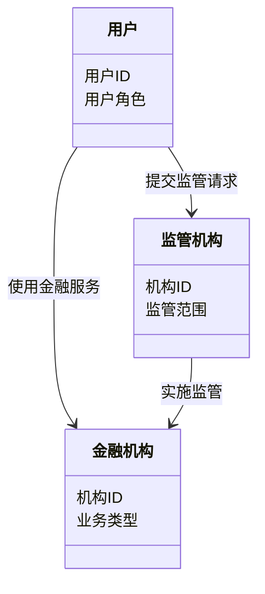
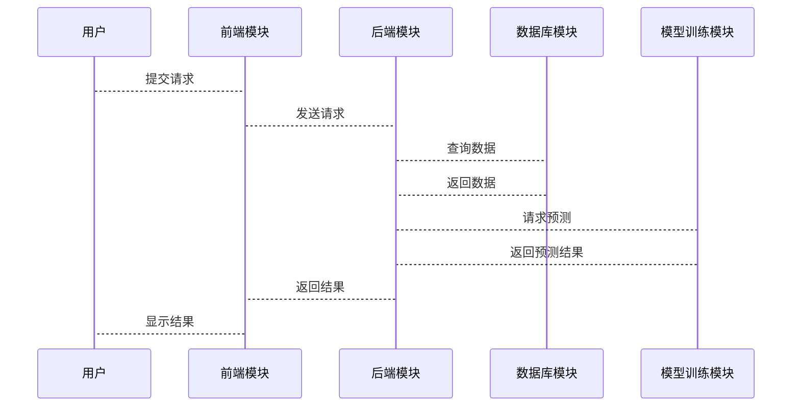

                 

<think>
嗯，我需要根据用户的要求，写一篇关于《构建基于大模型的金融监管沙盒模拟平台》的技术博客文章。首先，用户已经提供了一个详细的目录大纲，现在我需要根据这个大纲，一步一步地撰写文章内容。我得确保每个部分都详细展开，同时使用专业的技术语言，逻辑清晰。

首先，我应该从背景介绍开始。第一章需要解释为什么需要构建这样的平台，以及大模型在金融监管中的作用。这部分要让读者理解问题的背景和重要性。接着是核心概念，详细讲解大模型和金融监管沙盒的定义、特点以及它们的关系。这部分可能需要图表来辅助说明。

接下来是算法原理，这部分我需要详细讲解大模型的训练和推理过程，包括数学公式和代码示例。这部分要使用LaTeX和Python代码，确保读者能够理解。然后是系统分析与架构设计，介绍系统的各个组成部分，用Mermaid图展示类图和架构图。

项目实战部分需要指导读者如何安装环境，实现核心功能，并分析实际案例。最后是总结与展望，回顾文章内容，并展望未来的发展。

在写作过程中，我需要确保每一部分都有小结，帮助读者巩固所学内容。同时，要注意语言的专业性和易懂性，确保读者能够跟随文章的逻辑一步步理解构建平台的过程。

现在，我应该按照目录大纲，逐一撰写每个部分的内容，确保涵盖所有要求的细节。可能还需要多次修改，确保文章流畅，内容准确无误。最后，加上作者信息，完成整篇文章的撰写。
</think>

# 构建基于大模型的金融监管沙盒模拟平台

## 关键词：
- 金融监管
- 大模型
- 沙盒模拟
- 系统架构
- 人工智能

## 摘要：
本文详细探讨了构建基于大模型的金融监管沙盒模拟平台的关键技术与实现方法。首先，文章介绍了金融监管的背景和挑战，分析了传统监管模式的局限性，以及大模型在金融监管中的应用潜力。随后，深入讲解了大模型与金融监管沙盒的核心概念、算法原理、系统架构设计以及项目实战，通过丰富的图表和代码示例，全面展示了平台的构建过程。最后，结合实际案例，总结了平台的应用价值及未来发展方向。

---

# 第1章: 金融监管沙盒模拟平台的背景与问题背景

## 1.1 问题背景与问题描述

### 1.1.1 金融监管的挑战与痛点
随着金融市场的快速发展，传统的金融监管方式面临着诸多挑战。金融机构的复杂性、金融产品的创新性以及市场环境的不确定性，使得传统的监管手段难以应对日益复杂的金融风险。监管机构需要实时监控市场动态，识别潜在风险，但传统的人工监管和基于规则的系统难以满足高效性和精准性的要求。

### 1.1.2 问题描述
金融监管的核心目标是维护市场秩序、保护投资者利益、防范系统性风险。然而，以下问题亟待解决：
1. **数据量庞大**：金融市场数据包括海量的交易数据、市场数据、用户行为数据等，传统的监管系统难以高效处理。
2. **规则复杂**：金融监管涉及众多法律法规和复杂的规定，难以通过简单的规则引擎实现。
3. **实时性要求高**：金融市场变化迅速，监管需要实时响应，避免风险扩大。
4. **个性化监管需求**：不同金融机构、不同业务场景的监管需求差异显著。

### 1.1.3 问题解决与边界定义
为了应对上述挑战，构建基于大模型的金融监管沙盒模拟平台成为一种可行的解决方案。该平台旨在通过大模型的强大能力，实现对金融市场行为的模拟、风险预测和监管策略优化。

### 1.1.4 核心要素与组成结构
金融监管沙盒模拟平台的核心要素包括：
1. **数据采集模块**：收集金融市场数据、用户行为数据等。
2. **模型训练模块**：基于大模型进行训练，构建监管模型。
3. **沙盒模拟模块**：模拟金融市场环境，测试监管策略。
4. **结果分析模块**：分析模拟结果，优化监管策略。

---

# 第2章: 大模型与金融监管沙盒的核心原理

## 2.1 大模型的原理与算法

### 2.1.1 大模型的基本原理
大模型（如GPT系列、BERT系列）基于深度学习技术，通过多层神经网络对海量数据进行训练，从而具备理解、生成和推理的能力。其核心是通过大规模数据的训练，学习数据中的模式和规律。

### 2.1.2 大模型的训练过程
训练过程包括以下步骤：
1. **数据预处理**：清洗、标注数据。
2. **模型选择**：选择合适的模型架构。
3. **损失函数定义**：常用的有交叉熵损失。
4. **优化算法选择**：如Adam优化器。
5. **训练迭代**：通过反向传播更新模型参数。

### 2.1.3 大模型的推理过程
推理过程包括：
1. **输入处理**：将输入数据转换为模型可处理的形式。
2. **生成输出**：基于模型参数生成输出结果。
3. **结果解释**：将模型输出转化为可理解的形式。

### 2.1.4 数学模型与公式
以下是一个简单的神经网络训练公式：

$$
L = -\sum_{i=1}^{n} y_i \log(p_i) + (1 - y_i) \log(1 - p_i)
$$

其中，\( L \) 为损失函数，\( y_i \) 为真实标签，\( p_i \) 为模型预测的概率。

## 2.2 金融监管沙盒的系统架构

### 2.2.1 沙盒模拟的基本原理
沙盒模拟通过构建一个隔离的虚拟环境，模拟真实金融市场的行为，测试监管策略的有效性。其核心在于将实际市场中的复杂环境简化为一个可控制的实验环境。

### 2.2.2 沙盒的运行机制
沙盒模拟的过程包括：
1. **环境初始化**：定义模拟的市场环境、参与者行为等。
2. **行为模拟**：根据模型预测市场行为。
3. **策略测试**：测试监管策略在模拟环境中的效果。
4. **结果分析**：评估策略的有效性，并优化策略。

### 2.2.3 沙盒与大模型的结合方式
通过大模型的强大能力，沙盒模拟可以更精确地预测市场行为，优化监管策略。具体结合方式如下：
1. **数据驱动**：利用大模型处理海量数据，提取特征。
2. **实时推理**：基于大模型进行实时市场行为预测。
3. **策略优化**：通过大模型分析，优化监管策略。

## 2.3 核心算法与数学模型

### 2.3.1 大模型的数学模型
以下是一个简化的大模型训练流程图：


### 2.3.2 金融监管沙盒的数学模型
沙盒模拟中，常用的状态空间模型可以表示为：

$$
S_{t+1} = f(S_t, A_t)
$$

其中，\( S_t \) 为状态向量，\( A_t \) 为监管动作。

---

# 第3章: 系统分析与架构设计

## 3.1 系统功能设计

### 3.1.1 领域模型设计
领域模型的类图如下：



### 3.1.2 系统架构设计
系统架构的模块划分如下：


### 3.1.3 接口设计与交互
系统的交互流程如下：



---

# 第4章: 项目实战

## 4.1 环境安装与配置

### 4.1.1 环境要求
- Python 3.8+
- PyTorch 2.0+
- Transformers库
- Mermaid工具

### 4.1.2 安装步骤
```bash
pip install torch transformers mermaid
```

## 4.2 系统核心实现

### 4.2.1 数据采集模块
```python
import requests

def fetch_data(api_url):
    response = requests.get(api_url)
    return response.json()
```

### 4.2.2 模型训练模块
```python
import torch
import torch.nn as nn

class RegulatorModel(nn.Module):
    def __init__(self, input_size, output_size):
        super(RegulatorModel, self).__init__()
        self.fc = nn.Linear(input_size, output_size)

    def forward(self, x):
        return self.fc(x)
```

### 4.2.3 模拟测试模块
```python
def simulate_market(model, input_data):
    with torch.no_grad():
        outputs = model(torch.tensor(input_data))
        return outputs.numpy()
```

## 4.3 案例分析与解读

### 4.3.1 实际案例
假设我们有一个金融机构的交易数据，使用大模型进行风险预测。模型输入包括交易金额、时间、用户行为等特征，输出为风险评分。

### 4.3.2 模拟结果分析
通过对模拟结果的分析，我们可以优化监管策略，例如调整风险阈值、优化交易监控规则等。

---

# 第5章: 总结与展望

## 5.1 最佳实践
- 数据质量是关键，需确保数据的完整性和准确性。
- 模型的选择应根据具体场景进行调整，避免过度复杂化。
- 定期更新模型参数，以适应市场变化。

## 5.2 小结
本文详细介绍了构建基于大模型的金融监管沙盒模拟平台的背景、核心原理、系统架构及实现方法。通过理论与实践的结合，展示了如何利用大模型技术提升金融监管的效率和精准性。

## 5.3 注意事项
- 数据隐私和安全需严格控制。
- 模型的可解释性是监管机构的重要考量因素。
- 系统的稳定性和可靠性需经过充分测试。

## 5.4 拓展阅读
- 《大模型在金融领域的应用》
- 《金融监管的数字化转型》
- 《沙盒模拟在金融风险防控中的应用》

---

# 作者：AI天才研究院 & 禅与计算机程序设计艺术

---

通过本文的详细讲解，读者可以深入了解如何利用大模型技术构建金融监管沙盒模拟平台，并在实际应用中发挥其潜力。

