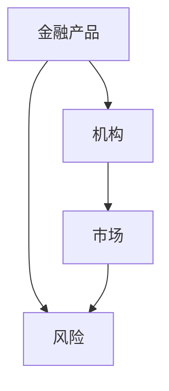
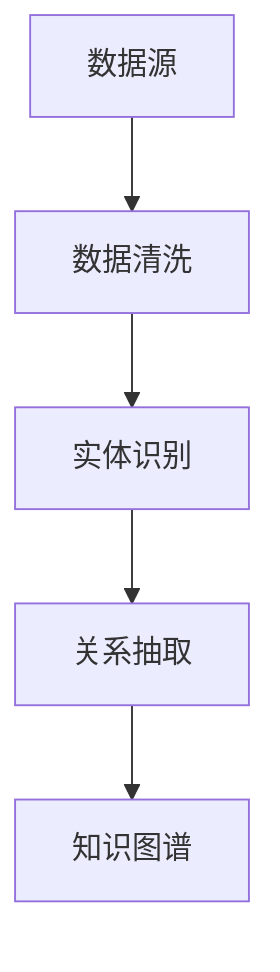
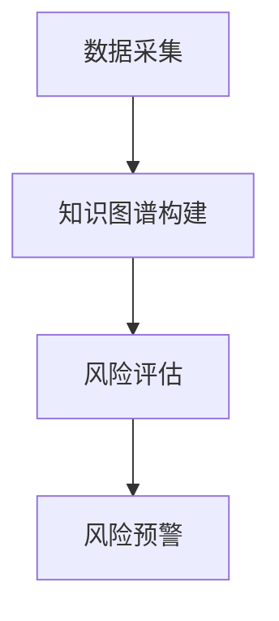

                 


# 构建基于知识图谱的金融产品全生命周期风险跟踪系统

> 关键词：知识图谱，金融产品，风险跟踪，全生命周期管理，系统架构

> 摘要：本文详细探讨了如何利用知识图谱技术构建金融产品全生命周期风险跟踪系统。文章首先介绍了金融产品风险跟踪的重要性及现有系统的局限性，随后阐述了知识图谱的核心原理及其在金融领域的应用潜力。接着，通过实体关系图和算法流程图，详细分析了知识图谱的构建方法及其在风险识别、评估和预警中的具体应用。最后，通过系统架构设计、项目实战和案例分析，展示了如何将知识图谱技术应用于实际金融产品风险管理中，为金融机构提供了一种高效、智能的风险跟踪解决方案。

---

## 第一部分: 背景介绍与核心概念

### 第1章: 问题背景与描述

#### 1.1 问题背景
金融市场的波动性和不确定性使得金融产品的风险管理显得尤为重要。传统的金融产品风险管理往往依赖于孤立的数据库和简单的统计模型，难以捕捉复杂的关系和潜在风险。随着金融产品的复杂化和多样化，传统的风险管理方法已难以满足实际需求。

#### 1.2 问题描述
金融产品全生命周期管理涉及产品设计、发行、运行和终止等多个阶段。每个阶段都伴随着不同的风险，如信用风险、市场风险和操作风险。传统的风险管理方法难以实现跨阶段的风险跟踪和分析，导致风险积累和爆发的可能性增加。

#### 1.3 问题解决与边界
知识图谱作为一种新兴的技术，能够通过结构化的方式表示复杂的金融实体及其关系，为金融产品全生命周期风险管理提供了新的思路。本系统将构建一个基于知识图谱的风险跟踪系统，涵盖金融产品的全生命周期，并实现风险的实时跟踪和预警。

---

### 第2章: 核心概念与联系

#### 2.1 知识图谱的原理与特点
知识图谱是一种用于描述实体及其关系的图结构，通常由三元组（头实体，关系，尾实体）构成。其特点包括语义丰富、可扩展性强和支持复杂查询等。

#### 2.2 金融产品全生命周期管理
金融产品的生命周期包括设计、发行、运行和终止四个阶段。每个阶段都有不同的风险特征和管理重点。

#### 2.3 知识图谱与金融产品风险跟踪的联系
知识图谱可以用于构建金融产品的知识网络，通过分析实体之间的关系和属性，实现风险的识别、评估和预警。

---

## 第二部分: 核心概念的属性特征对比

### 第3章: 知识图谱与传统数据库的对比

#### 3.1 数据模型的差异
传统数据库通常采用关系型或文档型数据模型，而知识图谱采用图数据模型，能够更好地表示复杂的关系。

#### 3.2 数据存储方式的对比
传统数据库主要基于行和列的结构存储数据，而知识图谱采用节点和边的方式存储数据。

#### 3.3 查询效率的对比分析
知识图谱的查询效率在处理复杂关系时通常优于传统数据库。

---

## 第三部分: 实体关系图架构

### 第4章: ER实体关系图架构

#### 4.1 实体关系图的定义与作用
实体关系图用于描述系统中各个实体及其关系，有助于理解系统的结构和功能。

#### 4.2 知识图谱的实体与关系
- 实体节点：如金融产品、机构、市场等。
- 关系边：如“属于”、“影响”、“关联”等。
- 属性节点：如产品类型、风险等级等。

#### 4.3 实体关系图的Mermaid流程图


---

## 第四部分: 算法原理

### 第5章: 知识图谱构建算法

#### 5.1 知识图谱构建流程
1. 数据采集：从多种数据源获取金融产品信息。
2. 数据清洗：去除重复和错误数据。
3. 实体识别：识别金融产品中的实体。
4. 关系抽取：抽取实体之间的关系。
5. 知识图谱构建：将实体和关系整合到图结构中。

#### 5.2 算法流程图


#### 5.3 算法实现代码
```python
import networkx as nx

# 创建图
G = nx.Graph()

# 添加节点
G.add_node("金融产品1")
G.add_node("机构1")
G.add_node("市场1")

# 添加边
G.add_edge("金融产品1", "机构1", label="发行")
G.add_edge("机构1", "市场1", label="影响")

# 可视化
nx.draw(G, node_size=1500, alpha=0.8)
plt.show()
```

---

## 第五部分: 系统分析与架构设计

### 第6章: 系统架构设计

#### 6.1 项目介绍
本系统旨在构建一个基于知识图谱的金融产品全生命周期风险跟踪系统，帮助金融机构实现风险的实时跟踪和预警。

#### 6.2 系统功能设计
- 数据采集模块：从多种数据源采集金融产品信息。
- 知识图谱构建模块：构建金融产品的知识图谱。
- 风险评估模块：基于知识图谱进行风险评估。
- 风险预警模块：实时监控风险并发出预警。

#### 6.3 系统架构图


---

## 第六部分: 项目实战

### 第7章: 环境安装与核心实现

#### 7.1 环境安装
- 安装Python和相关库：`networkx`, `numpy`, `pandas`。

#### 7.2 核心代码实现
```python
import networkx as nx

# 创建图
G = nx.Graph()

# 添加节点
G.add_node("金融产品1")
G.add_node("机构1")
G.add_node("市场1")

# 添加边
G.add_edge("金融产品1", "机构1", label="发行")
G.add_edge("机构1", "市场1", label="影响")

# 可视化
nx.draw(G, node_size=1500, alpha=0.8)
plt.show()
```

#### 7.3 代码解读与分析
- 数据采集模块：从数据库中读取金融产品信息。
- 知识图谱构建模块：使用`networkx`构建图结构。
- 风险评估模块：基于图结构进行风险评估。

---

## 第七部分: 案例分析与项目总结

### 第8章: 案例分析

#### 8.1 实际案例分析
假设一个金融产品在运行阶段出现市场波动，知识图谱能够快速识别相关风险并发出预警。

### 第8.2 项目总结
通过构建基于知识图谱的金融产品全生命周期风险跟踪系统，可以实现风险的实时跟踪和预警，有效降低金融风险。

---

## 第八部分: 最佳实践与拓展阅读

### 第9章: 最佳实践 tips
- 定期更新知识图谱数据，确保信息的准确性。
- 结合其他技术（如机器学习）提升系统的智能化水平。

### 第10章: 小结
本文详细介绍了如何利用知识图谱技术构建金融产品全生命周期风险跟踪系统，为金融机构提供了一种高效、智能的风险管理解决方案。

### 第11章: 注意事项
- 数据隐私和安全问题需要高度重视。
- 系统的可扩展性和可维护性需要在设计阶段充分考虑。

### 第12章: 拓展阅读
建议读者进一步学习知识图谱和金融风险管理的相关知识，探索更多应用场景。

---

## 作者

作者：AI天才研究院/AI Genius Institute & 禅与计算机程序设计艺术 /Zen And The Art of Computer Programming

---

通过以上详细的内容，我们构建了一个基于知识图谱的金融产品全生命周期风险跟踪系统，为金融机构提供了高效的风险管理工具。希望本文对读者有所帮助！

