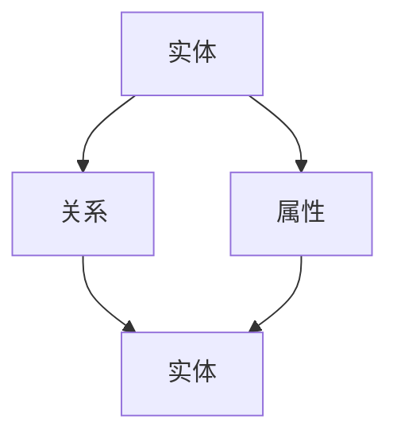
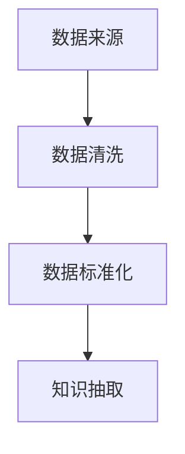
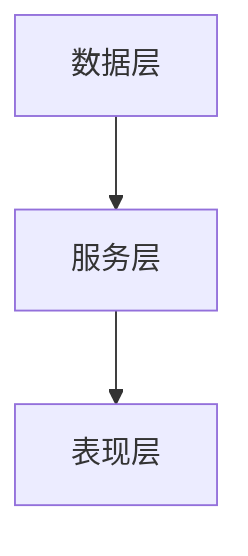

                 


# 构建基于知识图谱的金融产品比较系统

## 关键词：知识图谱，金融产品比较，系统架构，算法原理，项目实战

## 摘要

本文详细探讨了如何构建基于知识图谱的金融产品比较系统，从背景介绍到系统架构设计，再到项目实战，系统地分析了该系统的构建过程。文章首先介绍了知识图谱的基本概念和其在金融领域的应用，然后详细讲解了金融产品比较系统的需求分析、知识图谱的构建流程、算法原理以及系统架构设计。通过具体案例的分析和代码实现，展示了如何利用知识图谱技术来提升金融产品比较的效率和准确性。最后，本文总结了构建此类系统的最佳实践和未来发展方向。

---

# 第一部分: 知识图谱基础与金融应用背景

## 第1章: 知识图谱概述

### 1.1 知识图谱的定义与特点

知识图谱是一种以图结构形式表示知识的语义网络，由节点和边组成，节点代表实体或概念，边代表实体之间的关系。知识图谱具有以下特点：
- **可扩展性**：能够表示海量数据。
- **语义丰富性**：通过实体间的关系，提供语义信息。
- **结构化**：数据以结构化的形式存储，便于计算机理解和处理。



### 1.2 知识图谱的构建流程

知识图谱的构建流程通常包括以下步骤：
1. 数据收集与预处理
2. 知识抽取与表示
3. 知识融合与推理

### 1.3 知识图谱在金融领域的应用

在金融领域，知识图谱可以用于：
- 金融产品信息整合
- 产品关系分析
- 风险评估与预警

---

## 第2章: 金融产品比较系统的需求分析

### 2.1 金融产品比较的核心问题

金融产品比较的核心问题包括：
- **产品信息多样性**：不同产品的信息结构差异大。
- **用户需求个性化**：用户关注的比较维度不同。
- **产品比较复杂性**：涉及多维度的复杂关系。

### 2.2 系统需求分析

系统需求分析包括：
- **功能需求**：支持多维度比较、智能推荐。
- **性能需求**：高效查询和实时更新。
- **用户体验需求**：界面友好、操作简便。

### 2.3 系统边界与外延

系统边界：
- 输入：用户查询、产品数据。
- 输出：比较结果、推荐信息。

系统外延：
- 数据来源：金融数据库、第三方API。
- 输出形式：文本、图表。

---

# 第二部分: 知识图谱构建与金融产品比较

## 第3章: 金融知识图谱的构建

### 3.1 数据收集与预处理

数据收集来源包括：
- 内部数据库
- 第三方API
- 文本数据

预处理步骤：
1. 数据清洗：去除重复、错误数据。
2. 数据标准化：统一数据格式。



### 3.2 知识抽取与表示

知识抽取包括：
- 实体识别：识别产品名称、公司名称。
- 关系抽取：识别产品之间的关系。

知识表示：
- 使用RDF（资源描述框架）表示实体和关系。

### 3.3 知识融合与推理

知识融合：
- 数据去重、合并。
- 关系推理：通过已有关系推导新的关系。

---

## 第4章: 金融产品比较系统的算法原理

### 4.1 知识图谱匹配算法

匹配算法包括：
- **基于嵌入的匹配**：使用向量表示进行匹配。
- **基于路径的匹配**：通过路径匹配。
- **基于规则的匹配**：根据预定义规则匹配。

### 4.2 知识图谱推理算法

推理算法包括：
- 前向链推理：从已知事实推导新事实。
- 后向链推理：从目标事实反向推导。
- 深度推理：多步推理。

---

## 第5章: 系统架构设计与实现

### 5.1 系统架构设计

系统架构包括：
- 数据层：存储产品数据、知识图谱。
- 服务层：处理查询、推理。
- 表现层：展示结果。



### 5.2 系统接口设计

接口设计：
- RESTful API：提供查询接口。
- 数据接口：与第三方API对接。

### 5.3 系统交互流程

交互流程：
1. 用户提交查询。
2. 系统解析查询。
3. 系统执行推理。
4. 系统返回结果。

---

## 第6章: 项目实战

### 6.1 环境配置

- **工具安装**：安装Python、Jupyter、SPARQL查询工具。
- **数据准备**：收集金融产品数据。

### 6.2 核心代码实现

代码示例：

```python
from SPARQLWrapper import SPARQLWrapper

endpoint = "http://localhost:3030/financial_products"
query = """
    PREFIX rdf: <http://www.w3.org/1999/02/22-rdf-syntax-ns#>
    SELECT ?product ?risk WHERE {
        ?product rdf:type financial:Product .
        ?product financial:riskLevel ?risk .
    }
"""
 sparql = SPARQLWrapper(endpoint)
 sparql.setQuery(query)
 results = sparql.query().convert()
 for result in results['results']['bindings']:
     print(result['product']['value'], result['risk']['value'])
```

### 6.3 测试与优化

- **测试**：单元测试、性能测试。
- **优化**：优化查询效率、提升推理速度。

---

## 第7章: 最佳实践与未来展望

### 7.1 最佳实践

- 数据质量：确保数据准确、完整。
- 系统性能：优化查询效率。
- 用户体验：设计友好的交互界面。

### 7.2 未来展望

- 结合AI技术：利用深度学习提升推理能力。
- 实时更新：实现动态知识图谱。

---

## 小结

构建基于知识图谱的金融产品比较系统是一个复杂但极具价值的工程。通过知识图谱技术，可以有效整合金融产品信息，提供智能化的比较和推荐服务。本文详细探讨了系统的构建过程，从理论到实践，为读者提供了全面的指导。

---

## 注意事项

- 数据隐私：确保数据安全和用户隐私。
- 系统维护：定期更新知识图谱。
- 技术选型：根据需求选择合适的技术栈。

---

## 拓展阅读

- 《知识图谱入门与实践》
- 《金融产品分析与设计》
- 《图数据挖掘与应用》

---

作者：AI天才研究院/AI Genius Institute & 禅与计算机程序设计艺术 /Zen And The Art of Computer Programming

---

# 结语

构建基于知识图谱的金融产品比较系统是一项具有挑战性的任务，但其带来的价值和效率提升是显而易见的。通过本文的详细讲解，读者可以深入了解系统的构建过程，并在实际应用中灵活运用这些知识。未来，随着技术的不断发展，知识图谱在金融领域的应用将更加广泛和深入。

