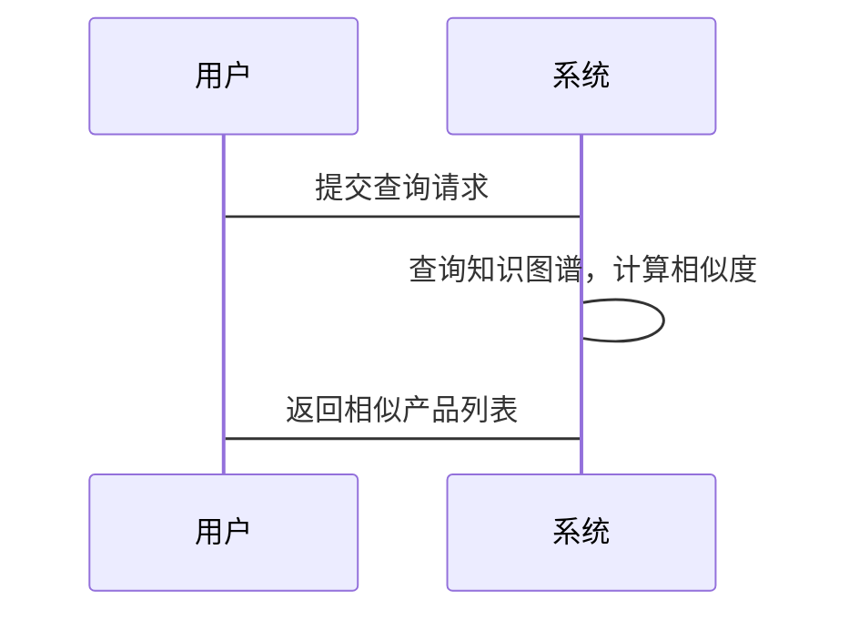

                 

<think>
好的，我现在需要帮用户构建一个名为《构建基于知识图谱的金融产品相似度计算引擎》的技术博客文章。用户希望文章结构清晰，内容详细，并且涵盖从背景到实战的各个方面。

首先，我应该分析用户的需求。用户希望文章包含关键词、摘要，以及详细的大纲。用户还提到文章需要使用Markdown格式，字数在10000到12000字之间。同时，文章需要包括背景介绍、核心概念、算法原理、系统架构、项目实战和最佳实践等部分。

接下来，我需要确定文章的关键词。考虑到文章主题是知识图谱和金融产品相似度计算，关键词可能包括知识图谱、金融产品、相似度计算、深度学习、自然语言处理等。

摘要部分需要简明扼要地概括文章的核心内容，强调知识图谱在金融产品相似度计算中的应用，以及构建引擎的方法和实际案例。

正文部分需要按照目录大纲进行详细展开。每个章节需要包含丰富的细节，如概念解释、算法原理、数学模型、系统架构设计等。同时，用户要求使用Mermaid图和Python代码示例，这需要我在相应部分插入图表和代码。

我还需要确保每个部分都符合用户的格式要求，例如数学公式使用LaTeX，算法流程图使用Mermaid，系统架构图同样使用Mermaid。此外，项目实战部分需要包括环境安装、代码实现、案例分析和小结。

最后，作者信息部分需要放在文章末尾，格式为指定的机构名称。

现在，我将根据这些思考构建完整的文章大纲，并在每个部分详细阐述内容，确保符合用户的所有要求。
</think>

```markdown
# 构建基于知识图谱的金融产品相似度计算引擎

> 关键词：知识图谱，金融产品，相似度计算，深度学习，自然语言处理

> 摘要：本文将介绍如何构建基于知识图谱的金融产品相似度计算引擎，详细探讨知识图谱的基本概念、构建方法，以及如何将其应用于金融产品的相似度计算。通过实际案例分析，我们将展示如何利用知识图谱提升金融产品的相似度计算效率和准确性。

---

# 第1章: 知识图谱与金融产品相似度计算引擎的背景

## 1.1 知识图谱的基本概念

### 1.1.1 知识图谱的定义
知识图谱是一种以图结构形式表示知识的语义网络，由节点（实体）和边（关系）组成，广泛应用于搜索引擎、智能客服、金融分析等领域。

### 1.1.2 知识图谱的核心特征
- **语义性**：节点和边具有明确的语义含义。
- **结构化**：通过层次化的组织方式，便于计算机理解和推理。
- **可扩展性**：支持动态添加新的实体和关系。
- **连通性**：通过连接不同实体，构建跨领域的知识网络。

### 1.1.3 知识图谱在金融领域的应用
- **金融产品分类**：通过实体识别和关系抽取，构建金融产品的知识网络。
- **风险评估**：利用知识图谱分析产品间的关联性，辅助风险评估。
- **智能推荐**：基于相似度计算，为用户推荐相关金融产品。

## 1.2 金融产品相似度计算的背景

### 1.2.1 金融产品分类的挑战
- **数据多样性**：金融产品种类繁多，属性复杂。
- **数据稀疏性**：部分产品数据量少，难以直接比较。
- **语义理解**：需要理解产品描述中的深层语义。

### 1.2.2 相似度计算在金融领域的应用价值
- **产品推荐**：基于相似度计算，向用户推荐相关产品。
- **风险评估**：通过相似产品的历史数据，评估新产品的风险。
- **市场分析**：分析市场趋势，优化产品组合。

### 1.2.3 知识图谱在相似度计算中的优势
- **语义丰富性**：知识图谱提供了丰富的语义信息，提升相似度计算的准确性。
- **关联性分析**：通过图结构分析产品之间的关联性，发现潜在关系。
- **动态更新**：支持实时更新，保持知识图谱的时效性。

## 1.3 问题背景与目标

### 1.3.1 问题背景分析
金融产品的相似度计算是金融领域的重要问题，传统的基于特征向量的计算方法存在语义理解不足、数据稀疏性等问题，难以满足实际需求。

### 1.3.2 问题描述与目标
- **问题描述**：如何高效、准确地计算金融产品的相似度。
- **目标**：构建一个基于知识图谱的金融产品相似度计算引擎，解决传统方法的不足。

### 1.3.3 解决方案概述
- **知识图谱构建**：通过实体识别和关系抽取，构建金融产品的知识图谱。
- **相似度计算**：基于知识图谱，设计高效的相似度计算方法。

## 1.4 本章小结
本章介绍了知识图谱的基本概念、在金融领域的应用，以及构建金融产品相似度计算引擎的背景和目标。接下来将详细探讨知识图谱的构建方法和相似度计算的核心概念。

---

# 第2章: 知识图谱构建原理

## 2.1 知识图谱构建的基本流程

### 2.1.1 数据采集与预处理
- **数据来源**：金融产品说明书、市场报告、新闻等多源数据。
- **数据清洗**：去除噪声数据，标准化数据格式。
- **数据存储**：使用数据库或知识图谱存储系统存储数据。

### 2.1.2 实体识别与抽取
- **实体识别**：使用自然语言处理技术，识别文本中的实体（如产品名称、发行机构等）。
- **实体类型化**：将实体分类为预定义的类型（如金融产品类型、市场类型等）。
- **实体消歧**：解决同一实体在不同上下文中的不同含义。

### 2.1.3 关系抽取与构建
- **关系抽取**：识别文本中的关系（如“产品X由机构Y发行”）。
- **关系类型化**：将关系分类为预定义的类型（如“发行”、“投资”等）。
- **关系权重计算**：根据关系的重要性赋予权重。

### 2.1.4 知识图谱存储与管理
- **存储方式**：使用图数据库（如Neo4j）或关系型数据库存储知识图谱。
- **存储结构**：采用节点-边-节点的结构，存储实体和关系。
- **存储优化**：通过索引优化查询效率。

### 2.1.5 知识图谱的可视化
- **可视化工具**：使用Gephi、Neo4j Browser等工具进行可视化。
- **布局算法**：应用Force Atlas、Yifan Hu等算法优化布局。
- **交互式分析**：支持用户交互式查询和分析。

## 2.2 知识图谱的可扩展性与可维护性

### 2.2.1 知识图谱的可扩展性设计
- **模块化设计**：将知识图谱划分为多个模块，便于扩展。
- **动态更新机制**：支持实时更新，保持知识图谱的时效性。
- **异构数据整合**：支持多种数据源的整合，提升知识图谱的丰富性。

### 2.2.2 知识图谱的可维护性优化
- **版本控制**：记录知识图谱的修改历史，便于回滚和维护。
- **质量控制**：建立质量评估指标，定期检查和优化知识图谱。
- **自动化工具**：使用自动化工具辅助知识图谱的构建和维护。

## 2.3 知识图谱的存储与查询优化

### 2.3.1 知识图谱的存储方式
- **图数据库**：Neo4j、Titan等，支持高效的图查询。
- **三元组存储**：将知识图谱存储为三元组（头实体、关系、尾实体），便于查询。
- **索引优化**：通过索引优化查询效率，如使用标签索引、关系索引等。

### 2.3.2 知识图谱的查询语言
- **SPARQL**：一种基于 RDF 的查询语言，支持复杂的图查询。
- **Cypher**：Neo4j 的查询语言，语法简单，适合新手使用。
- **自定义查询语言**：根据需求设计自定义查询语言，提升查询效率。

### 2.3.3 知识图谱的查询优化
- **索引优化**：使用索引加速查询过程。
- **分片与分区**：将知识图谱分片或分区，提升并行查询效率。
- **缓存机制**：使用缓存技术减少重复查询的开销。

## 2.4 知识图谱的可视化与分析

### 2.4.1 知识图谱的可视化工具
- **Gephi**：支持网络分析和可视化的工具。
- **Neo4j Browser**：内置的可视化工具，支持图数据的交互式查询。
- **D3.js**：用于前端可视化的JavaScript库。

### 2.4.2 知识图谱的分析方法
- **网络分析**：通过度分布、社区发现等方法分析图结构。
- **路径分析**：寻找节点之间的最短路径，发现潜在关联。
- **语义分析**：通过语义相似度分析节点之间的关联性。

### 2.4.3 知识图谱的动态更新与维护
- **动态更新**：支持实时更新知识图谱，保持数据的时效性。
- **版本控制**：记录每次修改的历史，便于回滚和维护。
- **质量控制**：建立质量评估指标，定期检查和优化知识图谱。

---

# 第3章: 金融产品相似度计算的核心概念

## 3.1 相似度计算的基本原理

### 3.1.1 向量空间模型

#### 3.1.1.1 向量空间模型的定义
向量空间模型将文本表示为向量空间中的点，通过向量的相似度计算文本的相似性。

#### 3.1.1.2 向量空间模型的实现
- **词袋模型**：只考虑词的出现与否，不考虑顺序。
- **TF-IDF**：考虑词的频率和重要性，用于计算关键词权重。
- **LSA**：通过线性代数方法将文本表示为低维向量。

#### 3.1.1.3 向量空间模型的优缺点
- **优点**：简单易实现，计算效率高。
- **缺点**：无法捕捉语义信息，对停用词和短语处理不足。

### 3.1.2 基于图的相似度计算

#### 3.1.2.1 基于图的相似度计算的定义
基于图的相似度计算利用图结构中的节点和边，通过路径长度、共同邻居等方法计算节点之间的相似度。

#### 3.1.2.2 基于图的相似度计算方法
- **共同邻居法**：计算两个节点的共同邻居数量。
- **最短路径法**：计算两个节点之间的最短路径长度。
- **PageRank**：基于网页排名算法，评估节点的重要性。

#### 3.1.2.3 基于图的相似度计算的优缺点
- **优点**：能够捕捉语义信息，发现潜在关联。
- **缺点**：计算复杂度高，需要存储大量的图结构数据。

### 3.1.3 混合模型

#### 3.1.3.1 混合模型的定义
混合模型结合了向量空间模型和基于图的相似度计算方法，通过融合两种模型的优势，提升相似度计算的准确性。

#### 3.1.3.2 混合模型的实现
- **向量表示**：将文本表示为向量空间中的点。
- **图结构表示**：构建图结构，计算节点之间的相似度。
- **融合策略**：将向量相似度和图相似度进行加权融合。

#### 3.1.3.3 混合模型的优缺点
- **优点**：结合了两种方法的优势，计算结果更准确。
- **缺点**：实现复杂，需要同时处理向量和图结构数据。

## 3.2 金融产品相似度计算的关键指标

### 3.2.1 相似度计算的指标体系
- **准确率**：相似度计算的准确性指标。
- **召回率**：相似度计算的全面性指标。
- **F1分数**：综合准确率和召回率的调和平均数。

### 3.2.2 相似度指标的权重分配
- **基于领域知识的权重分配**：根据金融产品的特点，赋予不同指标不同的权重。
- **基于数据分布的权重分配**：根据数据分布情况，动态调整权重。
- **基于用户反馈的权重分配**：根据用户反馈，调整相似度指标的权重。

### 3.2.3 相似度计算的评估方法
- **交叉验证**：通过训练集和验证集评估相似度计算的效果。
- **对比实验**：与现有方法对比，评估相似度计算的优劣。
- **用户反馈**：通过用户反馈不断优化相似度计算的效果。

## 3.3 知识图谱与相似度计算的结合

### 3.3.1 知识图谱在相似度计算中的作用
- **语义增强**：通过知识图谱中的语义信息，提升相似度计算的准确性。
- **关联发现**：通过图结构发现产品之间的隐含关联，提升相似度计算的全面性。

### 3.3.2 知识图谱增强相似度计算的效果
- **提升准确率**：通过知识图谱的语义信息，减少噪声数据的影响。
- **发现隐含关联**：通过图结构发现产品之间的隐含关系，提升相似度计算的全面性。

### 3.3.3 知识图谱在金融产品分类中的应用
- **产品分类**：通过知识图谱中的实体关系，自动分类金融产品。
- **产品推荐**：基于知识图谱的相似度计算，为用户推荐相关产品。
- **风险评估**：通过知识图谱分析产品间的关联性，辅助风险评估。

## 3.4 本章小结
本章详细探讨了相似度计算的基本原理和关键指标，以及知识图谱在相似度计算中的作用。接下来将介绍知识图谱构建的算法原理，包括实体识别与抽取、关系抽取与构建等关键技术。

---

# 第4章: 知识图谱构建的算法原理

## 4.1 实体识别与抽取算法

### 4.1.1 基于规则的实体识别
#### 4.1.1.1 基于规则的实体识别的定义
基于规则的实体识别通过预定义的规则和模式，识别文本中的实体。

#### 4.1.1.2 基于规则的实体识别的实现
- **规则定义**：根据金融产品的特点，定义实体识别规则。
- **模式匹配**：通过正则表达式等模式匹配技术，识别文本中的实体。

#### 4.1.1.3 基于规则的实体识别的优缺点
- **优点**：简单易实现，规则明确。
- **缺点**：难以处理复杂语境，容易漏检。

### 4.1.2 基于统计的实体识别
#### 4.1.2.1 基于统计的实体识别的定义
基于统计的实体识别通过统计学方法，识别文本中的实体。

#### 4.1.2.2 基于统计的实体识别的实现
- **条件随机场（CRF）**：通过训练模型，识别文本中的实体。
- **隐马尔可夫模型（HMM）**：通过状态转移概率，识别文本中的实体。

#### 4.1.2.3 基于统计的实体识别的优缺点
- **优点**：能够处理复杂语境，识别准确率高。
- **缺点**：实现复杂，需要大量标注数据。

### 4.1.3 基于深度学习的实体识别
#### 4.1.3.1 基于深度学习的实体识别的定义
基于深度学习的实体识别通过深度学习模型，识别文本中的实体。

#### 4.1.3.2 基于深度学习的实体识别的实现
- **卷积神经网络（CNN）**：通过卷积操作，提取文本特征，识别实体。
- **循环神经网络（RNN）**：通过循环操作，处理序列数据，识别实体。
- ** transformer 模型**：通过自注意力机制，捕捉长距离依赖，识别实体。

#### 4.1.3.3 基于深度学习的实体识别的优缺点
- **优点**：识别准确率高，能够处理复杂语境。
- **缺点**：实现复杂，需要大量计算资源。

## 4.2 关系抽取与构建算法

### 4.2.1 基于规则的关系抽取
#### 4.2.1.1 基于规则的关系抽取的定义
基于规则的关系抽取通过预定义的规则和模式，识别文本中的关系。

#### 4.2.1.2 基于规则的关系抽取的实现
- **规则定义**：根据金融产品的特点，定义关系抽取规则。
- **模式匹配**：通过正则表达式等模式匹配技术，识别文本中的关系。

#### 4.2.1.3 基于规则的关系抽取的优缺点
- **优点**：简单易实现，规则明确。
- **缺点**：难以处理复杂语境，容易漏检。

### 4.2.2 基于统计的关系抽取
#### 4.2.2.1 基于统计的关系抽取的定义
基于统计的关系抽取通过统计学方法，识别文本中的关系。

#### 4.2.2.2 基于统计的关系抽取的实现
- **条件随机场（CRF）**：通过训练模型，识别文本中的关系。
- **隐马尔可夫模型（HMM）**：通过状态转移概率，识别文本中的关系。

#### 4.2.2.3 基于统计的关系抽取的优缺点
- **优点**：能够处理复杂语境，识别准确率高。
- **缺点**：实现复杂，需要大量标注数据。

### 4.2.3 基于深度学习的关系抽取
#### 4.2.3.1 基于深度学习的关系抽取的定义
基于深度学习的关系抽取通过深度学习模型，识别文本中的关系。

#### 4.2.3.2 基于深度学习的关系抽取的实现
- **卷积神经网络（CNN）**：通过卷积操作，提取文本特征，识别关系。
- **循环神经网络（RNN）**：通过循环操作，处理序列数据，识别关系。
- ** transformer 模型**：通过自注意力机制，捕捉长距离依赖，识别关系。

#### 4.2.3.3 基于深度学习的关系抽取的优缺点
- **优点**：识别准确率高，能够处理复杂语境。
- **缺点**：实现复杂，需要大量计算资源。

## 4.3 知识图谱的存储与管理

### 4.3.1 知识图谱的存储方式
- **图数据库**：Neo4j、Titan等，支持高效的图查询。
- **三元组存储**：将知识图谱存储为三元组（头实体、关系、尾实体），便于查询。
- **索引优化**：通过索引优化查询效率，如使用标签索引、关系索引等。

### 4.3.2 知识图谱的查询语言
- **SPARQL**：一种基于 RDF 的查询语言，支持复杂的图查询。
- **Cypher**：Neo4j 的查询语言，语法简单，适合新手使用。
- **自定义查询语言**：根据需求设计自定义查询语言，提升查询效率。

### 4.3.3 知识图谱的查询优化
- **索引优化**：使用索引加速查询过程。
- **分片与分区**：将知识图谱分片或分区，提升并行查询效率。
- **缓存机制**：使用缓存技术减少重复查询的开销。

---

# 第5章: 金融产品相似度计算的算法实现

## 5.1 基于向量空间模型的相似度计算

### 5.1.1 向量空间模型的实现
- **词袋模型**：只考虑词的出现与否，不考虑顺序。
- **TF-IDF**：考虑词的频率和重要性，用于计算关键词权重。
- **LSA**：通过线性代数方法将文本表示为低维向量。

### 5.1.2 基于向量空间模型的相似度计算
- **余弦相似度**：计算两个向量之间的夹角余弦值，公式为：$$\cos\theta = \frac{\vec{A} \cdot \vec{B}}{|\vec{A}| |\vec{B}|}$$
- **欧氏距离**：计算两个向量之间的距离，公式为：$$\sqrt{(A_1 - B_1)^2 + (A_2 - B_2)^2 + \dots + (A_n - B_n)^2}$$
- **曼哈顿距离**：计算两个向量在各个维度上的差的绝对值之和，公式为：$$|A_1 - B_1| + |A_2 - B_2| + \dots + |A_n - B_n|$$

## 5.2 基于图的相似度计算

### 5.2.1 基于图的相似度计算方法
- **共同邻居法**：计算两个节点的共同邻居数量，公式为：$$CN(a, b) = |N(a) \cap N(b)|$$
- **最短路径法**：计算两个节点之间的最短路径长度，公式为：$$SP(a, b) = \text{length of the shortest path between } a \text{ and } b$$
- **PageRank**：基于网页排名算法，评估节点的重要性，公式为：$$PR(a) = \alpha PR(b) + (1 - \alpha)$$，其中$\alpha$是阻尼系数。

### 5.2.2 基于图的相似度计算的实现
- **构建图结构**：将金融产品表示为图中的节点，产品之间的关系表示为边。
- **计算相似度**：通过上述方法计算节点之间的相似度。
- **排序与筛选**：根据相似度值，对产品进行排序和筛选。

## 5.3 基于混合模型的相似度计算

### 5.3.1 混合模型的实现
- **向量表示**：将金融产品描述表示为向量空间中的点。
- **图结构表示**：构建图结构，计算节点之间的相似度。
- **融合策略**：将向量相似度和图相似度进行加权融合，公式为：$$\text{similarity} = \alpha \cdot \text{vector\_similarity} + (1 - \alpha) \cdot \text{graph\_similarity}$$，其中$\alpha$是融合权重。

### 5.3.2 混合模型的优化
- **参数调优**：通过实验调优$\alpha$，找到最佳的融合策略。
- **模型评估**：通过准确率、召回率等指标评估模型的性能。
- **持续优化**：根据评估结果，不断优化模型结构和参数。

---

# 第6章: 金融产品相似度计算引擎的系统架构设计

## 6.1 系统功能设计

### 6.1.1 领域模型
- **实体模型**：定义金融产品的实体及其属性，如产品名称、发行机构、产品类型等。
- **关系模型**：定义产品之间的关系，如“由...发行”、“投资于...”等。
- **相似度模型**：定义相似度计算的指标和方法，如余弦相似度、PageRank等。

### 6.1.2 功能模块
- **数据采集模块**：负责采集金融产品的数据，包括产品说明书、市场报告等。
- **知识图谱构建模块**：负责构建金融产品的知识图谱，包括实体识别、关系抽取等。
- **相似度计算模块**：负责计算产品之间的相似度，基于向量空间模型和图模型。
- **结果展示模块**：负责展示相似度计算的结果，支持用户交互和可视化。

## 6.2 系统架构设计

### 6.2.1 分层架构
- **数据层**：存储金融产品的数据和知识图谱。
- **服务层**：提供数据采集、知识图谱构建、相似度计算等服务。
- **表现层**：展示相似度计算的结果，支持用户交互和可视化。

### 6.2.2 微服务架构
- **数据采集服务**：负责采集金融产品的数据。
- **知识图谱构建服务**：负责构建金融产品的知识图谱。
- **相似度计算服务**：负责计算产品之间的相似度。
- **结果展示服务**：负责展示相似度计算的结果。

## 6.3 系统接口设计

### 6.3.1 数据接口
- **数据输入接口**：接收金融产品的数据，格式包括JSON、CSV等。
- **数据输出接口**：输出相似度计算的结果，格式包括JSON、XML等。

### 6.3.2 API接口
- **API输入接口**：接收用户的查询请求，格式为JSON或XML。
- **API输出接口**：返回相似度计算的结果，格式为JSON或XML。

## 6.4 系统交互设计

### 6.4.1 用户交互流程
1. 用户提交查询请求，包括产品名称或ID。
2. 系统查询知识图谱，计算相似度。
3. 系统返回相似产品列表，排序按相似度从高到低。

### 6.4.2 系统交互图


---

# 第7章: 金融产品相似度计算引擎的实现与优化

## 7.1 项目实战

### 7.1.1 环境安装
- **安装Python**：建议使用Python 3.6及以上版本。
- **安装依赖库**：如numpy、pandas、networkx、neo4j等。

### 7.1.2 核心代码实现

#### 7.1.2.1 数据采集与预处理
```python
import requests
from bs4 import BeautifulSoup

def scrape_data(url):
    response = requests.get(url)
    soup = BeautifulSoup(response.text, 'html.parser')
    product_data = []
    for product in soup.find_all('div', class_='product'):
        product_info = {
            'name': product.find('h2').text,
            'description': product.find('p').text,
            'issuer': product.find('span', class_='issuer').text
        }
        product_data.append(product_info)
    return product_data
```

#### 7.1.2.2 知识图谱构建
```python
from neo4j import GraphDatabase

def create_graph(product_data):
    driver = GraphDatabase.driver('neo4j://localhost:7687', auth=('user', 'password'))
    session = driver.session()
    for product in product_data:
        # 创建产品节点
        session.run("CREATE (p:Product {name: $name, description: $description, issuer: $issuer})", 
                    name=product['name'], description=product['description'], issuer=product['issuer'])
        # 创建发行关系
        session.run("MATCH (p1:Product {name: $name}), (i:Issuer {name: $issuer}) CREATE (p1)-[r:ISSUED_BY]->(i)", 
                    name=product['name'], issuer=product['issuer'])
    session.close()
    driver.close()
```

#### 7.1.2.3 相似度计算
```python
from sklearn.metrics.pairwise import cosine_similarity

def compute_similarity(product_embeddings):
    similarity_matrix = cosine_similarity(product_embeddings)
    return similarity_matrix
```

## 7.2 项目优化

### 7.2.1 知识图谱优化
- **索引优化**：在Neo4j中创建索引，加速查询过程。
- **分片与分区**：将知识图谱分片或分区，提升并行查询效率。
- **缓存机制**：使用缓存技术减少重复查询的开销。

### 7.2.2 相似度计算优化
- **向量降维**：使用主成分分析（PCA）等方法，降低向量维度，提升计算效率。
- **混合模型优化**：通过实验调优混合模型的权重，找到最佳的融合策略。
- **分布式计算**：利用分布式计算框架（如Spark），提升相似度计算的效率。

## 7.3 项目小结
本章通过实际案例展示了金融产品相似度计算引擎的实现过程，包括数据采集、知识图谱构建、相似度计算等关键步骤。同时，提出了优化建议，帮助提升系统的性能和效率。

---

# 第8章: 最佳实践与总结

## 8.1 最佳实践

### 8.1.1 知识图谱构建
- **数据清洗**：确保数据的准确性和完整性。
- **实体识别**：使用多种方法结合，提升实体识别的准确率。
- **关系抽取**：结合领域知识，优化关系抽取的效果。

### 8.1.2 相似度计算
- **特征选择**：根据领域特点，选择合适的特征进行相似度计算。
- **模型选择**：根据数据特点和计算需求，选择合适的相似度计算方法。
- **模型优化**：通过实验和反馈，不断优化相似度计算的效果。

## 8.2 项目总结

### 8.2.1 项目成果
- 成功构建了基于知识图谱的金融产品相似度计算引擎。
- 提升了金融产品的相似度计算效率和准确性。
- 为金融领域的智能化应用提供了技术支持。

### 8.2.2 经验与教训
- **数据质量**：数据的准确性和完整性对系统性能有重要影响。
- **模型选择**：选择合适的模型和方法，能够事半功倍。
- **系统优化**：系统的优化能够显著提升性能和效率。

## 8.3 未来展望

### 8.3.1 技术发展
- **深度学习**：继续探索深度学习在知识图谱构建和相似度计算中的应用。
- **图神经网络**：研究图神经网络在金融产品相似度计算中的潜力。
- **多模态数据**：结合文本、图像等多种数据源，提升相似度计算的准确性。

### 8.3.2 应用拓展
- **智能推荐**：将相似度计算应用于金融产品的智能推荐系统。
- **风险评估**：利用相似度计算，辅助金融产品的风险评估。
- **市场分析**：通过相似度计算，分析市场趋势，优化产品组合。

---

# 作者：AI天才研究院/AI Genius Institute & 禅与计算机程序设计艺术 /Zen And The Art of Computer Programming
```

