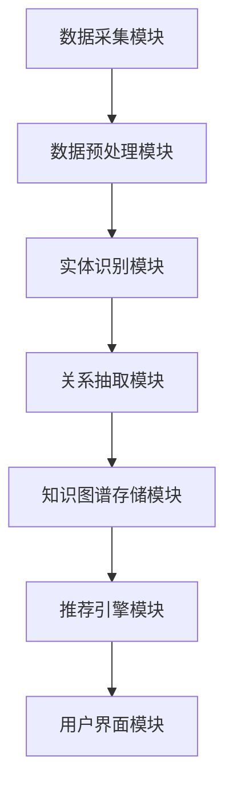

                 


# 构建基于知识图谱的金融产品组合推荐引擎

> 关键词：知识图谱，金融产品推荐，实体识别，关系抽取，推荐系统

> 摘要：本文详细探讨了基于知识图谱的金融产品组合推荐引擎的构建方法。首先介绍了知识图谱的基本概念及其在金融推荐系统中的重要性，接着分析了金融产品推荐系统的背景与挑战，然后详细讲解了知识图谱的构建过程，包括实体识别、关系抽取、知识图谱存储与管理等关键步骤。在此基础上，设计并实现了基于知识图谱的推荐算法，通过实际案例分析验证了系统的有效性，并提出了系统的优化建议和未来研究方向。

---

# 第一部分: 知识图谱与金融产品推荐概述

## 第1章: 知识图谱与金融推荐系统概述

### 1.1 知识图谱的定义与特点

知识图谱是一种以图结构形式表示知识的数据模型，由节点（实体）和边（关系）组成，能够描述实体之间的语义关系。其核心特点包括：

1. **结构化**：通过节点和边的明确关系，提供清晰的知识结构。
2. **语义丰富**：能够捕捉实体之间的复杂关系，提供深层次的语义信息。
3. **可扩展性**：支持大规模数据的扩展和更新。

### 1.2 金融产品推荐系统的背景与挑战

#### 1.2.1 金融产品的复杂性与多样性
金融产品种类繁多，包括基金、股票、债券、保险等，每种产品都有其独特的属性和风险特征。

#### 1.2.2 传统推荐系统在金融领域的局限性
传统推荐系统主要基于协同过滤或基于内容的推荐方法，难以处理金融产品复杂的关系和语义信息。

#### 1.2.3 知识图谱在金融推荐中的优势
知识图谱能够通过语义关系捕捉产品的关联性，帮助推荐系统更好地理解用户需求和产品特性。

---

## 第2章: 知识图谱构建的核心概念与联系

### 2.1 知识图谱的核心概念

#### 2.1.1 实体与属性
- **实体**：金融产品、客户、市场等。
- **属性**：产品的风险等级、收益率等。

#### 2.1.2 关系与边
- **关系**：产品之间的关联性，如“兼容”或“互补”。
- **边**：表示实体之间的关系，通常带有权重和方向。

#### 2.1.3 知识图谱的构建流程
1. 数据收集
2. 实体识别
3. 关系抽取
4. 知识图谱存储与管理

### 2.2 实体关系图的构建与分析

#### 2.2.1 实体关系图的构建方法
- **基于规则的方法**：通过预定义的规则抽取实体关系。
- **基于统计的方法**：利用统计学方法发现实体关系。
- **基于深度学习的方法**：使用神经网络模型自动学习实体关系。

#### 2.2.2 实体关系图的属性特征对比
| 特性 | 实体 | 关系 |
|------|------|------|
| 类型 | 基金、股票 | 兼容、互补 |
| 属性 | 风险等级、收益率 | 关联强度、时间范围 |

#### 2.2.3 实体关系图的ER模型设计

```mermaid
erDiagram
    customer_entity {
        id : int
        name : string
        risk_tolerance : string
    }
    product_entity {
        id : int
        name : string
        type : string
        risk_level : string
        yield : float
    }
    relationship {
        id : int
        source : int
        target : int
        relation_type : string
        strength : float
    }
    customer_entity --> relationship : owns
    product_entity --> relationship : associated_with
```

---

## 第3章: 知识图谱构建的算法原理

### 3.1 知识图谱构建算法概述

#### 3.1.1 基于规则的实体识别
- **方法**：通过正则表达式或预定义规则识别文本中的实体。
- **优点**：简单高效，适用于规则明确的场景。
- **缺点**：难以处理复杂多变的语境。

#### 3.1.2 基于统计的实体识别
- **方法**：利用统计学模型（如条件随机场CRF）识别实体。
- **优点**：能够捕捉上下文信息，适应性强。
- **缺点**：需要大量标注数据。

#### 3.1.3 基于深度学习的实体识别
- **方法**：使用神经网络模型（如BERT）进行实体识别。
- **优点**：能够自动学习特征，适用于复杂语境。
- **缺点**：计算资源需求较高。

### 3.2 实体关系抽取算法

#### 3.2.1 基于规则的关系抽取
- **方法**：通过预定义的语法规则抽取关系。
- **优点**：简单高效。
- **缺点**：难以处理复杂关系。

#### 3.2.2 基于统计的关系抽取
- **方法**：利用统计模型（如最大熵模型）抽取关系。
- **优点**：能够捕捉统计规律。
- **缺点**：需要大量标注数据。

#### 3.2.3 基于深度学习的关系抽取
- **方法**：使用双向LSTM模型进行关系抽取。
- **优点**：能够自动学习特征，适应性强。
- **缺点**：计算资源需求较高。

---

## 第4章: 知识图谱构建的系统分析与架构设计

### 4.1 系统分析

#### 4.1.1 问题场景介绍
- **目标**：构建金融产品知识图谱，用于推荐引擎。
- **需求**：支持大规模数据处理，实时推荐。

#### 4.1.2 项目背景与目标
- **背景**：金融产品种类繁多，用户需求多样。
- **目标**：通过知识图谱提高推荐系统的准确性和个性化。

#### 4.1.3 系统功能需求分析
- 数据采集与预处理
- 实体识别与关系抽取
- 知识图谱构建与存储
- 推荐算法实现

### 4.2 系统架构设计

#### 4.2.1 系统架构的分层设计
- 数据层：存储原始数据。
- 处理层：进行数据处理和知识图谱构建。
- 推荐层：实现推荐算法。
- 展示层：用户界面展示推荐结果。

#### 4.2.2 系统架构的模块划分
- 数据采集模块：负责数据的采集与预处理。
- 实体识别模块：识别文本中的实体。
- 关系抽取模块：抽取实体之间的关系。
- 知识图谱存储模块：存储构建的知识图谱。
- 推荐引擎模块：基于知识图谱实现推荐算法。

#### 4.2.3 系统架构的流程设计



---

## 第5章: 知识图谱构建的项目实战

### 5.1 环境安装与配置

#### 5.1.1 开发环境的选择与安装
- **Python**：安装Anaconda或Miniconda。
- **工具**：安装Jupyter Notebook、PyCharm等。

#### 5.1.2 数据库与工具的配置
- **图数据库**：选择Neo4j或OrientDB。
- **关系抽取工具**：使用spaCy或Gensim。

#### 5.1.3 知识图谱构建工具的安装
- **Neo4j**：安装社区版或企业版。
- **Python库**：安装networkx、py2neo等。

### 5.2 核心代码实现

#### 5.2.1 实体识别的代码实现

```python
import spacy

nlp = spacy.load("en_core_web_sm")
text = "Apple is a technology company."

doc = nlp(text)
for token in doc.ents:
    print(token.text, token.label_)
```

#### 5.2.2 关系抽取的代码实现

```python
def extract_relations(text):
    doc = nlp(text)
    relations = []
    for i, token in enumerate(doc):
        if token.dep_ == "ROOT":
            for child in token.children:
                if child.dep_ == "nsubj":
                    for grandchild in child.children:
                        if grandchild.dep_ == "prep":
                            relations.append((child.text, grandchild.text))
    return relations

text = "This company is led by Elon Musk."
relations = extract_relations(text)
print(relations)
```

#### 5.2.3 知识图谱构建的代码实现

```python
from py2neo import Graph, Node, Relationship

graph = Graph("bolt://localhost:7687", auth=("neo4j", "password"))
customer = Node("Customer", name="Alice", risk_tolerance="low")
product = Node("Product", name="Tech Fund", type="fund", risk_level="medium")
relationship = Relationship(customer, "INVESTED_IN", product)
graph.create(customer, product, relationship)
```

### 5.3 实际案例分析

#### 5.3.1 案例背景与需求分析
- **案例背景**：假设我们有一个客户数据库，每个客户有不同的风险承受能力和投资偏好。
- **需求分析**：根据客户信息和产品属性，推荐适合的金融产品。

#### 5.3.2 系统设计与实现
- **数据预处理**：清洗和标注客户数据。
- **知识图谱构建**：识别客户和产品实体，抽取关系。
- **推荐引擎实现**：基于知识图谱实现推荐算法。

#### 5.3.3 系统运行与效果评估
- **推荐效果**：评估准确率、召回率、F1值等指标。
- **优化建议**：根据评估结果优化推荐算法和知识图谱。

---

## 第6章: 知识图谱在金融产品推荐中的应用

### 6.1 金融产品推荐系统的构建

#### 6.1.1 系统功能设计
- 用户输入：用户的基本信息和投资偏好。
- 知识图谱查询：根据用户信息查询知识图谱。
- 推荐结果生成：基于查询结果生成推荐列表。

#### 6.1.2 系统实现与优化
- 优化知识图谱的查询效率。
- 提高推荐算法的准确性和实时性。

#### 6.1.3 系统测试与验证
- 测试推荐系统的准确性和性能。
- 验证系统的稳定性和可扩展性。

### 6.2 金融产品推荐系统的实际案例分析

#### 6.2.1 案例背景与需求分析
- **案例背景**：假设我们有一个在线投资平台，用户需要根据自己的风险承受能力和投资目标选择合适的金融产品。

#### 6.2.2 系统设计与实现
- **数据预处理**：清洗客户数据和产品数据。
- **知识图谱构建**：识别客户和产品实体，抽取关系。
- **推荐引擎实现**：基于知识图谱实现推荐算法。

#### 6.2.3 系统运行与效果评估
- **推荐效果**：评估准确率、召回率、F1值等指标。
- **优化建议**：根据评估结果优化推荐算法和知识图谱。

---

## 第7章: 知识图谱构建的最佳实践与小结

### 7.1 最佳实践 tips

#### 7.1.1 数据预处理的关键点
- 数据清洗：去除噪声数据。
- 数据标注：标注实体和关系。
- 数据归一化：统一数据格式。

#### 7.1.2 知识图谱构建的优化技巧
- 使用高效的图数据库。
- 优化实体识别和关系抽取算法。
- 定期更新知识图谱。

#### 7.1.3 系统部署与维护的注意事项
- 确保系统的高可用性。
- 定期备份数据。
- 监控系统性能。

### 7.2 项目小结与未来展望

#### 7.2.1 项目总结
- 成功构建了金融产品知识图谱。
- 实现了基于知识图谱的推荐引擎。
- 提高了推荐系统的准确性和个性化。

#### 7.2.2 未来研究方向
- 研究更高效的实体识别和关系抽取算法。
- 探索知识图谱的动态更新方法。
- 拓展知识图谱在金融领域的其他应用。

#### 7.2.3 拓展阅读与学习资源推荐
- 推荐书籍：《知识图谱：概念、方法与应用》。
- 推荐论文：相关领域的最新研究论文。
- 推荐工具：Neo4j、OrientDB等图数据库。

---

# 作者：AI天才研究院 & 禅与计算机程序设计艺术

本文由AI天才研究院（AI Genius Institute）与禅与计算机程序设计艺术（Zen And The Art of Computer Programming）联合撰写，旨在为读者提供关于构建基于知识图谱的金融产品组合推荐引擎的深入理解和实践指导。

