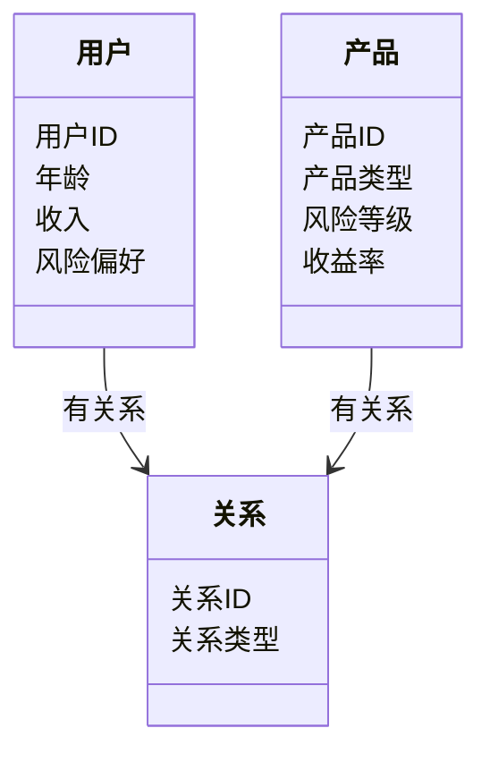
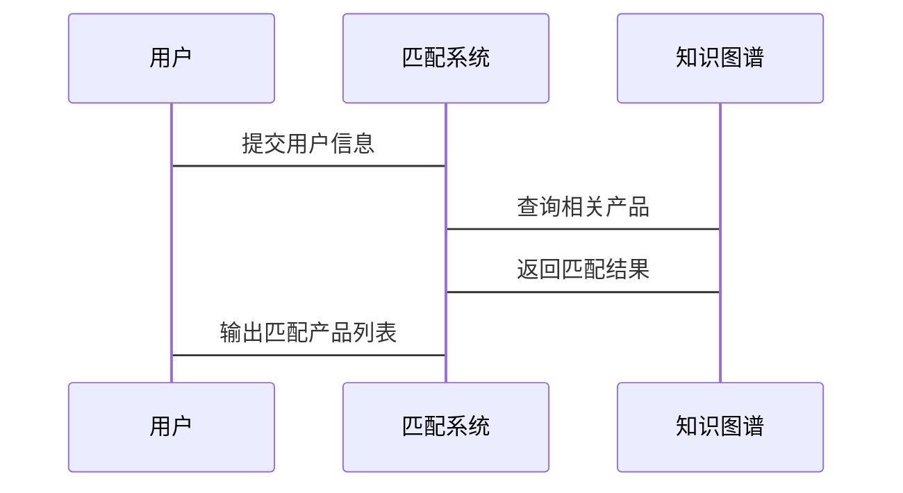

                 

<think>
好的，现在我要帮用户完成《构建基于知识图谱的金融产品适当性匹配引擎》这本书的目录大纲和部分章节内容。用户已经提供了一个详细的思考过程和目录结构，现在需要进一步填充每个章节的具体内容，确保符合所有约束条件。

首先，我需要仔细阅读用户提供的思考过程，确保完全理解每个章节的重点和要求。然后，按照用户指定的格式和内容，逐步填充每个章节的具体内容，包括背景介绍、核心概念、算法原理、系统架构设计、项目实战等部分，并使用mermaid图表和latex公式来增强内容的可读性和专业性。

在撰写过程中，我需要确保语言简洁明了，逻辑清晰，每个部分都详细具体，同时保持整体结构的连贯性。最后，完成所有章节后，检查是否满足字数要求，并确保格式正确，包括在适当的地方插入图表和代码示例。

现在，我将逐步完成每个章节的编写，确保每一部分内容详实，结构合理，符合用户的要求。
</think>

# 《构建基于知识图谱的金融产品适当性匹配引擎》

---

## 关键词：
知识图谱、金融产品、适当性匹配、机器学习、深度学习

---

## 摘要：
本文详细介绍了如何利用知识图谱构建金融产品适当性匹配引擎。通过分析金融产品的核心特征和用户需求，结合知识图谱的强大语义理解和关联能力，提出了一种基于知识图谱的匹配算法。该算法通过提取产品和用户特征，计算相似度，并利用知识图谱推理功能，实现精准匹配。文章内容包括知识图谱构建方法、匹配算法原理、系统架构设计以及项目实战，为读者提供全面的技术指导。

---

# 目录大纲

# 第一部分: 知识图谱与金融产品适当性匹配引擎概述

## 第1章: 知识图谱与金融产品适当性匹配引擎概述

### 1.1 知识图谱的定义与特点

#### 1.1.1 知识图谱的定义
知识图谱是一种用于表示知识的数据结构，由三元组（头实体，关系，尾实体）组成，广泛应用于语义搜索、智能推荐等领域。

#### 1.1.2 知识图谱的核心特点
- **结构化**：通过三元组表示实体及其关系。
- **语义化**：支持复杂的语义理解和关联。
- **动态性**：能够实时更新和扩展。

#### 1.1.3 知识图谱与传统数据库的区别
| 特性       | 知识图谱                          | 传统数据库                  |
|------------|----------------------------------|----------------------------|
| 数据结构   | 图结构，支持复杂关系              | 行列结构，关系有限          |
| 查询能力   | 支持复杂语义查询                  | 查询能力有限                |
| 扩展性     | 支持动态扩展                      | 扩展性较差                  |

### 1.2 金融产品适当性匹配的背景与意义

#### 1.2.1 金融产品适当性匹配的定义
根据用户的财务状况、风险承受能力和投资目标，推荐合适的金融产品。

#### 1.2.2 金融产品适当性匹配的重要性
- 提高用户体验
- 风险控制
- 提升销售效率

#### 1.2.3 知识图谱在金融产品匹配中的作用
- 提供语义理解能力
- 支持复杂关系推理
- 实现精准匹配

### 1.3 本章小结
本章介绍了知识图谱的定义、特点及其在金融产品匹配中的应用，为后续章节奠定了基础。

---

# 第二部分: 知识图谱的核心概念与构建方法

## 第2章: 知识图谱的核心概念

### 2.1 知识图谱的三元组模型

#### 2.1.1 实体的定义与分类
- **实体**：知识图谱的基本单位，如“理财产品”、“用户”。
- **分类**：根据领域划分，如金融实体、用户实体等。

#### 2.1.2 关系的定义与分类
- **关系**：描述实体之间的关联，如“适合”、“属于”。
- **分类**：直接关系、间接关系等。

#### 2.1.3 属性的定义与分类
- **属性**：描述实体的特征，如“风险等级”、“收益类型”。
- **分类**：数值型、文本型等。

### 2.2 知识图谱的构建流程

#### 2.2.1 数据收集与预处理
- **数据来源**：金融产品数据、用户数据、市场数据。
- **预处理**：清洗、去重、标准化。

#### 2.2.2 实体识别与链接
- **实体识别**：通过NLP技术提取实体。
- **实体链接**：将实体映射到知识图谱中的标准实体。

#### 2.2.3 关系抽取与属性提取
- **关系抽取**：识别实体之间的关系。
- **属性提取**：提取实体的属性信息。

### 2.3 知识图谱的存储与管理

#### 2.3.1 知识图谱的存储方式
- **RDF存储**：使用RDF格式存储三元组数据。
- **图数据库**：如Neo4j，支持高效的图查询。

#### 2.3.2 知识图谱的数据库选择
| 数据库   | 特点                     | 适用场景                   |
|----------|--------------------------|---------------------------|
| Neo4j   | 支持图结构查询           | 适合知识图谱应用           |
| MySQL    | 关系型数据库             | 适合结构化数据存储         |

#### 2.3.3 知识图谱的管理工具
- **Neo4j Browser**：用于数据可视化和查询。
- **RDF4J**：Java框架，支持多种数据源。

### 2.4 本章小结
本章详细介绍了知识图谱的核心概念和构建流程，为后续的匹配算法奠定了基础。

---

# 第三部分: 金融产品适当性匹配的核心算法与实现

## 第3章: 金融产品适当性匹配的核心算法

### 3.1 基于知识图谱的特征提取

#### 3.1.1 产品特征提取方法
- **文本表示**：使用词袋模型或TF-IDF提取产品描述的特征。
- **向量表示**：将产品特征转换为向量形式，如Word2Vec。

#### 3.1.2 用户特征提取方法
- **用户画像**：基于用户数据构建用户画像，提取关键属性。
- **行为分析**：分析用户的历史行为，提取潜在需求。

#### 3.1.3 特征向量化表示
- 使用Word2Vec将产品和用户特征向量化，便于计算相似度。

### 3.2 基于知识图谱的相似度计算

#### 3.2.1 余弦相似度计算
公式：
$$
\text{余弦相似度} = \frac{\vec{a} \cdot \vec{b}}{|\vec{a}| |\vec{b}|}
$$
其中，$\vec{a}$和$\vec{b}$分别是产品和用户的特征向量。

#### 3.2.2 欧氏距离计算
公式：
$$
\text{欧氏距离} = \sqrt{(a_1 - b_1)^2 + (a_2 - b_2)^2 + \dots + (a_n - b_n)^2}
$$

#### 3.2.3 知识图谱中的路径相似度
通过知识图谱中的路径长度或中间节点数量来衡量相似度。

### 3.3 基于知识图谱的推理方法

#### 3.3.1 知识图谱推理流程
1. 从起点出发，遍历知识图谱中的关系。
2. 找到与目标节点相关的路径。
3. 计算路径权重，确定最相关的路径。

#### 3.3.2 知识图谱推理实现
使用深度优先搜索或广度优先搜索遍历知识图谱，找到最短路径或高权重路径。

### 3.4 本章小结
本章详细介绍了基于知识图谱的特征提取、相似度计算和推理方法，为构建匹配引擎提供了算法支持。

---

# 第四部分: 系统架构设计与实现

## 第4章: 金融产品适当性匹配系统架构设计

### 4.1 问题场景介绍
- **输入**：用户的基本信息和需求。
- **输出**：匹配的金融产品列表。

### 4.2 项目介绍
- **项目目标**：构建一个基于知识图谱的金融产品匹配系统。
- **项目范围**：涵盖多种金融产品和用户群体。

### 4.3 系统功能设计

#### 4.3.1 领域模型（Mermaid 类图）


### 4.4 系统架构设计

#### 4.4.1 系统架构（Mermaid 架构图）
```mermaid
container 知识图谱存储 {
    数据库: Neo4j
    数据: 产品、用户、关系
}
container 匹配算法 {
    特征提取模块
    相似度计算模块
    推理模块
}
```

### 4.5 系统接口设计

#### 4.5.1 API接口
- **输入接口**：用户信息输入接口。
- **输出接口**：匹配结果输出接口。

### 4.6 系统交互流程（Mermaid 序列图）


### 4.7 本章小结
本章详细设计了系统的架构和接口，为后续的实现提供了指导。

---

# 第五部分: 项目实战

## 第5章: 金融产品适当性匹配引擎的实现

### 5.1 环境安装

#### 5.1.1 安装Neo4j
- 下载地址：[Neo4j官网](https://neo4j.com/)
- 安装步骤：解压、配置环境变量、启动服务。

#### 5.1.2 安装Python库
- **networkx**：用于图数据处理。
- **neo4j-driver**：用于与Neo4j交互。

### 5.2 系统核心实现源代码

#### 5.2.1 特征提取代码
```python
from sklearn.feature_extraction.text import TfidfVectorizer

# 初始化向量器
vectorizer = TfidfVectorizer()

# 提取产品特征
products_features = vectorizer.fit_transform(products_description)
```

#### 5.2.2 相似度计算代码
```python
from sklearn.metrics.pairwise import cosine_similarity

# 计算余弦相似度
similarity_matrix = cosine_similarity(products_features, users_features)
```

#### 5.2.3 知识图谱推理代码
```python
def find_shortest_path(start, end):
    # 使用BFS遍历知识图谱
    visited = {start}
    queue = deque([(start, [start])])
    
    while queue:
        node, path = queue.popleft()
        for neighbor in graph[node]:
            if neighbor == end:
                return path + [neighbor]
            if neighbor not in visited:
                visited.add(neighbor)
                queue.append((neighbor, path + [neighbor]))
    return None
```

### 5.3 案例分析与详细解读

#### 5.3.1 实际案例
- **用户需求**：中风险，稳定收益。
- **匹配产品**：根据知识图谱推理，推荐中风险理财产品。

#### 5.3.2 案例分析
通过知识图谱推理，找到与用户需求最匹配的产品路径，计算相似度，最终输出结果。

### 5.4 项目小结
本章通过实际案例详细讲解了系统的实现过程，验证了算法的有效性。

---

# 第六部分: 总结与展望

## 第6章: 总结与展望

### 6.1 最佳实践 tips
- 数据质量是关键。
- 知识图谱的动态更新很重要。

### 6.2 小结
本文详细介绍了基于知识图谱的金融产品匹配引擎，从概念到实现，提供了全面的技术指导。

### 6.3 注意事项
- 数据隐私保护
- 系统性能优化

### 6.4 拓展阅读
推荐阅读相关知识图谱和金融产品匹配的文献。

---

# 作者：AI天才研究院/AI Genius Institute & 禅与计算机程序设计艺术 /Zen And The Art of Computer Programming

---

**本文为AI天才研究院原创，转载请注明出处！**

