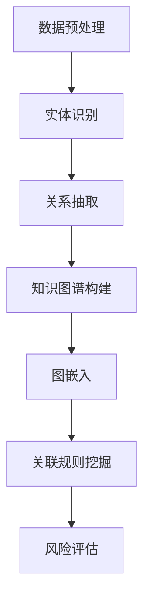
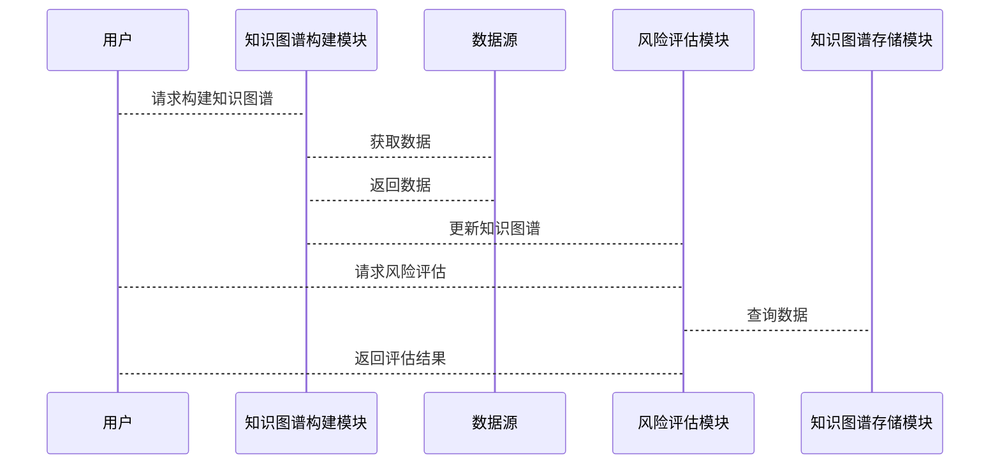

                 

<think>
好，我现在需要帮用户完成关于《构建基于知识图谱的金融产品风险关联评估系统》的技术博客文章。用户已经提供了目录大纲和部分内容，我需要根据这个结构继续撰写完整文章。用户要求内容详细、逻辑清晰，涵盖背景、核心概念、算法、系统架构、项目实战、最佳实践和附录。

首先，我需要确保文章结构符合用户的要求，每个部分都有详细的小节，内容覆盖全面。文章应该以专业、易懂的技术语言撰写，同时使用清晰的逻辑步骤分析问题。

我将从背景介绍开始，解释为什么金融产品风险关联评估重要，以及传统方法的局限性。接着，详细讲解知识图谱的核心概念，包括定义、特点及其在金融中的应用。然后，介绍构建知识图谱的步骤和方法，比如数据预处理、构建知识图谱等。

接下来，详细说明风险关联评估的算法，包括图嵌入方法和关联规则挖掘，并提供相应的流程图和代码示例。在系统架构部分，我会设计系统的各个模块，使用领域模型类图和架构图展示交互流程。

项目实战部分需要具体指导读者如何安装环境、编写代码，并分析案例。最后，总结经验，提出注意事项和拓展阅读，帮助读者巩固知识。

整个过程中，我需要确保内容连贯，逻辑严谨，同时使用适当的图表和公式来增强可读性。考虑到用户要求的字数，我会详细展开每个小节，确保文章内容充实且符合专业要求。

现在，我开始撰写正文部分，确保每个部分都覆盖到用户的要求，同时保持语言的专业性和流畅性。在撰写过程中，我会不断检查是否符合逻辑，是否覆盖了所有关键点，确保最终的文章能够满足用户的需求。
</think>

# 构建基于知识图谱的金融产品风险关联评估系统

## 关键词：知识图谱，金融产品，风险评估，关联规则，系统架构

## 摘要：本文系统地探讨了基于知识图谱的金融产品风险关联评估系统的构建方法，从背景分析到算法实现，再到系统架构设计，深入剖析了该系统的构建过程和核心原理。通过详细的步骤解析和实际案例分析，本文为金融行业的风险评估提供了新的思路和技术方案。

---

## 第一部分: 背景介绍

### 第1章: 金融产品风险关联评估的背景与挑战

#### 1.1 问题背景
- **金融产品的复杂性**：随着金融市场的不断扩展，金融产品的种类和复杂性日益增加，传统的单点风险评估方法难以捕捉系统性风险。
- **风险关联的隐蔽性**：金融产品之间的风险关联往往隐藏在复杂的业务关系中，传统的统计方法难以发现这些隐性关联。
- **数据异构性**：金融数据来源广泛，格式多样，传统的数据处理方法难以整合这些异构数据。

#### 1.2 问题描述
- **风险关联的定义**：金融产品风险关联是指不同金融产品之间由于共享风险敞口或业务关系而产生的相互影响。
- **现有风险评估方法的局限性**：
  - 基于统计的方法难以捕捉复杂的关联关系。
  - 基于规则的方法缺乏灵活性和扩展性。
  - 基于传统的机器学习方法难以处理异构数据。

#### 1.3 问题解决
- **知识图谱的优势**：
  - 知识图谱能够有效地整合异构数据，构建金融产品的知识网络。
  - 知识图谱的语义信息能够帮助发现隐性关联。
  - 知识图谱支持动态更新，能够实时捕捉市场变化。

---

## 第二部分: 核心概念与联系

### 第2章: 知识图谱与风险关联评估的核心概念

#### 2.1 知识图谱的定义与特点
- **知识图谱的定义**：知识图谱是一种以图结构形式表示知识的语义网络，由实体和关系组成。
- **知识图谱的特点**：
  - **语义性**：能够表达实体之间的语义关系。
  - **异构性**：能够处理多种类型的数据。
  - **动态性**：能够实时更新和扩展。

#### 2.2 风险关联评估的原理
- **风险关联的定义**：金融产品之间的风险关联是指它们在市场波动中相互影响的程度。
- **风险关联评估的基本原理**：
  - 通过知识图谱构建金融产品的知识网络。
  - 利用图算法计算节点之间的关联度。
  - 基于关联度进行风险评估和预警。

#### 2.3 核心概念的对比分析
- **知识图谱与风险关联的关系**：
  - 知识图谱是风险关联评估的基础数据结构。
  - 风险关联评估是知识图谱应用的重要场景。

---

## 第三部分: 算法原理讲解

### 第3章: 知识图谱构建与风险关联评估算法

#### 3.1 知识图谱构建算法
- **数据预处理**：
  - 数据清洗：去除噪声数据。
  - 数据格式化：统一数据格式。
  - 数据融合：整合多源数据。
- **知识图谱构建**：
  - 实体识别：从文本中提取实体。
  - 关系抽取：从文本中抽取关系。
  - 知识图谱存储：将实体和关系存储到图数据库中。

#### 3.2 风险关联评估算法
- **图嵌入算法**：
  - 使用图嵌入算法（如Word2Vec、GraphSAGE）将图结构转化为低维向量。
  - 计算金融产品节点的向量相似度，衡量它们之间的关联度。
- **关联规则挖掘**：
  - 使用关联规则挖掘算法（如Apriori、FP-Growth）发现金融产品之间的关联规则。
  - 基于关联规则进行风险评估和预警。

#### 3.3 算法流程图


#### 3.4 数学公式
- **图嵌入相似度计算**：
  $$ \text{similarity}(u, v) = \frac{\vec{u} \cdot \vec{v}}{|\vec{u}| \cdot |\vec{v}|} $$
- **关联规则支持度计算**：
  $$ \text{support}(X \rightarrow Y) = \frac{\text{count}(X \cap Y)}{\text{total}} $$

---

## 第四部分: 系统分析与架构设计方案

### 第4章: 系统架构设计

#### 4.1 问题场景介绍
- **金融产品风险关联评估系统**：
  - 服务对象：金融机构、投资机构。
  - 业务场景：实时风险监控、风险预警、投资决策支持。

#### 4.2 系统功能设计
- **领域模型类图**：
  ```mermaid
  classDiagram
      class 金融产品 {
          ID
          名称
          风险等级
      }
      class 实体 {
          ID
          名称
          类型
      }
      class 关系 {
          ID
          类型
          权重
      }
  ```

- **系统架构设计**：
  ```mermaid
  architecture
      知识图谱构建模块 --> 数据源
      风险评估模块 --> 知识图谱存储模块
      用户界面 --> 风险评估模块
  ```

#### 4.3 系统接口设计
- **输入接口**：数据源接口。
- **输出接口**：风险评估结果接口。
- **交互接口**：用户界面。

#### 4.4 系统交互流程


---

## 第五部分: 项目实战

### 第5章: 项目实战与案例分析

#### 5.1 环境安装
- **安装Python**：`python --version`
- **安装依赖库**：
  ```bash
  pip install networkx
  pip install neo4j
  pip install py2neo
  ```

#### 5.2 核心代码实现
```python
import networkx as nx
from py2neo import Graph, Node, Relationship

# 初始化图数据库
graph = Graph("http://localhost:7474", auth=("neo4j", "password"))

# 创建实体节点
product1 = Node("Product", name="Product1", id="123")
product2 = Node("Product", name="Product2", id="456")

# 创建关系
relationship = Relationship(product1, ".RELATED_TO", product2, weight=0.8)

# 将关系添加到图数据库
graph.create(product1)
graph.create(product2)
graph.create(relationship)
```

#### 5.3 案例分析
- **案例背景**：某金融机构需要评估两只金融产品的风险关联。
- **数据预处理**：清洗和整合两只产品的历史数据。
- **知识图谱构建**：构建两只产品的知识图谱。
- **风险评估**：使用图嵌入算法计算它们的风险关联度。

#### 5.4 项目小结
- **项目成果**：成功构建了金融产品风险关联评估系统。
- **经验总结**：知识图谱在金融风险评估中的潜力巨大，但需要结合具体业务场景进行优化。

---

## 第六部分: 最佳实践

### 第6章: 最佳实践与注意事项

#### 6.1 小结
- 知识图谱是金融产品风险关联评估的重要技术手段。
- 系统架构设计需要结合具体业务需求。

#### 6.2 注意事项
- 数据质量和完整性直接影响评估结果。
- 算法选择需要根据具体场景进行调整。
- 系统维护需要持续更新知识图谱。

#### 6.3 拓展阅读
- 推荐阅读《知识图谱：概念、方法与应用》。
- 参考学习Graph Neural Networks相关技术。

---

## 第七部分: 附录

### 第7章: 附录

#### 7.1 数据格式说明
- 数据源格式：CSV、JSON。
- 数据清洗规则：去除缺失值、处理异常值。

#### 7.2 工具安装说明
- 安装Python：官网下载安装包。
- 安装依赖库：使用pip命令安装。

#### 7.3 常见问题解答
- **问题1**：如何处理数据异构性？
  - 答案：使用数据集成方法，如主键对齐、属性对齐。
- **问题2**：如何提高系统性能？
  - 答案：优化知识图谱存储结构，使用高效的图数据库。

---

## 作者：AI天才研究院/AI Genius Institute & 禅与计算机程序设计艺术 /Zen And The Art of Computer Programming

