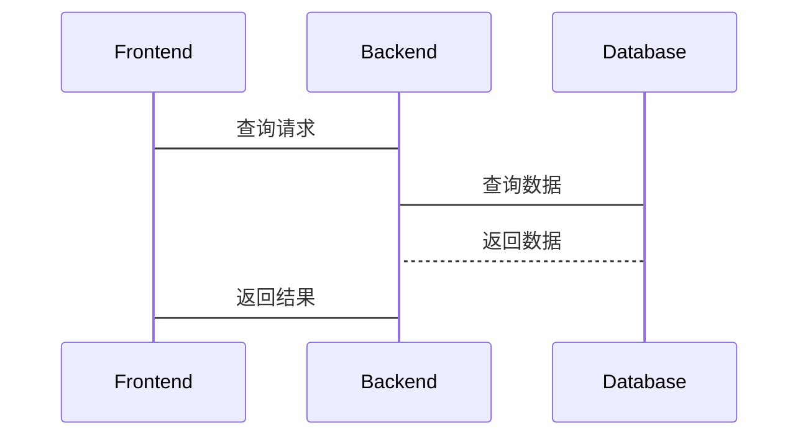

                 


# 构建基于知识图谱的金融监管合规追踪系统

> 关键词：知识图谱，金融监管，合规追踪，实体识别，关系抽取，图数据库

> 摘要：本文详细探讨了如何利用知识图谱构建金融监管合规追踪系统。通过分析金融监管的痛点，结合知识图谱的核心概念，介绍了系统的构建过程，包括实体识别、关系抽取、图数据库选型、系统架构设计以及实际案例分析。

---

## 第一部分：背景介绍与核心概念

### 第1章：问题背景与问题描述

#### 1.1 问题背景

金融监管是保障金融市场健康运行的重要环节。随着金融业务的复杂化，监管数据分散、信息孤岛等问题日益突出。传统的监管方式难以应对日益复杂的合规需求。

#### 1.2 问题描述

- **信息孤岛**：不同业务系统数据分散，难以统一分析。
- **合规复杂性**：金融产品和交易涉及多层关系，合规追踪难度大。
- **监管效率**：传统方法难以快速识别风险点。

#### 1.3 解决方案

知识图谱通过构建语义网络，将监管数据结构化，帮助发现隐藏关系，提升合规追踪效率。

### 第2章：问题解决与边界定义

#### 2.1 问题解决

- 知识图谱帮助整合分散数据，构建统一的知识网络。
- 提供可视化工具，便于监管人员快速发现异常。

#### 2.2 边界与外延

- **边界**：聚焦于合规追踪，不涉及具体的交易执行。
- **外延**：可扩展至风险评估、反洗钱等领域。

### 第3章：核心概念与概念结构

#### 3.1 核心概念

- **实体**：如公司、交易、账户。
- **关系**：如“拥有”、“交易”。
- **属性**：如“金额”、“时间”。

#### 3.2 概念结构

通过ER图展示实体及其关系：

```mermaid
erDiagram
    company {
        id : int
        name : string
        reg_num : string
    }
    transaction {
        id : int
        amount : float
        time : datetime
    }
    account {
        id : int
        balance : float
        owner : string
    }
    company --> transaction : "进行"
    account --> transaction : "涉及"
    company --> account : "拥有"
```

---

## 第二部分：核心概念与联系

### 第4章：核心概念原理

#### 4.1 知识图谱的构建原理

- **实体识别**：通过NLP技术从文本中提取实体。
- **关系抽取**：识别实体间的关联。
- **属性提取**：提取实体属性。

#### 4.2 知识图谱的存储与查询

- **图数据库**：如Neo4j，适合存储和查询关系数据。
- **图查询语言**：Cypher，用于复杂关系查询。

### 第5章：核心概念属性对比

通过表格对比实体与关系的属性：

| 属性类型 | 实体属性示例 | 关系属性示例 |
|----------|--------------|--------------|
| 名称      | 公司名称      | 交易类型      |
| 类型      | 企业类型      | 涉及金额      |
| 时间      | 成立时间      | 交易时间      |

---

## 第三部分：算法原理讲解

### 第7章：算法原理

#### 7.1 实体识别算法

- **基于规则的方法**：通过预定义规则匹配文本中的实体。
- **基于机器学习的方法**：使用CRF或LSTM模型识别实体。

#### 7.2 关系抽取算法

- **基于规则的方法**：利用句法结构识别关系。
- **基于语义的方法**：使用嵌入模型（如Word2Vec）计算语义相似度。

#### 7.3 属性提取算法

- **规则匹配**：通过正则表达式提取属性。
- **模式匹配**：基于上下文判断属性值。

---

## 第四部分：系统分析与架构设计

### 第8章：系统分析与架构设计

#### 8.1 问题场景介绍

系统需支持大规模金融数据处理，提供高效查询和分析功能。

#### 8.2 系统功能设计

- 数据采集模块：从多种数据源采集数据。
- 数据处理模块：清洗、转换数据。
- 知识构建模块：提取实体、关系和属性。
- 查询分析模块：提供复杂关系查询。

#### 8.3 系统架构设计

分层架构：


#### 8.4 接口设计与交互流程图

系统交互流程：



---

## 第五部分：项目实战

### 第9章：项目实战

#### 9.1 环境安装

安装必要的工具和库，如Python、Neo4j、networkx。

#### 9.2 核心实现代码

以下是Python代码示例：

```python
from neo4j import GraphDatabase
from py2neo import Graph, Node, Relationship

# 连接到Neo4j数据库
graph = Graph("bolt://localhost:7687", auth=("user", "password"))

# 创建实体节点
company = Node("Company", name="Example Corp", reg_num="12345")
account = Node("Account", id=1, balance=10000)

# 创建关系
relationship = Relationship(company, "OWNS", account)

# 将关系添加到图中
graph.create(relationship)
```

#### 9.3 代码解读与分析

代码实现以下功能：

- 连接到Neo4j数据库。
- 创建公司和账户节点。
- 建立“拥有”关系。

#### 9.4 实际案例分析

通过案例分析知识图谱在合规追踪中的应用，例如识别关联公司间的资金流动。

---

## 第六部分：总结与展望

### 第10章：总结与展望

#### 10.1 最佳实践

- 数据清洗是关键，确保数据质量。
- 结合可视化工具提升用户体验。

#### 10.2 小结

知识图谱为金融监管提供了强大的工具，能够有效解决合规追踪的难题。

#### 10.3 注意事项

- 数据隐私需严格保护。
- 系统性能需优化，支持大规模数据处理。

#### 10.4 拓展阅读

推荐相关书籍和论文，深入学习知识图谱和金融监管的知识。

---

## 作者

作者：AI天才研究院 & 禅与计算机程序设计艺术

---

通过以上结构，文章系统地介绍了构建基于知识图谱的金融监管合规追踪系统的各个方面，从理论到实践，从概念到代码，全面覆盖了相关知识，帮助读者深入理解并掌握构建该系统的技能。

