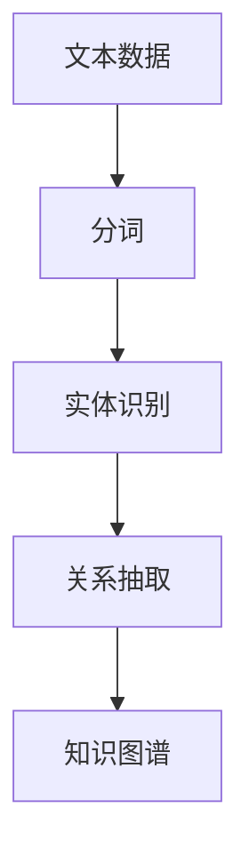
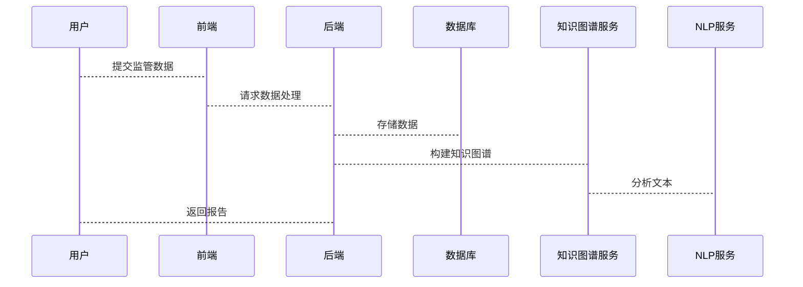

                 


# 构建基于知识图谱的金融监管报告生成器

> 关键词：知识图谱，金融监管，自然语言处理，报告生成，系统架构

> 摘要：本文详细探讨了如何构建基于知识图谱的金融监管报告生成器。文章从背景介绍开始，分析了金融监管的挑战与需求，提出了基于知识图谱的解决方案，并详细讲解了知识图谱的构建算法、系统架构设计以及实际项目实现。通过案例分析，展示了该系统在金融监管中的实际应用价值，并展望了未来的发展方向。

---

## 第一章: 背景介绍

### 1.1 问题背景

#### 1.1.1 金融监管的挑战与需求
金融监管是维护金融市场秩序、保护投资者利益的重要手段。然而，随着金融市场的发展，监管数据呈现出多样性、复杂性和动态性的特点，传统的监管方式难以应对日益复杂的监管需求。

#### 1.1.2 问题描述
金融监管报告的生成过程通常依赖人工操作，存在效率低、成本高、易出错等问题。监管数据分散在不同的系统中，难以实现信息的有效整合和利用。

#### 1.1.3 解决方案
通过构建基于知识图谱的金融监管报告生成器，可以实现对监管数据的自动化处理和分析，提高报告生成的效率和准确性。

#### 1.1.4 边界与外延
本系统仅关注金融监管报告的生成过程，不涉及具体的监管决策和执法行动。系统的输入是结构化的监管数据和非结构化的文本数据，输出是结构化的监管报告。

---

## 第二章: 核心概念与联系

### 2.1 知识图谱的定义与特点
知识图谱是一种以图结构形式表示知识的数据库，其核心要素包括节点（实体）和边（关系）。知识图谱具有语义丰富、结构清晰、易于推理等特点。

### 2.2 金融监管的定义与特点
金融监管是指通过对金融机构和市场的监管，确保金融体系的稳定运行。其特点包括复杂性、动态性和合规性。

### 2.3 知识图谱与金融监管的关系
知识图谱可以将分散的监管数据整合为一个统一的知识网络，为监管报告的生成提供数据支持和语义理解能力。

### 2.4 核心概念的ER实体关系图
```mermaid
er
    entity 知识图谱 {
        <属性> 节点
        <属性> 边
    }
    entity 金融监管 {
        <属性> 监管对象
        <属性> 监管规则
    }
    entity 报告生成器 {
        <属性> 输入数据
        <属性> 输出报告
    }
    知识图谱 --> 金融监管: 提供数据支持
    知识图谱 --> 报告生成器: 提供知识支持
    金融监管 --> 报告生成器: 提供监管需求
```

---

## 第三章: 算法原理讲解

### 3.1 知识图谱构建算法

#### 3.1.1 实体识别与抽取
实体识别是通过自然语言处理技术从文本中提取出具体实体的过程。例如，从新闻标题中提取公司名称和事件类型。

#### 3.1.2 实体关系抽取
实体关系抽取是从文本中识别出实体之间的关系。例如，从句子“公司A收购了公司B”中提取出“收购”的关系。

#### 3.1.3 知识图谱构建流程


#### 3.1.4 向量空间模型
向量空间模型通过将文本表示为向量，计算文本之间的相似性。例如，使用余弦相似度计算两个文本的相似性：
$$ \text{相似度} = \frac{\vec{A} \cdot \vec{B}}{|\vec{A}| |\vec{B}|} $$

#### 3.1.5 概率图模型
概率图模型通过概率分布描述实体之间的关系。例如，使用贝叶斯网络进行关系推理。

---

## 第四章: 系统分析与架构设计

### 4.1 系统功能设计
系统功能包括数据采集、知识图谱构建、报告生成和用户界面展示。

### 4.2 系统架构设计


### 4.3 接口设计
系统提供RESTful API接口，包括数据采集接口、知识图谱构建接口和报告生成接口。

### 4.4 系统交互流程


---

## 第五章: 项目实战

### 5.1 环境安装
需要安装Python、Jupyter Notebook、NLTK库和NetworkX库。

### 5.2 核心代码实现

#### 5.2.1 数据采集
```python
import requests

url = "https://example.com/api/data"
response = requests.get(url)
data = response.json()
```

#### 5.2.2 实体识别
```python
from nltk import word_tokenize, pos_tag

text = "公司A在2023年第一季度实现净利润10亿元。"
tokens = word_tokenize(text)
entities = pos_tag(tokens)
```

#### 5.2.3 知识图谱构建
```python
import networkx as nx

G = nx.Graph()
G.add_nodes_from(["公司A", "净利润", "10亿元"])
G.add_edges_from([("公司A", "净利润"), ("净利润", "10亿元")])
```

#### 5.2.4 报告生成
```python
from reportlab.pdfgen import canvas

pdf = canvas.Canvas("report.pdf")
pdf.drawString(100, 750, "公司A 2023年第一季度净利润10亿元")
pdf.save()
```

### 5.3 案例分析
以某公司为例，分析其财务数据，生成监管报告。

### 5.4 项目小结
通过实际案例，验证了基于知识图谱的金融监管报告生成器的有效性和可行性。

---

## 第六章: 总结与展望

### 6.1 总结
本文详细探讨了基于知识图谱的金融监管报告生成器的构建过程，包括背景分析、算法原理、系统架构和项目实现。

### 6.2 展望
未来可以进一步优化知识图谱构建算法，提升系统的智能化水平。

---

## 最佳实践 Tips

- 在数据采集阶段，建议使用可靠的API接口。
- 在知识图谱构建过程中，可以采用分布式计算技术提高效率。
- 在报告生成阶段，可以引入机器学习模型进行预测和分析。

---

## 作者：AI天才研究院 & 禅与计算机程序设计艺术

