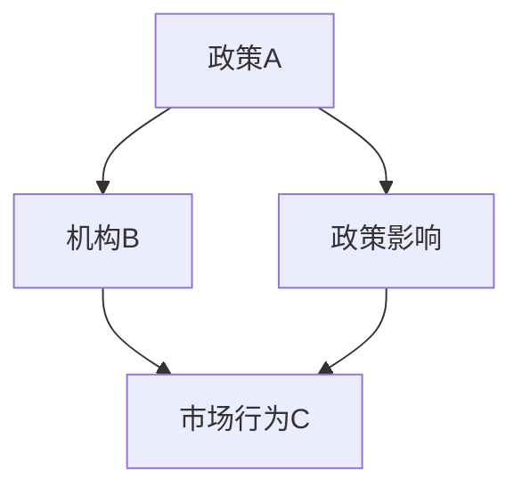
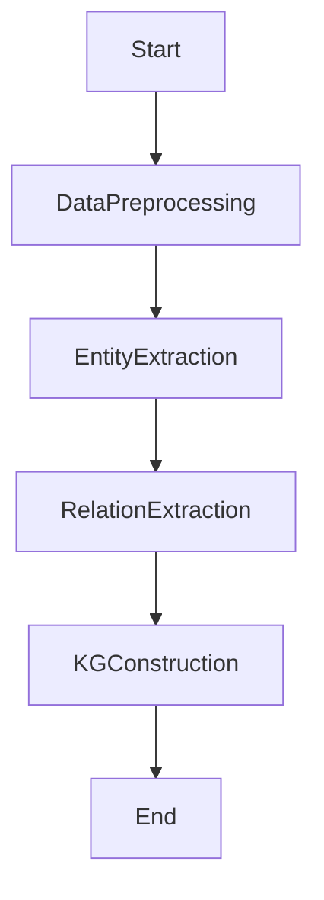
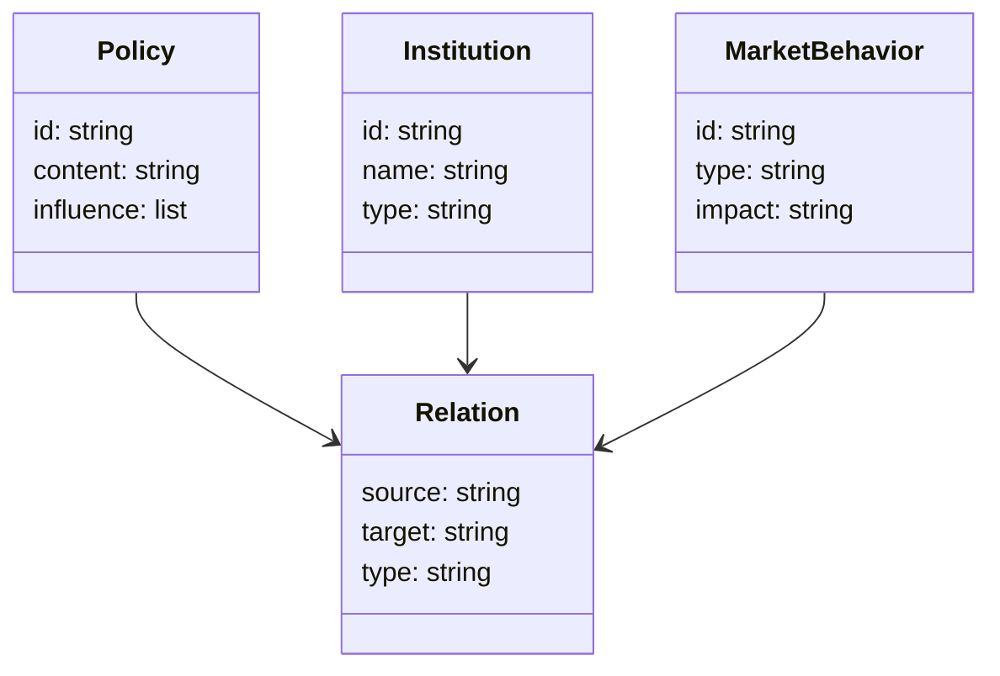

                 

<think>
好的，我需要帮助用户撰写一篇关于《构建基于知识图谱的金融监管政策影响链追踪系统》的技术博客文章。用户已经提供了一个详细的目录结构，涵盖了从背景介绍到项目实战的各个方面。我需要按照这个结构逐步完成每一部分，确保内容详实且符合技术要求。

首先，我会从背景介绍开始。这里需要定义知识图谱和金融监管政策影响链，并说明为什么需要构建这样一个系统。接着，我会讨论核心概念与联系，包括实体、关系、属性等，并使用表格和ER图来展示它们之间的关系。

接下来，算法原理部分需要详细讲解构建知识图谱的步骤，包括实体识别和关系抽取，并使用mermaid流程图来展示流程。这部分还需要包含数学公式和代码示例，以增强技术细节。

然后，系统分析与架构设计部分需要介绍系统的功能模块和架构设计，使用mermaid类图和架构图来展示系统结构。接口设计和交互流程也需要详细说明，可能使用序列图来展示。

项目实战部分需要指导读者如何安装环境、实现系统核心功能，并通过案例分析展示系统的实际应用。这部分需要包含代码示例和详细的实现步骤。

最后，总结与展望部分将回顾整个系统，讨论其应用价值、可能的挑战和未来的发展方向。

在撰写过程中，我会确保每一部分都细化到三级目录，内容全面且逻辑清晰。同时，我会使用mermaid图表和数学公式来增强技术细节的讲解，确保文章专业且易于理解。
</think>

# 构建基于知识图谱的金融监管政策影响链追踪系统

> 关键词：知识图谱，金融监管，政策影响链，系统构建，算法原理

> 摘要：本文详细介绍了如何利用知识图谱技术构建金融监管政策影响链追踪系统。通过分析知识图谱的核心概念、构建算法、系统架构设计和项目实战，展示了该系统在金融监管中的应用价值和实现方法。

---

## 第一部分：背景介绍

### 第1章：知识图谱与金融监管政策概述

#### 1.1 知识图谱的基本概念

- **知识图谱的定义**
  知识图谱是一种以结构化方式表示知识的图数据，由实体（节点）和关系（边）组成，用于描述真实世界中的概念及其关系。

- **知识图谱的核心特征**
  - 表示形式化：通过结构化数据描述知识。
  - 可扩展性：支持大规模数据的存储和查询。
  - 关联性：通过关系连接不同实体，揭示数据间的关联。

- **知识图谱在金融领域的应用**
  知识图谱在金融监管、风险评估、关联交易分析等方面有广泛应用，帮助金融机构更好地理解和应对监管要求。

#### 1.2 金融监管政策的影响链

- **金融监管政策的定义**
  金融监管政策是政府或监管机构为维护金融稳定、保护投资者利益而制定的法规和指导方针。

- **政策影响链的定义与特点**
  政策影响链描述了政策从制定到执行、再到影响最终结果的过程，具有因果性、层次性和动态性。

- **政策影响链在金融监管中的作用**
  通过追踪政策影响链，监管机构可以更准确地评估政策效果，及时调整监管措施，提高监管效率。

---

### 第2章：问题背景与需求分析

#### 2.1 问题背景

- **当前金融监管面临的挑战**
  - 政策复杂性：金融政策涉及多个层面，影响链条复杂，难以全面追踪。
  - 数据分散性：监管数据分散在不同机构和系统中，难以整合分析。
  - 监管效率低下：传统监管方式效率低，难以应对快速变化的金融市场。

#### 2.2 需求分析

- **金融监管政策影响链追踪的核心需求**
  - 实时追踪政策变化及其影响。
  - 精准识别政策对市场和机构的具体影响。
  - 提供可视化的政策影响分析工具。

- **知识图谱在政策影响链追踪中的优势**
  - 结构化的知识表示，便于数据整合和分析。
  - 可视化的能力，帮助监管机构清晰理解政策影响。
  - 高效的查询和推理能力，支持实时追踪和分析。

#### 2.3 问题解决思路

- **知识图谱技术在政策影响链追踪中的应用**
  - 通过知识图谱构建政策影响链的知识库，支持政策变化的实时追踪和影响分析。
  - 利用图数据结构，分析政策之间的关联和影响路径。

- **系统构建的目标与框架**
  - 构建一个支持政策影响链追踪的知识图谱系统，提供数据采集、存储、分析和可视化的功能。

---

## 第二部分：核心概念与联系

### 第3章：知识图谱的核心概念与原理

#### 3.1 实体与关系

- **实体的定义与分类**
  实体是知识图谱中的基本单元，可以是具体的对象、概念或事件。例如，金融监管政策、金融机构、市场行为等。

- **关系的定义与分类**
  关系描述实体之间的关联，可以是“制定”、“影响”、“执行”等。关系可以是二元关系（如A影响B）或多元关系（如A通过C影响B）。

- **实体与关系的关联方式**
  实体通过属性和关系连接，形成复杂的网络结构，描述现实世界中的各种关系和属性。

#### 3.2 知识图谱的构建流程

- **数据采集与预处理**
  从多种来源（如法规文件、新闻报道、市场数据）收集相关数据，清洗和标准化处理。

- **实体识别与抽取**
  使用自然语言处理技术从文本中提取实体，例如识别“金融监管政策”为一个实体。

- **关系抽取与构建**
  识别实体之间的关系，例如“政策A影响市场行为B”。

- **知识图谱存储与管理**
  使用图数据库（如Neo4j）存储知识图谱，支持高效的查询和分析。

### 第4章：知识图谱与政策影响链的实体关系分析

#### 4.1 实体关系分析

- **金融监管政策的实体识别**
  识别与金融监管政策相关的实体，例如“货币政策”、“监管机构”、“金融机构”等。

- **政策影响链中的关系抽取**
  抽取政策与市场行为、金融机构之间的关系，例如“政策X影响机构Y的市场行为”。

#### 4.2 实体关系对比表格

| 实体 | 属性 | 关系 |
|------|------|------|
| 政策A | 类型：货币政策 | 制定：机构B |
| 机构B | 类型：商业银行 | 执行：政策A |
| 市场行为C | 类型：股价波动 | 受影响：政策A |

#### 4.3 ER实体关系图架构



---

## 第三部分：算法原理讲解

### 第5章：知识图谱构建算法原理

#### 5.1 实体识别与抽取

- **实体识别算法**
  使用命名实体识别（NER）技术，从文本中提取实体，例如使用spaCy或NER模型。

#### 5.2 关系抽取与构建

- **关系抽取算法**
  使用关系抽取模型，识别实体之间的关系，例如使用BERT模型进行关系分类。

#### 5.3 知识图谱构建流程



#### 5.4 算法数学模型

- **实体识别的模型**
  使用条件随机场（CRF）模型进行序列标注，公式表示为：
  $$ P(y|x) = \frac{1}{Z} \exp(\sum_{i=1}^n \sum_{j=1}^m w_{y_i y_{i-1} x_i}) ) $$
  其中，$y$是标签序列，$x$是输入序列，$w$是权重参数，$Z$是归一化因子。

---

## 第四部分：系统分析与架构设计

### 第6章：系统功能设计

#### 6.1 问题场景介绍

- **政策影响链追踪**
  系统需要支持用户输入特定政策，追踪其对市场、机构的具体影响。

#### 6.2 系统功能模块

- **数据采集模块**
  从多种来源采集政策文本、市场数据等。
- **知识构建模块**
  构建知识图谱，存储政策、机构、市场行为等实体及其关系。
- **影响分析模块**
  分析特定政策的影响路径和结果。
- **可视化模块**
  提供图形化界面，展示政策影响链。

#### 6.3 领域模型类图



### 第7章：系统架构设计

#### 7.1 系统架构设计

- **分层架构**
  系统分为数据层、业务逻辑层和表现层，使用微服务架构。

#### 7.2 系统架构图

```mermaid
graph TD
    Client --> API Gateway
    API Gateway --> Service1
    Service1 --> Database
    Service1 --> Service2
    Service2 --> Database
```

---

## 第五部分：项目实战

### 第8章：环境安装与核心实现

#### 8.1 环境安装

- **安装Python环境**
  使用Anaconda安装Python 3.8及以上版本。
- **安装依赖库**
  使用pip安装所需库，如：
  ```bash
  pip install neo4j pythonNeo4j spacy transformers
  ```

#### 8.2 核心代码实现

- **实体识别代码**
  ```python
  import spacy
  nlp = spacy.load("en_core_web_sm")
  doc = nlp("The new policy affects stock market.")
  for token in doc:
      print(token.text, token.pos_)
  ```

- **关系抽取代码**
  ```python
  from transformers import pipeline
  nlp = pipeline("relation_extraction")
  result = nlp("The policy influences market behavior.")
  print(result)
  ```

#### 8.3 案例分析与实现

- **案例分析**
  以具体政策为例，展示如何构建知识图谱并进行影响分析。
- **代码应用解读**
  解读上述代码，说明其实现的功能和原理。

---

## 第六部分：总结与展望

### 第9章：系统总结

#### 9.1 系统应用价值

- 提高金融监管效率，增强政策执行的透明度。
- 为监管机构提供决策支持工具。

#### 9.2 项目经验与不足

- 成功实现了政策影响链的可视化和追踪。
- 数据采集和处理的复杂性是当前系统的瓶颈。

### 第10章：未来展望

#### 10.1 系统优化方向

- 提高数据处理效率，优化知识图谱构建算法。
- 增强系统的交互性和用户体验。

#### 10.2 拓展应用

- 将知识图谱技术应用到更多金融监管场景中。
- 结合机器学习算法，提升系统的智能化水平。

---

## 作者

作者：AI天才研究院/AI Genius Institute & 禅与计算机程序设计艺术 /Zen And The Art of Computer Programming

---

**注意**：以上内容为示例，实际文章需要根据具体需求进一步扩展和调整，确保每个部分详细且符合技术要求。

