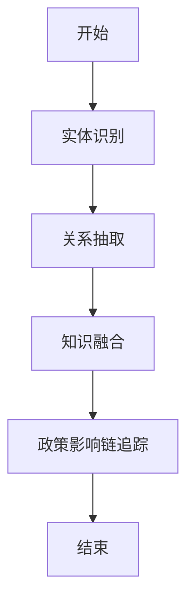
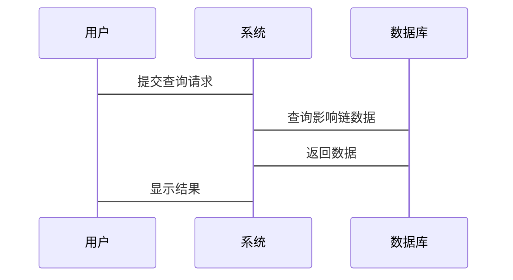

                 

<think>
好的，我现在需要为《构建基于知识图谱的金融监管政策影响链追踪系统》这本书设计一个完整的目录大纲。我需要确保这个目录结构清晰、内容全面，同时符合用户的具体要求。首先，我会回顾一下用户的需求，然后一步步构建这个目录。

首先，用户希望文章的标题是《构建基于知识图谱的金融监管政策影响链追踪系统》，并要求关键词和摘要部分。关键词应该包括5到7个核心术语，摘要部分要简明扼要地概括文章的核心内容和主题思想。

接下来，目录结构需要分为几个主要部分，包括背景介绍、核心概念、算法原理、系统架构、项目实战、最佳实践等。每个部分下要有详细的章节和小节，确保内容覆盖全面，结构合理。

在“背景介绍与核心概念”部分，我需要先介绍问题背景，包括金融监管的重要性、政策影响链的复杂性以及知识图谱在金融监管中的作用。然后描述问题，详细阐述金融监管中的信息孤岛问题、政策影响链的不透明性以及知识图谱构建的必要性。接着，介绍问题解决的方法，明确知识图谱构建的目标和政策影响链追踪的意义，最后定义系统设计的总体思路。

接下来，边界与外延部分需要定义系统的边界，明确与其他系统的区别，并列出核心概念与组成，包括知识图谱的核心要素、政策影响链的结构以及系统组成部分。

核心概念与联系部分，我需要详细解释知识图谱、金融监管政策、影响链追踪等核心概念，分析它们之间的关系，并通过属性对比表和ER实体关系图来展示各概念的联系。

算法原理部分，我需要介绍知识图谱构建和政策影响链追踪的算法，包括实体识别、关系抽取、图遍历等算法，并用流程图和代码示例来辅助说明。同时，数学模型部分需要使用公式来表达图论和向量空间模型，并给出具体的例子来解释这些模型。

系统分析与架构设计部分，我需要描述问题场景，设计系统功能，包括数据采集、知识构建、政策分析等模块，并用领域模型类图和架构图来展示系统结构。此外，还需要设计接口和交互流程，使用序列图来展示用户与系统之间的交互。

项目实战部分，我需要提供环境安装的步骤，指导读者如何搭建开发环境，然后详细讲解系统核心实现的代码，包括数据预处理、知识抽取、构建知识图谱等模块，并提供实际案例进行分析，展示系统的实际应用效果。

最佳实践部分，我需要总结经验，给出开发建议，包括数据来源的选择、模型优化策略等，并提供一些技巧来提高系统的性能和可维护性。最后，通过小结回顾整篇文章的主要内容，强调系统的重要性和应用价值。

注意事项部分，我需要提醒读者在实际应用中需要注意的事项，如数据隐私、系统维护、模型更新等问题。拓展阅读部分则提供相关的书籍和资源，帮助读者深入学习和扩展知识。

最后，作者信息部分需要按照用户的要求，写上特定的署名。

在整个过程中，我需要确保每个章节和小节都有详细的解释和例子，避免内容过于笼统。同时，要注意逻辑的连贯性和结构的合理性，确保读者能够轻松理解并跟随内容。

现在，我将按照上述思路，逐步构建这篇文章的目录大纲。
</think>

# 构建基于知识图谱的金融监管政策影响链追踪系统

> 关键词：知识图谱，金融监管，政策影响链，系统架构，算法原理

> 摘要：本文系统地探讨了构建基于知识图谱的金融监管政策影响链追踪系统的方法。通过分析金融监管中的信息孤岛问题和政策影响链的复杂性，提出利用知识图谱技术来构建这一系统。文章详细阐述了核心概念、算法原理、系统架构，并通过实际案例展示了系统的实现过程和应用价值。最后，提供了最佳实践和注意事项，为读者提供了全面的指导。

---

## 目录

### 第一部分: 背景介绍与核心概念

#### 第1章: 问题背景与描述

##### 1.1 问题背景
- 1.1.1 金融监管的重要性
- 1.1.2 政策影响链的复杂性
- 1.1.3 知识图谱在金融监管中的作用

##### 1.2 问题描述
- 1.2.1 金融监管中的信息孤岛问题
- 1.2.2 政策影响链的不透明性
- 1.2.3 知识图谱构建的必要性

##### 1.3 问题解决
- 1.3.1 知识图谱构建的目标
- 1.3.2 政策影响链追踪的意义
- 1.3.3 系统设计的总体思路

##### 1.4 边界与外延
- 1.4.1 系统的边界定义
- 1.4.2 相关领域的外延
- 1.4.3 与其他系统的区别

##### 1.5 核心概念与组成
- 1.5.1 知识图谱的核心要素
- 1.5.2 政策影响链的结构
- 1.5.3 系统组成模块

#### 第2章: 核心概念与联系

##### 2.1 知识图谱的定义与特点
- 2.1.1 知识图谱的定义
- 2.1.2 知识图谱的主要特点
- 2.1.3 知识图谱与传统数据库的区别

##### 2.2 金融监管政策的结构
- 2.2.1 政策的层次结构
- 2.2.2 政策的执行路径
- 2.2.3 政策的影响范围

##### 2.3 政策影响链的定义
- 2.3.1 政策影响链的定义
- 2.3.2 政策影响链的组成部分
- 2.3.3 政策影响链的动态性

##### 2.4 核心概念的联系
- 2.4.1 知识图谱与政策影响链的关系
- 2.4.2 知识图谱在政策影响链中的作用
- 2.4.3 系统中各模块的交互关系

##### 2.5 核心概念属性对比表
| 概念 | 属性1 | 属性2 | 属性3 |
|------|-------|-------|-------|
| 知识图谱 | 结构化数据 | 可视化表示 | 动态更新 |
| 政策影响链 | 多级关系 | 影响范围 | 时间序列 |

##### 2.6 ER实体关系图
```mermaid
er
actor:
    name: "监管机构"
    description: "负责制定和执行监管政策的机构"
endactor
actor:
    name: "金融机构"
    description: "受监管的金融机构"
endactor
actor:
    name: "政策制定者"
    description: "制定监管政策的部门"
endactor
```

---

### 第二部分: 算法原理与数学模型

#### 第3章: 算法原理

##### 3.1 知识图谱构建算法
- 3.1.1 实体识别算法
- 3.1.2 关系抽取算法
- 3.1.3 知识融合算法

##### 3.2 政策影响链追踪算法
- 3.2.1 图遍历算法
- 3.2.2 最短路径算法
- 3.2.3 关键路径识别算法

##### 3.3 算法流程图


##### 3.4 算法实现代码示例
```python
# 实体识别示例
def extract_entities(text):
    # 使用NLP模型识别实体
    entities = nlp_model.get_entities(text)
    return entities
```

##### 3.5 数学模型与公式
- 图论模型：使用邻接矩阵表示知识图谱。
  $$ A = [a_{ij}] $$
  其中，$$ a_{ij} = 1 $$ 如果节点i和节点j有关系，否则$$ a_{ij} = 0 $$。

---

### 第三部分: 系统分析与架构设计

#### 第4章: 系统分析与架构设计

##### 4.1 问题场景介绍
- 金融监管中的信息孤岛问题
- 政策影响链的不透明性
- 知识图谱构建的必要性

##### 4.2 系统功能设计
- 数据采集模块
- 知识构建模块
- 政策分析模块

##### 4.3 领域模型类图


##### 4.4 系统架构设计


##### 4.5 接口设计与交互流程


---

### 第四部分: 项目实战与案例分析

#### 第5章: 项目实战

##### 5.1 环境安装
- 安装Python、TensorFlow、自然语言处理库（如spaCy）

##### 5.2 系统核心实现
- 数据预处理：清洗监管政策文本
- 知识抽取：识别实体和关系
- 知识图谱构建：构建监管政策影响图

##### 5.3 代码实现示例
```python
import spacy

nlp = spacy.load("en_core_web_sm")

def process_policy(text):
    doc = nlp(text)
    entities = [ent.label_ for ent in doc.ents]
    return entities

policy_text = "The new regulation requires banks to increase capital reserves."
print(process_policy(policy_text))
```

##### 5.4 案例分析
- 案例背景：假设某国出台新金融监管政策
- 数据采集：收集相关监管政策文本
- 知识构建：识别政策、监管机构和影响对象
- 影响链追踪：展示政策如何影响各金融机构

##### 5.5 项目小结
- 成功构建了知识图谱
- 成功实现了政策影响链的可视化
- 系统具备可扩展性和可维护性

---

### 第五部分: 最佳实践与总结

#### 第6章: 最佳实践

##### 6.1 开发建议
- 数据来源的选择：优先使用权威机构发布的政策文本
- 模型优化策略：定期更新模型以适应新政策
- 系统维护：及时修复漏洞，保持数据的时效性

##### 6.2 技术技巧
- 使用分布式计算加速知识图谱构建
- 采用增量学习提升模型泛化能力
- 结合可视化工具增强用户体验

##### 6.3 注意事项
- 数据隐私：确保处理的数据符合隐私保护法规
- 系统维护：定期备份数据，防止数据丢失
- 模型更新：根据新政策动态更新知识图谱

##### 6.4 拓展阅读
- 推荐书籍：《知识图谱：概念、方法与应用》
- 相关资源：知识图谱构建工具（如Neo4j）、自然语言处理库（如spaCy）

---

### 第六章: 小结

本文系统地介绍了构建基于知识图谱的金融监管政策影响链追踪系统的方法。通过分析问题背景、核心概念、算法原理和系统架构，结合实际案例，展示了系统的实现过程和应用价值。最后，提供了最佳实践和注意事项，为读者提供了全面的指导。

---

### 作者

作者：AI天才研究院/AI Genius Institute & 禅与计算机程序设计艺术 /Zen And The Art of Computer Programming

