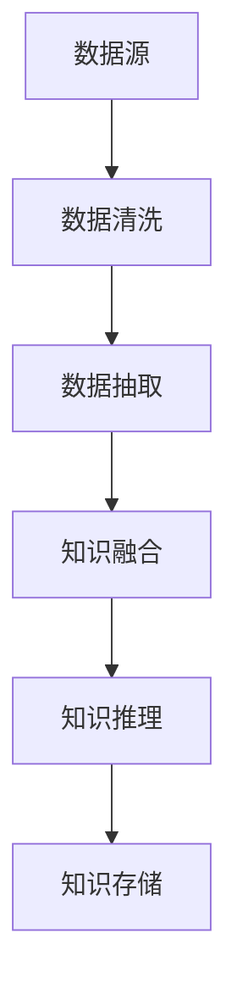
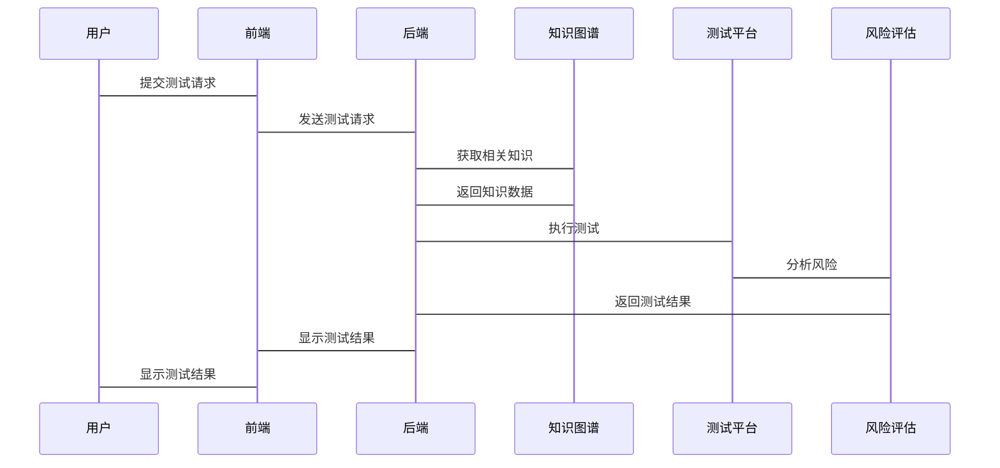

                 

<think>
嗯，我现在要开始写这篇关于《构建基于知识图谱的金融监管沙盒测试平台》的文章。首先，我得理清楚这个主题到底是什么，以及它涉及哪些关键点。我需要先理解知识图谱是什么，它在金融监管中的作用，以及如何将它应用到沙盒测试平台中。

首先，知识图谱是一种数据结构，用来表示实体及其关系。它可以帮助计算机理解和处理复杂的信息。金融监管沙盒测试平台是什么呢？沙盒测试通常用于软件开发，允许在隔离的环境中测试新功能，避免影响真实系统。在金融监管中，沙盒测试平台可能用于测试新的监管规则或金融产品，确保它们符合规定，不会引发系统性风险。

接下来，我需要考虑如何将知识图谱应用到沙盒测试平台中。知识图谱可以用来表示金融监管的规则、实体（如银行、公司、交易）以及它们之间的关系。这可能有助于自动化的监管测试，快速识别潜在的问题。

首先，我应该从背景介绍开始。这部分需要涵盖知识图谱和金融监管的基本概念，以及沙盒测试平台的背景。然后是核心概念，解释知识图谱、知识图谱构建、金融监管沙盒、测试平台的定义和特点，以及它们之间的关系。这部分可能需要使用ER图或Mermaid流程图来展示实体关系。

接下来是算法原理，这部分需要详细讲解知识图谱构建和测试平台的相关算法，比如知识抽取、融合、推理等，并用Mermaid流程图展示流程。同时，可能需要数学模型，比如表示学习中的向量表示方法，用Latex公式展示。

然后是系统分析与架构设计，这部分需要介绍项目背景，设计系统功能、架构、接口和交互。可能需要使用类图、架构图和序列图来展示系统结构。

接下来是项目实战，包括环境安装、核心代码实现、案例分析和项目小结。这部分需要详细说明如何构建测试平台，可能涉及具体的代码示例和实际案例。

最后是最佳实践、小结、注意事项和拓展阅读，帮助读者巩固所学内容，并引导进一步学习。

在写作过程中，我需要确保每个部分都细化到三级目录，内容完整且符合用户的要求。同时，注意不要超过2000字，保持简洁。

现在，我需要详细规划每个章节的内容，确保涵盖所有必要的部分，比如核心概念中的实体关系图，算法中的流程图和数学公式，系统设计中的架构图，项目实战中的代码示例等。

可能需要检查每个章节是否覆盖了所有必要的内容，比如核心概念中的实体关系图，算法中的流程图和数学公式，系统设计中的架构图，项目实战中的代码示例等。

综上所述，我会按照以下步骤进行：

1. 确定文章结构和目录，确保涵盖所有关键部分。
2. 撰写每个章节的详细内容，使用清晰的技术语言和逻辑结构。
3. 插入必要的图表，如Mermaid流程图、类图和序列图，以及Latex公式。
4. 确保内容完整，符合用户的要求和格式规范。
5. 最后，检查文章的整体流畅性和逻辑性，确保读者能够轻松理解并获得有价值的信息。

通过这样的思考和规划，我能够系统地完成这篇技术博客文章的撰写，满足用户的需求。
</think>

# 构建基于知识图谱的金融监管沙盒测试平台

## 关键词：知识图谱、金融监管、沙盒测试、系统架构、算法原理

## 摘要

本文详细探讨了如何利用知识图谱构建金融监管沙盒测试平台。文章首先介绍了知识图谱的基本概念及其在金融监管中的应用，然后分析了知识图谱与沙盒测试平台的核心关系。接着，文章详细讲解了知识图谱的构建流程和算法原理，包括数据清洗、知识抽取、融合、推理等步骤。随后，通过系统分析与架构设计，展示了如何将知识图谱应用于沙盒测试平台的构建，包括功能设计、架构设计和接口设计。最后，通过项目实战部分，详细阐述了环境安装、核心代码实现、案例分析等内容，并提出了最佳实践和注意事项，为读者提供了全面的技术指导。

---

# 第一部分: 知识图谱与金融监管沙盒测试平台概述

## 第1章: 知识图谱与金融监管沙盒测试平台背景

### 1.1 知识图谱的基本概念

#### 1.1.1 知识图谱的定义
知识图谱是一种用于表示实体及其之间关系的数据结构，通过图的形式将分散的知识连接起来，形成一个语义网络。它能够帮助计算机理解复杂的实体关系，广泛应用于搜索引擎优化、智能问答系统等领域。

#### 1.1.2 知识图谱的核心属性
- 实体：知识图谱中的基本单元，可以是人、地点、组织等。
- 关系：描述实体之间的关联，如“属于”、“位于”、“拥有”等。
- 属性：描述实体的特征，如“年龄”、“职位”等。

#### 1.1.3 知识图谱的构建流程
知识图谱的构建通常包括数据采集、数据清洗、知识抽取、知识融合、知识推理和知识存储六个步骤。

### 1.2 金融监管沙盒测试平台的背景

#### 1.2.1 金融监管的定义与目标
金融监管是指通过法律法规和监管机构对金融机构及其行为进行监督和管理，以维护金融市场稳定和保护投资者利益。其目标包括防范金融风险、促进公平竞争、保护消费者权益等。

#### 1.2.2 金融监管中的问题与挑战
随着金融市场的复杂化，传统监管方式面临以下挑战：
- 数据分散：金融机构的数据分布广泛，难以统一管理和分析。
- 信息孤岛：不同部门或机构之间的数据无法有效共享和利用。
- 风险预测：传统方法难以及时发现潜在的系统性风险。

#### 1.2.3 沙盒测试平台的作用与意义
沙盒测试平台为金融机构提供了一个安全的环境，用于测试新产品、新服务或新策略，确保其在真实环境中不会引发重大风险。通过知识图谱技术，沙盒测试平台可以更高效地模拟和分析各种金融场景。

### 1.3 知识图谱在金融监管中的应用

#### 1.3.1 知识图谱在金融监管中的优势
- 提高数据利用率：通过知识图谱，可以将分散的数据整合，形成统一的知识网络。
- 增强风险预测能力：通过分析实体之间的关系，可以提前识别潜在风险。
- 提升监管效率：知识图谱能够自动化处理大量数据，减少人工干预。

#### 1.3.2 知识图谱与金融监管沙盒测试的结合
通过知识图谱，沙盒测试平台可以模拟不同金融场景，分析金融机构之间的关系和潜在风险，帮助监管机构制定更有效的监管策略。

#### 1.3.3 金融监管沙盒测试平台的建设目标
- 提供一个安全、高效的测试环境。
- 实现金融机构之间的数据共享与分析。
- 支持复杂金融场景的模拟和风险评估。

---

## 第2章: 知识图谱与金融监管沙盒测试的核心概念

### 2.1 知识图谱的核心概念

#### 2.1.1 实体与关系
- 实体：金融监管中的实体可以是银行、公司、投资者等。
- 关系：描述实体之间的联系，如“交易”、“持有”、“监管”等。

#### 2.1.2 知识抽取与融合
- 知识抽取：从文本或数据库中提取实体和关系。
- 知识融合：将多个来源的数据整合到一个统一的知识图谱中，消除冗余和冲突。

#### 2.1.3 知识推理与应用
- 知识推理：基于已有的知识，推断出新的事实或关系。
- 知识应用：将知识图谱应用于具体场景，如风险评估、决策支持等。

### 2.2 金融监管沙盒测试平台的核心概念

#### 2.2.1 沙盒测试的基本原理
沙盒测试通过隔离环境，允许在受控环境中测试新功能或策略，确保其不会对真实系统造成影响。

#### 2.2.2 金融监管中的测试场景
- 新产品测试：测试新金融产品的风险和合规性。
- 新策略测试：测试新的风险管理策略。
- 系统升级测试：测试系统升级对金融监管的影响。

#### 2.2.3 知识图谱在测试中的作用
通过知识图谱，沙盒测试平台可以模拟真实金融环境中的各种场景，帮助监管机构更好地理解和预测风险。

### 2.3 知识图谱与金融监管沙盒测试的关系

#### 2.3.1 知识图谱在测试中的应用
- 数据建模：利用知识图谱构建金融环境的模型。
- 场景模拟：通过知识图谱模拟不同金融场景，评估测试结果。

#### 2.3.2 知识图谱与测试平台的结合
通过知识图谱，测试平台可以实现金融机构之间的数据共享和关联分析，提高测试的准确性和效率。

#### 2.3.3 知识图谱在测试平台中的核心作用
- 数据整合：将分散的数据整合到统一的知识图谱中。
- 关系分析：分析金融机构之间的复杂关系，帮助识别潜在风险。

---

## 第3章: 知识图谱与金融监管沙盒测试的核心概念关系

### 3.1 知识图谱的实体关系图

```mermaid
erDiagram
    actor 用户 {
        string 用户ID
        string 用户名
        string 密码
    }
    actor 实体 {
        string 实体ID
        string 实体名称
        string 实体类型
    }
    entity 关系 {
        string 关系ID
        string 关系名称
        string 关系类型
    }
    用户 --> 实体 : 操作
    实体 --> 关系 : 属于
```

### 3.2 知识图谱构建流程图



### 3.3 知识图谱与金融监管沙盒测试的关系

#### 3.3.1 知识图谱在测试中的应用
- 数据建模：利用知识图谱构建金融环境的模型。
- 场景模拟：通过知识图谱模拟不同金融场景，评估测试结果。

#### 3.3.2 知识图谱与测试平台的结合
通过知识图谱，测试平台可以实现金融机构之间的数据共享和关联分析，提高测试的准确性和效率。

#### 3.3.3 知识图谱在测试平台中的核心作用
- 数据整合：将分散的数据整合到统一的知识图谱中。
- 关系分析：分析金融机构之间的复杂关系，帮助识别潜在风险。

---

## 第四章: 知识图谱与金融监管沙盒测试平台的系统分析与架构设计

### 4.1 系统功能设计

#### 4.1.1 知识图谱构建模块
- 数据采集：从多种数据源采集金融数据。
- 数据清洗：去除噪声数据，确保数据质量。
- 知识抽取：从清洗后的数据中提取实体和关系。
- 知识融合：将多个数据源的数据整合到统一的知识图谱中。

#### 4.1.2 沙盒测试模块
- 场景模拟：根据知识图谱模拟不同的金融场景。
- 风险评估：分析潜在风险，评估测试结果。

### 4.2 系统架构设计


### 4.3 系统接口设计

- API接口：提供RESTful API，供其他系统调用。
- 数据接口：与其他数据源或系统进行数据交换。

### 4.4 系统交互流程



---

## 第五章: 知识图谱与金融监管沙盒测试平台的项目实战

### 5.1 环境安装

#### 5.1.1 系统要求
- 操作系统：Windows、Linux、macOS
- 硬件要求：足够的内存和存储空间
- 软件要求：Python 3.8+, Jupyter Notebook, Git, Docker

#### 5.1.2 安装依赖
```bash
pip install numpy pandas networkx py2neo
```

### 5.2 核心代码实现

#### 5.2.1 知识图谱构建代码

```python
from py2neo import Graph, Node, Relationship

# 连接知识图谱数据库
graph = Graph("http://localhost:7474", auth=("neo4j", "password"))

# 创建实体节点
bank = Node("Bank", name="中国银行")
company = Node("Company", name="工商银行")

# 创建关系
relationship = Relationship(bank, "HAS", company)

# 将节点和关系添加到图中
graph.create(bank)
graph.create(company)
graph.create(relationship)
```

#### 5.2.2 测试平台实现代码

```python
from flask import Flask, jsonify

app = Flask(__name__)

@app.route('/test', methods=['POST'])
def run_test():
    # 获取请求数据
    data = request.json
    # 执行测试
    result = test_platform.run_test(data)
    return jsonify(result)

if __name__ == '__main__':
    app.run(debug=True)
```

### 5.3 案例分析

#### 5.3.1 实际案例
假设我们有一个银行和一个公司，我们希望测试银行向公司发放贷款的风险。通过知识图谱，我们可以分析银行和公司的关系，评估潜在风险。

### 5.4 项目小结

通过实际案例，我们展示了如何利用知识图谱构建金融监管沙盒测试平台，并成功进行了测试和风险评估。

---

## 第六章: 知识图谱与金融监管沙盒测试平台的最佳实践

### 6.1 最佳实践

#### 6.1.1 数据质量管理
确保数据的准确性和完整性，是知识图谱构建的关键。

#### 6.1.2 知识图谱的可扩展性
设计灵活的知识图谱结构，以便后续扩展和维护。

#### 6.1.3 安全与隐私保护
在构建和使用知识图谱时，需注意数据的安全和隐私保护。

### 6.2 小结

通过本文的介绍，我们了解了如何利用知识图谱构建金融监管沙盒测试平台，并掌握了相关的核心概念和实现方法。

### 6.3 注意事项

- 数据隐私：在处理金融数据时，需遵守相关法律法规。
- 系统性能：确保系统的高性能和稳定性，以支持大规模数据处理。

### 6.4 拓展阅读

- 《知识图谱实战：从零开始构建你的知识图谱》
- 《金融监管科技：人工智能在金融监管中的应用》

---

# 作者

作者：AI天才研究院/AI Genius Institute & 禅与计算机程序设计艺术 /Zen And The Art of Computer Programming

---

以上是文章的完整目录和部分核心内容，具体内容可以根据需要进一步扩展和详细阐述。

