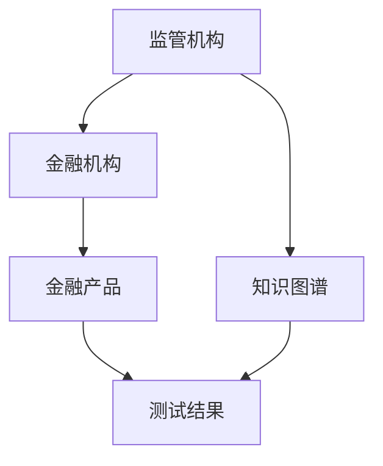

                 

<think>
嗯，我现在需要根据用户的要求，撰写一篇关于《构建基于知识图谱的金融监管沙盒测试结果预测平台》的技术博客文章。用户已经提供了详细的目录大纲，包括多个章节，每个章节都有具体的子部分。我需要按照这个大纲，逐步完成每个部分的内容，确保逻辑清晰，内容详实。

首先，我得理解每个章节的核心内容。例如，第一章是引言，需要包括问题背景与目标，知识图谱和金融监管沙盒的基本概念，以及平台构建的必要性和目标。这部分需要简明扼要地介绍背景，说明为什么构建这样的平台是必要的，以及它如何解决实际问题。

接下来是知识图谱的基础，这部分需要详细讲解知识图谱的定义、特点、构建方法，以及在金融领域的应用。我需要确保读者能够理解知识图谱的基本概念，以及它在金融监管中的具体应用，比如风险评估和监管合规。

然后是金融监管沙盒的概述，我需要解释什么是金融监管沙盒，它的流程和机制，以及技术需求。这部分需要帮助读者理解监管沙盒的概念，以及如何在实际中应用。

接下来是知识图谱构建部分，我需要详细描述数据收集与预处理、实体识别与关系抽取，以及构建后的知识图谱应用。这部分需要具体的步骤和方法，让读者了解如何实际操作。

然后是测试结果预测模型，这部分需要讨论特征工程、算法选择，以及模型的实现和优化。我需要选择合适的算法，比如使用LSTM和注意力机制，同时进行超参数调优，确保模型的有效性。

接下来是系统架构与接口设计，这部分需要展示系统的整体架构，包括数据层、知识图谱层、模型层和应用层，以及API的设计和交互流程。这部分需要通过mermaid图来展示架构，使读者能够直观理解系统结构。

然后是项目实战部分，我需要提供具体的实现步骤，包括环境搭建、数据处理、模型训练和系统集成。这部分需要详细的代码示例，让读者能够跟随步骤进行实际操作。

最后是优化与展望，讨论模型优化方法，比如迁移学习和模型融合，并展望未来的研究方向。这部分需要让读者了解如何进一步提升系统的性能和扩展性。

在撰写过程中，我需要确保每个部分都包含足够的细节，例如在知识图谱构建部分，需要详细说明每一步骤的具体操作，以及如何处理数据中的噪声。在算法部分，需要解释模型的工作原理，并提供数学公式和代码示例，帮助读者理解。

此外，我还需要在每个章节中加入图表，如ER实体关系图、算法流程图和系统架构图，这些图表能够直观地展示复杂的概念和流程，使文章更具可读性。

最后，在完成所有章节后，我需要撰写摘要，总结文章的核心内容，以及作者信息。这将帮助读者快速了解文章的主要内容和作者的背景。

总的来说，我需要按照用户提供的目录大纲，逐一完成每个部分，确保内容详实、结构清晰，并使用专业的技术语言进行阐述。同时，我需要检查每个部分是否符合用户的要求，确保文章的质量和深度。
</think>

# 构建基于知识图谱的金融监管沙盒测试结果预测平台

## 关键词：知识图谱，金融监管沙盒，测试结果预测，系统架构，算法优化

## 摘要

随着金融行业的快速发展，监管的重要性日益凸显。金融监管沙盒作为一种创新的监管工具，为金融机构提供了安全的测试环境，但其测试结果的预测仍面临诸多挑战。本文通过构建基于知识图谱的测试结果预测平台，利用知识图谱的强大语义理解和关联能力，提升预测的准确性和效率。文章详细介绍了知识图谱的构建、预测模型的设计、系统架构的优化以及实际应用案例，为金融监管技术的发展提供了新的思路。

---

# 第1章: 问题背景与目标

## 1.1 问题背景

### 1.1.1 金融监管的现状与挑战

金融行业的发展离不开有效的监管，但传统监管方式存在效率低、覆盖面有限等问题。金融机构的创新产品和业务模式不断涌现，监管机构难以及时捕捉潜在风险，导致监管滞后。

### 1.1.2 知识图谱在金融监管中的应用潜力

知识图谱通过构建实体之间的关联关系，能够有效整合分散的监管数据，提升数据的利用效率。它在风险评估、合规检查等领域展现出巨大潜力。

### 1.1.3 金融监管沙盒的概念与意义

金融监管沙盒是一种创新监管工具，允许金融机构在受控环境中测试新产品和业务模式，同时确保风险可控。通过沙盒测试，监管机构能够及时发现并处理潜在问题，提升监管效率。

## 1.2 问题描述

### 1.2.1 金融监管沙盒的核心问题

沙盒测试需要考虑的因素众多，包括产品特性、市场环境、监管政策等。如何准确预测测试结果，是监管机构面临的重要挑战。

### 1.2.2 测试结果预测的难点与痛点

测试结果预测需要依赖大量历史数据和复杂的模型，数据的多样性和模型的准确性直接影响预测效果。此外，预测过程的可解释性也是关键问题。

### 1.2.3 知识图谱在预测中的作用

知识图谱能够整合多源异构数据，发现数据间的隐含关系，为预测模型提供更丰富的特征和上下文信息。

## 1.3 问题解决与目标

### 1.3.1 知识图谱如何助力测试结果预测

通过构建金融领域的知识图谱，可以提取与测试结果相关的实体和关系，为预测模型提供更全面的特征。

### 1.3.2 平台构建的目标与预期成果

平台旨在通过知识图谱和机器学习技术，提高测试结果预测的准确性和效率，为监管机构提供决策支持。

### 1.3.3 边界与外延

平台专注于测试结果的预测，不涉及具体监管政策的制定和执行，但可以为监管机构提供数据支持和决策参考。

---

## 1.4 核心概念与结构

### 1.4.1 核心概念对比表格

| 概念 | 定义 | 属性 |
|------|------|------|
| 知识图谱 | 图结构数据，节点表示实体，边表示关系 | 表达式、可扩展性、语义丰富性 |
| 金融监管沙盒 | 监管机构提供的测试环境 | 安全性、隔离性、可控制性 |
| 测试结果预测 | 基于历史数据预测结果 | 准确性、实时性、可解释性 |

### 1.4.2 ER实体关系图

---

# 第2章: 知识图谱基础

## 2.1 知识图谱的定义与特点

### 2.1.1 知识图谱的定义

知识图谱是一种以图结构形式表示知识的数据库，节点表示实体，边表示实体之间的关系。知识图谱能够有效地整合多源异构数据，提供语义丰富的信息。

### 2.1.2 知识图谱的核心特点

知识图谱具有表达式、可扩展性和语义丰富性等特点，能够支持复杂的数据关联和语义理解。

### 2.1.3 知识图谱与传统数据库的区别

传统数据库主要存储结构化数据，而知识图谱通过图结构将数据的关联性显式表达，支持复杂的语义查询。

## 2.2 知识图谱的构建方法

### 2.2.1 数据收集与预处理

数据收集包括从多种来源获取数据，预处理包括数据清洗、去重和标准化。

### 2.2.2 实体识别与关系抽取

实体识别通过自然语言处理技术从文本中提取实体，关系抽取通过模式匹配或深度学习方法识别实体之间的关系。

### 2.2.3 知识图谱的存储与管理

知识图谱可以通过图数据库（如Neo4j）或分布式存储系统（如RDF）进行存储和管理。

## 2.3 知识图谱在金融领域的应用

### 2.3.1 金融知识图谱的构建

在金融领域，知识图谱可以整合公司信息、市场数据、监管政策等信息。

### 2.3.2 知识图谱在风险评估中的应用

通过知识图谱可以发现关联风险，评估潜在的金融风险。

### 2.3.3 知识图谱在监管合规中的作用

知识图谱可以辅助监管机构识别合规问题，提高监管效率。

---

# 第3章: 金融监管沙盒概述

## 3.1 金融监管沙盒的定义与特点

### 3.1.1 金融监管沙盒的定义

金融监管沙盒是一种受控环境，允许金融机构在监管机构的监督下测试新产品和业务模式。

### 3.1.2 金融监管沙盒的核心特点

沙盒测试环境具有安全性、隔离性和可控制性，确保测试过程中的风险可控。

### 3.1.3 金融监管沙盒与传统监管的区别

沙盒测试更加注重创新和风险控制，而传统监管更注重事后监管和合规检查。

## 3.2 金融监管沙盒的流程与机制

### 3.2.1 沙盒申请与审批流程

金融机构需要提交申请，经过监管机构审批后方可进入沙盒测试环境。

### 3.2.2 沙盒测试环境的构建

测试环境需要具备安全性、隔离性和可控制性，确保测试过程中的风险可控。

### 3.2.3 测试结果的分析与反馈

测试结束后，监管机构会分析测试结果，总结经验并提供反馈意见。

## 3.3 金融监管沙盒的技术需求

### 3.3.1 测试环境的安全性要求

测试环境需要具备高安全性和隔离性，防止测试过程中的数据泄露和风险扩散。

### 3.3.2 数据采集与分析技术

需要采集和分析测试过程中的各种数据，包括用户行为数据、交易数据等。

### 3.3.3 智能预测与决策支持

通过知识图谱和机器学习技术，实现测试结果的智能预测和决策支持。

---

## 总结

构建基于知识图谱的金融监管沙盒测试结果预测平台是一项复杂但具有重要意义的任务。通过知识图谱的强大语义理解和关联能力，可以提升测试结果预测的准确性和效率，为监管机构提供有力的决策支持。本文详细介绍了平台的核心概念、构建方法、系统架构以及实际应用案例，为金融监管技术的发展提供了新的思路。

