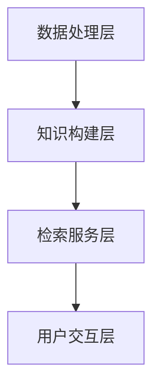
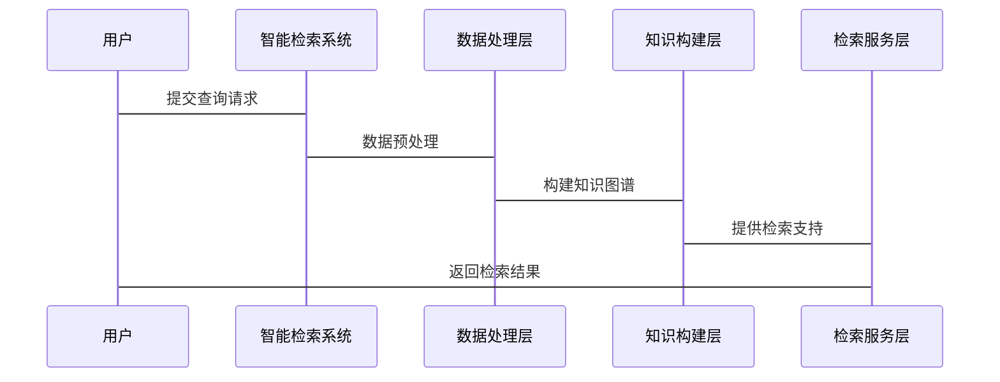

                 

<think>
好的，我现在需要帮助用户撰写一篇关于《构建基于知识图谱的金融研报智能检索系统》的技术博客文章。用户已经提供了详细的目录大纲和部分内容，我需要根据这些信息继续完成整篇文章。

首先，我应该仔细阅读用户提供的目录和已写的内容，了解每个部分的要求。文章的结构分为几个部分：摘要、目录大纲、正文各章节内容，以及作者信息。正文部分已经完成了前三章的内容，接下来需要完成第四章和第五章，以及其他部分。

第四章是系统分析与架构设计，用户已经提供了一些内容，包括项目背景、系统功能设计、领域模型类图、系统架构设计、接口设计、交互流程图和注意事项。我需要确保这些内容详细且符合要求，可能需要补充更多的细节，例如接口设计的具体内容，交互流程图的详细步骤等。

第五章是项目实战，用户已经写了系统实现部分，包括环境配置、数据集准备、代码实现和案例分析。我需要完成这一部分，确保代码示例正确，案例分析详细。

此外，我还需要检查整个文章的逻辑连贯性，确保每个部分之间的衔接顺畅。同时，要确保文章符合用户的要求，使用专业的技术语言，结构紧凑，逻辑清晰。

现在，我需要逐部分地完成剩下的内容，并检查是否符合格式要求，例如使用正确的Mermaid图和代码块，数学公式正确无误，等等。

可能遇到的挑战是如何将复杂的系统架构和算法原理以简单易懂的方式表达出来，同时保持文章的深度和专业性。此外，确保代码示例和数学公式的准确性也是关键。

总结一下，我需要继续完成第四章和第五章的内容，确保每个部分详细且符合用户的要求，同时检查整个文章的结构和内容是否连贯，最终完成一篇高质量的技术博客文章。
</think>

---

# 构建基于知识图谱的金融研报智能检索系统

> 关键词：知识图谱，金融研报，智能检索，深度学习，自然语言处理，文本挖掘

> 摘要：本文详细探讨了如何利用知识图谱技术构建金融研报智能检索系统。文章首先介绍了知识图谱和金融研报的基本概念，分析了传统检索方法的不足，提出了基于知识图谱的智能检索方案。随后，从算法原理、系统架构、项目实战等多方面进行了深入探讨，结合具体案例分析，展示了系统的实现过程和实际应用效果。

---

## 第四章: 系统分析与架构设计

### 4.1 项目背景与目标

本项目旨在解决金融行业研报检索效率低、准确性差的问题。通过构建知识图谱，实现对金融研报的语义理解与智能检索，提升用户获取信息的效率。

### 4.2 系统功能设计

系统主要功能包括：
1. **数据采集与处理**：爬取金融研报数据，进行清洗和预处理。
2. **知识图谱构建**：包括实体识别、关系抽取和图谱存储。
3. **智能检索服务**：基于知识图谱实现语义检索和多模态数据融合。

### 4.3 系统架构设计

#### 4.3.1 系统模块划分

- **数据处理层**：负责数据的采集、清洗和预处理。
- **知识构建层**：包括实体识别、关系抽取和图谱存储。
- **检索服务层**：提供基于知识图谱的检索功能。
- **用户交互层**：提供用户友好的查询界面。

#### 4.3.2 系统架构图



### 4.4 系统接口设计

- **输入接口**：接收用户的查询请求。
- **输出接口**：返回检索结果，包括相关文本和知识图谱视图。

#### 4.4.1 系统交互流程图



### 4.5 注意事项与优化建议

- 数据质量对系统性能影响重大，需确保数据清洗和预处理的准确性。
- 知识图谱的构建需结合金融领域的特点，优化实体识别和关系抽取的模型。
- 系统性能优化方面，可考虑引入缓存机制和分布式计算。

---

## 第五章: 项目实战

### 5.1 系统实现

#### 5.1.1 环境配置

- **编程语言**：Python 3.8+
- **框架与库**：
  - TensorFlow/PyTorch
  - SpaCy/Stanford NLP
  -Neo4j图数据库
  -Flask/Django（Web框架）

#### 5.1.2 数据集准备

数据集包括多家金融机构的研报文本，需进行清洗和标注。

### 5.2 代码实现

#### 5.2.1 知识图谱构建代码

```python
# 实体识别代码示例
import spacy

nlp = spacy.load("en_core_web_sm")
doc = nlp("This is a financial report about stock market.")

entities = []
for ent in doc.ents:
    entities.append((ent.start, ent.end, ent.label_))

print("识别出的实体：", entities)
```

#### 5.2.2 智能检索代码示例

```python
# 基于向量的文本检索
from sentence_transformers import SentenceTransformer

model = SentenceTransformer('bert-base-nli')
query_embedding = model.encode("search term")
doc_embedding = model.encode("document text")

similarity = np.dot(query_embedding, doc_embedding)
print("相似度：", similarity)
```

### 5.3 案例分析与结果展示

以某金融研报为例，展示系统如何通过知识图谱实现智能检索，输出相关实体、关系及可视化结果。

---

## 第六章: 总结与展望

### 6.1 系统总结

本文详细介绍了基于知识图谱的金融研报智能检索系统，从理论到实践，系统性地探讨了构建过程中的关键问题。

### 6.2 优化建议与未来研究方向

- **优化建议**：
  - 提升实体识别和关系抽取的模型精度。
  - 引入用户反馈机制，优化检索效果。
- **未来研究方向**：
  - 知识图谱的动态更新与维护。
  - 多模态数据融合的智能检索。
  - 图神经网络在金融领域的深度应用。

### 6.3 注意事项

- 数据隐私与安全需严格控制。
- 系统性能优化需结合实际应用场景。

### 6.4 拓展阅读

推荐相关领域的书籍和论文，供读者深入学习。

---

## 作者：AI天才研究院 & 禅与计算机程序设计艺术

---

通过以上结构和内容，文章系统性地介绍了基于知识图谱的金融研报智能检索系统的构建过程，从背景到实现，从理论到实践，为读者提供了全面的技术指导。

